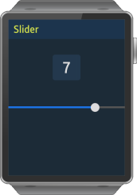
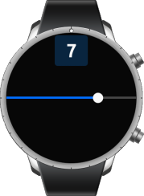

# Slider

The slider UI component is a draggable item used to select a value within a certain range. For more information, see the [Slider](../../../../api/wearable/latest/group__Elm__Slider.html) API.

This feature is supported in wearable applications only.

## Basic Usage

To use a slider component in your application:

1. Create a new slider with the `elm_slider_add()` function:

   ```
   Evas_Object *slider = NULL;

   slider = elm_slider_add(parent);
   ```

2. Configure the slider. The following configurations are optional. Unless you set other options, the slider uses the default styles.

   - Set the slider indicator:

     ```
     elm_slider_indicator_show_set(slider, EINA_TRUE);
     elm_slider_indicator_format_set(slider, "%.0f");
     ```

   - Set the range and value of the slider:

     ```
     elm_slider_min_max_set(slider, 0.0, 10.0);
     elm_slider_value_set(slider, 5.0);
     ```

   - The slider for wearable devices does not support additional features, such as horizontal or inverted slider.

3. Register the [callback](#callbacks) functions.

   The following example shows how to define and register a callback for the `changed` signal:

   ```
   evas_object_smart_callback_add(slider, "changed", slider_changed_cb, NULL);

   void
   slider_changed_cb(void *data, Evas_Object *obj, void *event_info)
   {
       double _val = elm_slider_value_get(obj);
       dlog_print(DLOG_INFO, LOG_TAG, "Slider value changed. %0.1f\n", _val);
   }
   ```

The following example shows a simple use case of the slider component.

**Example: Slider use case**

 

```
Evas_Object *box;
Evas_Object *slider;
Evas_Object *nf;

/* Starting right after the basic EFL UI layout code */
/* (win - conformant - naviframe) */

box = elm_box_add(nf);
elm_naviframe_item_push(nf, "Slider", NULL, NULL, box, NULL);
/* Add a slider */
slider = elm_slider_add(box);
evas_object_size_hint_align_set(slider, EVAS_HINT_FILL, 0.5);

/* Indicator shows the value of the slider */
elm_slider_indicator_show_set(slider, EINA_TRUE);
elm_slider_indicator_format_set(slider, "%.0f");

/* Set the slider range */
elm_slider_min_max_set(slider, 0.0, 10.0);

/* Show the slider */
evas_object_show(slider);
elm_box_pack_end(box, slider);
```

## Styles

The following table lists the available component styles.

**Table: Slider styles**

| Style     | Sample                                   |
|---------|----------------------------------------|
| `default` |  |

## Callbacks

You can register callback functions connected to the following signals for a slider object.

**Table: Slider callback signals**

| Signal              | Description                              | `event_info` |
|-------------------|----------------------------------------|------------|
| `changed`           | The slider value is changed by the user. | `NULL`       |
| `delay,changed`     | A short time after the value is changed by the user. This is called only when the user stops dragging for a very short period or when they release their finger or mouse, so it avoids possibly expensive reactions to the value change. | `NULL`       |
| `slider,drag,start` | Dragging the slider indicator around has started. | `NULL`       |
| `slider,drag,stop`  | Dragging the slider indicator around has stopped. | `NULL`       |

> **Note**  
> The signal list in the API reference can be more extensive, but only the above signals are actually supported in Tizen.

> **Note**  
> Except as noted, this content is licensed under [LGPLv2.1+](http://opensource.org/licenses/LGPL-2.1).

## Related Information
- Dependencies
  - Tizen 2.3.1 and Higher for Wearable
