# Wearable UI Components

EFL Elementary is a set of fast, finger-friendly, scalable, and themeable UI component libraries. A number of UI components, including both [containers](../ui-layouts.md) and non-containers (listed in this topic), are supported. Originally, Elementary was developed as part of the Window Manager development on desktop devices. In the wearable profile, Tizen created new UI styles for circular wearable devices with existing UI components, and optimized all of them for Tizen native applications.

This feature is supported in wearable applications only.

The UI components are wearable-friendly: for example, the circle datetime component extends the basic datetime component (`elm_datetime`) by visualizing the selected field, the circle genlist component provides a scrollbar with circular movement, and the circle progressbar, circle scroller, and circle slider components are all adjusted to the circular design.

The wearable UI components are designed to allow the user to interact with small touch screen-equipped wearable devices with rotary component parts. Therefore, when developing wearable applications, you can easily use them through the wearable-related infrastructure in company with full notification, and when reacting to touch and rotary events and the user finger size.

**Table: Available UI components**

| Category              | Component name                           | Description                              |
|-----------------------|------------------------------------------|------------------------------------------|
| Navigation elements   | [Index](./component-index.md) | The  index component provides an index for quick access to another group of UI  items. |
| Presentation views    | [Win](./component-win.md) | The  win component is the root window component often used in an application. It  allows you to create some content in it, and it is handled by the window  manager. |
| Presentation  views   | [Background](./component-background.md) | The  background component can be used to set a solid background decoration to a  window or a container object. It works like an image, but has some  background-specific properties, such as setting it to a tiled, centered,  scaled, or stretched mode. |
| Presentation  views   | [Genlist](./component-genlist.md) | The  genlist component displays a scrollable list of items. It can hold a lot of  items while still being fast and memory-efficient (since only the visible  items are allocated memory). |
| Presentation  views   | [List](./component-list.md) | The  list component is a very simple list for managing a small number of items. If  you need to manage a lot of items, use the genlist component instead. |
| Presentation  views   | [Label](./component-label.md) | The  label component displays text with simple HTML-like markup. |
| Presentation  views   | [Image](./component-image.md) | The  image component can load and display an image from a file or memory. |
| Presentation  views   | [Icon](./component-icon.md) | The  icon component inherits from the image component. It is used to display  images in an icon context. |
| Presentation  views   | [Progressbar](./component-progressbar.md) | The  progressbar component can be used to display the progress status of a given  job. |
| User  input           | [Button](./component-button.md) | The  button component is a simple push button. It is composed of a label icon and  an icon object, and has an auto-repeat feature. |
| User  input           | [Check](./component-check.md) | The  check component toggles the Boolean value between true and false. |
| User  input           | [Radio](./component-radio.md) | The  radio component can display 1 or more options, while the user can only select  one of them. The UI component is composed of an indicator (selected or  unselected), an optional icon, and an optional label. Even though it is  usually grouped with 2 or more other radio components, it can also be used  alone. |
| User  input           | [Entry](./component-entry.md) | The  entry component is a box to which the user can enter text. |
| User  input           | [Slider](./component-slider.md) | The  slider component is a draggable bar that is used to select a value from a  range of values. |
| User  input           | [Datetime](./component-datetime.md) | The  datetime component can display and accept input for date and time values. |
| Assist  views         | [Popup](./component-popup.md) | The  popup component shows a pop-up area that can contain a title area, a content  area, and an action area. |
| Assist  views         | [Ctxpopup](./component-ctxpopup.md) | The  ctxpopup component is a contextual popup that can show a list of items. |
| Transition            | Transit                                  | The  transit component can apply several transition effects to an Evas object,  such as translations and rotations. |
| Hardware acceleration | [GLView](./component-glview.md) | The  GLView component can render OpenGL&reg; in an Elementary object, hiding EvasGL  complexity. |
| Miscellaneous         | [Plug](./component-plug.md) | The  plug component allows you to show an Evas object created by another process.  It can be used anywhere like any other Elementary UI component. |

The following UI components are designed for specific circular wearable devices which have rotary component parts. On a circular device, you can draw round UI components, such as a slider, progressbar, and scroller. Generally, wearable UI components provide compatibility between the rectangular and circular wearable devices. However, use circular UI components for circular wearable devices only, because they have a dependency with the round UX and rotary events. For more information on the compatibility of the UI components between rectangular and circular, see the [Wearable Design](../../../../../design/wearable/design-principles.md) guidelines.

**Table: Available circular UI components**

| Component name                           | Description                              |
|------------------------------------------|------------------------------------------|
| [Circle Datetime](./component-circle-datetime.md) | The circle datetime extends the basic datetime component (`elm_datetime`) by visualizing the selected field. |
| [Circle Genlist](./component-circle-genlist.md) | The circle genlist provides a scrollbar with circular movement. It can also use rotary events to move to the next or previous item. |
| [Circle Object](./component-circle-object.md) | The circle object extends Elementary components in a form of circular design. Sometimes, a circle object merely provides additional UI features for the Elementary component, and sometimes it works as an independent component with its own UI and functionalities. 	Circular components can usually be added with the `eext_circle_object_[component_name]_add()` function, which returns a circle object handle. Circular components are shown in a form of an arch with radius, line width, and color. These properties can be set with the `eext_circle_object_item_XXX()` functions. The circle object can also take a rotary event. Generally, a clockwise rotary event increases the value of the rotary event activated by the circle object, and a counter-clockwise rotary event decreases the value. |
| [Circle Progressbar](./component-circle-progressbar.md) | The circle progressbar shows the progress status of a given task with a circular design. It visualizes the progress status within a range. |
| [Circle Scroller](./component-circle-scroller.md) | The circle scroller changes based on rotary events. It shows the whole scrollable area with a circular scroll bar. |
| [Circle Slider](./component-circle-slider.md) | The circle slider changes based on rotary events. The circle slider not only extends the UI feature of the basic slider component (`elm_slider`), but also replaces the functionalities of the `elm_slider` in a circular design. |
| [Circle Surface](./component-circle-surface.md) | The circle surface manages and renders circle objects. Multiple circle objects can be connected to one circle surface as candidates of an object to be rendered. |
| [Rotary Selector](./component-circle-rotary.md) | The rotary selector shows multiple items around a selector, and can change pages through rotary events. |
| [More Option](./component-circle-option.md) | The more option contains a cue button, which, when clicked, reveals a rotary selector view. |
| [Circle Spinner](./component-circle-spinner.md) | The circle spinner shows a spinner value as a marker around the circular display. |

## Wearable Circular UI Component Styles

EFL can separate the UI and logic of each UI component, resulting in each component having a different style of look. To change the styles of UI components, use the `elm_object_style_get()` and `elm_object_style_set()` functions to get and apply the style for a specific UI component.

The following tables list the styles for each UI component, including the names of the available styles, and the name of the part in the EDC file where you can define the text or some other `Evas_Object` included in the UI component. The style list in the EFL upstream is more extensive, but only the styles in the following tables are actually supported by Tizen.

**Table: Button styles**

| Style                | Sample                                   | Text part  | Swallow part          |
|----------------------|------------------------------------------|------------|-----------------------|
| `default`            | 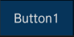 | `elm.text` | `elm.swallow.content` |
| `bottom`             | 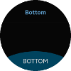 | `elm.text` | `elm.swallow.content` |
| `popup/circle`       | 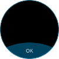 | `elm.text` | `elm.swallow.content` |
| `popup/circle/left`  | 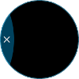 | -          | `elm.swallow.content` |
| `popup/circle/right` | 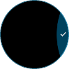 | -            | `elm.swallow.content` |

**Table: Check styles**

| Style     | Sample                                   |
|-----------|------------------------------------------|
| `default` |  |
| `small`   |  |
| `on&off`  |  |

**Table: Contextual popup (Ctxpopup) styles**

| Style                | Sample                                   | Notes                                    |
|----------------------|------------------------------------------|------------------------------------------|
| `select_mode`        |  |                 -                         |
| `select_mode/top`    |  | Pair this style with the `select_mode/bottom` style. |
| `select_mode/bottom` |  | Pair this style with the `select_mode/top` style. |

**Table: Datetime styles**

| Style               | Sample                                   |
|---------------------|------------------------------------------|
| `datepicker/circle` | 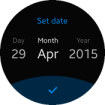 |
| `timepicker/circle` |  |

**Table: Entry styles**

| Style     | Sample                                   | Text part                                | Notes                                    |
|-----------|------------------------------------------|------------------------------------------|----------------------------------------|
| `default` |  | `elm.guide`: for the guide text. `elm.text`: for the main text. | The guide text is automatically erased when the main text is entered. |

**Table: Genlist styles**

| Style                 | Sample                                   | Text part                                | Swallow part                             |
|-----------------------|------------------------------------------|------------------------------------------|------------------------------------------|
| `default`             |  | `elm.text`                               | `elm.swallow.icon`: for the icon on the left.  `elm.swallow.end`: for the icon on the right. |
| `title`               |  | `elm.text`                               |          -                                |
| `group_index`         |  | `elm.text`                               |           -                               |
| `1text`               |  | `elm.text`                               |             -                             |
| `1text.1icon`         |  | `elm.text`                               | `elm.icon`                               |
| `1text.1icon.1`       |  | `elm.text`                               | `elm.icon`                               |
| `1text.1icon.divider` |  | `elm.text`                               | `elm.icon`: for the icon.  `elm.divider`: for the icon divider. |
| `2text`               |  | `elm.text`: for the main text.  `elm.text.1`: for the sub text. |                   -                       |
| `2text.1icon`         |  | `elm.text`: for the main text.  `elm.text.1`: for the sub text. | `elm.icon`                               |
| `2text.1icon.1`       |  | `elm.text`: for the main text.  `elm.text.1`: for the sub text. | `elm.icon`                               |
| `2text.1icon.divider` |  | `elm.text`: for the main text.  `elm.text.1`: for the sub text. | `elm.icon`: for the icon.  `elm.divider`: for the icon divider. |
| `editfield`           |  | `elm.text`                               |                   -                       |
| `multiline`           | 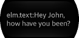 | `elm.text`                               |        -                                  |

**Table: Index styles**

| Style       | Sample                                   |
|-------------|------------------------------------------|
| `thumbnail` |  |
| `circle`    |  |

**Table: Popup styles**

| Style          | Sample                                   | Text part                        | Swallow part |
|----------------|------------------------------------------|----------------------------------|--------------|
| `circle`       |  | -         | `button1`  `button2` |
| `toast/circle` |  | `elm.text`                       | `toast,icon` |

**Table: Progressbar styles**

| Style                 | Sample                                   |
|-----------------------|------------------------------------------|
| `process`             |  |
| `process/small`       |  |
| `process/popup/small` |  |

**Table: Radio styles**

| Style     | Sample                                   |
|-----------|------------------------------------------|
| `default` |  |

**Table: Slider styles**

| Style                | Sample                                   | Swallow part       |
|----------------------|------------------------------------------|--------------------|
| `horizontal/default` |  | `elm.swallow.icon` |

## Wearable Rectangular UI Component Styles

EFL can separate the UI and logic of each UI component, resulting in each component having a different style of look. To change the styles of UI components, use the `elm_object_style_get()` and `elm_object_style_set()` functions to get and apply the style for a specific UI component.

The following tables list the styles for each UI component, including the names of the available styles, and the name of the part in the EDC file where you can define the text or some other `Evas_Object` included in the UI component. The style list in the EFL upstream is more extensive, but only the styles in the following tables are actually supported by Tizen. For more information, see [Style, Theme, and EDC](../component-custom.md#style-theme-and-edc).

**Table: Button styles**

| Style                  | Sample                                   | Text part  | Swallow part          | Notes                                    |
|------------------------|------------------------------------------|------------|-----------------------|------------------------------------------|
| `default`              |  | `elm.text` | `elm.swallow.content` |          -                                |
| `green`                |  | `elm.text` | `elm.swallow.content` |                                -          |
| `orange`               |  | `elm.text` | `elm.swallow.content` |                                 -         |
| `red`                  |  | `elm.text` | `elm.swallow.content` |                               -           |
| `nextdepth`            |  |           - |               -        |              -                            |
| `naviframe/title_icon` |  |    -        | `elm.swallow.content` | The icon can be set with the `elm_object_part_content_set(btn, "icon", ic)` function. |

**Table: Check styles**

| Style     | Sample                                   |
|-----------|------------------------------------------|
| `default` |  |
| `on&off`  |  |

**Table: Contextual popup (Ctxpopup) styles**

| Style     | Sample                                   | Notes                                    |
|-----------|------------------------------------------|----------------------------------------|
| `default` |  | Use the `elm_ctxpopup_item_append()` function to add both text and an icon to the list. |

**Table: Datetime styles**

| Style               | Sample                                   |
|---------------------|------------------------------------------|
| `datepicker_layout` |  |
| `timepicker_layout` |  |

**Table: Entry styles**

| Style     | Sample                                   | Text part                                | Notes                                    |
|-----------|------------------------------------------|------------------------------------------|------------------------------------------|
| `default` |  | `elm.guide`: for the guide text.  `elm.text`: for the main text. | The guide text is automatically erased when the main text is entered. |

**Table: Genlist styles**

| Style                 | Sample                                   | Text part                                | Swallow part                             |
|-----------------------|------------------------------------------|------------------------------------------|------------------------------------------|
| `default`             | 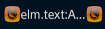 | `elm.text`                               | `elm.swallow.icon`: for the icon on the left.  `elm.swallow.end`: for the icon on the right. |
| `group_index`         |  | `elm.text`: for the main text.  `elm.text.1`: for the sub text. | `elm.icon`                               |
| `1text`               | 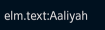 | `elm.text`                               |                 -                         |
| `1text.1icon`         | 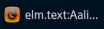 | `elm.text`                               | `elm.icon`                               |
| `2text`               |  | `elm.text`: for the main text.  `elm.text.1`: for the sub text. |                -                          |
| `2text.1`             | 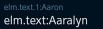 | `elm.text`: for the main text.   `elm.text.1`: for the sub text. |             -                             |
| `1text.1icon.divider` |  | `elm.text`                               | `elm.icon`: for the icon.  `elm.divider`: for the icon divider. |
| `1text.1icon.1`       |  | `elm.text`                               | `elm.icon`                               |
| `2text.1icon.1`       |  | `elm.text`: for the main text.  `elm.text.1`: for the sub text. | `elm.icon`                               |
| `multiline/1text`     | 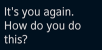 | `elm.text`: for the multi-line text.     |                     -                     |
| `multiline/2text`     |  | `elm.text`: for the main text.  `elm.text.1`: for the multi-line sub text. |                -                          |

**Table: Index styles**

| Style       | Sample                                   |
|-------------|------------------------------------------|
| `thumbnail` |  |
| `tab`       |  |

**Table: Popup styles**

| Style     | Sample                                   |
|-----------|------------------------------------------|
| `default` |  |
| `toast`   | 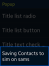 |

**Table: Progressbar styles**

| Style                | Sample                                   |
|----------------------|------------------------------------------|
| `default`            |  |
| `pending_list`       |  |
| `process`            |  |
| `process/groupindex` |  |

**Table: Radio styles**

| Style     | Sample                                   |
|-----------|------------------------------------------|
| `default` |  |

**Table: Slider styles**

| Style                | Sample                                   | Swallow part       |
|----------------------|------------------------------------------|--------------------|
| `horizontal/default` |  | `elm.swallow.icon` |

> **Note**
>
> Except as noted, this content is licensed under [LGPLv2.1+](http://opensource.org/licenses/LGPL-2.1).

## Related Information
- Dependencies
  - Tizen 2.3.1 and Higher for Wearable
