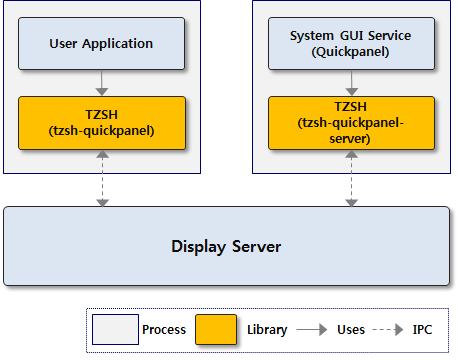

# Tizen Window System Shell

Tizen Window System Shell (TZSH) is an interface for manipulating windows of the system Graphical User Interface (GUI) services such as Quickpanel and Softkey. It provides C libraries that allow you to control windows of system GUI services and get notifications about the state changes of each window within an application.

The system GUI service runs different processes. Therefore, all the operations of TZSH are performed using the inter-process communication (IPC). It is needed to enable communication between the system GUI service processes and separated user application process using the display server. The following figure illustrates a simple software architecture of TZSH:

**Figure: Layer diagram for the Tizen Window System Shell**



To support each system GUI service in Tizen, TZSH provides the following libraries:

- **[TZSH-Quickpanel](./tzsh-quickpanel.md)**: For the Quickpanel window that shows notifications and system setup widgets.

- **[TZSH-Softkey](./tzsh-softkey.md)**: For the Softkey window that shows the device back and home buttons.

Most applications do not need to use the TZSH's functionalities. However, in some cases, certain applications may require to perform manipulation of system GUI service window. For example, media player application needs to close the Quickpanel window during playback of video. In this case, you can use the TZSH-Quickpanel library.

## Prerequisites

To use the functions and structures of the TZSH API, include the `<tzsh.h>` header file in your application:

```
#include <tzsh.h>
```

## Create TZSH Structures
After you have created the main window of your application, call `tzsh_create()` with a native window ID to create the `tzsh_h` structure. To create the `tzsh_h` structure, use the following code:

```
#include <Elementary.h>
#include <tzsh.h>

static void
init(const char *name)
{
    Evas_Object *main_win;

    /* create main window for the application */
    main_win = elm_win_util_standard_add(name, name);

    /* set up main window */
    ...
    evas_object_show(main_win);


    tzsh_h tzsh;
    tzsh_window tz_win;

    /* Get native window ID of main window */
    tz_win = elm_win_window_id_get(main_win);

    /* Create tzsh_h structure */
    tzsh = tzsh_create(TZSH_TOOLKIT_TYPE_EFL);

    /* Do Something with TZSH */
```

## Destroy TZSH Structures
When TZSH structures are no longer needed, destroy the structures. To destroy the structures, use the following code:

```
static void
deinit(void)
{
    tzsh_destroy(tzsh);
}
```

## Related Information
- Dependencies
  - Tizen 3.0 and Higher for Mobile
  - Tizen 3.0 and Higher for Wearable
