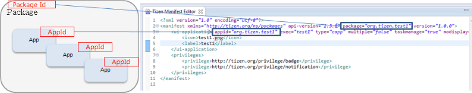
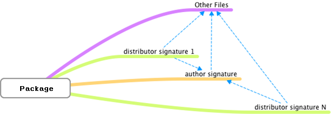
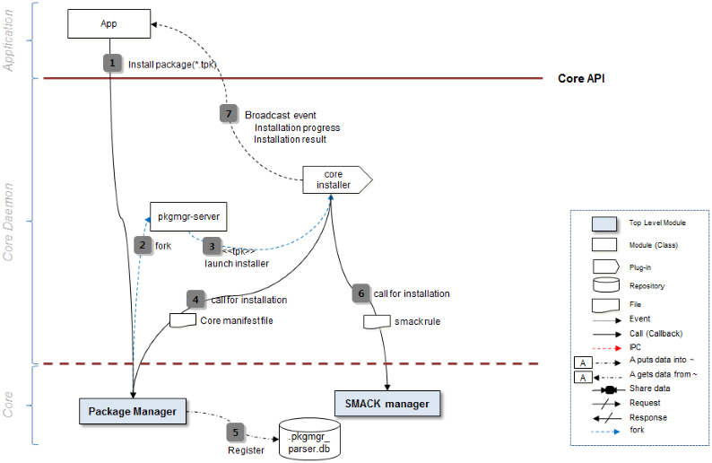

# Tizen Native Application

The Tizen native application model handles application life-cycle and system events. Tizen native application life-cycle is handled by the Application API (in [mobile](api/mobile/latest/group__CAPI__APPLICATION__MODULE.html)
and [wearable](api/wearable/latest/group__CAPI__APPLICATION__MODULE.html)
applications). It provides functions to manage the main event loop, the application state change events, and basic system events.

Tizen supports both UI applications (which have a graphical user interface) and service applications (which have no graphical user
interface). The UI and service applications can be packaged together, if necessary; however, a combined application package must contain only 1 UI application, while it can have several service applications.

Applications in the same package follow the same installation life-cycle, which is handled by the application package manager. Each
application in the package follows its own application life-cycle. Each application (UI application or service application) in an application package can be identified by its own ID.

The following figure shows the UI and service application life-cycle.

**Figure: UI and service application life-cycle**


A Tizen native application is similar to a conventional Linux application, with some additional features optimized for mobile and
wearable devices. These devices have constraints, such as relatively small screen sizes and lack of system resources compared to a larger system.

For example, for power management reasons, well-designed applications reduce resource usage when they detect that their display window is covered by another application window. State change events make the detection possible.

<a name="life"></a>
## Native Application Life-cycle

A Tizen native application can be in one of several different states.
Typically, the application is launched by the user from the Launcher, or by another application. When the application is starting, the `app_create_cb()` function is executed and the main event loop starts.  The application normally at the top window, with focus.

When the application loses the focus status, the `app_pause_cb()` callback is invoked. The application can go into the pause state, which means that your application is not terminated but continues to run in
the background, when:
-   A new application is launched by the request of your application.
-   The user requests to go to the home screen.
-   A system event (such as an incoming phone call) occurs and causes a resident application with a higher priority to become active and temporarily hide your application.
-   An alarm is triggered for another application, which becomes the
    topmost window and hides your application.

Since Tizen 2.4, an application in the background goes into a suspended state. In the suspended state, the application process is executed with limited CPU resources. In other words, the platform does not allow the running of the background applications, except for some exceptional applications (such as Media and Download) that necessarily work in the
background. In this case, the application can [designate their background category as an allowed category](guides/app-management/ui-app/efl-ui-app.md#allow_bg) to avoid going into the suspended state.

When your application becomes visible again, the `app_resume_cb()` callback is invoked. The visibility returns, when:

-   Another application requests your application to run (for example, the Task Navigator, which shows all running applications and lets user select any application to run).
-   All applications on top of your application in the window stack finish.
-   An alarm is triggered for your application, bringing it to the front and hiding other applications.

When your application starts exiting, the `app_terminate_cb()` callback is invoked. Your application can start the termination process, when:
-   Your application itself requests to exit by calling the `ui_app_exit()` or `service_app_exit()` function to terminate the
    event loop.
-   The low memory killer is terminating your application in a low
    memory situation.

Because a service application has no UI, neither does it have a pause state. Since Tizen 2.4, a service application can go into the suspended state. Basically, the service application is running in the background by its nature; so the platform does not allow running the service application unless the application has a background category defined in its manifest file. However, when the UI application that is packaged with the service application is running on the foreground, the service application is also regarded as a foreground application and it can be run without a designated background category.

Application state changes are managed by the underlying framework. For more information on application state transitions, see [Application States and Transitions](guides/app-management/ui-app/efl-ui-app.md#state_trans).

<a name="start"></a>
## Starting the Tizen Native Application


An application can be launched by the user from the Launcher or by another application. Either way, the Application Framework starts the
application by creating a new process and calling the application entry point. Like in a conventional Linux application, the application main
function is the entry point. For more information on launching native applications, see [Application
Controls](guides/app-management/app-controls.md).

<a name="packageID"></a>
## Package ID and Application ID


When developing a Tizen application, you must define a package and application ID:

-   Package ID

    The package ID, such as `org.tizen.message` or `org.tizen.call`, is the application package identifier.

    The package ID functions as a unit for package installation, uninstallation, and updates. It is also the unit of the application package DRM, sandboxing, and privilege.

- Application ID

    The application ID (`appid`) is the application identifier. Multiple applications are allowed in a package and the application ID is used to identify the different applications.

    The application ID must be the same as the package ID if the package contains a single application. If [the package contains multiple applications](tutorials/process/app-dev-process.md#develop), the application ID must be assigned with the package ID as a prefix. For example, if the `org.tizen.message` package contains 2 applications, the main application is named as `org.tizen.message`, and the second application is named as `org.tizen.message.app2`.

    The application ID functions as a unit for launching and terminating applications, and for App Control.

You can use the a\~z, A\~Z, 0\~9, ".", "-", and "\_" characters for the package and application ID. Both values must be shorter than 50 characters.

The following figure shows how to use the package and application ID.

**Figure: Package ID and application ID**



<a name="appdirectory"></a>
## Application Directory Policy


The following list shows the directory hierarchy:

- `bin`: Executable binary path
- `lib`: Library path
- `res`: Resource path
- `data`: The application's own directory (read or write); no initial data
- `shared/`: For sharing with other applications

    Sandboxing refers to an application package which can access its own directories only. It is used to share resources in the `shared` directories.

    In sandboxing, [SMACK](#installer) is used, and discretionary access control (DAC) is applied to application package directories and files. The uid(root, app) is applied to directories and files.

The `tizen-manifest.xml` file and signature files are located in the application root directory.

### Permissions

The installed packages have a user ID, a group ID, permissions, and a smack label.

**Figure: Permissions**


The following table shows the details of files and directories.

**Table: Package data**

| Name                   | File or directory | Owner:Group | Permission | Smack label             |
| ---------------------- | ----------------- | ----------- | ---------- | ----------------------- |
| `bin`                  | Directory         | root:root   | rwxr-xr-x  | {PackageId}<sup>1</sup>            |
| `data`                 | Directory         | app:app     | rwxr-xr-x  | {PackageId}             |
| `lib`                  | Directory         | root:root   | rwxr-xr-x  | {PackageId}             |
| `res`                  | Directory         | root:root   | rwxr-xr-x  | {PackageId}             |
| `shared`               | Directory         | root:root   | rwxr-xr-x  | -                       |
| `shared/data`          | Directory         | app:app     | rwxr-xr-x  | {Random}<sup>2</sup> transmute    |
| `shared/res`           | Directory         | root:root   | rwxr-xr-x  | -                       |
| `shared/trusted`       | Directory         | app:app     | rwxr-xr-x  | {Cert Hash}<sup>3</sup> transmute |
| `author-signature.xml` | File              | root:root   | rwxr-xr-x  | {PackageId}             |
| `signature1.xml`       | File              | root:root   | rwxr-xr-x  | {PackageId}             |
| `signature2.xml`       | File              | root:root   | rwxr-xr-x  | {PackageId}             |
| `signatureN.xml`       | File              | root:root   | rwxr-xr-x  | {PackageId}             |
| `tizen-manifest.xml`   | File              | root:root   | rwxr-xr-x  | {PackageId}             |

<sup>1</sup> The {PackageId} is the package ID, such as `org.tizen.browser`.

<sup>2</sup> {Random} means that there is a 28-byte random string created by the
smack module.

<sup>3</sup> {Cert Hash} refers to a 28-byte string where \[Raw Hash\] equals to
Base64Encode (SHA1 author certificate in `author-signature.xml`) and
{Cert Hash} replaces "/" with "\#" in \[Raw Hash\].

<a name="appmanifest"></a>
## Application Manifest


The following example shows the beginning of the Tizen manifest schema:

```xml
<?xml version="1.0" encoding="UTF-8"?>
<xs:schema xmlns:xs="http://www.w3.org/2001/XMLSchema" elementFormDefault="qualified" targetNamespace="http://tizen.org/ns/packages" xmlns:packages="http://tizen.org/ns/packages">
   <xs:import namespace="http://www.w3.org/XML/1998/namespace" schemaLocation="xml.xsd"/>
      <xs:element name="manifest">
         <xs:complexType>
            <xs:sequence>
               <xs:choice maxOccurs="unbounded">
                  <xs:element ref="packages:label"/>
```

The following example shows the syntax of the manifest reference. The
`<manifest>` element serves as a container for the other configuration
elements.

```xml
<manifest xmlns=http://tizen.org/ns/packages
          package="org.tizen.application"
          version="1.0.0"
          api-version="2.3">
```

<a name="signature"></a>
## Signature


A Tizen package is digitally signed by an author and 1 or more distributors to produce a signature file that cryptographically covers all the package files.

There are two types of signatures:

-   Author signature

    The author signature specifies which entity alleges to have authored the package, that the integrity of the package is as the author intended, and whether a set of packages came from the same author.

- Distributor signature

    The distributor signature specifies that a particular distributor has distributed a package, that the integrity of the package is as the distributor intended, and whether a set of packages came from the same distributor.

The following image describes the relationship between the signatures.

**Figure: Signature**



<a name="installer"></a>
## Installer and SMACK

The following figure describes how the application installer works.

**Figure: Installer**



The installer applies smack according to the privileges that are specified in the `tizen-manifest.xml` file.

An application can only access the resources that are allowed by the privileges. The privileges are used in the Tizen Store to show the permissions and receive user consent.

<a name="commands"></a>
## Package Commands


You can use shell commands to install, uninstall, update, and launch applications.

**Figure: Tizen Studio interactions**


## Native Applications Tutorials

The introduction to native applications documentation provides overall information you need to become familiar with native-specific Tizen programming and the Tizen application model:

- [Getting Started](getting-started/overview.md)

    Demonstrates how you can create your first simple native application.

- [Overview of Tizen UI Development](tutorials/ui-builder/ui-builder-overview.md)

    Describes the basic characteristics and components of UI development with EFL.

- [Designing Your Native Application](tutorials/ui-builder/ui-builder-app-design.md)

    Teaches you how to develop a native application using the native UI Builder tool.
