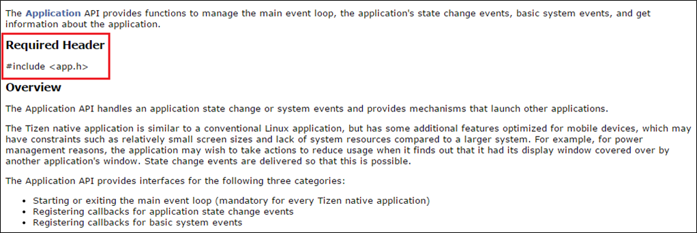
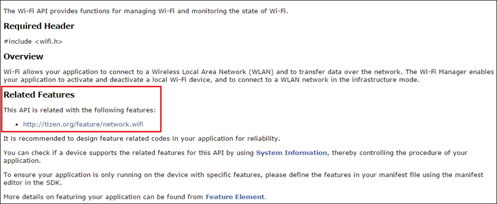
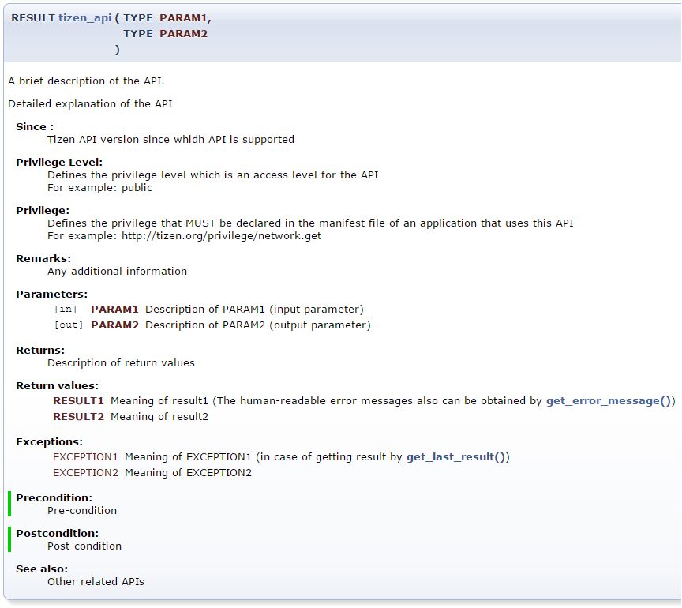
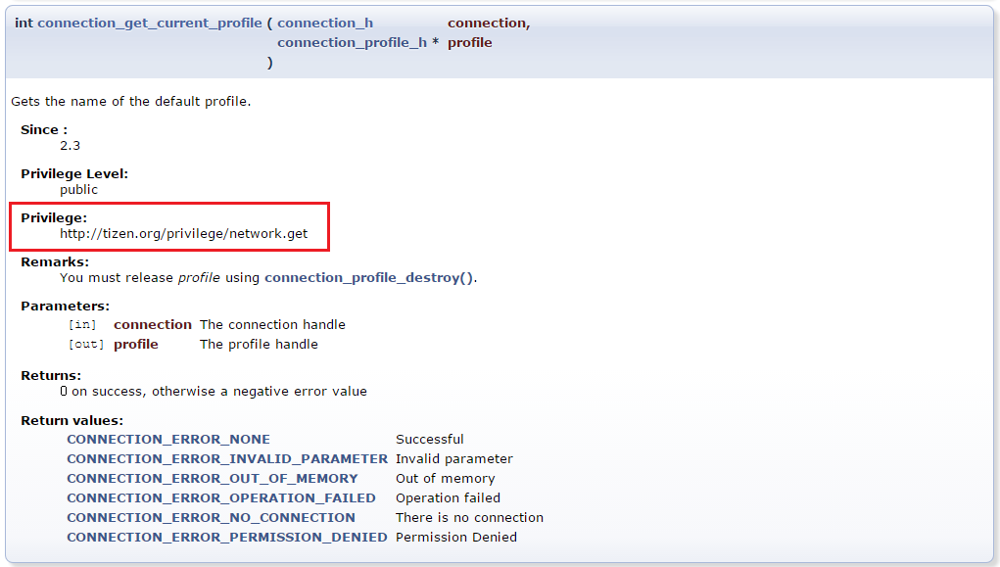

# Tizen Native API Overview

The Tizen Native API provides a comprehensive set of tools and libraries for developing high-performance, platform-specific applications across multiple device profiles. It offers developers access to low-level system capabilities and optimized functionality for building native applications on Tizen-powered devices.

## What is Tizen Native API?

The Tizen Native API is a carefully selected and tightly managed collection of APIs from the Tizen Native subsystems. It is divided into dozens of API modules, where each module represents a logically similar set of submodule APIs grouped into the same category. This modular structure makes it easier for developers to find specific methods needed to implement features in their applications.

### Common API (Tizen 8.0+)

Starting from Tizen 8.0, a single unified set of Native APIs is supported across all device profiles. This provides a consistent development experience regardless of the target device type.

### Legacy Device Profiles

For versions prior to Tizen 8.0, the Native API supports separate profiles:

- **Mobile**: Smartphones and tablets with full-featured capabilities
- **Wearable**: Smartwatches and wearable devices with optimized features
- **IoT-Headed**: IoT devices with display capabilities
- **IoT-Headless**: IoT devices without display capabilities

Each profile contains somewhat different modules optimized for their specific use cases and hardware capabilities.

## API Module Categories

The Tizen Native API consists of several major module categories, each containing multiple submodules:

### Account

Manages user account information and authentication services.

**Key Submodules:**
- AccountManager - CRUD operations for account management
- FIDO Client - Universal Authentication Framework
- OAuth 2.0 - Secure authorization token management
- Sync Manager - Data synchronization operations

### Application Framework

Core framework for application life-cycle management and inter-application communication.

**Key Submodules:**
- Application - Main event loop and state management
- Application Manager - Application information and control
- Data Control - Inter-application data exchange
- Message Port - Application-to-application messaging
- Notification - User notification system
- Package Manager - Package information and management

### Base

Fundamental libraries and utilities for application development.

**Key Submodules:**
- C++ Standard Library - Standard C++ library support
- Common Error - Shared error codes across APIs
- Glib - Low-level libraries and data structures
- Sqlite - Lightweight SQL database
- Utils > i18n - Internationalization support

### Content

Media content management and metadata operations.

**Key Submodules:**
- Download - HTTP-based content downloading
- MIME Type - MIME type to file extension mapping
- Media Content - Media database management

### Context

Context-aware features and triggers.

**Key Submodules:**
- Contextual History - Usage statistics and patterns
- Contextual Trigger - Rule-based event triggering

### Location

Location-based services and geographic positioning.

**Key Submodules:**
- GeofenceManager - Geofencing services
- LocationManager - GPS and positioning services
- Maps Service - Map rendering and interaction

### Messaging

Communication and messaging capabilities.

**Key Submodules:**
- Email - Email composition and management
- Messages - SMS, MMS, and WAP push messages
- Push - Push notification services

### Multimedia

Audio, video, and image processing capabilities.

**Key Submodules:**
- Audio I/O - Raw audio device access
- Camera - Camera preview and capture
- Image Util - Image encoding, decoding, and transformation
- Media Codec - Audio/video encoding and decoding
- Player - Media playback control
- Recorder - Media recording functionality
- Media Vision - Barcode detection, face recognition

### Network

Network communication and connectivity.

**Key Submodules:**
- Bluetooth - Bluetooth device management
- Connection - Network connection information
- HTTP - Web server communication
- NFC - Near Field Communication
- Wi-Fi - Wi-Fi connection management
- Wi-Fi Direct - Direct device-to-device connection
- VPN Service - Virtual Private Network connections

### Security

Cryptographic functions and secure data management.

**Key Submodules:**
- Device Certificate Manager - Certificate and key management
- Device Policy Manager - Enterprise security policies
- Key Manager - Secure key and certificate storage
- Privacy Privilege Manager - Privacy permission management
- YACA - Cryptographic operations

### Social

Personal data management for contacts and calendars.

**Key Submodules:**
- Calendar - Calendar and event management
- Contacts - Contact information management
- Phonenumber utils - Phone number parsing and formatting

### System

System-level device management and monitoring.

**Key Submodules:**
- Device - Device control and status monitoring
- Feedback - Haptic and audio feedback
- Sensor - Sensor data acquisition
- Storage - Storage information and management
- System Information - Device and platform information

### Telephony

Telephony and network services.

**Key Submodules:**
- Telephony Information - Call, network, and SIM information

### UI

User interface and graphics rendering.

**Key Submodules:**
- EFL - Enlightenment Foundation Libraries
- EFL Extension - Device-specific UI enhancements
- OpenGL ES - 2D/3D graphics rendering
- Vulkan - Modern graphics API
- Tizen Window System Shell - Window manager communication

### UIX

User interaction and input handling.

**Key Submodules:**
- Gesture - Gesture recognition
- Input Method - IME (Input Method Editor) support
- STT - Speech-to-Text
- TTS - Text-to-Speech
- Voice Control - Voice command recognition

### Web

Web browsing and JSON document handling.

**Key Submodules:**
- Json-Glib - JSON document parsing
- WebView - Web page display and control

## API Structure and Documentation

### Required Headers

To use an API, you must include the header file where the API is defined. The required header is specified in the API reference documentation.

**Figure: Required Header Documentation**

### Related Features

Some APIs require specific features to be declared in the `tizen-manifest.xml` file. If an API has a "Related Feature" section, the feature must be declared to prevent your application from being filtered out on the official Tizen application store.

**Figure: Related Feature Documentation**

### Function Documentation Structure

API functions are documented using a unified structure that includes:

- Function name and signature
- Brief description
- Detailed description
- Parameters
- Return values
- Preconditions
- Postconditions
- See also
- Examples

**Figure: Function Documentation Structure**

### Privileges

Many APIs require specific privileges to access sensitive system resources or user data. These privileges must be declared in the `tizen-manifest.xml` file. If required privileges are not included, API calls return `TIZEN_ERROR_PERMISSION_DENIED`.

**Figure: Privilege Documentation**

## Related Documentation

- [API Reference](../api/overview.md) - Detailed API documentation
- [Guides](../guides/index.md) - Implementation guides for each API module
