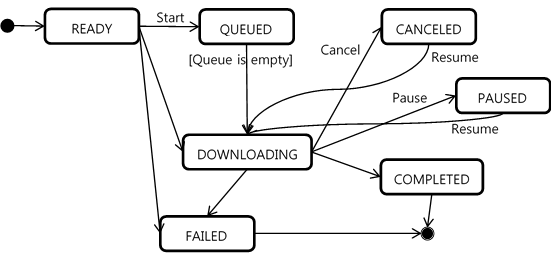

# Network Operations

The basic tasks involved in network operations are connecting to the
network, downloading HTTP content, and parsing data in XML and JSON
formats. The following sections provide you with the fundamental
building blocks for creating Tizen applications that download content
and parse data efficiently.

<a name="connection"></a>
## Connecting to the Network

You can write applications that create a network connection and check
the connection status over that connection. The connected application
can access connection details, such as the IP address, proxy
information, gateway information, and connection statistics.

### Required Privileges and Features

Applications that use the Network (in
[mobile](../../api/mobile/latest/group__CAPI__NETWORK__FRAMEWORK.html)
and
[wearable](../../api/wearable/latest/group__CAPI__NETWORK__FRAMEWORK.html)
applications) and Telephony (in
[mobile](../../api/mobile/latest/group__CAPI__TELEPHONY__FRAMEWORK.html)
and
[wearable](../../api/wearable/latest/group__CAPI__TELEPHONY__FRAMEWORK.html)
applications) APIs must declare the required privileges in the
`tizen-manifest.xml` file. For more information on the Tizen privileges,
see [Security and API Privileges](../details/sec-privileges.md).

To perform the network operations, the application manifest must include
the following privileges:

```xml
<privileges>
   <privilege>http://tizen.org/privilege/network.get</privilege>
</privileges>
```

To perform the network operations, the device must support the following
[features](../details/app-filtering.md):

-   `http://tizen.org/feature/network.wifi`
-   `http://tizen.org/feature/network.telephony`

### Network Selection

The supported network connections vary depending on the device. If Wi-Fi
is available on your device, the device tries first to use a Wi-Fi
network to connect to the Internet, and only selects the mobile
(cellular) network if a Wi-Fi network is not available. If the device
does not support Wi-Fi, you must check whether it supports the mobile
network and whether mobile data is switched on.

### Checking the Network Connection

The Connection Manager API (in
[mobile](../../api/mobile/latest/group__CAPI__NETWORK__CONNECTION__MANAGER__MODULE.html)
and
[wearable](../../api/wearable/latest/group__CAPI__NETWORK__CONNECTION__MANAGER__MODULE.html)
applications) provides functions for managing data connections. It
allows you to get a state of the connection interface, such as
Bluetooth, mobile network, and Wi-Fi. It also contains functions for
getting the IP address, proxy information, and gateway information.

Before your application attempts to connect to a network, it must check
whether a network connection is available, by using the
`connection_get_type()` function. This is necessary, because the device
can be out of range of a network, or the user may have disabled both
Wi-Fi and mobile data access.

The following example demonstrates how to create a connection handle and
check the currently used connection type with the Connection API:

```c++
#include <tizen.h>
#include <service_app.h>
#include "service.h" /* Auto-generated header file by the Tizen Studio */
#include <net_connection.h>

static connection_h connection;

bool
service_app_create(void *data)
{
    int error_code;

    /* Create a connection handle */
    error_code = connection_create(&connection);
    if (error_code != CONNECTION_ERROR_NONE)
        return;

    /*
       Get the type of the current profile for data connection
       net_state is the network type defined in the connection_type_e enumerator
    */
    connection_type_e net_state;
    error_code = connection_get_type(connection, &net_state);
    if (error_code == CONNECTION_ERROR_NONE) {
        dlog_print(DLOG_INFO, LOG_TAG, "Network connection type: %d", net_state);
    }

    return true;
}

void
service_app_terminate(void *data)
{
    /* Destroy the created connection handle */
    error_code = connection_destroy(connection);

    return;
}

/* Assume that auto-generated functions from the Tizen Studio are here */

int
main(int argc, char* argv[])
{
    char ad[50] = {0,};
    service_app_lifecycle_callback_s event_callback;
    app_event_handler_h handlers[5] = {NULL,};

    event_callback.create = service_app_create;
    event_callback.terminate = service_app_terminate;
    event_callback.app_control = service_app_control;

    service_app_add_event_handler(&handlers[APP_EVENT_LOW_BATTERY], APP_EVENT_LOW_BATTERY,
                                  service_app_low_battery, &ad);
    service_app_add_event_handler(&handlers[APP_EVENT_LOW_MEMORY], APP_EVENT_LOW_MEMORY,
                                  service_app_low_memory, &ad);
    service_app_add_event_handler(&handlers[APP_EVENT_LANGUAGE_CHANGED], APP_EVENT_LANGUAGE_CHANGED,
                                  service_app_lang_changed, &ad);
    service_app_add_event_handler(&handlers[APP_EVENT_REGION_FORMAT_CHANGED], APP_EVENT_REGION_FORMAT_CHANGED,
                                  service_app_region_changed, &ad);

    return service_app_main(argc, argv, &event_callback, ad);
}
```

<a name="download"></a>
## Downloading HTTP Content

After a network connection is established, the application can download
HTTP content from the Internet. There are 2 ways to download HTTP
content:

-   With [libcurl](http://curl.haxx.se/libcurl/), which is an open
    source library.
-   With the
    [Download](../../api/mobile/latest/group__CAPI__WEB__DOWNLOAD__MODULE.html)
    API, which is one of the Tizen Framework APIs.

### Required Privileges

To download HTTP content, the application must declare the required
privileges in the `tizen-manifest.xml` file. The files that the
application downloads from the Internet are stored in the device
storage. The privileges are required to access the resources for
downloading content and to save them to the media storage. For more
information on the Tizen privileges, see [Security and API
Privileges](../details/sec-privileges.md).

To perform the HTTP download operations, the application manifest must
include the following privileges:

```xml
<privileges>
   <privilege>http://tizen.org/privilege/download</privilege>
   <privilege>http://tizen.org/privilege/mediastorage</privilege>
</privileges>
```

### Downloading HTTP Content with libcurl

The Curl API (in
[mobile](../../api/mobile/latest/group__OPENSRC__CURL__FRAMEWORK.html)
and
[wearable](../../api/wearable/latest/group__OPENSRC__CURL__FRAMEWORK.html)
applications) is a client-side URL transfer library supporting various
protocols, such as HTTP, HTTPS, FTP, and file URIs. It allows
applications to perform URL-related activities without having to involve
a Web browser.

The following example demonstrates how to perform an HTTP download with
libcurl:

```c++
#include <tizen.h>
#include <service_app.h>
#include "service.h" /* Auto-generated header file by the Tizen Studio */
#include <curl/curl.h>

/*
   start_downloading() function utilizes the ecore_thread_feedback_run() function
   to allow the download_thread_run_cb() function to call the
   download_feedback_cb function
*/
static void
start_downloading(void *data)
{
    appdata_s *ad = data;
    Ecore_Thread *thread;

    /* Create a thread that communicates with the main thread */
    thread = ecore_thread_feedback_run(download_thread_run_cb, download_feedback_cb,
                                       download_thread_end_cb, download_thread_cancel_cb,
                                       ad, EINA_FALSE);
}

bool
service_app_create(void *data)
{
    start_downloading(data);

    return true;
}

/* Assume that auto-generated functions from the Tizen Studio are here */

int
main(int argc, char* argv[])
{
    char ad[50] = {0,};
    service_app_lifecycle_callback_s event_callback;
    app_event_handler_h handlers[5] = {NULL,};

    event_callback.create = service_app_create;
    event_callback.terminate = service_app_terminate;
    event_callback.app_control = service_app_control;

    service_app_add_event_handler(&handlers[APP_EVENT_LOW_BATTERY], APP_EVENT_LOW_BATTERY,
                                  service_app_low_battery, &ad);
    service_app_add_event_handler(&handlers[APP_EVENT_LOW_MEMORY], APP_EVENT_LOW_MEMORY,
                                  service_app_low_memory, &ad);
    service_app_add_event_handler(&handlers[APP_EVENT_LANGUAGE_CHANGED], APP_EVENT_LANGUAGE_CHANGED,
                                  service_app_lang_changed, &ad);
    service_app_add_event_handler(&handlers[APP_EVENT_REGION_FORMAT_CHANGED], APP_EVENT_REGION_FORMAT_CHANGED,
                                  service_app_region_changed, &ad);

    return service_app_main(argc, argv, &event_callback, ad);
}
```

The `ecore_thread_feedback()` function allows the
`download_thread_run_cb()` callback to call the `download_feedback_cb()`
callback:

```c++
static void
download_thread_run_cb(void *data, Ecore_Thread *thread)
{
    download_contents(data);

    /*
       ecore_thread_feedback() invokes download_feedback_cb()
       registered by ecore_thread_feedback_run()
    */
    ecore_thread_feedback(thread, data);
}

static void
download_contents(void *data)
{
    if (data == NULL) {
        dlog_print(DLOG_ERROR, LOG_TAG, "data is NULL");

        return;
    }

    appdata_s *ad = data;
    CURL *curl;

    const char error_message[BUFFER_SIZE];

    /* Initialize the curl session */
    curl = curl_easy_init();
    dlog_print(DLOG_DEBUG, LOG_TAG, "curl_easy_init()");

    /* Download the header */
    if (curl) {
        /* Set URL to get */
        CURLcode error_code = curl_easy_setopt(curl, CURLOPT_URL, "http://developer.tizen.org");

        /* Verify the SSL certificate */
        curl_easy_setopt(curl_handle, CURLOPT_SSL_VERIFYPEER, 0L);

        /* Verify the host name in the SSL certificate */
        curl_easy_setopt(curl_handle, CURLOPT_SSL_VERIFYHOST, 0L);

        /* Follow HTTP 3xx redirects */
        curl_easy_setopt(curl_handle, CURLOPT_FOLLOWLOCATION, 1L);

        /* Callback for writing data */
        curl_easy_setopt(curl_handle, CURLOPT_WRITEFUNCTION, WriteMemoryCb);

        /* Data pointer to pass to the write callback */
        curl_easy_setopt(curl_handle, CURLOPT_WRITEDATA, (void *)&chunk);

        /* User-Agent: header */
        curl_easy_setopt(curl_handle, CURLOPT_USERAGENT, "TizenMaps/1.0");

        /* Provide a buffer for storing errors */
        curl_easy_setopt(curl_handle, CURLOPT_ERRORBUFFER, errbuf);

        /* Timeout for the entire request */
        curl_easy_setopt(curl_handle, CURLOPT_TIMEOUT, TIZEN_CFG_CURL_TIMEOUT);

        /* Callback to progress meter function */
        curl_easy_setopt(curl_handle, CURLOPT_XFERINFOFUNCTION, XferInfoCb);

        /* Switch off the progress meter */
        curl_easy_setopt(curl_handle, CURLOPT_NOPROGRESS, 0L);

        /* Perform a blocking file transfer */
        error_code = curl_easy_perform(curl);
        dlog_print(DLOG_DEBUG, LOG_TAG, "curl_easy_perform(curl): %s (%d)",
                   curl_easy_strerror(error_code), error_code);
        if (error_code == CURLE_ABORTED_BY_CALLBACK)
            /* Clean up and display cancel message */
        else if (error_code != CURLE_OK)
            /* Display failure message */

        curl_easy_cleanup(curl);
        dlog_print(DLOG_DEBUG, LOG_TAG, "curl_easy_cleanup(ad->curl)");
    } else {
        /* Display failure message */
    }
}

/*
   This function is called in the main thread whenever ecore_thread_feedback()
   is called in the download thread
*/
static void
download_feedback_cb(void *data, Ecore_Thread *thread, void *msg_data)
{
    /* TODO: Something that you want here */
    if (msg_data == NULL) {
        dlog_print(DLOG_ERROR, LOG_TAG, "msg_data is NULL");

        return;
    }
}

static void
download_thread_end_cb(void *data, Ecore_Thread *thread)
{
    dlog_print(DLOG_ERROR, LOG_TAG, "thread end!");
}

static void
download_thread_cancel_cb(void *data, Ecore_Thread *thread)
{
    dlog_print(DLOG_ERROR, LOG_TAG, "thread cancel!");
}
```

### Downloading HTTP Content with the Download API

You can download content asynchronously from a given URL into the device
storage. The
[Download](../../api/mobile/latest/group__CAPI__WEB__DOWNLOAD__MODULE.html)
API provides functions to create and manage 1 or more download requests.

This feature is supported in mobile applications only.

The following figure illustrates the download states:

**Figure: Download states**



The **Start** step begins to download content. If the queue is empty,
the state is transited to downloading (`DOWNLOAD_STATE_COMPLETED`).
Otherwise, the request is queued. The application can pause, cancel, or
resume the download based on user interaction. Whenever the user makes a
request, the state of the download is transited accordingly to paused,
canceled, or downloading.

The following example demonstrates how to perform an HTTP download:

```c++
#include <tizen.h>
#include <service_app.h>
#include "service.h" /* Auto-generated header file by the Tizen Studio */
#include <download.h>

download_error_e error;
int download_id;
/* Callback to be triggered by download_set_state_changed_cb() */
void
state_changed_cb(int download_id, download_state_e state, void *user_data)
{
    /* Download state is completed, failed, or canceled, destroy the handle */
    if (state >= DOWNLOAD_STATE_COMPLETED) {
        dlog_print(DLOG_INFO, LOG_TAG, "Download completed!");
        if (download_destroy(download_id) == DOWNLOAD_ERROR_NONE) {
            dlog_print(DLOG_INFO, LOG_TAG, "Successfully released the memory of a download request!");
        }
    }
}

/* Callback to be triggered by download_set_progress_cb() */
static void
progress_cb(int download_id, unsigned long long received, void *user_data)
{
    dlog_print(DLOG_INFO, LOG_TAG, "received: %llu of %llu", received, *((unsigned long long*)user_data));
}

/* Download the file with notification to default file name and location */
int
start_downloading()
{
    /* Create a download handle */
    error = download_create(&download_id);

    /* Set a callback to get the state */
    error = download_set_state_changed_cb(download_id, state_changed_cb, NULL);
    error = download_set_progress_cb(download_id, progress_cb, &content_size);

    /* Set the URL for downloading content */
    error = download_set_url(download_id, "http://developer.tizen.org");

    /*
       Set the destination path and file name
       If the values are not given,
       the default storage and an auto-generated file name are used
    */
    char *data_path = app_get_data_path();
    error = download_set_destination(download_id, data_path);
    free(data_path);
    error = download_set_file_name(download_id, "downloaded_file.bin");

    /*
       Set auto download
       If you set the second parameter to true, the download manager continues downloading
       even after the client process is terminated
    */
    error = download_set_auto_download(download_id, true);

    /* Start content download */
    error = download_start(download_id);

    return error;
}

int
end_downloading()
{
    /* Release callbacks */
    download_unset_progress_cb(download_id);
    download_unset_state_changed_cb(download_id);

    /* Destroy the download handle */
    error = download_destroy(download_id);

    return error;
}

bool
service_app_create(void *data)
{
    start_downloading(data);

    return true;
}

void
service_app_terminate(void *data)
{
    end_downloading();

    return;
}

/* Assume that auto-generated functions from the Tizen Studio are here */

int
main(int argc, char* argv[])
{
    char ad[50] = {0,};
    service_app_lifecycle_callback_s event_callback;
    app_event_handler_h handlers[5] = {NULL,};

    event_callback.create = service_app_create;
    event_callback.terminate = service_app_terminate;
    event_callback.app_control = service_app_control;

    service_app_add_event_handler(&handlers[APP_EVENT_LOW_BATTERY], APP_EVENT_LOW_BATTERY,
                                  service_app_low_battery, &ad);
    service_app_add_event_handler(&handlers[APP_EVENT_LOW_MEMORY], APP_EVENT_LOW_MEMORY,
                                  service_app_low_memory, &ad);
    service_app_add_event_handler(&handlers[APP_EVENT_LANGUAGE_CHANGED], APP_EVENT_LANGUAGE_CHANGED,
                                  service_app_lang_changed, &ad);
    service_app_add_event_handler(&handlers[APP_EVENT_REGION_FORMAT_CHANGED], APP_EVENT_REGION_FORMAT_CHANGED,
                                  service_app_region_changed, &ad);

    return service_app_main(argc, argv, &event_callback, ad);
}
```

<a name="parse"></a>
## Parsing XML and JSON

The responses of many open APIs are composed of XML or JSON data. Tizen
provides the [JSON-GLIB](https://developer.gnome.org/json-glib/) library
for parsing JSON and [libxml2](http://www.xmlsoft.org/) for parsing XML.

### Required Privileges

Applications that read and write to a device file system must declare
the required privileges in the `tizen-manifest.xml` file. For more
information on the Tizen privileges, see [Security and API
Privileges](../details/sec-privileges-n.md).

To perform the download operations and read and write to a file system,
the application manifest must include the following privileges:

```xml
<privileges>
   <privilege>http://tizen.org/privilege/filesystem.read</privilege>
   <privilege>http://tizen.org/privilege/filesystem.write</privilege>
</privileges>
```

### Parsing JSON

[JSON-GLib](https://developer.gnome.org/json-glib/stable/) is a library
aimed at providing an API for efficient parsing and writing of JSON
(JavaScript Object Notation) streams, using GLib data types and API. As
Tizen supports JSON-GLIB natively, you do not need to manually download
this library and install it on your project.

The following example demonstrates how to parse a JSON file:

```c++
#include <json-glib/json-glib.h>

/* Called a moment after downloading */
static void
parse_downloaded(void *data)
{
    char *file_name = NULL;
    download_get_downloaded_file_path((int)data, &file_name);
    dlog_print(DLOG_DEBUG, LOG_TAG, "got file %s", file_name);

    /* Parse a file */
    call_parser(file_name);

    /* Remove the file when no longer used */
    remove(file_name);
}

static void
call_parser(char *file_name)
{
    int parse_reply = json_parse(file_name, ad_);
    if (parse_reply == -1) {
        elm_object_text_set(ad_->popup_label, "<align=center>This file is not in JSON format</align>");
    } else if (parse_reply == 1) {
        elm_object_text_set(ad_->popup_label, "<align=center>File parsed, however some nodes "
                            "weren't imported due to the limit of nesting level</align>");
    } else {
        elm_object_text_set(ad_->popup_label, "<align=center>File parsed</align>");
    }
}

/* Parse a given JSON file */
int
json_parse(char *file_name, void *data)
{
    appdata_s *ad = (appdata_s *)data;
    GError *error = NULL;
    JsonParser *parser = json_parser_new();

    /* Load a file to parse */
    json_parser_load_from_file(parser, file_name, &error);

    dlog_print(DLOG_DEBUG, LOG_TAG, "parsing %s", file_name);

    if (error) {
        dlog_print(DLOG_DEBUG, LOG_TAG, "parsing failed");
        g_object_unref(parser);
        g_error_free(error);

        return -1;
    }

    /* Iterate through root members */
    JsonNode *root = json_parser_get_root(parser);

    if (json_node_get_node_type(root) == JSON_NODE_NULL
        || json_node_get_node_type(root) == JSON_NODE_VALUE) {
        dlog_print(DLOG_DEBUG, LOG_TAG, "not supported root");
        g_object_unref(parser);

        return -1;
    }

    ad->parsing_in_progress = true;

    /* Show editor item */
    create_editor_view(data, NULL, NULL);

    switch (json_node_get_node_type(root)) {
    case JSON_NODE_OBJECT:
        ;
        JsonObject *object;
        object = json_node_get_object(root);
        json_object_foreach_member(object, object_member_cb, (gpointer)root_associated);
        break;
    case JSON_NODE_ARRAY:
        ;
        JsonArray *array;
        array = json_node_get_array(root);
        json_array_foreach_element(array, array_element_cb, (gpointer)root_associated);
        break;
    default:
        ;
    }

    root_associated->type = json_node_get_node_type(root);

    ad->parsing_in_progress = false;

    g_object_unref(parser);

    if (nodes_omitted)
        return 1;

    return 0;
}
```

### Parsing XML

Libxml2 is the XML C parser and toolkit developed for the Gnome project
(but usable outside the Gnome platform). It is free software available
under the MIT License. XML itself is a metalanguage to design markup
languages: it is a text language where semantics and structure are added
to the content using extra **markup** information enclosed between angle
brackets. HTML is the most well-known markup language. Though the
library is written in C, a variety of language bindings make it
available in other environments.

> **Note**  
> For more examples and tutorials, see [libxml
Tutorial](http://www.xmlsoft.org/tutorial/index.html).


The following example comes from the libxml Tutorial. It demonstrates
how to parse and validate an XML file to a tree and free the result:

```c++
/*
   section: Parsing
   synopsis: Parse and validate an XML file to a tree and free the result
   purpose: Create a parser context for an XML file, then parse and validate
            the file, creating a tree, check the validation result
            and xmlFreeDoc() to free the resulting tree
   usage: parse2 test2.xml
   test: parse2 test2.xml
   author: Daniel Veillard
   copy: see Copyright for the status of this software
*/

#include <stdio.h>
#include <libxml/parser.h>
#include <libxml/tree.h>

/*
   exampleFunc:
   @filename: a filename or an URL

   Parse and validate the resource and free the resulting tree
*/
static void
exampleFunc(const char *filename)
{
    xmlParserCtxtPtr ctxt; /* Parser context */
    xmlDocPtr doc; /* Resulting document tree */

    /* Create a parser context */
    ctxt = xmlNewParserCtxt();
    if (ctxt == NULL) {
        fprintf(stderr, "Failed to allocate parser context\n");

        return;
    }
    /* Parse the file, activating the DTD validation option */
    doc = xmlCtxtReadFile(ctxt, filename, NULL, XML_PARSE_DTDVALID);
    /* Check whether parsing succeeds */
    if (doc == NULL) {
        fprintf(stderr, "Failed to parse %s\n", filename);
    } else {
        /* Check whether validation succeeds */
        if (ctxt->valid == 0)
            fprintf(stderr, "Failed to validate %s\n", filename);
        /* Free up the resulting document */
        xmlFreeDoc(doc);
    }
    /* Free up the parser context */
    xmlFreeParserCtxt(ctxt);
}

int
main(int argc, char **argv)
{
    if (argc != 2)
        return(1);

    /*
       Initialize the library and check potential ABI mismatches
       between the version it was compiled for and the actual shared
       library used
    */
    LIBXML_TEST_VERSION

    exampleFunc(argv[1]);

    /* Cleanup function for the XML library */
    xmlCleanupParser();
    /* This is to debug memory for regression tests */
    xmlMemoryDump();

    return(0);
}
```
