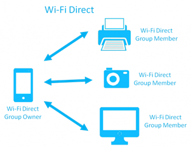

# P2P Connections with Wi-Fi Direct&reg;

Wi-Fi Direct&reg; (synonym for Wi-Fi P2P (Peer-to-Peer)) is a technology
that allows you to find nearby Wi-Fi Direct devices and form a Wi-Fi
Direct group to communicate over a peer-to-peer link without wireless
access points (base stations) in the infrastructure mode.

This feature is supported in mobile applications only.

In a Wi-Fi Direct group, the group owner works as an access point (AP)
in the Wi-Fi infrastructure mode and the other devices join the group as
clients. A group can be created by:

-   Negotiation between 2 devices

    In a negotiation-based group creation, 2 devices compete based on
    the group owner intent value and the higher intent device becomes a
    group owner, while the other device becomes a group client.

- In an autonomous mode by a single group owner device

    In an autonomous group creation, a device becomes a group owner by
    itself without any group client.

The following sections demonstrate how to find and connect to nearby
devices using Wi-Fi Direct.

<a name="privilege"></a>
## Required Privileges and Features

Applications that use Wi-Fi Direct must declare the required privileges
in the `tizen-manifest.xml` file. For more information on the Tizen
privileges, see [Security and API
Privileges](../details/sec-privileges.md).

To perform the Wi-Fi Direct operations, the application manifest must
include the following privileges:

```xml
<privileges>
   <privilege>http://tizen.org/privilege/network.get</privilege>
   <privilege>http://tizen.org/privilege/internet</privilege>
   <privilege>http://tizen.org/privilege/wifidirect</privilege>
</privileges>
```


> **Note**  
> Wi-Fi Direct does not require an Internet connection, but it
needs the `http://tizen.org/privilege/internet` privilege because it
uses standard sockets.


To perform the Wi-Fi Direct operations, the device must support the
following [features](../details/app-filtering.md):

-   `http://tizen.org/feature/network.wifi`
-   `http://tizen.org/feature/network.wifi.direct`
-   `http://tizen.org/feature/network.wifi.direct.display`
-   `http://tizen.org/feature/network.wifi.direct.service_discovery`


<a name="setting"></a>
## Wi-Fi Direct Settings

To use Wi-Fi P2P, you must confirm that 2 devices are connected through
Wi-Fi Direct. To see the Wi-Fi Direct settings, go to **Settings &gt;
Wi-Fi &gt; Wi-Fi Direct** on the device. To listen for the Wi-Fi Direct
states, set a callback function.

<a name="implement"></a>
## Implementing Wi-Fi Direct

To use Wi-Fi P2P, you must activate Wi-Fi Direct and start the service.
If you want to listen for Wi-Fi Direct states, you must also set a
callback function.

To implement a Wi-Fi Direct connection:

1.  Initialize Wi-Fi Direct to use all Wi-Fi Direct functions:

    ```c++
    #include <wifi_direct.h>
    int error_code;

    error_code = wifi_direct_initialize();
    ```

    To monitor the state of several events, the application can set
    state changed callbacks using the
    `wifi_direct_set_device_state_changed_cb()`,
    `discovery_state_changed_cb()`, and
    `wifi_direct_set_connection_state_changed_cb()` functions after
    initializing Wi-Fi Direct.

2. Activate Wi-Fi Direct.

    Define the `device_state_changed_cb()` callback function, which is
    invoked whenever a Wi-Fi Direct local device activates or
    deactivates:

    ```c++
    /*
       Get the Wi-Fi Direct activation and deactivation events
       in device_state_changed_cb() callback
    */
    static void
    device_state_changed_cb(wifi_direct_error_e error_code,
                            wifi_direct_discovery_state_e discovery_state, void *user_data)
    {
        if (device_state == WIFI_DIRECT_DEVICE_STATE_ACTIVATED)
            printf("Activate Wi-Fi Direct device!\n");
        else if (device_state == WIFI_DIRECT_DEVICE_STATE_DEACTIVATED)
            printf("Deactivate Wi-Fi Direct device!\n");
    }

    error_code = wifi_direct_set_device_state_changed_cb(device_state_changed_cb, NULL);

    /* Activate Wi-Fi Direct */
    error_code = wifi_direct_activate();
    if (error_code != WIFI_DIRECT_ERROR_NONE) {
        dlog_print(DLOG_ERROR, LOG_TAG, "[wifi_direct_activate] Failed.");

        return;
    } else {
        dlog_print(DLOG_DEBUG, LOG_TAG, "[wifi_direct_activate] Succeeded.");
    }
    ```

    After the `wifi_direct_activate()` function is completed, the
    `device_state_changed_cb()` callback is invoked.

3. Start the discovery to find nearby peer devices:

    ```c++
    void
    discovery_state_changed_cb(wifi_direct_error_e error_code,
                               wifi_direct_discovery_state_e discovery_state, void *user_data);

    error_code = wifi_direct_set_discovery_state_changed_cb(discovery_state_changed_cb, NULL);

    /* Discover nearby Wi-Fi Direct peer devices */
    wifi_direct_start_discovery(false, 0);
    ```

    When the Wi-Fi Direct discovery state changes, the
    `discovery_state_changed_cb()` function is called.

4. Fetch the list of peers.

    Get the list of peers with the
    `wifi_direct_foreach_discovered_peers()` function. It invokes the
    `wifi_direct_discovered_peer_cb()` callback, which provides
    information about the peers that Wi-Fi P2P has detected:

    ```c++
    char * mac_address = NULL;

    bool
    discovered_peer_cb(wifi_direct_discovered_peer_info_s *peer, void *user_data)
    {
        if (NULL != peer) {
            printf("\nDevice Name: %s", peer->device_name);
            printf("\nMac Address: %s", peer->mac_address);
            mac_address = strdup(peer->mac_address);
            error_code = wifi_direct_connect(mac_address);
            if (error_code != WIFI_DIRECT_ERROR_NONE) {
                printf("Fail to connect\n");

                return -1;
            }

            return 1;
        }
    }

    int
    fetch_wifi_direct()
    {
        int error_code;

        int ret = wifi_direct_foreach_discovered_peers(discovered_peer_cb, &mac_address);
        if (ret != WIFI_DIRECT_ERROR_NONE) {
            dlog_print(DLOG_ERROR, LOG_TAG, "[wifi_direct_foreach_discovered_peers] Failed.");

            return;
        }
    }
    ```

5. Connect a specific Wi-Fi Direct peer device:

    ```c++
    static void
    connection_state_changed_cb(wifi_direct_error_e error_code,
                                wifi_direct_connection_state_e connection_state,
                                const char *mac_address, void *user_data)
    {
        printf("Connection state changed to: [%d] [%s]\n", connection_state,
               test_wfd_convert_connection_state_to_string(connection_state));

        bool accept_connection = false;
        int rv = 0;

        switch (connection_state) {
        case WIFI_DIRECT_CONNECTION_WPS_REQ:
            /* Outgoing requests */
            wifi_direct_wps_type_e wps_mode;
            wifi_direct_get_local_wps_type(&wps_mode);
            /* Handle the event */
            break;
        case WIFI_DIRECT_CONNECTION_REQ:
            /* Incoming requests */
            wifi_direct_wps_type_e wps_mode;
            wifi_direct_get_local_wps_type(&wps_mode);
            /* Handle the event */
            break;
        case WIFI_DIRECT_INVITATION_REQ:
            /* Invitation request from peer */
            /* Handle the event */
            break;
        case WIFI_DIRECT_DISASSOCIATION_IND:
        case WIFI_DIRECT_DISCONNECTION_IND:
            printf("Peer: [%s] disconnected.\n", mac_address);
            /* Handle the event */
            break;
        case WIFI_DIRECT_CONNECTION_IN_PROGRESS:
            printf("Connection in progress\n");
            /* Handle the event */
        case WIFI_DIRECT_CONNECTION_RSP:
            if (error_code == WIFI_DIRECT_ERROR_CONNECTION_FAILED) {
                printf(MAKE_RED"Time Out or connection failed"RESET_COLOR"\n");
                /* Handle the event */
            }
            break;
        case WIFI_DIRECT_GROUP_CREATED:
            /* Handle the event */
            break;
        case WIFI_DIRECT_GROUP_DESTROYED:
            /* Handle the event */
            break;
        case WIFI_DIRECT_DISCONNECTION_RSP:
            /* Handle the event */
            break;
        default:
            printf("Unknown State Received\n");
        }
    }

    error_code = wifi_direct_set_connection_state_changed_cb(connection_state_changed_cb, NULL);
    ```

6. When the connection is no longer needed, disconnect the Wi-Fi Direct
    device:

    ```c++
    error_code = wifi_direct_disconnect(mac_address);
    if (error_code != WIFI_DIRECT_ERROR_NONE) {
        printf("Fail to disconnect\n");

        return -1;
    }
    ```

7. To deactivate Wi-Fi Direct when it is no longer needed (or the
    application is exiting):

    ```c++
    /* Power off the local device using the wifi_direct_deactivate() function */
    /* Deactivate Wi-Fi Direct */
    wifi_direct_deactivate(NULL);

    /* Unset the callbacks */
    /* Unset the activation or deactivation event callback */
    wifi_direct_unset_device_state_changed_cb(NULL);

    /* Unset the discovery event callback */
    wifi_direct_unset_discovery_state_changed_cb(NULL);

    /* Unset the connection event callback */
    wifi_direct_unset_connection_state_changed_cb(NULL);
    ```

8. Release the Wi-Fi Direct.

    Power off the local device using the `wifi_direct_deactivate()`
    function:

    ```c++
    /* Release Wi-Fi Direct */
    wifi_direct_deinitialize();
    ```


<a name="TDLS"></a>
## Difference Between Wi-Fi Direct and TDLS

There are 2 protocol technologies to connect directly with each other
for Wi-Fi devices:

-   Wi-Fi Direct
-   TDLS (Tunneled Direct Link Setup)

Wi-Fi Direct-certified devices can quickly connect to one another while
on the go, even when a Wi-Fi network is unavailable, while TDLS operates
in the background of a Wi-Fi network to optimize performance. Many
devices are certified for both solutions and use them in different
situations.

For more information, see [What is the difference between TDLS and Wi-Fi
Direct?](http://www.wi-fi.org/knowledge-center/faq/what-is-the-difference-between-tdls-and-wi-fi-direct),
[IEEE 802.11z - TDLS](http://www.telecomabc.com/numbers/80211z.html) and
[Content sharing, syncing, streaming protocols for
Wi-Fi](https://www.excentis.com/blog/content-sharing-syncing-streaming-protocols-wi-fi).

### Wi-Fi Direct

Wi-Fi Direct is a new technology defined by the Wi-Fi Alliance aimed at
enhancing direct device to device communications in Wi-Fi. Wi-Fi Direct
can be used to directly connect mobile phones, tablets, and PCs to
peripherals, such as cameras, printers, gaming devices, or a wireless
mouse, without the need for an access point. Devices can make a
one-to-one connection, or a group of several devices can connect.

**Figure: Wi-Fi Direct**



Direct device to device connectivity was already possible in the
original IEEE 802.11 standard by means of the ad-hoc mode of operation.
However, this never became widely deployed. Wi-Fi Direct takes a
different approach: in it, one of the devices acts as an access point.
This means that legacy Wi-Fi devices can seamlessly connect to Wi-Fi
Direct devices.

### TDLS (Tunneled Direct Link Setup)

The IEEE 802.11z amendment is a mechanism that makes it possible to
directly transfer data between 2 Wi-Fi clients that are part of the same
Wi-Fi network.

**Figure: TDLS**


Usually, in a Wi-Fi network, data is transferred from one client to
another through an access point (AP). The IEEE 802.11z amendment defines
mechanisms that allow IEEE 802.11 to set up a direct link between client
devices while also remaining associated with the AP. These mechanisms
are referred to as Tunneled Direct Link Setup (TDLS). This reduces the
amount of traffic that is transferred in the network and prevents
congestion at the AP.

A TDLS direct link is set up automatically between the devices, without
intervention from the AP or the user. The connection with the AP is
maintained.

TDLS is not the same as, nor does it replace Wi-Fi Direct. TDLS is used
to optimize the traffic flow in a network, while Wi-Fi Direct is used to
quickly connect devices to one another while on the go, even when a
Wi-Fi network is unavailable.
