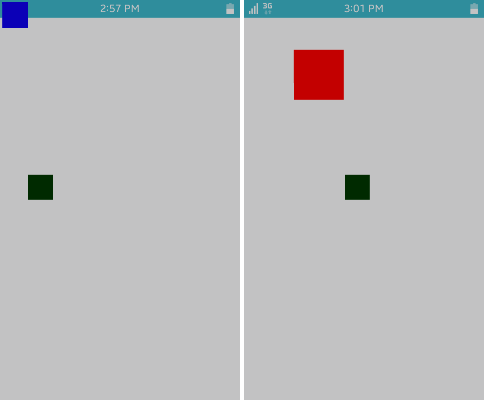

# Animations

You can change an object on the screen at certain intervals using an
animation. To create an animation, you must first determine the duration
of the animation, and then define a callback function that performs the
actual animation with that duration.

In the following example, 2 square rectangles are animated. One of them
simply moves on the screen, while the other also changes its color and
size while moving.

The following example uses the same **Basic UI** template as the square
drawing example. For more information on how to create the project with
the template, see [Squares on the Canvas](app-graphics-square.md).

To implement animations in an application:

1.  Create a new project and specify the project name as **AnimatorEx**.
2. After the project is created, open the `.c` source file in the `src`
    folder and add the new code to the `create_base_gui()` function to
    create 2 rectangles and 2 animations.

    The following functions are used to create the animations:

    -   `ecore_animator_frametime_set()` specifies a frame time interval
        for an animation. For example, if you specify the interval as
        1/50, 50 frame events occur in 1 second. The unit is seconds.
    - `ecore_animator_timeline_add()` creates an `Animator` object
        with a limited time specified in seconds by the first parameter.
        Once the runtime of the animator has elapsed, it is
        deleted automatically.

        The second parameter indicates the frame event callback function
        that actually defines the animation details, and the third
        parameter indicates the user data, which generally passes an
        object or application data to which you apply the animation.

        The callback function can return `ECORE_CALLBACK_RENEW` to keep
        the animator running or `ECORE_CALLBACK_CANCEL` to stop it and
        automatically delete it at any time.

    - `ecore_animator_add()` creates an `Animator` object. The first
        parameter indicates the frame event callback function that
        actually defines the animation details, and the second parameter
        indicates the user data.

        The `ecore_animator_timeline_add()` function is exactly like the
        `ecore_animator_add()` function, except that the animator only
        runs for a limited time.

    - `ecore_timer_add()` creates a timer to call the given function
        in the given period of time. The first parameter is the interval
        in seconds, and the second parameter is the given function.

        If this function returns `ECORE_CALLBACK_RENEW`, the timer is
        rescheduled for the next interval given in the first parameter.
        If it returns `ECORE_CALLBACK_CANCEL`, the timer is
        deleted automatically. The third parameter indicates the user
        data to pass to the function when it is called.

    The label is not used in this example, so annotate it.

    ```c++
    /*
       Conformant
       Create and initialize elm_conformant
       elm_conformant is mandatory for the base GUI to have a proper size
       when the indicator or virtual keypad is visible
    */
    ad->conform = elm_conformant_add(ad->win);
    elm_win_indicator_mode_set(ad->win, ELM_WIN_INDICATOR_SHOW);
    elm_win_indicator_opacity_set(ad->win, ELM_WIN_INDICATOR_OPAQUE);
    evas_object_size_hint_weight_set(ad->conform, EVAS_HINT_EXPAND, EVAS_HINT_EXPAND);
    elm_win_resize_object_add(ad->win, ad->conform);
    evas_object_show(ad->conform);
    /*
       Label
       Create an actual view of the base GUI
       Modify this part to change the view
    */
    #if 0 /* _NOT_USED */
        ad->label = elm_label_add(ad->conform);
        elm_object_text_set(ad->label, "<align=center>Hello Tizen</align>");
        evas_object_size_hint_weight_set(ad->label, EVAS_HINT_EXPAND, EVAS_HINT_EXPAND);
        elm_object_content_set(ad->conform, ad->label);
        evas_object_show(ad->label);
    #endif

    /* Evas */
    Evas *evas = evas_object_evas_get(ad->conform);

    /* Rect */
    Evas_Object * rect = evas_object_rectangle_add(evas);

    evas_object_color_set(rect, 0, 0, 255, 255);
    evas_object_resize(rect, 50, 50);
    evas_object_show(rect);

    Evas_Object *rect2 = evas_object_rectangle_add(evas);
    evas_object_color_set(rect2, 0, 55, 0, 255);
    evas_object_resize(rect2, 50, 50);
    evas_object_show(rect2);

    /* Animation */
    ecore_animator_frametime_set(1. / 50);
    Ecore_Animator *anim = ecore_animator_timeline_add(5, _advance_frame, rect);
    Ecore_Animator *anim2 = ecore_animator_add(_advance_frame3, rect2);
    Ecore_Timer *timer1 = ecore_timer_add(10, _start_second_anim, rect);
    Ecore_Timer *timer2 = ecore_timer_add(5, _freeze_third_anim, rect2);
    Ecore_Timer *timer3 = ecore_timer_add(10, _thaw_third_anim, rect2);

    /* Show the window after the base GUI is set up */
    evas_object_show(ad->win);
    ```

3. Create the frame event callback functions by adding them to the top
    of the `create_base_gui()` function:

    -   The code of the `_advance_frame()` timeline animation frame
        event callback function specifies the new size, position, and
        color of the square. It changes the blue square to red and grows
        it larger as it moves toward the bottom right. The style applied
        to the animation is `ECORE_POS_MAP_LINEAR`, which keeps the
        animation moving at a certain speed.
    -   The code of the `_advance_frame2()` timeline animation frame
        event callback function also specifies the size, position, and
        color of a square. The style applied to the animation is
        `ECORE_POS_MAP_BOUNCE`, which creates a vibration like a
        bouncing ball. It slows to a stop after bouncing off the
        ending point.
    -   The code of the `_advance_frame3()` timeline animation frame
        event callback function increases the X coordinate of an object
        by 2 at every frame. The static variable `x` is used in order to
        increase the X coordinate whenever this function is called. When
        the X coordinate becomes greater than 250, it starts back
        from 0. The `evas_object_move()` function changes the position
        of an object.

    The `ecore_animator_pos_map()` function returns the resulting value
    that is mapped onto the position of the current animation. The
    returned values range between 0 and 1. The resulting value when the
    animation starts is 0, and it gradually increases and eventually
    reaches 1 when the animation stops.

    The second parameter of the timeline animation event function must
    be passed to the first parameter of the
    `ecore_animator_pos_map()` function. For the second parameter, enter
    the style of the animation. The style types are described in the
    `_Ecore_Pos_Map` enumeration (in
    [mobile](../../api/mobile/latest/group__Ecore__Animator__Group.html#ga2db0d0f0f3973829c7f700e5af3e041c)
    and
    [wearable](../../api/wearable/latest/group__Ecore__Animator__Group.html#ga2db0d0f0f3973829c7f700e5af3e041c) applications)
    that defines the position mappings for the animation. For the third
    and fourth parameter, enter the intensity and tempo of the
    speed change.

    The `_advance_frame()` function is only valid for 5 seconds, since
    its runtime (specified by the first parameter of the
    `ecore_animator_timeline_add()` function) is 5 seconds. Therefore,
    the `_advance_frame()` function is automatically deleted after
    5 seconds. The `freeze_third_anim()` function is called 5 seconds
    after the application starts, and the `ecore_animator_freeze()`
    function pauses the animation. The `thaw_third_anim()` and
    `_start_second_anim()` functions are called 10 seconds after the
    application starts, and the `ecore_animator_thaw()` function
    restarts the animation.

    ```c++
    static Eina_Bool
    _advance_frame(void *data, double pos)
    {
        double frame = ecore_animator_pos_map(pos, ECORE_POS_MAP_LINEAR, 12, 15);
        evas_object_resize(data, 50 * (1 + frame), 50 * (1 + frame));
        evas_object_move(data, 100 * frame, 100 * frame);
        evas_object_color_set(data, 255 * frame, 0, 255 * (1 - frame), 255);

        return ECORE_CALLBACK_RENEW;
    }

    static Eina_Bool
    _advance_frame2(void *data, double pos)
    {
        double frame = ecore_animator_pos_map(pos, ECORE_POS_MAP_BOUNCE, 1.2, 50);
        evas_object_resize(data, 100 - (50 * frame), 100 - (50 * frame));
        evas_object_move(data, 100 * (1 - frame), 100 * (1 - frame));
        evas_object_color_set(data, 255 * (1 - frame), 0, 255 * frame, 255);

        return ECORE_CALLBACK_RENEW;
    }

    static Eina_Bool
    _advance_frame3(void * data)
    {
        static int x = 0;
        if (x >= 250)
            x = 0;
        evas_object_move(data, x += 2, 350);

        return ECORE_CALLBACK_RENEW;
    }

    static Eina_Bool
    _start_second_anim(void *data)
    {
        ecore_animator_frametime_set(1./10);
        ecore_animator_timeline_add(20, _advance_frame2, data);

        return ECORE_CALLBACK_CANCEL;
    }

    static Eina_Bool
    _freeze_third_anim(void *data)
    {
        dlog_print(DLOG_ERROR, LOG_TAG, "ANIMATOR = %p", data);
        ecore_animator_freeze(data);

        return ECORE_CALLBACK_CANCEL;
    }

    static Eina_Bool
    _thaw_third_anim(void *data)
    {
        ecore_animator_thaw(data);

        return ECORE_CALLBACK_CANCEL;
    }
    ```

4. Build and run the application.

    2 squares are shown on the screen:

    -   The green square moves from left to right. When the green square
        has moved a certain distance, it restarts its movement from the
        left end of the screen.
    - The blue square turns red and becomes larger as it moves to the
        bottom right for 5 seconds. From 5 to 10 seconds, 2 squares
        are paused. After 10 seconds, they are resumed, and the red
        square turns blue and becomes smaller as it moves to the top
        left for 20 seconds.

        
