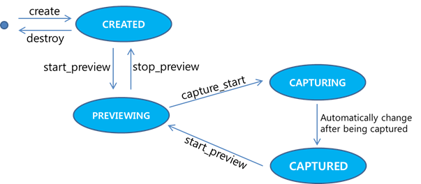

# Image Capturing with the Camera

You can capture still images with the device's internal camera and keep
images on your target device using the Camera API (in
[mobile](../../api/mobile/latest/group__CAPI__MEDIA__CAMERA__MODULE.html)
and
[wearable](../../api/wearable/latest/group__CAPI__MEDIA__CAMERA__MODULE.html)
applications). The main features of the Camera API include:

-   Previewing images in real time
-   Capturing and saving images
-   Controlling the camera settings, such as contrast, exposure,
    brightness, ISO, flash, white balance, and HDR

You can take photos using the Camera API through the following steps:

1.  Initialize the camera.
2.  Configure the camera.
3.  Preview and capture images.
4.  Terminate the camera.

The following figure illustrates the camera state changes in the normal
mode.

**Figure: Camera state changes**




## Initializing the Camera

To initialize the camera, create a handle for the camera, configure the
camera settings, and register callback functions for the events of
preview and auto-focus:

1.  To use the functions and data types of the Camera API (in
    [mobile](../../api/mobile/latest/group__CAPI__MEDIA__CAMERA__MODULE.html)
    and
    [wearable](../../api/wearable/latest/group__CAPI__MEDIA__CAMERA__MODULE.html)
    applications), include the &lt;camera.h&gt; header file in your
    application:

    ```c++
    #include <camera.h>
    ```

2. Create the camera handle using the `camera_create()` function.

    In the following example, create a `g_camera` camera handle, and
    define a `camdata` structure type, to store global data related to
    the camera handle:

    ```c++
    struct _camdata {
        Evas_Object *win;
        Evas_Object *rect;
        Evas *evas;
        camera_h g_camera; /* Camera handle */
    };
    typedef struct _camdata camdata;

    static camdata cam_data;

    int error_code = 0;

    /* Create the camera handle */
    error_code = camera_create(CAMERA_DEVICE_CAMERA0, &cam_data.g_camera);
    if (error_code != CAMERA_ERROR_NONE)
        dlog_print(DLOG_INFO, LOG_TAG, "fail to create camera: error code = %d", error_code);
    ```

    The `CAMERA_DEVICE_CAMERA0` parameter means that the currently
    activated device camera is 0, which is the primary camera. You can
    select between the primary (0) and the secondary (1) camera, which
    are defined in the `camera_device_e` enumeration (in
    [mobile](../../api/mobile/latest/group__CAPI__MEDIA__CAMERA__MODULE.html#gab030be4ec6b05144c3f2a732541e4104)
    and
    [wearable](../../api/wearable/latest/group__CAPI__MEDIA__CAMERA__MODULE.html#gab030be4ec6b05144c3f2a732541e4104) applications).
    Since devices can have multiple camera sensors with different
    capabilities, you must create a camera handle with a proper
    `camera_device_e` value, determining which camera sensor is used.
    Usually, the primary sensor is located on the back side and the
    secondary sensor is on the front side of the device.

3. Configure the camera settings.

    Before configuring the camera settings, find out which
    configurations are supported by the camera. Depending on the camera
    type, the device can support different orientations, resolutions, or
    preview and capture formats. You can obtain this information using
    the relevant functions, such as
    `camera_foreach_supported_preview_resolution()`,
    `camera_foreach_supported_preview_format()`, or other
    `camera_foreach_supported_XXX()` functions. For example, using the
    `camera_foreach_supported_preview_resolution()` function, you can
    find out which resolutions are supported for the camera preview on a
    specific device. As usual, the foreach function invokes a callback
    for each supported resolution and stops when the callback returns
    `false`.

    Set the camera configurations (such as image quality, display type,
    preview resolution, and capture format) by using the relevant
    functions:

    -   Image quality

        Set the image quality using the
        `camera_attr_set_image_quality()` function. The quality value
        ranges from 1 (lowest quality) to 100 (highest quality).

        ```c++
        error_code = camera_attr_set_image_quality(cam_data.g_camera, 100);
        ```

    - Display type

        Using the `camera_set_display()` function, you can set the
        display type for showing preview images. The display type is
        either `CAMERA_DISPLAY_TYPE_EVAS` or
        `CAMERA_DISPLAY_TYPE_OVERLAY`.

        The following example shows how to set the display according to
        the `display_type` parameter:

        > **Note**  
        > The camera state must be `CAMERA_STATE_CREATED` and the
        `create_base_gui()` function must be called before previewing.

        ```c++
        int error_code = CAMERA_ERROR_NONE;
        Evas_Object *g_eo = NULL;

        static void
        create_base_gui(camdata *cam_data, camera_display_type_e display_type)
        {
            /* Window */
            elm_config_accel_preference_set("opengl");
            /* PACKAGE contains the package name character info */
            cam_data->win = elm_win_add(NULL, PACKAGE, ELM_WIN_BASIC);

            evas_object_resize(cam_data->win, 240, 320);

            evas_object_move(cam_data->win, 0, 0);
            elm_win_autodel_set(cam_data->win, EINA_TRUE);

            cam_data->evas = evas_object_evas_get(cam_data->win);

            switch (display_type) {
            case CAMERA_DISPLAY_TYPE_EVAS:
                /* Set the Evas image object for drawing */
                g_eo = evas_object_image_add(cam_data->evas);
                evas_object_image_size_set(g_eo, 240, 320);
                evas_object_image_fill_set(g_eo, 0, 0, 240, 320);
                evas_object_resize(g_eo, 240, 320);
                evas_object_show(g_eo);
                evas_object_show(cam_data.win);
                break;
            case CAMERA_DISPLAY_TYPE_OVERLAY:
                cam_data->rect = evas_object_rectangle_add(cam_data->evas);
                evas_object_resize(cam_data->rect, 240, 320);
                evas_object_move(cam_data->rect, 0, 0);
                evas_object_color_set(cam_data->rect, 0, 0, 0, 0);
                evas_object_render_op_set(cam_data->rect, EVAS_RENDER_COPY);
                evas_object_size_hint_weight_set(cam_data->rect, EVAS_HINT_EXPAND, EVAS_HINT_EXPAND);
                /* Show the window after the base GUI is set up */
                evas_object_show(cam_data->win);
                break;
            case default:
            break;
            }
        }

        error_code = camera_set_display(cam_data.g_camera, CAMERA_DISPLAY_TYPE_OVERLAY, GET_DISPLAY(cam_data.win));
        if (error_code != CAMERA_ERROR_NONE) {
            dlog_print(DLOG_DEBUG, "camera_set_display failed [0x%x]", ret);
            camera_destroy(cam_data.g_camera);
            cam_data.g_camera = 0;

            return;
        }
        ```

    - Preview resolution

        Set the preview resolution by calling the
        `camera_set_preview_resolution()` function before previewing.

        The following example code sets the camera preview resolution to
        the first found supported resolution, which is returned from the
        `camera_foreach_supported_preview_resolution()` function:

        ```c++
        int resolution[2];

        static bool
        _preview_resolution_cb(int width, int height, void *user_data)
        {
            int *resolution = (int*)user_data;
            resolution[0] = width;
            resolution[1] = height;

            return false;
        }

        /* Find a resolution that is supported by the device */
        error_code = camera_foreach_supported_preview_resolution(cam_data.g_camera, _preview_resolution_cb, resolution);

        /* Set the supported resolution for camera preview */
        error_code = camera_set_preview_resolution(cam_data.g_camera, resolution[0], resolution[1]);
        ```

    - Capture format

        Using the `camera_set_capture_format()` function, set the
        capture format. The available formats are defined in the
        `camera_pixel_format_e` enumeration (in
        [mobile](../../api/mobile/latest/group__CAPI__MEDIA__CAMERA__MODULE.html#ga18b291f5f688ef92692b0cc273fd6ece)
        and
        [wearable](../../api/wearable/latest/group__CAPI__MEDIA__CAMERA__MODULE.html#ga18b291f5f688ef92692b0cc273fd6ece)
        applications), such as `NV12`, `NV16`, and `JPEG`.

        ```c++
        error_code = camera_set_capture_format(cam_data.g_camera, CAMERA_PIXEL_FORMAT_JPEG);
        ```

4. Register callback functions.

    To retrieve notifications, you must register appropriate callback
    functions for handling newly previewed frames and auto-focus state
    changes:

    -   Camera preview

        To receive notifications about newly previewed frames, register
        a callback function using the
        `camera_set_preview_cb()` function. The callback is invoked once
        per frame during a preview.

        The following example implements the `_camera_preview_cb()`
        callback, which starts auto-focusing using the
        `camera_start_focusing()` function:

        ```c++
        error_code = camera_set_preview_cb(cam_data.g_camera, _camera_preview_cb, NULL);

        static void
        _camera_preview_cb(camera_preview_data_s *frame, void *user_data)
        {
            int error_code = 0;

            if (g_enable_focus == true) {
                error_code = camera_start_focusing(cam_data.g_camera, true);

                if (error_code == CAMERA_ERROR_NOT_SUPPORTED)
                    error_code = camera_start_focusing(cam_data.g_camera, false);

                g_enable_focus = false;
            }
        }
        ```

        The second parameter of the `camera_start_focusing()` function
        is a Boolean flag defining whether the camera must continuously
        maintain focus. The `g_enable_focus` flag is set to `true` at
        the application startup. For the first frame of the preview, the
        camera starts auto-focusing. Subsequent calls to the callback do
        not provoke any action, which prevents the auto-focusing process
        from starting after the first previewed frame.

    - Auto-focus state change

        Before auto-focusing starts, the auto-focus state is
        `CAMERA_FOCUS_STATE_RELEASED`. After the
        `camera_start_focusing()` function is called, the camera starts
        auto-focusing and the state changes to
        `CAMERA_FOCUS_STATE_ONGOING`. If the auto-focusing finishes
        successfully, the state changes to `CAMERA_FOCUS_STATE_FOCUSED`.
        If the auto-focusing fails, the state changes to
        `CAMERA_FOCUS_STATE_FAILED`.

        To receive notifications about auto-focusing state changes,
        register a callback using the
        `camera_set_focus_changed_cb()` function. The callback is
        invoked every time the auto-focus state changes.

        The following example implements the `_camera_focus_cb()`
        callback, which starts capturing focused frames using the
        `camera_start_capture()` function:

        ```c++
        static void
        _camera_focus_cb(camera_focus_state_e state, void *user_data)
        {
            int error_code;

            if (state == CAMERA_FOCUS_STATE_FOCUSED && g_enable_shot == true) {
                /*  Start capturing */
                error_code = camera_start_capture(cam_data.g_camera, _camera_capturing_cb, _camera_completed_cb, NULL);

                g_enable_shot = false;
            }
        }
        ```


## Previewing and Capturing Images

After initializing the camera, you can start the preview, auto-focus,
and capturing processes to take a photo. The camera preview starts with
the `camera_start_preview()` function call, and it draws frames on the
screen and allows you to capture frames as still images:

```c++
error_code = camera_start_preview(cam_data.g_camera);
```

After starting the camera preview, the image capturing flows as follows:

1.  To handle the camera preview, the application calls the camera
    preview callback, which calls the `camera_start_focusing()` function
    starting the auto-focusing process.
2.  To handle the auto-focusing process, the application calls the
    camera auto-focus callback, which calls the `camera_start_capture()`
    function starting the capturing process.
3.  To handle the capturing process, the application calls the camera
    capturing callback, which is invoked once for each captured frame.

The following example code implements the `_camera_capturing_cb()`
callback, which saves the captured frame as a JPEG image, whose format
is set by the `camera_set_capture_format()` function:

```c++
static void
_camera_capturing_cb(camera_image_data_s* image, camera_image_data_s* postview, camera_image_data_s* thumbnail, void *user_data)
{
    dlog_print(DLOG_DEBUG, LOG_TAG, "Writing image to file");
    FILE *file = fopen(g_fname, "w+");

    if (image->data != NULL)
        fwrite(image->data, 1, image->size, file);

    fclose(file);
}
```

You can get a notification when the image has been captured. After the
`camera_capturing_cb()` function completes, the callback function,
`camera_capture_completed_cb()`, is invoked. It is used for notification
and for restarting the camera preview.

The following example code implements the `_camera_completed_cb()`
callback, which waits 0.025 seconds before restarting the camera preview
with auto-focusing. By waiting 0.025 seconds, the callback keeps the
captured image on the screen for 0.025 seconds.

```c++
static void
_camera_completed_cb(void *user_data)
{
    int error_code = 0;

    usleep(25000);  /* Display the captured image for 0.025 seconds */

    /* Restart the camera preview */
    error_code = camera_start_preview(cam_data.g_camera);

    g_enable_focus = true;
}
```


## Stopping the Camera

After you have finished working with the camera, you need to stop the
camera and clean up the application environment:

1.  If auto-focus is switched on, switch it off using the
    `camera_cancel_focusing()` function.
2.  Stop the camera preview using the `camera_stop_preview()` function.
3.  Unregister the camera preview and auto-focus callback functions
    using the `camera_unset_preview_cb()` and
    `camera_unset_focus_changed_cb()` functions.
4.  Destroy the camera handle and release all the allocated resources
    using the `camera_destroy()` function.

```c++
error_code = camera_stop_preview(cam_data.g_camera);
error_code = camera_destroy(cam_data.g_camera);

if (error_code != CAMERA_ERROR_NONE)
    dlog_print(DLOG_INFO, LOG_TAG, "fail to destroy camera: error code = %d", error_code);
```
