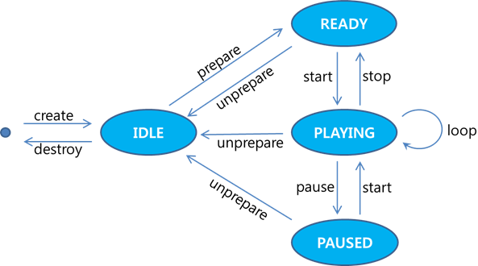
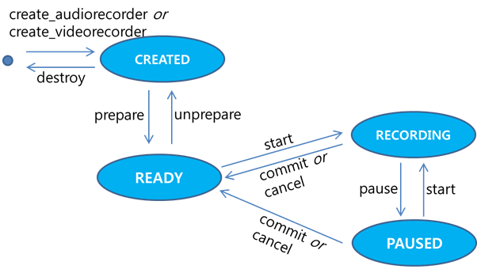

# Video Playback and Recording

Tizen enables your application to manage video content and provides
control functions for using video resources. To play and record video
files, use the Player (in
[mobile](../../api/mobile/latest/group__CAPI__MEDIA__PLAYER__MODULE.html)
and
[wearable](../../api/wearable/latest/group__CAPI__MEDIA__PLAYER__MODULE.html)
applications) and Recorder (in
[mobile](../../api/mobile/latest/group__CAPI__MEDIA__RECORDER__MODULE.html)
and
[wearable](../../api/wearable/latest/group__CAPI__MEDIA__RECORDER__MODULE.html)
applications) APIs. Managing video files is very similar to managing
audio content, but it requires more consideration to display the visual
content.

Tizen supports various video formats, including WMV, ASF, MP4, 3GP, AVI,
MKV, and OGG. The available formats depend on the target device.


## Playing Video

To play video files stored on the device, use the Player API (in
[mobile](../../api/mobile/latest/group__CAPI__MEDIA__PLAYER__MODULE.html)
and
[wearable](../../api/wearable/latest/group__CAPI__MEDIA__PLAYER__MODULE.html)
applications). The Player API also provides interfaces for getting media
content information and controlling media operations, such as play,
pause, resume, and stop.

Video content requires a drawing area for visual display, so you have to
get an overlay region and set it to the player instance to display the
drawing area:

1.  Get the overlay region or Evas from the Graphics module. You can
    display video on a UI layer with the Evas object as well as on an
    overlay layer.
2.  Create the player instance.
3.  Set the surface type and display a handle to the player using the
    `player_set_display()` function.

The following figure illustrates the player state changes.

**Figure: Player state changes**



### Initializing the Video Player

You can create a player by calling the `player_create()` function, which
returns a player handle on success. You need the player handle in
setting which files to play and with which configuration. You also have
to register appropriate callback functions to handle notifications about
interruptions, ends, and errors during playback.

To prepare the player for playback, and to define the necessary
callbacks to handle playback events:

1.  To use the data types and functions of the Player API (in
    [mobile](../../api/mobile/latest/group__CAPI__MEDIA__PLAYER__MODULE.html)
    and
    [wearable](../../api/wearable/latest/group__CAPI__MEDIA__PLAYER__MODULE.html)
    applications), include the `<player.h>` header file in your
    application:

    ```c++
    #include <player.h>
    ```

2. Define a variable for the player handle, and create the handle:

    ```c++
    struct appdata {
        player_h player;
    };
    typedef struct appdata appdata_s;

    static void
    init_base_player(appdata_s *ad)
    {
        int error_code = 0;
        error_code = player_create(&ad->player);
        if (error_code != PLAYER_ERROR_NONE)
            dlog_print(DLOG_ERROR, LOG_TAG, "failed to create");

        /*
           Perform more playback configuration, such as setting callbacks,
           setting the source file URI, and preparing the player
        */
    }
    ```

3. Set configurations, such as the source file URI.

    To set a specific path for video files to play, retrieve the default
    internal storage paths. To access and use internal storage, include
    the `<storage.h>` header file in your application.

    ```c++
    #include <storage.h>

    #define MP4_SAMPLE "SampleVideo.mp4";

    int internal_storage_id;
    char *video_storage_path = NULL;
    char *video_path = NULL;

    static bool
    storage_cb(int storage_id, storage_type_e type, storage_state_e state, const char *path, void *user_data)
    {
        if (type == STORAGE_TYPE_INTERNAL) {
            internal_storage_id = storage_id;

            return false;
        }

        return true;
    }

    void
    _get_storage_path()
    {
        int error_code = 0;
        char *path = NULL;

        error_code = storage_foreach_device_supported(storage_cb, NULL);

        error_code = storage_get_directory(internal_storage_id, STORAGE_DIRECTORY_VIDEOS, &path);
        if (error_code != STORAGE_ERROR_NONE) {
            video_storage_path = strdup(path);
            free(path);
        }
    }

    void
    _set_test_path()
    {
        int path_len = 0;

        path_len = strlen(video_storage_path) + strlen(MP4_SAMPLE) + 1;
        video_path = malloc(path_len);
        memset(video_path, 0x0, path_len);

        strncat(video_path, video_storage_path, strlen(video_storage_path));
        strncat(video_path, MP4_SAMPLE, strlen(MP4_SAMPLE));
    }
    ```

    Once the storage path is set, you can specify the video file to play
    using the `player_set_uri()` function with the player handle:

    ```c++
    error_code = player_set_uri(ad->player, video_path);
    if (error_code != PLAYER_ERROR_NONE)
        dlog_print(DLOG_ERROR, LOG_TAG, "failed to set URI: error code = %d", error_code);
    ```

4. Create UI buttons and add callback functions for your application to
    control the playback:

    ```c++
    static void
    create_base_gui(appdata_s *ad)
    {
        /* Create a window */
        /* Create a button */
        /* Add a callback to the button */
        evas_object_smart_callback_add(button_init, "clicked", init_base_player, ad);
        evas_object_smart_callback_add(button_end, "clicked", release_base_player, ad);
        /* Create an Evas image object for the video surface */
    }

    static void
    app_create(void *data)
    {
        appdata_s *ad = data;
        create_base_gui(ad);

        return true;
    }
    ```

5. Register callback functions.

    To receive notifications, register and define appropriate callback
    functions for interruption, playback ending, and error events:

    -   Interruption notifications:

        ```c++
        static void
        _player_interrupted_cb(player_interrupted_code_e code, void *data)
        {
            appdata_s *ad = data;
            player_state_e state;

            /*
               All the interrupted_code_e is deprecated since Tizen 3.0
               except PLAYER_INTERRUPTED_BY_RESOURCE_CONFLICT
            */
            player_get_state(ad->player, &state);
            dlog_print(DLOG_INFO, LOG_TAG, "current player state = %d", state);
            /* If the state is PLAYER_STATE_PAUSED, update the UI (for example, button) */
        }

        static void
        init_base_player(appdata_s *ad)
        {
            /* Set an interruption callback if the application wants to know the reason */
            error_code = player_set_interrupted_cb(ad->player, _player_interrupted_cb, ad);
            if (error_code != PLAYER_ERROR_NONE)
                dlog_print(DLOG_ERROR, LOG_TAG, "failed to set interrupt cb");
        }
        ```

    - End notifications:

        ```c++
        static void
        _player_completed_cb(void *_data)
        {
            dlog_print(DLOG_INFO, LOG_TAG, "Playback End");
        }

        static void
        init_base_player(appdata_s *ad)
        {
            error_code = player_set_completed_cb(ad->player, _player_completed_cb, ad);
            if (error_code != PLAYER_ERROR_NONE)
                dlog_print(DLOG_ERROR, LOG_TAG, "failed to set completed cb");
        }
        ```

    - Error notifications:

        ```c++
        static void
        _player_error_cb(int error_code, void *user_data)
        {
            dlog_print(DLOG_ERROR, LOG_TAG, "playback failed, error = %x", error_code);
        }

        static void
        init_base_player(appdata_s *ad)
        {
            error_code = player_set_error_cb(ad->player, _player_error_cb, NULL);
            if (error_code != PLAYER_ERROR_NONE)
                dlog_print(DLOG_ERROR, LOG_TAG, "failed to set error cb");
        }
        ```

### Managing Video Playback

To manage playback:

1.  Unlike in audio playback, the video player needs a region
    to display. To set the display, use the `player_set_display()`
    function with the player handle, display type, and display handle.
    After the function has been successfully executed, the player is
    connected to the display. The display handle can be retrieved using
    the `GET_DISPLAY()` function.

    ```c++
    error_code = player_set_display(ad->player, PLAYER_DISPLAY_TYPE_OVERLAY, GET_DISPLAY(evas_obj));
    ```

2. When the player is created, it is in the `PLAYER_STATE_IDLE` state.
    To start playback, it must be in the `PLAYER_STATE_READY` state.

    Get the player ready for playback by calling the `player_prepare()`
    function, which changes the player state from `PLAYER_STATE_IDLE` to
    `PLAYER_STATE_READY`:

    ```c++
    error_code = player_prepare(ad->player);
    if (error_code != PLAYER_ERROR_NONE)
        dlog_print(DLOG_ERROR, LOG_TAG, "failed to prepare player: error code = %d", error_code);
    ```

3. Once the player is ready, start playing the video file using the
    `player_start()` function. The player state changes to
    `PLAYER_STATE_PLAYING`.

    ```c++
    error_code = player_start(ad->player);
    if (error_code != PLAYER_ERROR_NONE)
        dlog_print(DLOG_ERROR, LOG_TAG, "failed to start player: error code = %d", error_code);
    ```

4. Stop playback by calling the `player_stop()` function. The player
    state changes back to `PLAYER_STATE_READY`.

    By calling the `player_pause()` function, you can pause playback and
    change the player state to `PLAYER_STATE_PAUSED`.

### Configuring the Video Playback

During video playback, you can manage the display settings &ndash; display
mode and display orientation &ndash; as needed. Before setting the parameters,
make sure that the player handle has been created, the display set, and
the player started.

To configure the display settings:

1.  Check whether the display is visible.

    If the display is not visible, make it visible using the
    `player_set_display_visible()` function with `true` as the second
    parameter:

    ```c++
    bool is_visible;

    error_code = player_is_display_visible(ad->player, &is_visible);
    dlog_print(DLOG_ERROR, LOG_TAG, "player_is_display_visible = %d", error_code);

    if (!is_visible) {
        error_code = player_set_display_visible(ad->player, true);
        dlog_print(DLOG_ERROR, LOG_TAG, "player_set_display_visible = %d", error_code);
    }
    ```

2. Set the display mode.

    The available display modes are defined in the
    `player_display_mode_e` enumeration (in
    [mobile](../../api/mobile/latest/group__CAPI__MEDIA__PLAYER__DISPLAY__MODULE.html#gaafcf6f7487d8cb376e1851a6e1253f3a)
    and
    [wearable](../../api/wearable/latest/group__CAPI__MEDIA__PLAYER__DISPLAY__MODULE.html#gaafcf6f7487d8cb376e1851a6e1253f3a) applications).
    Note that the DST ROI mode is deprecated since Tizen 3.0.

    ```c++
    error_code = player_set_display_mode(ad->player, PLAYER_DISPLAY_MODE_FULL_SCREEN);
    dlog_print(DLOG_ERROR, LOG_TAG, "player_set_display_mode = %d", error_code);
    ```

3. Set the display orientation.

    The display orientations are defined in the
    `player_display_rotation_e` enumeration (in
    [mobile](../../api/mobile/latest/group__CAPI__MEDIA__PLAYER__DISPLAY__MODULE.html#gab8c4c170d4b2628a09831edc8d652302)
    and
    [wearable](../../api/wearable/latest/group__CAPI__MEDIA__PLAYER__DISPLAY__MODULE.html#gab8c4c170d4b2628a09831edc8d652302) applications).

    ```c++
    error_code = player_set_display_rotation(ad->player, PLAYER_DISPLAY_ROTATION_90);
    dlog_print(DLOG_ERROR, LOG_TAG, "player_set_display_mode = %d", error_code);
    ```

### Terminating the Video Player

When you are finished using the player, release all the resources
allocated to it:

1.  Reset the player by calling the `player_unprepare()` function, which
    changes the player state to `PLAYER_STATE_IDLE`.
2.  Destroy the player handle using the `player_destroy()` function.

```c++
error_code = player_stop(ad->player);
error_code = player_unprepare(ad->player);
error_code = player_destroy(ad->player);

if (error_code != PLAYER_ERROR_NONE)
    dlog_print(DLOG_ERROR, LOG_TAG, "fail to destroy player: error code = %d", error_code);
```


# Recording Video

To record video, use the Recorder API (in
[mobile](../../api/mobile/latest/group__CAPI__MEDIA__RECORDER__MODULE.html)
and
[wearable](../../api/wearable/latest/group__CAPI__MEDIA__RECORDER__MODULE.html)
applications). The main features of the Recorder API include:

-   Basic recording functionalities: record, stop, pause, cancel, and
    mute
-   Setting the maximum recording time and size
-   Controlling the system volume level

The supported formats in video recording are MP4 and 3GP.

The following figure illustrates the general recorder state changes.

**Figure: Recorder state changes**



### Initializing the Video Recorder

To prepare the recorder for the recording session, and to define the
necessary callbacks to handle recording events:

1.  To use the data types and functions of the Recorder API (in
    [mobile](../../api/mobile/latest/group__CAPI__MEDIA__RECORDER__MODULE.html)
    and
    [wearable](../../api/wearable/latest/group__CAPI__MEDIA__RECORDER__MODULE.html)
    applications), include the `<recorder.h>` header file in your
    application:

    ```c++
    #include <recorder.h>
    ```

2. To initialize the video recorder, configure the camera and video
    recorder, and register callback functions for the event of reaching
    the recording limit.

    Before you start configuring and initializing, define a structure
    for the camera and video recorder handles. This structure contains a
    Boolean variable specifying whether the video recorder is
    switched off.

    ```c++
    #include <camera.h>

    struct recdata {
        bool shutdown;
        recorder_h recorder;
        camera_h camera;
    };
    ```

3. Define configuration values for the camera and the video recorder:

    ```c++
    static const int RECORD_TIME=2;
    static const int RECORD_LIMIT=4;
    #define FILENAME_PREFIX "VIDEO"
    static int g_bitrate = 288000;
    static int duration;
    static int playing=0;
    static int ret;
    ```

    -   Configure the camera.

        Create a handle for the camera using the
        `camera_create()` function. The parameters are the hardware
        camera to access and the camera handle to be returned. The
        camera state is set as `CAMERA_STATE_CREATED`.

        ```c++
        static recdata rec_data;

        int error_code = 0;

        rec_data.shutdown = FALSE;
        rec_data.camera = NULL;
        rec_data.recorder = NULL;

        /* Create the camera handle */
        error_code = camera_create(CAMERA_DEVICE_CAMERA0, &rec_data.camera);
        if (error_code != CAMERA_ERROR_NONE)
            dlog_print(DLOG_ERROR, LOG_TAG, "fail to create camera: error code = %d", error_code);
        ```

    - Configure the video recorder.

        To create a handle for the video recorder, use the
        `recorder_create_videorecorder()` function with the camera and
        video recorder handles as parameters. The state of the video
        recorder is set as `RECORDER_STATE_CREATED`.

        ```c++
        /* Create the video recorder handle */
        error_code = recorder_create_videorecorder(rec_data.camera, &rec_data.recorder);
        if (error_code != RECORDER_ERROR_NONE)
            dlog_print(DLOG_INFO, LOG_TAG, "fail to create a Video Recorder: error code = %d", error_code);
        ```

4. Register appropriate callback functions to receive notifications
    about recorder state changes or reaching the recording limit:

    ```c++
    /* Set the state change callback for the video recorder */
    error_code = recorder_set_state_changed_cb(rec_data.recorder, on_state_changed_cb, NULL);
    if (error_code != RECORDER_ERROR_NONE)
        dlog_print(DLOG_ERROR, LOG_TAG, "error code = %d", error_code);

    /* Define the change callback for the video recorder */
    static void
    on_state_changed_cb(recorder_state_e previous, recorder_state_e current, bool by_asm, void *data)
    {
        dlog_print(DLOG_DEBUG, LOG_TAG, "_recorder_state_changed_cb (prev: %d, curr: %d)\n", previous, current);
    }
    ```

5. You can set various attributes of video recording, such as video
    codec, file format, file name, encoder bitrate, as well as audio
    attributes:

    -   To set the video codec, you need to check first which codecs the
        device supports by calling the
        `recorder_foreach_supported_video_encoder()` function. The
        possible video codec values are defined in the
        `recorder_video_codec_e` enumeration (in
        [mobile](../../api/mobile/latest/group__CAPI__MEDIA__RECORDER__MODULE.html#gaaf3f0deeb1717f568e2b93bb9a375b63)
        and
        [wearable](../../api/wearable/latest/group__CAPI__MEDIA__RECORDER__MODULE.html#gaaf3f0deeb1717f568e2b93bb9a375b63) applications).
        Using the returned value and the `recorder_set_video_encoder()`
        function, you can set the video recorder codec:

        ```c++
        recorder_video_codec_e supported_codec;

        static bool
        _video_encoder_cb(recorder_video_codec_e codec, void *user_data)
        {
            recorder_video_codec_e * supported_codec = (recorder_video_codec_e*)user_data;
            *supported_codec = codec;

            return false;
        }

        error_code = recorder_foreach_supported_video_encoder(rec_data.recorder, _video_encoder_cb, &supported_codec);

        /* Set the video encoder for the video recorder */
        error_code = recorder_set_video_encoder(rec_data.recorder, supported_codec);
        ```

    - To set the video encoder bitrate, use the
        `recorder_attr_set_video_encoder_bitrate()` function:

        ```c++
        /* Set the video encoder bitrate */
        error_code = recorder_attr_set_video_encoder_bitrate(rec_data.recorder, g_bitrate);
        ```

    - To set the file format, use the
        `recorder_set_file_format()` function. Make sure that the file
        format matches the video codec.

        ```c++
        /* Set the file format */
        error_code = recorder_set_file_format(rec_data.recorder, RECORDER_FILE_FORMAT_MP4);
        ```

    - To set the file name, use the `recorder_set_filename()`
        function:

        ```c++
        struct tm localtime = {0};
        time_t rawtime = time(NULL);
        char filename[256] = {'\0'};
        size_t size;

        /* Create the file name */
        if (localtime_r(&rawtime, &localtime) != NULL) {
            size = snprintf(filename, sizeof(filename), "%s/%s-%04i-%02i-%02i_%02i:%02i:%02i.mp4",
                            app_get_data_path(), FILENAME_PREFIX,
                            localtime.tm_year + 1900, localtime.tm_mon + 1, localtime.tm_mday,
                            localtime.tm_hour, localtime.tm_min, localtime.tm_sec);
        } else {
            /* Error handling */
        }
        /* Set the full path and file name */
        error_code = recorder_set_filename(rec_data.recorder, filename);
        ```

    - To set the audio attributes, such as encoder, encoder bitrate,
        and sample rate, use the `recorder_set_audio_encoder()`,
        `recorder_attr_set_audio_encoder_bitrate()`, and
        `recorder_attr_set_audio_samplerate()` functions, respectively.

### Managing Video Recording

When the recorder handle is created, the video recorder is in the
`RECORDER_STATE_CREATED` state. To start recording, the video recorder
must be in the `RECORDER_STATE_READY` state.

To manage recording:

1.  Get the recorder ready by calling the `recorder_prepare()` function,
    which changes the player state from `RECORDER_STATE_CREATED` to
    `RECORDER_STATE_READY`:

    ```c++
    error_code = recorder_prepare(rec_data.recorder);
    ```

2. Once the recorder is ready, start video recording using the
    `recorder_start()` function. The recorder state changes to
    `RECORDER_STATE_RECORDING`.

    ```c++
    error_code = recorder_start(rec_data.recorder);
    ```

3. In the `RECORDER_STATE_RECORDING` state, you can pause or stop
    recording:

    -   To pause recording, call the `recorder_pause()` function that
        changes the recorder state to `RECORDER_STATE_PAUSED`. In this
        state, you can resume or stop recording. To resume, call the
        `recorder_start()` function.

        ```c++
        error_code = recorder_pause(rec_data.recorder);
        ```

    - You can stop recording either in the `RECORDER_STATE_RECORDING`
        or `RECORDER_STATE_PAUSED` state. In stopping recording, you can
        save or discard the recorded data. To save the recorded data,
        use the `recorder_commit()` function, and to discard, use the
        `recorder_cancel()` function. Both functions set the video
        recorder state to `RECORDER_STATE_READY`.

        ```c++
        error_code = recorder_commit(rec_data.recorder);
        /* OR */
        error_code = recorder_cancel(rec_data.recorder);
        ```

### Terminating the Video Recorder

After you finish video recording, release all the resources allocated to
the video recorder:

1.  Reset the video recorder by calling the `recorder_unprepare()`
    function, which changes the recorder state from
    `RECORDER_STATE_READY` to `RECORDER_STATE_CREATED`.
2.  Release the video recorder resources by calling the
    `recorder_destroy()` function. The recorder state changes to
    `RECORDER_STATE_NONE`.

```c++
error_code = recorder_unprepare(rec_data->recorder);
error_code = recorder_destroy(rec_data.recorder);

if (error_code != RECORDER_ERROR_NONE)
    dlog_print(DLOG_ERROR, LOG_TAG, "fail to destroy recorder: error code = %d", error_code);
```
