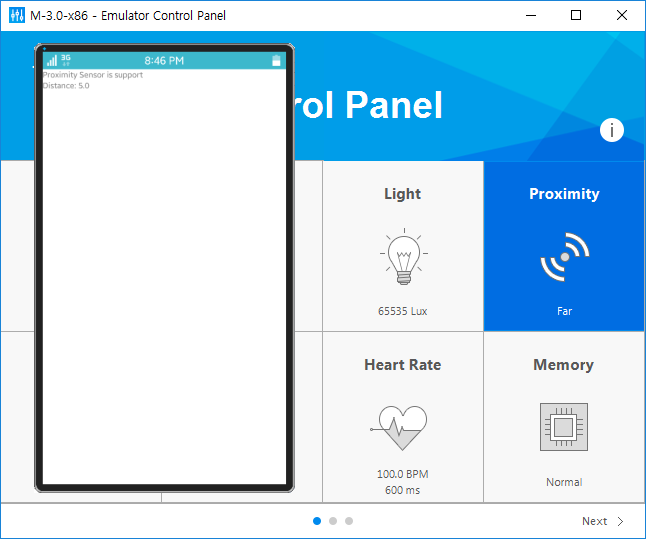

# Proximity Sensor Usage

The proximity sensor can measure the distance of an object from the
front of the device. Some sensors only report the maximum measurement
(far) or 0 (near), and they are called wake-up sensors. Before
attempting to measure the distance values, you need to know whether the
device supports the proximity sensor.


## Determining Whether the Sensor Is Supported

To determine whether the proximity sensor is supported on the device:

1.  Create a new project in the Tizen Studio with the **Basic UI**
    template, and specify the project name as **SensorProximity**.

    For more information on how to create a project, see Creating a
    Project (in [mobile](../../getting-started/mobile/first-app.md#create) and
    [wearable](../../getting-started/wearable/first-app.md#creating-a-project) applications).

2. In the new project, open the `sensorproximity.c` source file in the
    `src` folder and add the required library header file and variables:

    -   The `sensor.h` file is a header file for various
        sensor libraries.
    -   The purpose of the application is to display whether the
        proximity sensor is supported, and the current distance value.
        As a result, a variable is defined for both of these values.

    ```c++
    #include "sensorproximity.h"
    #include <sensor.h>

    struct appdata {
        Evas_Object *win;
        Evas_Object *conform;
        Evas_Object *label0; /* Whether the proximity sensor is supported */
        Evas_Object *label1; /* Distance value */
    };
    typedef struct appdata appdata_s;
    ```

3. Create 2 new functions on top of the `create_base_gui()` function:

    -   The `show_is_supported()` function identifies whether the
        proximity sensor is supported, and displays the result in the
        first label component.

        The `sensor_is_supported()` function requests the
        support information. Passing `SENSOR_PROXIMITY` as the first
        parameter makes the second parameter return the proximity
        support information.

    - The `my_box_pack()` function adds a UI component to a
        box container.

    ```c++
    static void
    show_is_supported(appdata_s *ad)
    {
        char buf[PATH_MAX];
        bool is_supported = false;
        sensor_is_supported(SENSOR_PROXIMITY, &is_supported);
        sprintf(buf, "Proximity Sensor is %s", is_supported ? "support" : "not support");
        elm_object_text_set(ad->label0, buf);
    }

    static void
    my_box_pack(Evas_Object *box, Evas_Object *child,
                double h_weight, double v_weight, double h_align, double v_align)
    {
        /* Tell the child packed into the box to be able to expand */
        evas_object_size_hint_weight_set(child, h_weight, v_weight);
        /* Fill the expanded area (above) as opposed to centering in it */
        evas_object_size_hint_align_set(child, h_align, v_align);
        /* Set the child as the box content and show it */
        evas_object_show(child);
        elm_object_content_set(box, child);

        /* Put the child into the box */
        elm_box_pack_end(box, child);
        /* Show the box */
        evas_object_show(box);
    }
    ```

4. To create the box, add the 2 labels to the box, and call the
    `show_is_supported()` function to determine the sensor support, you
    must modify the source code at the bottom of the `create_base_gui()`
    function as follows:

    ```c++
    /* Conformant */
    /*
       Create and initialize elm_conformant
       elm_conformant is mandatory for the base GUI to have a proper size
       when the indicator or virtual keypad is visible
    */
    ad->conform = elm_conformant_add(ad->win);
    elm_win_indicator_mode_set(ad->win, ELM_WIN_INDICATOR_SHOW);
    elm_win_indicator_opacity_set(ad->win, ELM_WIN_INDICATOR_OPAQUE);
    evas_object_size_hint_weight_set(ad->conform, EVAS_HINT_EXPAND, EVAS_HINT_EXPAND);
    elm_win_resize_object_add(ad->win, ad->conform);
    evas_object_show(ad->conform);

    /* Box can contain other elements in a vertical line (by default) */
    Evas_Object *box = elm_box_add(ad->win);
    evas_object_size_hint_weight_set(box, EVAS_HINT_EXPAND, EVAS_HINT_EXPAND);
    evas_object_size_hint_align_set(box, EVAS_HINT_EXPAND, EVAS_HINT_EXPAND);
    elm_object_content_set(ad->conform, box);
    evas_object_show(box);

    /* First label (for the sensor support) */
    ad->label0 = elm_label_add(ad->conform);
    elm_object_text_set(ad->label0, "Msg -");
    my_box_pack(box, ad->label0, 1.0, 0.0, -1.0, -1.0);

    /* Second label (for the current distance value) */
    ad->label1 = elm_label_add(ad->conform);
    elm_object_text_set(ad->label1, "Value -");
    my_box_pack(box, ad->label1, 1.0, 1.0, -1.0, -1.0);

    /* Show the window after the base GUI is set up */
    evas_object_show(ad->win);

    /* Check the sensor support */
    show_is_supported(ad);
    ```

5. Build (in [mobile](../../getting-started/mobile/first-app.md#build) and
    [wearable](../../getting-started/wearable/first-app.md#building-your-application) applications) and run
    (in [mobile](../../getting-started/mobile/first-app.md#run) and
    [wearable](../../getting-started/wearable/first-app.md#running-your-application) applications)
    the application. If the proximity sensor is supported, the
    **Proximity Sensor is support** message is shown on the
    device screen.

    Not all smartphones support this sensor. In that case, test the
    application on the emulator.

    


## Requesting Sensor Events

To implement a feature that requests the corresponding event as the
proximity sensor detects an object, and displays the distance value on
the screen:

1.  Add a structure for the sensor and a global variable to the top of
    the `sensorproximity.c` source file:

    -   The `sensorinfo_s` structure includes a sensor handle and an
        event listener variable.
    -   The `sensor_info` is a global variable of the
        `sensorinfo_s` structure.

    ```c++
    struct appdata {
        Evas_Object *win;
        Evas_Object *conform;
        Evas_Object *label0;
        Evas_Object *label1;
    };
    typedef struct appdata appdata_s;

    struct _sensor_info {
        sensor_h sensor; /* Sensor handle */
        sensor_listener_h sensor_listener; /* Sensor listener */
    };
    typedef struct _sensor_info sensorinfo_s;

    static sensorinfo_s sensor_info;
    ```

2. To request sensor events, you need a sensor handle and an event
    listener, and must start the listener. Create 2 new functions above
    the `create_base_gui()` function:

    -   The `_new_sensor_value()` function is an event callback for the
        proximity sensor, and it outputs a new sensor value to
        the screen.

        The sensor data is passed to the second parameter. The distance
        data is saved in `values[0]`.

    - The `start_proximity_sensor()` function starts the proximity
        sensor and specifies the event callback function:
        -   The `sensor_get_default_sensor()` function gets a specific
            sensor handle. Passing `SENSOR_PROXIMITY` to the first
            parameter returns an proximity sensor handle to the
            second parameter.
        -   The `sensor_create_listener()` function creates an
            event listener. Passing a sensor handle to the first
            parameter returns a listener object to the second parameter.
        -   The `sensor_listener_set_event_cb()` function specifies a
            callback function to the listener. The parameters follow
            this order: event listener, interval (in milliseconds),
            callback function name, and user data.
        -   The `sensor_listener_start()` function starts the listener.

    ```c++
    static void
    _new_sensor_value(sensor_h sensor, sensor_event_s *sensor_data, void *user_data)
    {
        if (sensor_data->value_count < 1)
            return;
        char buf[PATH_MAX];
        appdata_s *ad = (appdata_s*)user_data;

        sprintf(buf, "Distance: %0.1f", sensor_data->values[0]);
        elm_object_text_set(ad->label1, buf);
    }

    static void
    start_proximity_sensor(appdata_s *ad)
    {
        sensor_error_e err = SENSOR_ERROR_NONE;
        sensor_get_default_sensor(SENSOR_PROXIMITY, &sensor_info.sensor);
        err = sensor_create_listener(sensor_info.sensor, &sensor_info.sensor_listener);
        sensor_listener_set_event_cb(sensor_info.sensor_listener, 100, _new_sensor_value, ad);
        sensor_listener_start(sensor_info.sensor_listener);
    }
    ```

3. To operate the event listener automatically when the application
    starts running, invoke the above `start_proximity_sensor()` function
    at the end of the `create_base_gui()` function:

    ```c++
    /* Show the window after the base GUI is set up */
    evas_object_show(ad->win);

    show_is_supported(ad);
    start_proximity_sensor(ad);
    ```

4. Run the application again. To test it on your smartphone, simply
    bring the device close to your face.

    To test on the emulator, use the [control
    panel](../../../tizen-studio/common-tools/emulator-control-panel.md):

    a.  Right-click the emulator and select **Control Panel**.  
    b. Click **Next** in the lower-right corner until you see the        **Proximity** box.  
    c. Click the box to toggle between **Far** and **Near** values. The        **Near** value in the control panel makes the second label        component on the application screen show **0.0**. If you change        the value to **Far**, the label component displays **5.0**.

      
