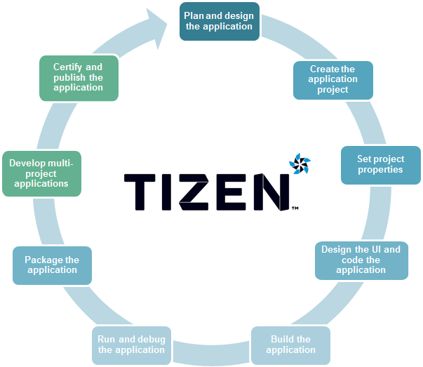

# Native Application Development Process

Tizen provides the tools required to manage your native application life-cycle from product conception, through development and release, to end-of-life application retirement.

**Figure: Native application development process**

## Planning and Designing the Application

The first step in creating a Tizen native application is planning and designing the application using the design tools of your choice.

Once you have finished the application plan and design, you are ready to [create the application project](#creating).

## Creating the Application Project

The Tizen Studio provides various project templates that make it easier for you to start coding your application. When you create a new project, you can select a specific template or sample. Based on the selection, the Tizen native [Project Wizard](../../../tizen-studio/native-tools/project-wizard.md) automatically creates basic functionalities that the application has to implement to be able to run. The default project files and folders are also created.

## Setting Project Properties

After creating the application project, you can [configure the project properties and create the application manifest](setting-properties.md) to achieve the required functionality and features for your application.

## Designing the Application UI and Implementing Code

Implementing your application consists of:

- **Designing and creating the application UI (User Interface)**

  You can [design and create the application UI (user interface) with UI Builder](../ui-builder/ui-builder-app-design.md).

  UI Builder is included in the Tizen Studio, and functions as a WYSIWYG (What You See Is What You Get) design environment for creating UIs for native applications.

  > **Note**  
  > You can also design the application UI using the controls defined in the [User Interface](../../guides/ui/index.md) guides.

- **Coding applications**

  Code your application in the Tizen Studio using the namespaces defined in the Native API Reference (in [mobile](../../api/mobile/latest/modules.html) and [wearable](../../api/wearable/latest/modules.html) applications).

If needed, update the privileges of the application.

Once you have finished implementing your application, you are ready to [build your application](#build).

## Building the Application

You must [build your native application project](building-app.md) before you can [run and debug the application](#debugging).

The build configuration is the [set of properties](building-app.md#prop) which are used in the build process. The build configuration includes the following properties:

- Build (compile and link) options
- Source files to build
- Compiler toolchain, such as compiler, linker, and archiver

## Running and Debugging the Application

You can [run your application in the emulator](running-app.md). The device emulator, provided with the Tizen Studio, imitates the target environment running Tizen native applications. Using this replicated environment, you can test your application before deploying it to the real target device.

You can also [debug your application with the
emulator](debugging-app.md#debugging-applications-on-the-emulator). The emulator represents the almost identical functionality of the corresponding device model.

The emulator provides the following debugging capabilities:

- Simulating events with the Emulator Control Panel
- Simulating peripheral devices
- Acting as a source-level debugger
- Producing console output

You can make running and testing your application faster using the [Rapid Development Support (RDS)](running-app.md#rapid-development-support). For more information on the debugging methods and tools you can use, see [Debugging Applications](debugging-app.md).

You can also [optimize your application](performance.md) to achieve the best possible performance.

To debug your application with the emulator or the target device, you must first [build the application](building-app.md).

## Packaging the Application

You can package your application using the Tizen Studio. If you want to register your application in the Tizen store, [register the author certificate](../../../tizen-studio/common-tools/certificate-registration.md) before packaging your application.

1. If you have made changes to the application after testing it, [rebuild the application](building-app.md).

2. Select the project in the **Project Explorer** view.

3. In the project context menu, select **Project &gt; Build Signed Package**.

After the packaging process is complete, check the package in the project folder to ensure that the packaging was successful.

## Developing Multiple Projects as a Combined Package

Tizen supports multi-project applications that combine different types of application templates.

You can develop a UI project with service or widget projects as a package.

To develop a multi-project native application:

1. [Create a UI application](#creating).
2. Create a service or widget application.
3. Package a multi-project application using Tizen Studio:

   1. In the Tizen Studio, make sure all the applications you want to include in the package are located in the **Project Explorer** view.  
      To make the projects appear in the **Project Explorer** view, you can create new applications, or import existing projects or sample applications into the Tizen Studio.

   2. To establish a project reference between a UI application and a service or widget application:  
      - In the **Project Explorer** view, right-click the UI application.  
      - Select **Properties &gt; Tizen Studio &gt; Package &gt; Multi**.  
      - Select the check box for the service or widget application, and click **OK**.  
        In the **Project Explorer** view, a message (with the UI application) appears next to the referenced project name for all the applications you have added to the package.

   After packaging the multi-project application, the package consists of the application binary, resource, and data files of the root and referenced applications. Their `tizen-manifest.xml` files are merged into one. [The application ID in the `tizen-manifest.xml` must be assigned with the package ID as a prefix.](../../index.md#packageID)

4. [Build](building-app.md) and [run](running-app.md) the UI application.

   The service or widget application is built and run automatically
   while the UI application is built and run.

> **Note**  
> Tizen has limited a multi-project application combination policy for device usability. If you do not follow the policy, the submission of your application to the Tizen Store can be rejected.
>
> For your convenience, some policies can be allowed in the Tizen Studio only. For example, you can make a STANDALONE service application or STANDALONE widget application in the Tizen Studio, but these applications can be rejected in the Tizen Store.

The following table shows the possible combinations for a native multi-project. **1** means that only one application can be packaged as a sub application, while **M** means that multiple applications can be packaged as sub applications. The **STANDALONE** column defines whether the application can be packaged alone as the main application.

**Table: Combinations**

| Main project | Sub project | Sub project | Sub project | Sub project | Sub project | Sub project |
|------------|-----------|-----------|-----------|----------|-----------|-----------|
| Main project | STANDALONE  | UI          | SERVICE     | WATCH       | WIDGET      | IME         |
| UI           | Yes         | No          | M           | No          | M           | No          |
| SERVICE      | No          | No          | No          | No          | No          | No          |
| WATCH        | Yes         | No          | M           | No          | No          | No          |
| WIDGET       | No          | No          | No          | No          | No          | No          |
| IME          | Yes         | M           | M           | No          | No          | No          |

The following examples illustrate how to read the above table:

- Main UI project alone: Allowed
- Main UI project + 3 service projects packaged together: Allowed
- Main UI project + 1 widget project packaged together: Allowed
- Main service project alone: Not allowed
- Main widget project alone: Not allowed

## Certifying and Publishing the Application

After you have packaged your application, you are ready to certify and publish your application.

To certify and publish your application:

- Upload your mobile native application to the Tizen Store or your wearable native application to the Samsung Galaxy Apps Store for registration.

  After the application is uploaded, the application is signed as a certified application installer package and the `<Application_name>.tpk` archive format, which contains the distributor signature, is added by the Tizen Store or Samsung Galaxy Apps Store.

- Check your application to the Tizen Store or Samsung Galaxy Apps Store for validation and selling.

  The Tizen Store or Samsung Galaxy Apps Store checks whether your application functions properly.

For detailed instructions on how to register your application and submit it for validation and publication in the Tizen Store, see [Tizen Store Overview](https://developer.tizen.org/distribution/tizen-store-overview) and other subtopics within the **Distribution** section of the Tizen Developers site.

You can also upgrade your application after certification. If you want to withdraw your application from distribution and operation, you need to request for application retirement from the Tizen Store or Samsung Galaxy Apps Store.
