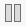
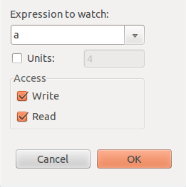
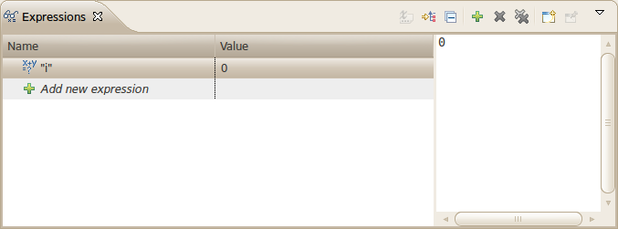
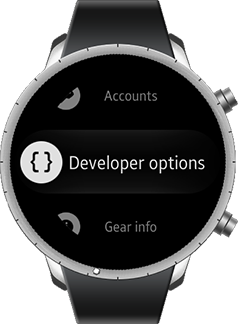
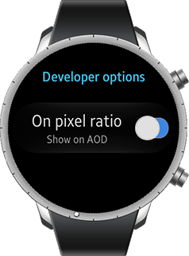

# Debugging Applications

Debugging your application enables you to understand its flow of control. With the Tizen Studio, you can use various [application debugging methods](#application-debugging-methods). However, remember that the best way to debug an application is to not make bugs in the first place, so learn how to [prevent bugs by using logs](#debugging-with-logs).

The debugging environment uses [GDB](http://www.gnu.org/software/gdb/gdb.html) (GNU Debugger) for debugging with the emulator and a target device. GDB can debug both locally and [remotely](#remote-debugging). To ease the debugging process, you can set [break points](#break-points), step in, step out, and step over break points, and watch variables to track the changes in their values in the **Debug** view.

Debugging native applications with Tizen Studio is same as with Eclipse CDT. For more information, see [Debugging in Eclipse](http://help.eclipse.org/luna/index.jsp?topic=%2Forg.eclipse.cdt.doc.user%2Ftasks%2Fcdt_o_debug.htm).

## Debug View

The **Debug** view provides debug control buttons that help you to track source code easily.

You can control debug execution in various ways. After a break point suspends the program execution, you can step through your program or suspend the program by force. To control the execution, use the following control buttons in the **Debug** view.

**Table: Debug view control buttons**

| Button                                   | Keyboard shortcut | Description                              |
|----------------------------------------|-----------------|----------------------------------------|
|  | **F8**            | Resumes a suspended thread.              |
|  | **F5**            | Steps into the highlighted statement.Executes the current line, and if the line contains a method, steps into the method. |
|  | **F6**            | Steps over the highlighted statement.Executes the current line, and if the line contains a method, executes the method without entering it. |
|  | **F7**            | Step out of the current method.          |
|  | -                 | Suspends the selected thread.            |
|  | **Ctrl + F2**     | Terminates the selected debug target.    |

<a name="methods"></a>
## Application Debugging Methods

You can apply the normal or attached method for debugging a Tizen application.

### Normal Debugging

The normal debugging method is used to debug from start to finish an executable Tizen application, which can be run as a standalone. To debug the application:

1. In the **Project Explorer** view, right-click the project and select **Debug As > Tizen Native Application**.

   Debugging starts.

2. To stop the program execution, select **Run > Suspend** in the Tizen Studio menu. The program can be stopped also by a break point you have set before debugging.

You can debug the source code by, for example, checking variables, registers, and memory. You can also use the **Step Over**, **Step In**, and **Resume** buttons in the **Debug** view for step-by-step debugging actions.

### Attached Debugging

The attached debugging method is effective for debugging Tizen applications that have no external interaction with the UI, such as middle-ware and libraries. This method attaches the "GDB" debugger to an application which is running in a target.

If the Tizen Studio workspace has a project that contains the source code of the application currently running on the target, you can apply "attach debugging" at a source level.

To debug an application that is already running on the emulator or a device:

- In the **Project Explorer** view, right-click the project and select **Debug As > Tizen Native Application - Attach**.

  Note that the source code of the project must be related to the application that is running on the target.

<a name="remote"></a>
## Remote Debugging

The Tizen Studio supports remote debugging. Remote debugging is used to debug the OS Kernel or a system which cannot support local debugging. Remote debugging requires a "GDB client" on the host side and a "GDB server" on the target side. Both sides must be connected by serial or TCP/IP communication.

**Figure: Remote debugging**


### Remote Debugging Process

A cross remote debugging environment is used to support the armel architecture of the Tizen devices. This means that the "cross GDB" and "GDB server" are used instead of native GDB and GDB server. Tizen also supports native (i386) remote debugging for the i386 emulator.

The Eclipse CDT based Tizen Studio supports the UI and control of the debugging process. The following figure shows the control flow of the remote debugging process.

**Figure: Remote debugging control flow**


<a name="logs"></a>
## Debugging with Logs

EFL provides a tool (`EINA_LOG`) for logging information. It has the following levels:

- `EINA_LOG_LEVEL_CRITICAL = 0`
- `EINA_LOG_LEVEL_ERR = 1`
- `EINA_LOG_LEVEL_WARN = 2`
- `EINA_LOG_LEVEL_INFO = 3`
- `EINA_LOG_LEVEL_DBG = 4`

Execute the application using one of the following commands:

```c++
EINA_LOG_LEVEL=1 ./sample
/* OR */
export EINA_LOG_LEVEL=1
```

Use the `EINA_LOG_LEVELS=elementary:1,evas:4` parameters to see the logs domain by domain, and change the log level using `EINA_LOG_ABORT_LEVEL`.

To terminate the application when `EINA_LOG` is shown, use `EINA_LOG_ABORT=1`.

### Already Deleted Parameter Log

The following log is shown when the `ecore_idler_del()` function is used and the pointer address is deleted again.

When you use `ecore_timer`, `ecore_animator`, and `ecore_idler`, you can often see this log.

```c++
ERR<4268>:ecore ecore.c:558 _ecore_magic_fail()
*** ECORE ERROR: Ecore Magic Check Failed!!!
*** IN FUNCTION: ecore_idler_del()
ERR<4268>:ecore ecore.c:562 _ecore_magic_fail()   Input handle has already been freed!
ERR<4268>:ecore ecore.c:571 _ecore_magic_fail() *** NAUGHTY PROGRAMMER!!!
*** SPANK SPANK SPANK!!!
*** Now go fix your code. Tut tut tut!
```

To fix the problem:

1. Make a new `ecore_idler` and save the pointer address to `myidler`:

   ```c++
   Ecore_Idler *myidler = ecore_idler_add(_idler_cb, data);
   ```

2. Define the idler callback. When it returns `ECORE_CALLBACK_CANCEL`, the `ecore_idler` is deleted. The pointer address in `myidler` is not deleted. So you add `myidler = NULL`:

   ```c++
   static Eina_Bool
   _idler_cb(void *data)
   {
       myidler = NULL;

       return ECORE_CALLBACK_CANCEL;
   }
   ```

   Similarly, if you use the `ecore_idler_del()` function, add `myidler = NULL`:

   ```c++
   if (myidler) {
       ecore_idler_del(myidler);
       myidler = NULL;
   }
   ```

### Parameter Logs

The following log is shown when the `ecore_idler_del()` parameter is of the wrong type:

```
ERR<4266>:ecore ecore.c:558 _ecore_magic_fail()
*** ECORE ERROR: Ecore Magic Check Failed!!!
*** IN FUNCTION: ecore_idler_del()
ERR<4266>:ecore ecore.c:568 _ecore_magic_fail()   Input handle is wrong type
   Expected: f7c614f3 - Ecore_Idler (Idler)
   Supplied: 71737723 - <UNKNOWN>
ERR<4266>:ecore ecore.c:571 _ecore_magic_fail() *** NAUGHTY PROGRAMMER!!!
*** SPANK SPANK SPANK!!!
*** Now go fix your code. Tut tut tut!
```

### Part Name Logs

The `elm_object_part_content_set()` function is often used as follows:

```c++
btn = elm_button_add(win)
elm_object_part_content_set(btn, "hahaha", tmp);
```

The following log is shown when the `hahaha` swallow part does not exist:

```
ERR<6919>:elementary elm_layout.c:969 _elm_layout_elm_container_content_set() could not swallow 0x80000005a000002e into part 'hahaha'
```

### Premultiplied Color Log

Evas supports a premultiplied color, where the RGB color values must be less than the alpha value:

```
evas_object_color_set(rect, 255, 0, 0, 100);
```

If you write the above code, the following ERR log is shown:

```
ERR<4639>:evas_main lib/evas/canvas/evas_object_main.c:1313 _evas_object_color_set() Evas only handles pre multiplied colors!
```

### EDC Logs

The following examples are common mistakes when writing EDC:

- If you write the following EDC code, part1 is calculated by part2 and part2 is calculated by part1:

  ```c++
  collections {
     group {
        name: "circular_dependency";
        parts {
           part {
              name: "bg";
              type: RECT;
              description {
                 state: "default" 0.0;
                 color: 255 255 255 255;
              }
           }
           part {
              name: "part1";
              type: RECT;
              description {
                 state: "default" 0.0;
                 color: 127 0 0 127;
                 min: 100 100;
                 /* FIXME: Circular Dependency !! */
                 rel1.to: "part2";
                 rel2.to: "part2";
              }
           }
           part {
              name: "part2";
              type: RECT;
              description {
                 state: "default" 0.0;
                 color: 0 0 127 127;
                 min: 100 100;
                 /* FIXME: Circular Dependency !! */
                 rel1.to: "part1";
                 rel2.to: "part1";
              }
           }
        }
     }
  }
  ```

  The following log is shown because a recursive calculation has happened:

  ```
  ERR<4365>:edje lib/edje/edje_calc.c:3144 _edje_part_recalc() Circular dependency when calculating part "part1". Already calculating XY [03] axes. Need to calculate Y [02] axes
  ```

- If you write the following EDC code, part1 is calculated by part2 and part1 is of the minimum size, (100, 100). But the size of part2 is no bigger than 50. So Edje has no idea how to calculate part1.

  ```c++
  collections {
     group {
        name: "fixed";
        parts {
           part {
              name: "bg";
              type: RECT;
              description {
                 state: "default" 0.0;
                 color: 255 255 255 255;
              }
           }
           part {
              name: "part1";
              type: RECT;
              description {
                 state: "default" 0.0;
                 color: 127 0 0 127;
                 min: 100 100;
                 /* FIXME: Ambiguous Size Setting */
                 rel1.to: "part2";
                 rel2.to: "part2";
              }
           }
           part {
              name: "part2";
              type: RECT;
              description {
                 state: "default" 0.0;
                 color: 0 0 127 127;
                 min: 50 50;
                 max: 50 50;
                 fixed: 1 1;
              }
           }
        }
     }
  }
  ```

  Use `fixed: 1 1;` on part1 for the correct calculation to fix the problem:

  ```
  ERR<4357>:edje lib/edje/edje_util.c:3069 _edje_object_size_min_restricted_calc() file, group fixed has a non-fixed part 'part1'. Adding 'fixed: 1 1;' to source EDC may help. Continuing discarding faulty part.
  ```
<a name="break"></a>
## Break Points

A break point suspends the execution of a program at the location where the break point is set.

To set or unset a break point, right-click in the marker bar area on the left side of the editor, and select **Toggle Breakpoint**.

You can view and manage the existing break points in the **Breakpoints** view:

- To remove a break point, right-click it and select **Remove**.

  When you remove a break point, the corresponding icon is removed from the marker bar are in the editor too.

- To enable or disable a break point, toggle the check box of the break point, or right-click the break point and select **Enable** or **Disable**.

  This allows you to temporarily disable a break point without losing the information it contains.

### Break Point Properties

You can set break point properties for actions that are executed along with the break point code.

To edit the properties:

1. Right-click in the marker bar area and select **Breakpoint Properties**.

2. To define actions, select **Actions** in the left side menu.

3. Click **New** and select an action type. The available action types are:

   - Sound Action

     You can make a sound when the break point stops.

   - Log Action

     You can see log messages in the **Console** view.

   - Resume Action

     The program execution continues after a specified time.

   - External Tool Action

     You can make your own action.

   Click **Attach** after setting the action attributes.

4. To define common properties where the break point stops, select **Common** in the left side menu.

   For example, you can specify a condition using an expression. The break point stops the execution only if the condition is matched. The **Ignore count** field defines the count where the break point stops.

## Watch Points

A watch point suspends the execution of a program at the location where the expression is read or written.

To add a watch point:

1. In the **Variables**, **Outline**, or [Expressions](#expressions) view, right-click a variable, and select **Add Watchpoint (C/C++)**.
2. Define the details and click **OK**.

**Figure: Watch point details**



The added watch points are displayed in the **Breakpoints** view.

To execute watch points, set the read/write access of the expression you want to watch. When running the application, the program breaks when the address of the expression is valid.

### Expressions View

The **Expressions** view allows you to evaluate the data related to expressions.

The **Expressions** view can be used in the following ways:

- In the **Expressions** view:
  1. Right-click and select **Add Watch Expression**.
  2. Type the expression that you want to evaluate.
- In the **Variables** view: 
  1. Select the variable to watch.
  2. Drag and drop it into the **Expressions** view.

**Figure: Expressions view**



## Debugging Applications on the Emulator

You can debug Tizen native applications on the [emulator](../../../tizen-studio/common-tools/emulator.md) using the **Project Explorer** view or the Tizen Studio menu.

To debug your application on the emulator:

1. Start the emulator in the **Connections** view.

2. Start the debugging by doing one of the following:

   - In the **Project Explorer** view, right-click the project and select **Debug As > Tizen Native Application**.
   - In the Tizen Studio menu, go to **Run > Debug As > Tizen Native Application**.
   - On the Tizen Studio toolbar, click **Debug**.

   If the application binary does not exist, it is built automatically for the emulator.

   If many active emulator instances are connected, select the emulator to run the application from the dialog box.

3. The debug messages are displayed in the Tizen Studio **Console** view. To see the GDB console, in the **Console** view, click the **Display Selected Console** button and select the option containing **gdb**. With the GDB console, you can also execute GDB commands.

   To display verbose GDB output in the GDB console:

   - Right-click the **Project Explorer** view and select **Debug As > Debug Configurations**.
   - On the **Remote** tab, select the **Show verbose messages in console** check box.
   - Click **Debug**.

4. Use the application in the emulator as you would on a target device.

   While the application is running, the Tizen Studio [Log view](../../../tizen-studio/common-tools/log-view.md) shows the log, debug, and exception messages from the methods defined in the log macros.

5. To stop debugging, do one of the following:

   - In the Tizen Studio, in the **Console** or **Debug** view, click the **Terminate** button. If the application execution is not suspended before you click the **Terminate** button, touch an arbitrary control on the screen or press a hard key on the emulator after clicking **Terminate**.
   - On the emulator, press the **End** key.

After debugging, run your application again to check its functionality and to ensure that the bugs detected during the debugging process are fixed.

In the emulator settings, you can change the display language settings, keyboard language settings, proxy address, and location settings. In addition, you can use the [Emulator Control Panel](../../../tizen-studio/common-tools/emulator-control-panel.md) to generate application events (such as sensor data, incoming calls, or location data) for debugging and testing purposes.

## Using Developer Options

You can utilize additional features for application development and debugging by enabling the developer options.

> **Note**
>
> The developer options are currently supported on the Tizen 2.3.2 wearable emulator only.

The developer options allow you to make the pixel ratio visible on the screen:

1. In the emulator, go to **Settings > Developer options**.

2. Select **On pixel ratio**.

  

3. To see the OPR (on pixel ratio) at the top of the screen, go to the home screen.

   
