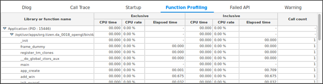
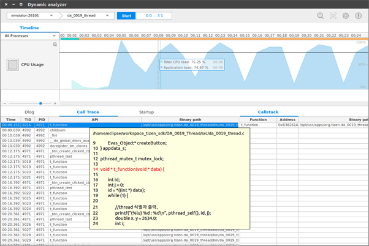
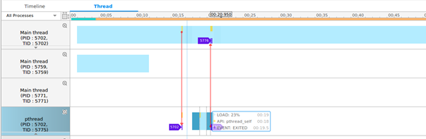
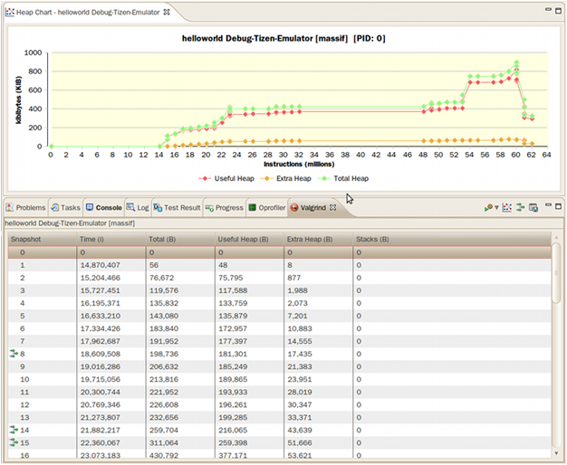

# Optimizing Application Performance

The application performance optimization features include measuring and improving application performance.

If an application performs poorly and gives delayed responses to user actions, the user experience can suffer. To avoid this situation, some parts of the code must be optimized.

Most processors that are used today in mobile phones are based on multi-core technologies and so you must consider utilizing this hardware feature. To effectively utilize multi-core capabilities, you need to divide your code to run on several cores simultaneously. Traditionally, this is done by using `pthreads`, but this method has an overhead of initialization and termination of threads, and can generate potential runtime errors. Several solutions exist to exploit multi-core capabilities easily. These solutions abstract `pthreads`, allowing you to focus on the application development without worrying about thread level management.

To improve the performance of an application:

1. Identify the bottlenecks which need to be optimized.
2. Optimize the bottlenecks by code refactoring.
3. [Measure performance](#measuring-application-performance) to compare refactoring gains.
4. If the performance goal is met, you can stop the process, else go to step 2 and repeat till the goal is met.

## Measuring Application Performance

The Tizen Studio supports various tools which help to measure and increase performance at runtime:

- [Dynamic Analyzer](../../../tizen-studio/common-tools/dynamic-analyzer/overview.md)

  The Dynamic Analyzer helps to identify bottlenecks and improve resource usage patterns in applications. For more information on its usage, see [Dynamic Analysis](#dynamic-analysis).

- [Valgrind](../../../tizen-studio/native-tools/valgrind.md)

  Valgrind detects memory errors or leaks. This tool helps to improve memory usage patterns in native applications. For more information on its usage, see [Valgrind Analysis](#valgrind-analysis).

Measuring performance allows you to identify bottlenecks that take a critical amount of time during the program execution and to compare the code execution time before and after optimization.

Profiling can show unexpected bottleneck locations that you have not noticed otherwise. Once bottlenecks are identified, you can consider applying a threading mechanism to clear them. This solution does not work in all situations or for all algorithms, but it can be worth spending your time to investigate the possibilities. Code refactoring is required to apply the threading mechanism.

## Performance Tips

A faster application can increase battery life. If your application is not as fast as expected, you can look at profiling data to identify bottlenecks. Fixing these bottlenecks increases the application speed with minimal effort.

Some general tips to improve the performance of your application are:

- Select the most appropriate algorithm and data structures.
- High-level optimization is important, because it can change the order of complexity. If your code includes `sort`, `search`, or `compare`, use optimal algorithms and data structures.
- Split a task, which contains both high and low priority jobs, to prevent low priority jobs delaying high priority jobs. Running high and low priority jobs in a single task causes delays.
- Do not run heavy calculations in the same thread as your UI.
- Use optimization options provided by toolchains.

## Dynamic Analysis

To make your applications powerful, faster, and more stable, you need to analyze their performance to recognize and fix bottlenecks, bugs, and memory and resource leaks.

The following instructions and examples help you to use the Dynamic Analyzer effectively:

- [Running Dynamic Analyzer](#running-dynamic-analyzer)

  Describes how to launch the Dynamic Analyzer.

- [Using the Analysis Result](#using-the-analysis-result)

  Describes how to utilize the Dynamic Analyzer for various improvement purposes.

### Running Dynamic Analyzer

You can launch the Dynamic Analyzer in the Tizen Studio or as a standalone application from the Tizen Studio submenu.

- To launch the Dynamic Analyzer in the Tizen Studio:
  1. Right-click your project in the Tizen Studio **Project Explorer** view.
  2. Select **Profile As > Profile with Dynamic Analyzer**.

  The selected project is built, packaged, and installed on the target device. The Dynamic Analyzer is launched and the profiling starts automatically.

- To run the Dynamic Analyzer as a standalone from the Tizen Studio submenu:
  1. Launch the Dynamic Analyzer from the Tizen Studio **Tools > Dynamic Analyzer** menu.
  2. Select the target device and the application to be traced from the combo box in the Dynamic Analyzer toolbar.
  3. Click the **Start** button.

The performance details of your application retrieved during tracing are stored in trace files. You can manage the trace files through the Dynamic Analyzer toolbar. For usage details, see [Handling Common Dynamic Analyzer Tasks](../../../tizen-studio/common-tools/dynamic-analyzer/common-tasks.md) and [Handling Advanced Dynamic Analyzer Tasks](../../../tizen-studio/common-tools/dynamic-analyzer/advanced-tasks.md).

#### Using the Command Line Interface to Access Dynamic Analyzer Features

The Dynamic Analyzer provides access to its features through the Command Line Interface (CLI) tool. This possibility can be useful, for example, in the following cases:

- CLI tool can be used in testing and profiling automation scenarios.
- CLI tool can be used in GUI-less environments, and the collected profile data can be transferred into other environment where it can be further analyzed with the Dynamic Analyzer GUI.
- CLI tool can be used by people who do not like to use graphical user interfaces at all.

For more information on using the Dynamic Analyzer CLI, see [Command Line Interface](../../../tizen-studio/common-tools/dynamic-analyzer/advanced-tasks.md#command-line-interface).

### Using the Analysis Result

After the profiling is terminated by the Dynamic Analyzer, analyze the result. The Dynamic Analyzer provides a variety of information collected while your application was run. Use the result selectively to meet your improvement purposes.

The following instructions help you to use the analysis result:

- [Performance Analysis](#performance_analysis)

  Describes how to analyze application performance.

- [Detecting Leaks](#detecting)

  Describes how to detect memory and resource leaks.

- [Multi-threaded Application and Synchronization Analysis](#multithread)

  Describes how to analyze threads and synchronization.

#### Performance Analysis

You can use the Dynamic Analyzer to analyze application performance and identify bottlenecks. After identifying bottlenecks, you can modify the code to eliminate them. That increases application performance significantly, and extends the battery life of the device running the application.

To analyze performance of the application with the Dynamic Analyzer, use the following features:

- Function profiling

  When analyzing application performance, execution time of each method is one of the most significant factors. You can improve the performance of an application by identifying unexpected bottleneck locations, and analyzing and optimizing the most commonly used methods in the Dynamic Analyzer.

  To detect and fix the methods consuming the most time:

  - Select the **View > Report > Function Profiling** in the menu to show the Function Profiling table displaying the methods consuming the most time. Click the title of a column to view the sorted results.
  - To view the execution time of the methods called within a specific time period, use the [range inspection feature](../../../tizen-studio/common-tools/dynamic-analyzer/advanced-tasks.md#range-inspection) of the Dynamic Analyzer.

  **Figure: Function Profiling table**

  

- Timeline CPU chart

  When analyzing application performance, the CPU load is one of the most significant factors. A CPU load peak can result in a performance bottleneck. High CPU load leads to increased memory consumption, which shortens the battery life of the device running the application. To avoid this, you need to optimize your code.

  To detect and fix CPU load peaks with the CPU load feature of the Dynamic Analyzer:

  1. Select the **Timeline** tab and view the CPU chart.
  2. Hover the mouse on a CPU peak to view the CPU load value in a tooltip.
  3. Click the CPU peak to highlight the last user method called before the peak in the Call Trace table.
  4. Right-click the highlighted method and select **View Declaration Source**. The source code is displayed as a tooltip. To investigate the method, double-click it, and the source code is displayed in the Tizen Studio.
  5. Modify the code in the Tizen Studio, re-build, and re-analyze the application to see if the bottleneck has been eliminated.

  **Figure: Timeline CPU chart and Call Trace table**

  

- Thread load

  If you use threads in your application code, you need to analyze the load of each thread during the application execution. The thread load feature helps to distribute the thread load. You can modify the code to optimize the thread load, while maintaining a single thread.

  The thread load is displayed in the **Thread** tab. The thread line displayed in blue indicates the thread load within a time frame. The darker the color, the higher the load.

  **Figure: Thread load**

  

#### Detecting Leaks

To improve the performance of your application, you can use the Dynamic Analyzer to detect memory leaks. Memory leaks occur when memory capacity that is dynamically allocated during application execution is not returned after the execution stops. Severe or accumulating memory leaks can affect the performance of your application along with other applications and programs. For more information, see [Performing Memory Analysis](../../../tizen-studio/common-tools/dynamic-analyzer/memory-analysis.md).

#### Multi-threaded Application and Synchronization Analysis

Understanding the thread execution in multi-threaded applications can be challenging. The GDB (GNU Debugger) supports the process of debugging multi-threaded applications, but since it uses synchronization objects, the debugging can be quite difficult. The Dynamic Analyzer, on the other hand, provides effective thread analysis features. For more information, see [Performing Thread Analysis](../../../tizen-studio/common-tools/dynamic-analyzer/thread-analysis.md).

## Valgrind Analysis

Valgrind helps you to detect memory errors or leaks in your application at runtime.

The following instructions and examples help you to use Valgrind effectively:

- [Running Valgrind](#running-valgrind)

  Describes how to launch Valgrind with your application.

- [Viewing Valgrind Result](#viewing-valgrind-result)

  Describes the information provided through Valgrind analysis.

### Running Valgrind

To set the Valgrind options for your application:

1. In the **Project Explorer** view, right-click the project and select **Profile As > Profile Configurations**.

2. In the **Profile Configurations** window, right-click the **Profile with Valgrind** and select **New**.

3. Select the created configuration.

4. Go to the **Memory Profile Options > Collect data** tab:

   Select from 2 types of memory profiling settings:

   - Memory error and memory leak checking

     This option uses the **Memcheck** tool to profile your application.

   - Heap memory profiling

     This option uses the **Massif** tool to profile your application.

5. On the **General setting** tab, set the general Valgrind options. These options are used for both **Memcheck** and **Massif** profiling.

   **Figure: Memory error and memory leak data options**

   

   - **trace children on exec**

     When enabled, Valgrind traces into sub-processes initiated through the exec system call. This is necessary for multi-project applications. Valgrind does trace into the child of a fork (it would be difficult not to, since fork makes an identical copy of a process), so this option is arguably badly named. However, most children of fork calls immediately call exec anyway.

   - **run __libc_freeres() on exit**

     This option is only relevant when running Valgrind on Linux.

     The GNU C library (`libc.so`), which is used by all applications, can allocate memory for its own uses. Usually it does not free that memory when the application ends, since the Linux kernel reclaims all process resources when a process exits anyway. The glibc authors realized that this behavior causes leak checkers, such as Valgrind, to falsely report leaks in glibc, when a leak check is done at exit. In order to avoid this, they provided a routine called `__libc_freeres()` specifically to make glibc release all memory it has allocated. **Memcheck** therefore tries to run `__libc_freeres()` at exit. Unfortunately, in some very old versions of glibc, `__libc_freeres()` is sufficiently buggy to cause segmentation faults. This was particularly noticeable on Red Hat 7.1. So this option is provided in order to inhibit the run of `__libc_freeres()`. If your application seems to run fine on Valgrind, but segfaults at exit, disabling this option can fix the problem, although at the cost of possibly falsely reporting space leaks in `libc.so`.

   - **demangle C++ names**

       Automatic demangling (decoding) of C++ names is enabled by default. When enabled, Valgrind attempts to translate encoded C++ names back to something approaching the original. The demangler handles symbols mangled by g++ versions 2.X, 3.X, and 4.X.

       An important fact about demangling is that method names mentioned in suppressions files must be in their mangled form. Valgrind does not demangle method names when searching for applicable suppressions, because to do otherwise would make suppression file contents dependent on the state of Valgrind's demangling machinery, and also slow down suppression matching.

   - **num callers in stack trace**

       This option specifies the maximum number of entries shown in stack traces that identify application locations. Errors are commoned up using only the top 4 method locations (the place in the current method, and that of its 3 immediate callers). So this does not affect the total number of errors reported.

      The maximum value for this option is 50. Note that higher settings make Valgrind run more slowly and take more memory, but can be useful when working with applications with deeply-nested call chains.

   - **limit errors reported**

       When enabled, Valgrind stops reporting errors after 10,000,000 in total, or 1,000 different ones, have been seen. This is to stop the error tracking machinery from becoming a huge performance overhead in applications with many errors.

   - **show errors below main**

      By default, stack traces for errors do not show any methods that appear beneath `main()`. Alternatively, if `main()` is not present in the stack trace, it does not show any methods below `main()`-like methods, such as glibc's `__libc_start_main()`. Furthermore, if `main()`-like methods are present in the trace, they are normalized (below `main()`), in order to make the output more deterministic. If this option is enabled, all stack trace entries are shown and `main()`-like methods are not normalized.

   - **max size of stack frame**

      This option specifies the maximum size of a stack frame. If the stack pointer moves by more than this amount, Valgrind assumes that the application is switching to a different stack.

      You can to use this option if your application has large stack-allocated arrays. Valgrind keeps track of your application's stack pointer. If it changes by more than the threshold amount, Valgrind assumes your application is switching to a different stack, and **Memcheck** behaves differently than it would for a stack pointer change smaller than the threshold. Usually this heuristic works well. However, if your application allocates large structures on the stack, this heuristic is fooled, and **Memcheck** subsequently reports large numbers of invalid stack accesses. This option allows you to change the threshold to a different value.

      You must only consider the use of this option if Valgrind's debug output directs you to do so. In that case, it tells you the new threshold you must specify.

      In general, allocating large structures on the stack is a bad idea, because you can easily run out of stack space, especially on systems with limited memory or which expect to support large numbers of threads each with a small stack, and also because the error checking performed by **Memcheck** is more effective for heap-allocated data than for stack-allocated data. If you have to use this option, consider rewriting your code to allocate on the heap rather than on the stack.

   - **suppressions file**

       This option specifies an extra file from which to read descriptions of errors to suppress. You can use up to 100 extra suppression files.

6. On the **Tool Advanced setting** tab, set the advanced options.

   The tab content depends on the selection you have made on the **Collect data** tab.

   Tool Advanced setting options for memory error and memory leak profiling cantains the following options:

   - **leak check**

       This option, when enabled, searches for memory leaks when the client application finishes. If set to **summary**, it lists out how many leaks occurred. If set to **full** or **yes**, it also gives details of each individual leak.

   - **leak resolution**

        When performing leak checks, this option determines how willing **Memcheck** is to consider different backtraces to be the same for the purposes of merging multiple leaks into a single leak report. When set to **low**, only the first 2 entries need match. When set to **med**, 4 entries have to match. When **high**, all entries need to match.

      For hardcore leak debugging, you probably want to use **--leak-resolution=high** together with **--num-callers=40** or a similar large number. The **--leak-resolution** setting does not affect **Memcheck**'s ability to find leaks. It only changes how the results are presented.

   - **freelist size (blocks)**

       When the client application releases memory using free (in C) or delete (C++), that memory is not immediately made available for re-allocation. Instead, it is marked inaccessible and placed in a queue of freed blocks. The purpose is to defer as long as possible the point at which freed-up memory comes back into circulation. This increases the chance that **Memcheck** is able to detect invalid accesses to blocks for some significant period of time after they have been freed.

      This option specifies the maximum total size, in bytes, of the blocks in the queue. The default value is 20 million bytes. Increasing this increases the total amount of memory used by **Memcheck**, but can result in the detection of invalid uses of freed blocks which would otherwise go undetected.

   - **show reachable blocks**

       When disabled, the memory leak detector only shows "definitely lost" and "possibly lost" blocks. When enabled, the leak detector also shows "reachable" and "indirectly lost" blocks. It shows all blocks, except suppressed ones, so **--show-all** would be a better name for it.

   - **allow partial loads**

       This option controls how **Memcheck** handles word-sized, word-aligned loads from addresses for which some bytes are addressable and others are not. When set to **yes**, such loads do not produce an address error. Instead, loaded bytes originating from illegal addresses are marked as uninitialized, and those corresponding to legal addresses are handled in the normal way.

       When set to **no**, loads from partially invalid addresses are treated the same as loads from completely invalid addresses, an illegal-address error is issued, and the resulting bytes are marked as initialized.

      The code that behaves in this way is in violation of the ISO C/C++ standards, and must be considered broken. If at all possible, such code must be fixed. This option must be used only as a last resort.

   - **undef value errors**

       This option controls whether **Memcheck** reports uses of undefined value errors. If you do not want to see undefined value errors, set this to no. It also has the side effect of slightly speeding up **Memcheck**.

   Tool Advanced setting options for heap memory profiling cantains the following options:

   - **profile heap**

       This option specifies whether heap profiling is done.

   - **administrative bytes per block**

       If heap profiling is enabled, this option gives the number of administrative bytes per block to use. This must be an estimate of the average, since it can vary. For example, the allocator used by glibc on Linux requires somewhere between 4 to 15 bytes per block, depending on various factors. That allocator also requires admin space for freed blocks, but **Massif** cannot account for this.

   - **profile stack**

       This option specifies whether stack profiling must be done. This option slows **Massif** down greatly, and so is off by default. **Massif** assumes that the main stack has size zero at start-up. This is not true, but doing otherwise accurately is difficult. Furthermore, starting at zero better indicates the size of the part of the main stack that a user application actually has control over.

   - **allocation tree depth**

       The maximum depth of the allocation trees recorded for detailed snapshots. Increasing it makes **Massif** run somewhat more slowly, use more memory, and produce bigger output files.

   - **heap allocation threshold**

       The significance threshold for heap allocations is a percentage of the total memory size. The allocation tree entries that account for less than this are aggregated. This must be specified in tandem with ms_print's option of the same name.

   - **allocation peak inaccuracy**

       **Massif** does not necessarily record the actual global memory allocation peak. By default, it records a peak only when the global memory allocation size exceeds the previous peak by at least 1.0%. This is because there can be many local allocation peaks along the way, and doing a detailed snapshot for each is expensive and wasteful, as all but one of them are later discarded. This inaccuracy can be changed (even to 0.0%) through this option, but **Massif** runs drastically slower as the number approaches zero.

   - **time unit**

       This option specifies the time unit used for the profiling. There are 3 possibilities:

       - Instructions executed (i)

         Good for most cases

       - Real (wall clock) time (in milliseconds)

         It is useful sometimes

       - Bytes allocated/deallocated on the heap or stack (B)

         It is useful for very short-run programs, and for testing purposes, because it is the most reproducible across different machines.

   - **detailed snapshot frequency**

       This option specifies the frequency of detailed snapshots. With **--detailed-freq=1**, every snapshot is detailed.

   - **max snapshots**

       This option specifies the maximum number of snapshots recorded. If set to N, for all programs except very short-running ones, the final number of snapshots is between N/2 and N.

   - **minimum heap block alignment**

       By default, Valgrind's malloc, realloc, and so on return a block whose starting address is 8-byte-aligned or 16-byte-aligned. The value depends on the platform and matches the platform default. This option allows you to specify a different alignment. The supplied value must be greater than or equal to the default, less than or equal to 4096, and must be a power of 2.

   - **allocation functions**

       Methods specified with this option are treated as though they were a heap allocation method, such as malloc. This is useful for methods that are wrappers to malloc or new, which can fill up the allocation trees with uninteresting information. This option can be specified multiple times on the command line, to name multiple methods.
       The named method is only treated this way if it is the top entry in a stack trace, or just below another method treated this way. For example, if you have a method malloc1 that wraps malloc, and malloc2 that wraps malloc1, just specifying **--alloc-fn=malloc2** has no effect. You need to specify **--alloc-fn=malloc1** as well. This is a little inconvenient, but the reason is that checking for allocation methods is slow, and it saves a lot of time if **Massif** can stop looking through the stack trace entries as soon as it finds one that does not match rather than having to continue through all the entries.

7. To save the settings, click **Apply**.

8. To run Valgrind, click **Profile**.

### Viewing Valgrind Result

After the [memory profiling](#running-valgrind) is terminated, you can view the profiling results.

#### Memory Error and Leak Results

The memory error table displays memory leaks that occurred during the profiling process:

- **Memory error** or **Memory leak**: Error or leak type
- **Function name**: Location where the error occurred
- **Sizes**: Memory size of the error
- **Address**: Code memory address
- **Location**: Source or executable path, or library path, where the error occurred
- **pid**: Process ID
- **tid**: Thread ID

If you expand an error entry, you can see the callstack of the method.

#### Heap Memory Profiling Results

The heap memory profiling table displays the heap memory consumed and allocated during the profiling process:

- **Snapshot**: Index number of the snapshot
- **Time (i)**: Number of instructions being executed
- **Total (B)**: Total heap memory consumption byte size
- **Useful Heap (B)**: Size of the heap memory used by the program
- **Extra Heap (B)**: Size of the heap memory allocated in excess of what the program is using. The source of the extra heap memory is:
  - Administrative bytes of the heap memory block
  - Aligned bytes of the requested memory size
- **Stack (B)**: Size of the stacks. By default, stack profiling is disabled as it slows profiling. It is enabled using the **profile stack** option.

**Figure: Heap memory profiling results**

A snapshot with a green icon in front has a heap tree with a callstack. Double-click the entry to see the callstack details.

For information on executing Valgrind on the command line interface, see the [Valgrind User Manual](http://valgrind.org/docs/manual/manual.html).

#### Managing Results

To save a Valgrind profiling result, click **Save file** on the Valgrind result view toolbar.

To load a saved Valgrind result file, select **File > Open File** in the Tizen Studio menu.
