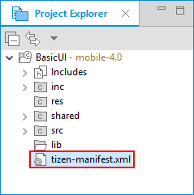

# Setting Project Properties

Before you implement the actual application functionality, define all the necessary properties for your application project:

- To set the [application project properties for API and privilege checks](#checking-api-and-privilege-usage), right-click the project in the Tizen Studio **Project Explorer** view and select **Properties**. After setting or changing a property, click **OK**.
- To define the [application manifest settings](#setting-the-application-manifest), edit the `tizen-manifest.xml` file.

> **Note**
>
> Only modify the manifest file by using the manifest editor in the Tizen Studio. If you create or edit the `tizen-manifest.xml` file using any other text editor, your application may not work as expected.

After you have finished setting the project properties, you are ready to [design the UI and implement the application code](app-dev-process.md#designing).

<a name="api"></a>
## Checking API and Privilege Usage

You can [check the source code in your project for any violation of API and privilege usage](../../../tizen-studio/native-tools/api-checker.md). To enable the non-default checks (the default checks are always performed):

1. In the **Properties** window, select **C/C++ Build > Tizen Settings > API and Privilege Checker Properties**.
2. Select the required checks in the **Privilege Check** panel.

To perform the usage checks automatically during specific tasks, select the required option in the **Launching** panel:

- During the [build process](app-dev-process.md#build), select the **Run API and privilege checks with build** option.
- During code editing, select the **Run API and privilege checks while editing** option.

You can also perform the usage checks manually after building the application, by right-clicking the project in the **Project Explorer** view and selecting **Check API and Privilege Violations With Build**. The results are displayed in the **Problems** view.

> **Note**
>
> If the application has conflicting API versions, the build fails and the results are displayed in the **Problems** view.

<a name="manifest"></a>
## Setting the Application Manifest

The application manifest consists of application information, such as package, version, features, and privileges, which are available for the application. To configure the application information in the manifest editor, double-click the application `tizen-manifest.xml` file in the **Project Explorer** view.

**Figure: Setting the application manifest**



You can [edit the application properties using the form tabs of the manifest editor](../../../tizen-studio/native-tools/manifest-text-editor.md#editing-the-manifest-file).

### Defining and Editing General Information in the Overview Tab

You can set and edit general and project-related information about the application, such as application package, version, author, and description, in the **Overview** tab of the manifest editor.

You can perform the following tasks using the **Overview** tab:

- View the application ID.

  The Tizen Studio creates automatically an application ID, which uniquely identifies the application within the package.

- Set the package name of the application.

  The package name represents the package identifier of the application

- Set the application version (x.y.z).

  The application version format has the following constraints: 0 ≤ {x, y} ≤ 255, 0 ≤ z ≤ 65535. You can change the application version in the **Version** field.

- Set the API version.

  The API version format is "x.y.z".

- Set the application label.

  The application label represents the name of the application.

- View the application executable file path.

- Add an application icon.

  You can add a launcher icon to your application by defining it in the **Icon** panel. If your application supports both HD and WVGA, it is best to provide an icon for HD for better image quality in both cases.

  The following table describes the available icons.

  **Table: Application icons**

  | Profile  | Mandatory | Format                 | Xhigh (HD) Size   | High (WVGA) Size  | Description                       |
  |----------|-----------|------------------------|-------------------|-------------------|-----------------------------------|
  | Mobile   | Yes       | 32-bit PNG with  alpha | 117 x 117 pixels  | 78 x 78 pixels    | Image displayed in the main menu. |
  | Wearable | Yes       | 32-bit PNG with alpha  | 152 x 152 pixels  | 152 x 152 pixels  | Image displayed in the main menu. |

- Set the application author.

  The application author represents the creator of the Tizen native application package. You can set the name, email ID, and Web site of the author.

- Set the application description.

  The application description represents the human-readable description of the Tizen native application package.

### Declaring Required Software or Hardware Features in the Features Tab

You can declare any device software or hardware features that your application requires to run properly. The declaration can be used for application filtering in the Tizen Store.

To enable filtering for your native application:

1. In the **Features** tab, click **+**.

2. Select a feature from the [predefined list of features available for filtering](../details/app-filtering.md).

   To check which features are necessary for using a specific API, see the related feature in the native [API Reference](../../api/mobile/latest/index.html).

3. Click **OK**.

4. Upload and publish the application package on the Tizen Store.

   If a Tizen-powered device requests applications, the store displays a list containing only applications compatible with the user's device.

After setting the feature information with the manifest editor, you can see the added code in the **Source** tab:

```
<feature name="http://tizen.org/feature/network.nfc">true</feature>
```

### Specifying Privileges in the Privileges Tab

You can use features and services provided by privileged APIs, which handle platform and user-sensitive data. You can specify a privilege in the **Privileges** tab of the manifest editor.

To add a privilege:

1. In the **Privileges** tab, click **+**.
2. Select a privilege from the [predefined list of available API privileges](../details/sec-privileges.md).
3. Click **OK**.

After setting the privilege information with the manifest editor, you can see the added code in the **Source** tab:

```
<privileges>
   <privilege>http://tizen.org/privilege/appmanager.launch</privilege>
</privileges>
```

### Adding Localized Application Details in the Localization Tab

You can provide localized versions of the application name (label) and description in the **Localization** tab of the manifest editor.

To add a localized name or description:

- In the **Name** panel, click **+**. Select the language, define the application name for that language, and click **OK**.

  The following example shows the setting in the `tizen-manifest.xml` file code:
```
<label xml:lang="en-us">This is a sample</label>
```

- In the **Description** panel, click **+**. Select the language, define the application description text for that language, and click **OK**.

  The following example shows the setting in the `tizen-manifest.xml` file code:
```
<description xml:lang="en-us">This is a sample</description>
```

You can localize a native application to adapt to various languages and cultural environments by creating different native application versions for different languages. For more information, see [Localizing Application Resources](../../../tizen-studio/native-tools/po-file-editor.md).

### Defining Advanced Features in the Advanced Tab

You can define advanced application features, such as metadata and data and application control functionalities, account, and miscellaneous options, in the **Advanced** tab of the manifest editor.

You can perform the following tasks using the **Advanced** tab:

- Add metadata.

  In the **Meta Data** section, you can add user-defined key-value pairs to the application to be used for filtering in the package manager.

- Export [data control](../../guides/app-management/data-control.md) functionality.

  A service application can act as a service provider and allow other applications to access specific data.
To define the kind of access and data your service application provides to other applications, click **+** in the **Data Control** section, and define the data control details.

- Set miscellaneous options.

  In the **Miscellaneous Options** section, you can set various application options:

  - **Manage task**

    Define whether the application is shown in the task manager.

  - **No display**

    In UI applications, define whether the application is hidden in the device application tray. In service applications, this settings is always **true**.

  - **Hardware acceleration**

    Define whether hardware acceleration is enabled for the application.

  - **Launch Mode**

    Define the launch mode of the application (whether the application is launched as a main or sub application, or whether a caller application defines the launch mode when the application is launched by an application control request).

- Define application controls.

  You can [export the application control functionality](../../guides/app-management/app-controls.md#application-control-export) of your application.

  To define an application control used to access the functionality of your application, click **+** in the **Application Control** section.

  Each application control can have multiple operation, MIME type, and URI attributes.

- Add accounts (in mobile applications only).

  Account providers, such as Google and Facebook, represent specific service provider-related information or protocol that provides user accounts. To add, update, or remove accounts, you must register a specific account provider in your application.

  To register an account provider, click **+** in the **Account** section and define the account provider information, as described in the following table.

  **Table: Account provider properties**

  | Acount property1  | Acount property2 | Data type | Property type                            |
  |-------------------|------------------|-----------|------------------------------------------|
  | Multiple account  |             | bool      | Indicates  whether multiple accounts are supported. This is a mandatory property. |
  | Provider ID       |             | String    | ID  of the account provider.             |
  | Default label     |             | String    | Display  name of the account provider. This is a mandatory property. |
  | Icons             | Icon        | String    | File  path of the account provider icon.<br> The  icon size is:<br> - 72 x 72 for Xhigh (HD)<br> - 48 x 48 for High (WVGA)<br> Since the  icon is used in Settings > Accounts, place the icon in a shared  directory.<br> This is a mandatory property. |
  | Icons             | Icon  small | String    | File  path of the account provider icon. <br>The icon size is: <br> -  45 x 45 for Xhigh  (HD)<br> - 30 x 30 for High  (WVGA)<br>  Since the small icon is used  in other applications, place the icon in a shared directory.<br>  This is a mandatory property. |
  | Name              |             | String    | Localization  support for the display name.<br> To add a localized name, click + in  the Name panel, select the language, define the display name for  that language, and click OK. |
  | Capabilities      |             | String    | Capability  of the account provider.    Capabilities are defined in the `http://<VENDOR_INFORMATION>/accounts/capability/<NAME>` IRI  format.    <br>The following predefined capabilities can be used in Tizen:    <br>- `http://tizen.org/account/capability/calendar` <br>&nbsp;&nbsp;&nbsp;Used when the account is related to a calendar.    <br>- `http://tizen.org/account/capability/contact`    <br>&nbsp;&nbsp;&nbsp;Used when the account is related to contacts.    <br>- `http://tizen.org/account/capability/document`    <br>&nbsp;&nbsp;&nbsp;Used when the account is related to a document.    <br>- `http://tizen.org/account/capability/email`    <br>&nbsp;&nbsp;&nbsp;Used when the account is related to email.    <br>- `http://tizen.org/account/capability/game`    <br>&nbsp;&nbsp;&nbsp;Used when the account is related to a game.    <br>- `http://tizen.org/account/capability/message`    <br>&nbsp;&nbsp;&nbsp;Used when the account is related to a message.    <br>- `http://tizen.org/account/capability/music`    <br>&nbsp;&nbsp;&nbsp;Used when the account is related to music.    <br>- `http://tizen.org/account/capability/photo`    <br>&nbsp;&nbsp;&nbsp;Used when the account is related to a photo.    <br>- `http://tizen.org/account/capability/video`    <br>&nbsp;&nbsp;&nbsp;Used when the account is related to a video.    <br>To add a capability, click + in the Capabilities panel. A default  capability is added to the table. Click the default capability and change it  to the one you need.    <br>This is an optional property. |

- Add the background category type (since Tizen 2.4).

  You can [describe the background category](../../guides/app-management/efl-ui-app.md#describing-the-background-category) of your Tizen native application.

  To add background category types to allow running in the background, click **+** in the **Background Category** panel, select the category type, and click **OK**.

- Add shortcuts.

  To add a shortcut for the application, click **+** in the **Shortcut List** panel and define the shortcut details, as described in the following table.

  **Table: Shortcut properties**

  | Shortcut property | Data type | Property type                            |
  |-------------------|-----------|------------------------------------------|
  | App ID            | String  | Application unique ID.                   |
  | Key               | String  | Key for user content.                    |
  | Data              | String  | Data for user content.                   |
  | Default label     | String  | Display name of the shortcut.            |
  | Icon              | String  | File path of the shortcut icon.This is a mandatory property. |
  | Name              | String  | Localization support for the display name.<br> To add a localized name, click **+** in the **Name** panel, select the language, define the display name for that language, and click **OK**. |

### Editing the tizen-manifest.xml File in the Source Tab

  The **Source** tab of the manifest editor shows the code of the `tizen-manifest.xml` file. You can [edit the basic syntax of the XML document](../../../tizen-studio/native-tools/manifest-text-editor.md) and also see how changes made on the other tabs are reflected in the raw XML source content.

>  **Note**
>
>  If you edit application information manually in the `tizen-manifest.xml` file source code, you can introduce errors preventing the application from running normally.
