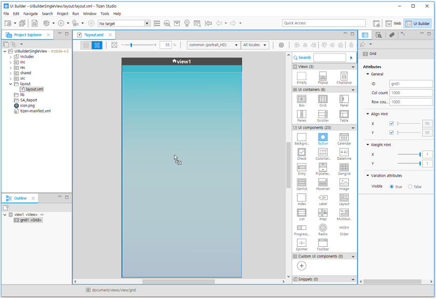
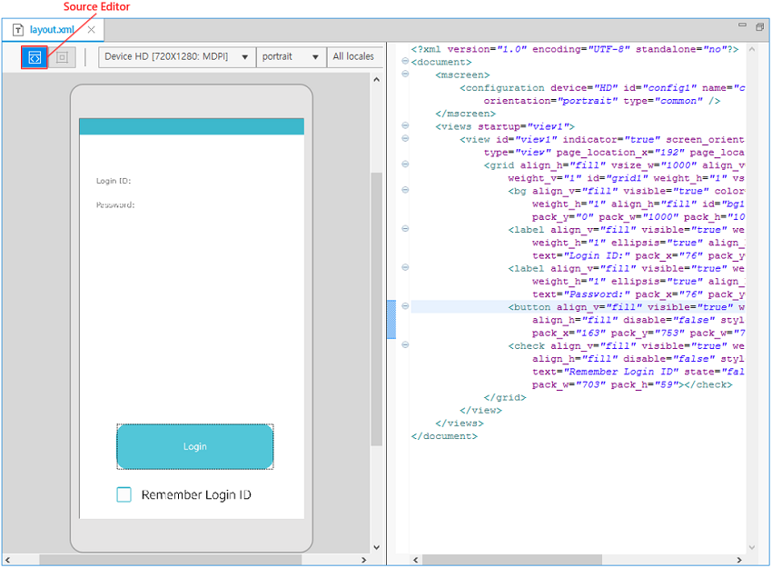
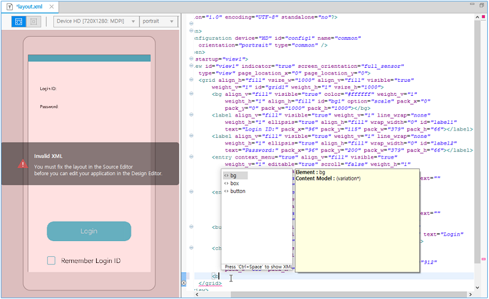
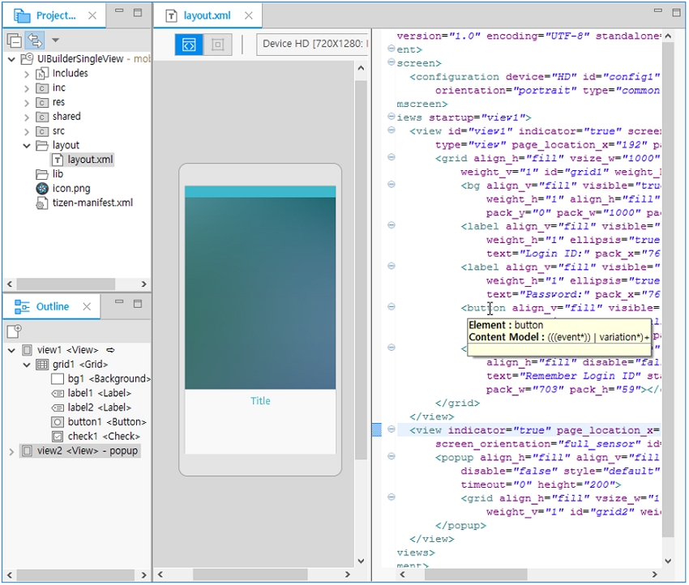
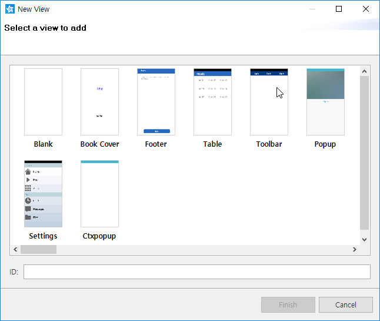
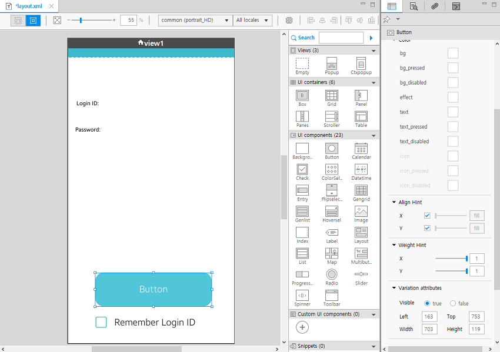
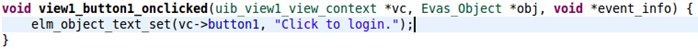
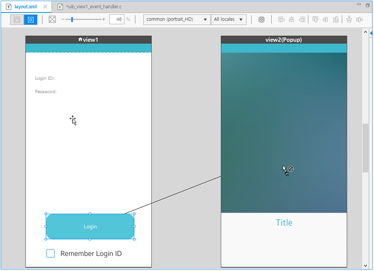
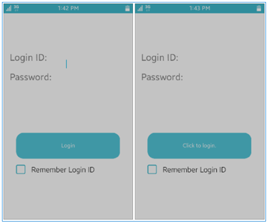

# Designing Your Native Application


You can approach the task of designing a native application with several
methods. On the one hand, you can edit the application in the Tizen
Studio after creating it with a basic template. On the other hand, you
can edit the application in another editor and build it with the CLI
interface of the Tizen Studio. As a third option, you can use the native
UI Builder in the Tizen Studio.

This topic describes the design of a mobile application with the UI
Builder. The process for a wearable application is similar.

The native UI Builder offers 2 ways to develop a native application in
the **WYSIWYG Editor** view:

-   You can use WYSIWYG editing in the **Design** editor.
-   You can use XML document editing in the **Source** editor.

You can switch between the editors as needed.

<a name="project"></a>
## Creating a Project


To create a native UI Builder project:

1.  In the Tizen Studio, select **File &gt; New &gt; Tizen Project**.
2. In the Project Wizard, create a template-based mobile native
    application, and select a Tizen native UI Builder project template.

    The **UI Builder - Navigation View** template creates an application
    with 3 default views, while the **UI Builder - Single View**
    template offers a single view. For more information on the Project
    Wizard and templates, see [Creating Tizen Projects with Tizen
    Project
    Wizard](../../../tizen-studio/native-tools/project-wizard.md).

    

3. Define the project details, and click **Finish**.

    

After you have created the project, the Tizen Studio changes to the **UI Builder** perspective with the applicable views, and the project
structure is shown in the **Project Explorer** view.

**Figure: UI Builder views and default project structure**


The following table describes the content of the default project folders
and files.

**Table: Default project content**

| File or folder                           | Content                                  |
|----------------------------------------|----------------------------------------|
|  `inc` | Folder for the default include path      |
|  `res` | Resource folder of the Tizen Studio      |
|  `shared` | Shared folder                            |
|  `src` | Application source files<br> - `src/managed`: UI layout source files automatically generated by the native UI Builder<br> - `src/event_handler`: Event handler source files |
|  `layout` | Layout folder                            |
|  `lib` | Library folder                           |
|  `layout.xml` | Layout meta file                         |
|  `icon.png` | Application icon file                    |
|  `tizen-manifest.xml` | Tizen native application manifest XML file |

<a name="view"></a>
## Designing a UI Layout for a View


### Using the Design Editor

To create a UI with the **Design** editor:

1.  Each view must have a root container as a top-level UI component
    (see the [UI hierarchy
    structure](ui-builder-overview.md#UI_figure) figure). To design
    a view, first place the top-level UI component, the root container,
    on the canvas.

    To place a top-level UI component, use the components in the **UI
    container** category of the **Palette**. You can drag and drop the
    component from the palette to the canvas, or select the component in
    the palette and click on the canvas. After you have added the
    component, you can see it in the **Outline** view.

    

    

2. After placing the root container, you can place any other UI
    components you want.

    The native UI Builder provides a useful visual feedback. When you
    drag a UI component on the canvas, a feedback shows whether you can
    place the component. If the component can be placed in the selected
    position, the cursor shows a + sign. If not, the cursor displays a
    rejection sign.

    The following figures show an example of positive and
    negative feedback.

    

    

3. After placing the UI components, you can set their properties and
    bind any event handlers for specific events.

    Select the component you want to modify in the **Design** editor,
    and it is shown with a blue line. Use the **Properties** view to set
    the properties and bind event handlers for the selected component.

    

Using the above steps, you can create a layout for your UI. For example,
you can create a Login view by adding a grid, label, entry, button, and
check UI components, and setting their properties and events.

### Using the Source Editor

Another UI programming method of the native UI Builder is to use the XML
editor. You can edit your layout file in the **Source** editor. This
section describes some of the features that are available in the
**Source** editor.

For more information on the XML schema of the layout file, see [Managing
UI Component Attributes in
layout.xml](../../../tizen-studio/native-tools/component-attributes.md).

To use the XML editor and its helpful features:

-   **Source** editor

    You can switch to the **Source** editor by clicking the toggle
    button at the top toolbar area of the **Layout** editor. In the
    **Source** editor, you can edit the layout XML file.

    **Figure: Source editor**

    

- Content assist

    The native UI Builder provides content assist functionality, which
    helps you to write code faster and more efficiently. To use this
    functionality, type a few characters of the word and press **Ctrl +
    Space**. The proposals are shown in a popup as in the right panel of
    the following figure.

    Until the UI XML tag is completed, the notification toast window is
    displayed, as in the left panel of the following figure. The toast
    window disappears when input is normally completed by the XML
    closing tag.

    **Figure: Content assist**

    

- Auto complete

    If you select a tag in the suggested list with content assist, the
    auto complete feature automatically adds the end tag.

    **Figure: Auto complete**

    

- Selection synchronization

    If you move a focus to another UI component in the **Source**
    editor, the selection in Preview pane is automatically synchronized.
    Similarly, if you change the selection in the preview pane, the
    focus in the **Source** editor moves accordingly.

    **Figure: Selection synchronization**

    

### Adding Views

To add a new view:

1.  In the **Outline** view, click the **Empty View** icon in the
    toolbar (marked by a red circle in the following figure), or
    right-click the **Outline** view area and select **Add** and the
    applicable view.

    

2. If you select **View From Template List**, a collection of
    predefined view templates for creating the view is shown. Select the
    template you want, enter a name (ID) for the view, and click
    **Finish**.

    

    After adding a view, you can see it in the **Outline** view and the
    **Source** editor.

    

3. To activate the view for editing, click it in the **Outline** view.
4. After selecting the view, create a layout for it by adding UI
    components from the **Palette** and defining their properties in the
    **Properties** view.


<a name="binding"></a>
## Binding an Event Handler to the UI Component


An event handler is part of the application logic. It is called by the
Tizen framework when any user interaction, such as a mouse click or
touch, occurs.

The event type is different for each UI component, and the event
information is data which depends on the UI component and event type.

You can add events on a component in the **Properties** view, and you
can add events between views using the **Storyboard** in the **Design**
editor.

To add an event handler to a specific UI component:

1.  Select a UI component in the **Design** editor.
2. In the **Properties** view, scroll down to the **Events** panel.

    

    The **Events** panel shows all available event types for the
    selected UI component:

    -   To add an event handler for an event type, click
         next to the event type.

        The **Events** panel expands and you can see the suggested event
        handler name in gray color. Change the function name of the
        event handler, if needed. You can see the added event element in
        the **Source** editor.

    - To go to the event handler source, click
        .
    - To remove the event handler, click
        .

    

3. Access the event handler code.

    When you click , the C source
    editor opens the generated event handler code, such as boilerplate,
    structure declaration, and function signature with comment.

    You can add your own source code. Your own source code is kept even
    if you change the event handler in the **Design** or
    **Source** editor.

    

    The new event handler C file is shown in the **Project
    Explorer** view. If it already exists, the function signature for
    the new event handler is appended at the end of the file.

    The following figure shows an example of the automatically generated
    event handler code snippets.

    

    The signature contains the following parameters:

    ```c++
    void view1_button1_onclicked(uib_view1_view_context *vc, Evas_Object *obj, void *event_info)
    ```

    -   `vc`: View context related to the event. You can access the UI
        component in the view through this structure. The following code
        example shows a sample of the view context.

        ```c++
        struct _uib_view1_view_context {
            /* Parent evas_object which was parameter of create function */
            Evas_Object *parent;
            /* Root container UI component of this view */
            Evas_Object* root_container;
            /* View class name */
            const char *view_name;
            /* Control context to control this view */
            struct _uib_view1_control_context *cc;

            /* UI components in this view */
            Evas_Object *grid1;
            Evas_Object *button1;
            Evas_Object *check1;
            Evas_Object *label1;
            Evas_Object *label2;
            Evas_Object *entry1;
            Evas_Object *entry2;
        };
        typedef struct _uib_view1_view_context uib_view1_view_context;
        ```

    - `obj`: UI component where the event occurs.
    - `event_info`: User data passed from the Tizen framework. The
        event type is defined in the above event handle code.

4. Edit the event handler code.

    For example, change the button text.

    

    You can use the content assist by pressing **Ctrl + Space**.

    


<a name="storyboard"></a>
## Adding an Event Handler from the Storyboard


To transition between pages in your application, use the **Storyboard**
feature of the **Design** editor. In the **Storyboard**, you can see all
the views of your application. In the **Storyboard**, transitioning
between the application views based on some UI component event is called
a connection from a UI component to the target view. The target view is
the view to be opened when performing a specific event on the UI
component.

To create a connection:

1.  Select the UI component from which you want to create a connection
    to a target view (another view in your application), press **Shift**
    on your keyboard, and drag the UI component to the target view.

    

2. When you drop the UI component on the target view, a list of UI
    component events is shown in a context menu.

    If a connection already exists for an event, that event is disabled
    in the list. Select one of the events displayed in the context menu.

    

    Selecting an event from the context menu generates the code for the
    view transition and creates a connection between the 2 views.

3. To see the properties of the created event, select the UI component
    (or the connection arrow) and go to the **Events** panel in the
    **Properties** view.

    

4. To edit the event code, click the connection and select the event
    function in the **Properties** view.

    To delete the connection, right-click the connection and select
    **Delete**.

    

    In the source code, 2 functions are generated:

    -   One is called before the transition is performed to the target
        view (`view1_<UI_component>_<event>()`).
    -   One is provided after the transition has been performed
        (`view1_<UI_component>_<event>_post()`).

    You can perform whatever pre or post transition operations you want
    in these functions.

    


<a name="emulator"></a>
## Running the Application in the Emulator


You can run your application in the emulator. The device emulator,
provided with the Tizen Studio, imitates the target environment running
Tizen native applications. Using this replicated environment, you can
test your application before deploying to a real target device. For more
information, see [Running Applications on the
Emulator](../../../tizen-studio/common-tools/emulator.md).

To run the application:

1.  Run the Emulator Manager.
2. Create an emulator instance with the correct profile and
    platform version.
3. Launch the emulator instance.
4. Run the application.

    In the **Project Explorer** view, right-click the application
    project and select **Run As &gt; Tizen Native Application**.

The following figure shows the running application. If you click the
**Login** button, the text changes to **Click to login**.

**Figure: Running Login application**


