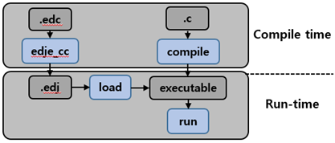

# Overview of Tizen UI Development

This guide gives a brief description of UI structures and demonstrates
how you can develop and design native UI applications with tools.

This documentation has been created based on the mobile profile.

When talking about the development of Tizen native UI applications, you
cannot avoid EFL. Tizen platform uses EFL as a UI framework that
provides both a visual outlook for user applications and significant
performance benefits.

EFL stands for Enlightenment Foundation Libraries. Enlightenment is a
project consisting of Enlightenment window manager, EFL libraries, and
various utilities and applications. Originally, Enlightenment was a
project to build a Window Manager for X11. However, it has grown much
since then. At the moment, it still produces the Window Manager, but it
has evolved to cover mobile, wearable, and TV UI needs (for example, for
Tizen projects) as well as the traditional desktop UI. Although Tizen
adopts EFL as the UI framework, the UI framework and EFL are not the
same thing. Since EFL is mainly a project for the Window Manager, in the
Tizen UI framework, its features are defined for mobile, wearable, and
TV characteristics.

## Benefits of EFL

EFL provides streamlined graphic core libraries that you need to create
powerful applications. EFL has comparatively low memory requirements but
provides high performance, and supports a retained mode graphics system
and user-centric features, such as themes, 2D/3D effects, and
accessibility. In addition, EFL supports various resolutions with the
same layout, fast and small file systems, a variety of programming
language bindings, and separation of UI and logic. Even though the EFL
UI toolkit is used mainly for 2D-based Tizen native applications, it
also supports 2.5D and 3D effects and 3D objects.

An important aspect of EFL is efficiency, both in speed and size:

-   The core EFL libraries, even with Elementary, are about half the
    size of the equivalent "small stack" of GTK+ (used, for example, by
    GNOME), and about one quarter the size of Qt. Of course, with these
    kinds of numbers, you can always argue over what exactly constitutes
    an equivalent measurement.
-   EFL is low on actual memory usage at runtime, with memory footprints
    a fraction the size of those in the GTK+ and Qt environments.
-   EFL is fast, considering what it does. Some libraries claim to be
    very fast - but then, it is easy to be fast when you only handle
    simple and straightforward tasks. EFL is fast, while also tackling
    the more complex rendering problems involving, for example, alpha
    blending, interpolated scaling, and transforms with dithering.

## Key Characteristics of EFL

The key characteristics of EFL explain why Tizen has adopted EFL as its
UI framework:

-   Fast performance
-   Small memory footprint
-   Various back-end engine support
-   UI and logic separation
-   Themeable and scalable
-   Animations
-   Language bindings and hardware acceleration
-   Flexibility

The following sections describe the most important features (fast
performance, and UI and logic separation) in more detail.

### Fast Performance with the Retained-mode Rendering

The main reason Tizen uses EFL is its speed. EFL is highly optimized by
using a scene graph and retained-mode rendering, resulting in EFL being
fast even in software rendering.

A graphics system adopting the retained mode is basically responsible
for responding to all repaint requests for rendering the application
objects. Clients do not directly cause actual rendering, but objects are
redrawn when parts of them are updated. In other words, since EFL (Evas)
works with the retained mode, there is no need to command any drawing.

**Figure: Retained-mode rendering**

### Separation of UI and Logic with Edje

EFL supports EDC files for the UI layout and theme:

-   The EDC file can separate the UI layout (EDC) and logic by having
    the layout description in a plain text file and the logic code in
    the C or C++ source files.
-   The EDC files support themes, which can be changed at runtime
    without restarting the application.
-   UI components are customizable so that each application can create
    its own customized theme to overlay above the default theme, adding
    customized versions of UI components to achieve a specific look
    and feel.

The following figure describes the behavior of the EDC files.

**Figure: EDC file behavior**

## EFL Structure on Tizen

EFL is a collection of libraries that cover a range of functionality
from managing the application life-cycle to rendering graphical objects.
EFL libraries build on top of each other in layers, steadily becoming
higher-level, yet allowing access to lower levels. The higher up you go,
the less you have to do yourself. Elementary is at the top, but you
still access the layers below it for common tasks, as there is no need
for Elementary to wrap things that work perfectly well as-is.

To learn more about each library, go to [Introduction](../../guides/ui/efl/introduction.md).
This section only briefly describes the hierarchical structure of your
application on Tizen.

**Figure: EFL structure**

When you create a basic EFL application, you use the following main
libraries as a basis:

-   Elementary is the topmost library with which you create your
    EFL application. It provides all the functions you need to create a
    window, create simple and complex layouts, manage the life-cycle of
    a view, and add UI components (a full set with, for example,
    buttons, boxes, scrollers, and sliders).
- EFL Core Library consists of several libraries that build on top of
    each other in layers, steadily becoming higher-level, yet allowing
    access to lower levels.

    EFL Core Library provides the following main libraries:

    -   Edje library provides a powerful theme. You can use it to create
        your own UI components and use them in your application. You can
        also extend the default theme.
    -   Ecore library manages the main loop of your application. The
        main loop is one of the most important concepts you need to know
        to develop an application. The main loop is where events are
        handled, and where you interact with the user through the
        callback mechanism.
    -   Evas library is responsible for managing the drawing of
        your content. All graphical objects that you create are
        Evas objects. Evas handles the window state by filling the
        canvas with objects and manipulating their states. In contrast
        to other canvas libraries, such as Cairo, OpenGL&reg;, and XRender,
        Evas is not a drawing library but a scene graph library that
        retains the state of all objects. Evas objects are created and
        then manipulated until they are no longer needed, at which point
        they are deleted. This allows you to work in the same terms that
        a designer thinks in: it is a direct mapping, as opposed to
        having to convert the concepts into drawing commands in the
        right order, and calculate minimum drawing calls needed to get
        the job done.
    -   Eina library is the basis of all the EFL libraries. Eina is a
        toolbox that implements an API for data types in an
        efficient way. It contains all the functions needed to create
        lists and hashes, manage shared strings and open shared
        libraries, and handle errors and memory pools.

## UI Hierarchy Structure

To develop a UI application, you must understand the hierarchy structure
used in EFL.

To manage multiple views with EFL on Tizen applications, create a
naviframe object. The naviframe can contain multiple views, and is a
top-layer object which can help your application to manage and switch
views. If your application has only one view, you do not need the
naviframe.

The following figure illustrates the most popular view hierarchy for
managing multiple views.

**Figure: View hierarchy for multiple views**

-   **Window** is the bottommost UI component holding a canvas object
    for drawing, and represents a block of memory that gets composited
    to the screen.
- **Conformant** shows the virtual keyboard, indicator, softkey, and
    clipboard areas.

    If you do not need those components, you do not need the
    conformant either.

- **Naviframe** is used in applications that show multiple views with
    back and forth transitions between them.

    If you want to manage only 1 view, there is no need to add
    the naviframe.

- **UI Container** (such as grid, table, or box) helps to arrange
    UI components.
- **UI Component** (such as button, background, icon, or image)
    presents the UI layout.

If you want to make a structure for each situation (single and multiple
views), the following figure illustrates a possible structure.

**Figure: UI hierarchy structure**

## Elementary UI Component Library

The EFL Elementary is a set of fast, finger-friendly, scalable, and
themeable UI component libraries. The number of supported UI components
is around 80, including both containers and non-containers. Originally,
the Elementary was developed as part of the Window Manager development
on Desktop devices. For the mobile profile, Tizen reused the proper UI
components and created new ones, and then enhanced and adjusted all of
them for Tizen native applications.

The UI components are mobile-friendly: for example, the naviframe
component supports view-management for multiple views, the entry
component supports many modes (such as password, single/multi-line, and
edit/no-edit), the index component supports quick access to another
group of UI items, and the toolbar component shows a menu when an item
is selected.

The mobile UI components were designed to allow the user to interact
with touch screen-equipped mobile devices. Therefore, when developing
mobile applications, you can easily use them through the mobile-related
infrastructure in company with view management and when reacting to
touch events and the user finger size.

### UI Components

-   **Win** is the root window component that is often used in
    an application. It allows you to create some content in it, and it
    is handled by the window manager.
-   **Conformant** is a container component that accounts for the space
    taken by the indicator, virtual keyboard, and softkey areas.
-   **Naviframe** consists of a stack of views. New views are pushed on
    top of previous ones, and only the topmost view is displayed.
-   **Popup** shows a popup area that can contain a title area, a
    content area, and an action area.
-   **Ctxpopup** is a contextual popup that can show a list of items.
-   **Scroller** holds (and clips) a single object and allows you to
    scroll across it.
-   **Grid** allows objects to be placed at specific positions along a
    fixed grid.
-   **Table** is like a box but with 2 dimensions.
-   **Box** is one of the simplest EFL container components. It allows
    you to arrange the UI components in a specific order, horizontally
    or vertically.
-   **Panes** adds a draggable bar between 2 content sections. The
    sections are resized when the bar is dragged.
-   **Panel** is an animated object that can contain child objects. It
    can be expanded or collapsed by clicking the button on its edge.
-   **List** is a very simple list for managing a small number of items.
    If you need to manage a lot of items, use the genlist
    component instead.
-   **Genlist** displays a scrollable list of items. It can hold a lot
    of items while still being fast and memory-efficient (only the
    visible items are allocated memory).
-   **Toolbar** is a scrollable list of items. It can also show a menu
    when an item is selected. Only one item can be selected at a time.
-   **Multibuttonentry** allows the user to enter text so that the text
    is divided into chunks and managed as a set of buttons.
-   **Gengrid** displays objects on a grid layout and renders only the
    visible objects.
-   **Index** gives you quick access to a group of other UI items.
-   **Flipselector** is a set of text items and a selector that flips up
    or down to change the currently-shown text item.
-   **Background** can be used to set a solid background decoration to a
    window or a container object. It works like an image, but has some
    background-specific properties, such as setting it to a tiled,
    centered, scaled, or stretched mode.
-   **Datetime** can display and input date and time values.
-   **Image** can load and display an image from a file or memory.
-   **Label** displays text with simple HTML-like markup.
-   **Progressbar** can be used to display the progress status of a
    given task.
-   **Layout** is a container component that takes a standard Edje
    design file and wraps it very thinly in a UI component.
-   **Map** displays a map, using the
    [OpenStreetMap](http://www.openstreetmap.org/) provider.
-   **Calendar** displays month views.
-   **Colorselector** provides a color selector. It has different modes,
    each of them showing a different color selection configuration.
-   **Entry** is a box in which the user can enter text.
-   **Spinner** enables the user to increase or decrease a numeric value
    by using arrow buttons.
-   **Slider** is a draggable bar that is used to select a value from a
    range of values.
-   **Button** is a simple push button. It is composed of a label icon
    and an icon object, and has an auto-repeat feature.
-   **Check** toggles a Boolean value between true and false.
-   **Radio** can display 1 or more options, but the user can only
    select one of them. The UI component is composed of an indicator
    (selected/unselected), an optional icon, and an optional label. Even
    though it is usually grouped with 2 or more other radio components,
    it can also be used alone.
