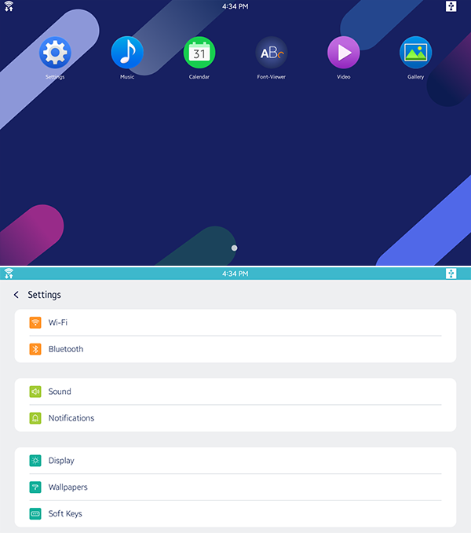

# Get Started for IoT

The Get Started Tutorial teaches you how to create basic Tizen applications for IoT devices.

**Applications using the IoT profile**

## Hardware Setup for IoT Development

To start developing Tizen IoT applications, follow the [Get Started guide](http://tizenschool.org/tutorial/191/) that demonstrates how to set up the Raspberry Pi 3 or 4 board.

## .NET Application

The following guide demonstrates how to create and run a basic Tizen .NET application, which displays some text on the screen with no user interaction:

- [IoT .NET application](../dotnet/get-started/iot/first-app.md)

	An IoT application is targeted to run on an IoT device. The applications can take advantage of a wide variety of functionalities available on IoT devices.

Ensure that you have installed the latest version of [Visual Studio Tools for Tizen](../vstools/install.md).

## Native Service Application

You can create rich applications in C to run on Raspberry Pi with various interfaces to the device hardware.

To begin your Tizen Native Service application development journey, use the following quick start guide:

- [IoT Native Service application](../native/get-started/iot/first-app.md)

    An IoT native service application can be created using the C language and is targeted to run on Raspberry Pi. The application uses the native APIs, which provide various interfaces to the device hardware allowing you to take advantage of numerous capabilities tailored to run with limited device resources.

Ensure that you have installed the latest version of [Tizen Studio](../tizen-studio/index.md).
