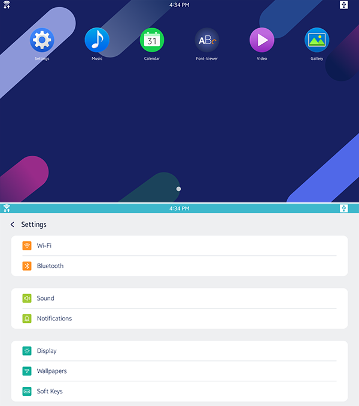

# Get Started for IoT

The Get Started Tutorial teaches you how to create basic Tizen applications for IoT devices.

**Applications using the IoT profile**

## Hardware setup for IoT development

To start developing Tizen IoT applications, follow the [Get Started guide](https://samsung.github.io/TizenSchool/tutorials/191) that demonstrates how to set up the Raspberry Pi 3 or 4 board.

## .NET application

The following guide demonstrates how to create and run a basic Tizen .NET application, which displays some text on the screen with no user interaction:

- IoT .NET application

	An IoT application is targeted to run on an IoT device. The applications can take advantage of a wide variety of functionalities available on IoT devices.

Ensure that you have installed the latest version of [Visual Studio Tools for Tizen](../../sdk-tools/vstools/install.md).

## Native service application

You can create rich applications in C to run on Raspberry Pi with various interfaces to the device hardware.

To begin your Tizen Native service application development journey, use the current VS Code guide:

- [Native application development](../../sdk-tools/vscode-ext/Tizen/native.md)

    Native service applications use C and the Native APIs to access device capabilities.

See the [VS Code Extension for Tizen overview](../../sdk-tools/vscode-ext/overview.md) for setup information.
