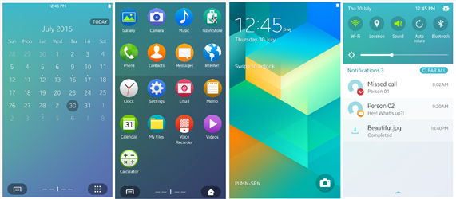

# Get Started with Tizen Mobile Applications

Tizen ecosystem is enhanced with advanced Tizen-based smartphone application development.  
For mobile devices, Tizen supports three primary application types, .NET, Web, and Native applications.

**Applications using the mobile profile**

## .NET Applications
You can create rich applications in C# using the .NET framework benefits that contribute to secure and efficient application development. 

To begin your Tizen .NET application development journey, use the following quick start guide:
-   [Mobile .NET application](../dotnet/get-started/mobile/first-app.md)

Ensure that you have installed the latest version of [Visual Studio Tools for Tizen](https://marketplace.visualstudio.com/items?itemName=tizen.VSToolsforTizen).
	
Explore more about the Tizen mobile .NET application development:
-   [Guides](../dotnet/guides/index.md)
-   [API reference ](../dotnet/api/overview.md)

## Web Applications
You can create rich Web applications that consist of HTML, JavaScript, and CSS that are combined in a package. 

To begin your Tizen Web application development journey, use the following quick start guide:
-   [Mobile Web application](../web/get-started/mobile/first-app.md)

Ensure that you have installed the latest version of [Tizen Studio](https://developer.tizen.org/development/tizen-studio/download).

Explore more about the Tizen mobile Web application development:
-   [Tutorials](../web/tutorials/overview.md)
-   [Guides](../web/guides/index.md)
-   [API reference](../web/api/index.md) 

## Native Applications
You can create rich applications in C with device-specific features, advanced system settings, and additional functionalities.

To begin your Tizen Native application development journey, use the following quick start guide:
-   [Mobile Native application](../native/get-started/mobile/first-app.md)

Ensure that you have installed the latest version of [Tizen Studio](https://developer.tizen.org/development/tizen-studio/download).

Explore more about the Tizen mobile Native application development:
-   [Tutorials](../native/tutorials/overview.md)
-   [Guides](../native/guides/index.md)
-   [API reference](../native/api/overview.md)

