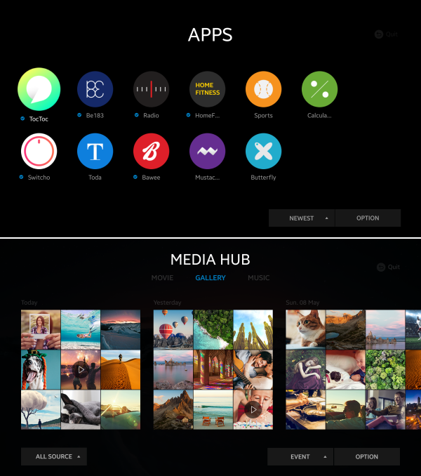

# Get Started with Tizen TV Applications
Tizen combines best TV features with a robust development environment to enhance the smart TV application development.
For TV, Tizen supports two primary application types, .NET and Web applications.

**Applications using the TV profile**

## .NET Applications
You can create rich applications in C# using the .NET framework benefits that contribute to secure and efficient application development.

To begin your Tizen .NET application development journey, use the following quick start guide:
-   [TV .NET application](../dotnet/get-started/tv/first-app.md)

Ensure that you have installed the latest version of [Visual Studio Tools for Tizen](https://marketplace.visualstudio.com/items?itemName=tizen.VSToolsforTizen).

Explore more about the Tizen TV .NET application development:
-   [Guides](../dotnet/guides/index.md)
-   [API reference ](../dotnet/api/overview.md)

## Web Applications
You can create rich Web applications that consist of HTML, JavaScript, and CSS that are combined in a package.

To begin your Tizen Web application development journey, use the following quick start guides:
-   [TV Web application](../web/get-started/tv/first-app.md)
-   [Samsung Smart TV Web application](../web/get-started/tv/first-samsung-tv-app.md)

Ensure that you have installed the latest version of [Tizen Studio](https://developer.tizen.org/development/tizen-studio/download).

Explore more about the Tizen TV Web application development:
-   [Tutorials](../web/tutorials/overview.md)
-   [Guides](../web/guides/index.md)
-   [API reference](../web/api/index.md)

