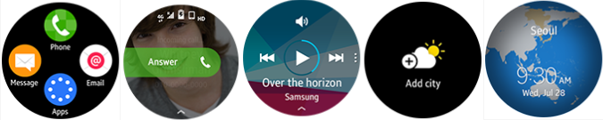

# Get Started with Tizen Wearable Applications
Tizen targets to provide a robust development environment to explore the future of innovative smart wearable application development.
For wearable devices, Tizen supports three primary application types, .NET, Web, and Native applications.

**Applications using the wearable profile**

## .NET Applications
You can create rich applications in C# using the .NET framework benefits that contribute to secure and efficient application development.

To begin your Tizen .NET application development journey, use the following quick start guides:
-   [Wearable .NET application](../dotnet/get-started/wearable/first-app.md)
-   [Wearable XAML application](../dotnet/get-started/wearable/first-xaml-app.md)

Ensure that you have installed the latest version of [Visual Studio Tools for Tizen](https://marketplace.visualstudio.com/items?itemName=tizen.VSToolsforTizen).

Explore more about the Tizen wearable .NET application development:
-   [Guides](../dotnet/guides/index.md)
-   [API reference](../dotnet/api/overview.md)

## Web Applications
You can create rich Web applications that consist of HTML, JavaScript, and CSS that are combined in a package.

To begin your Tizen Web application development journey, use the following quick start guides:
-   [Wearable Web application](../web/get-started/wearable/first-app.md)
-   [Wearable Web watch application](../web/get-started/wearable-watch/first-app-watch.md)
-   [Wearable Web widget application](../web/get-started/wearable-widget/first-app-widget.md)

Ensure that you have installed the latest version of [Tizen Studio](https://developer.tizen.org/development/tizen-studio/download).

Explore more about the Tizen wearable Web application development:
-   [Tutorials](../web/tutorials/overview.md)
-   [Guides](../web/guides/index.md)
-   [API reference](../web/api/index.md)

## Native Applications
You can create rich applications in C with device-specific features, advanced system settings, and additional functionalities.

To begin your Tizen Native application development journey, use the following quick start guides:
-   [Wearable Native application](../native/get-started/wearable/first-app.md)
-   [Wearable Native watch application](../native/get-started/wearable-watch/first-app-watch.md)
-   [Wearable Native widget application](../native/get-started/wearable-widget/first-app-widget.md)

Ensure that you have installed the latest version of [Tizen Studio](https://developer.tizen.org/development/tizen-studio/download).

Explore more about the Tizen wearable Native application development:
-   [Tutorials](../native/tutorials/overview.md)
-   [Guides](../native/guides/index.md)
-   [API reference](../native/api/overview.md)

