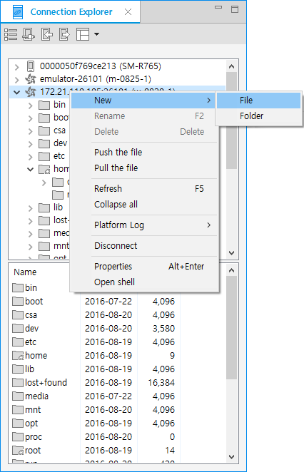

# Managing and Connecting Devices for Testing

The **Connection Explorer** view shows the devices connected to the system. A list of connected devices is available in tree view after connecting a device or launching a Tizen emulator. The **Connection Explorer** view provides the following actions for the connected devices:

- Show a list of connected devices and connect devices for running and debugging the application.
- Provide file operations on connected devices.
- Send or receive files between the **Project Explorer** and **Connection Explorer** views by dragging and dropping.
- Explore the file system on the connected devices.
- Launch the Emulator Manager to handle multiple emulator instances.

**Figure: Connection Explorer view**

## Running and Debugging the Application with Devices

You can test Tizen applications with connected devices in the following ways:

- Testing applications on a physical device connected to the host system:

  1. Connect your device to the host system with a USB cable. The device icon () is displayed in the **Connection Explorer** view.
  2. Select the device in the **Connection Explorer** view. It is ready to be run and used to test your project.

- Testing applications on an emulator that emulates a real device as a software component installed on the host computer

  To start the emulator:

  1. Click the Emulator Manager icon in the **Connection Explorer** view toolbar, select an emulator in the Emulator Manager, and click **Launch**.The emulator icon () is displayed in the **Connection Explorer** view after the emulator boots successfully.
  2. Select the emulator device in the **Connection Explorer** view. It is ready to be run and used to test your project.

- Testing applications on a remote device

  To connect to the remote device:

  1. In the **Connection Explorer** view toolbar, click the Remote Device Manager icon ().When the Remote Device Manager is launched, it automatically starts to scan for nearby remote devices:If a remote device exists on the host system's subnet, the remote device information is registered to the Remote Device Manager automatically.To add remote device information, click **New**.In the dialog box, enter the **Name**, **IP**, and **Port** of the remote device.To modify the remote device information later, select the device in the Remote Device Manager, click **Edit**, and modify the **Name**, **IP**, and **Port** in the dialog box.
  2. In the Remote Device Manager, select a remote device.
  3. Click **Connect**.
  4. In the **Connection Explorer** view, select the device. It is ready to be run and used to test your project.

  When testing is finished, disconnect the remote device by selecting the device in the Remote Device Manager and clicking **Disconnect**. To remove the remote device from the Remote Device Manager, select the device in the Remote Device Manager and click **Delete**.

## Transferring Files to Devices

You can transfer files between the connected devices and the host system:

- To transfer a file from a connected device to the host file system, pull the selected file to the desired host system path.
- To transfer a file from the host file system to a connected device, push the selected file to the desired connected device path.

## Configuring Preferences

You can set the following preferences for the **Connection Explorer** view:

- Change the Emulator Manager path
- Set the file transfer timeout value

To see the preferences, go to **Window > Preferences > Tizen Studio > Tools > Connection Explorer**.

## Related information
* Dependencies
 - Tizen Studio 1.0 and Higher
