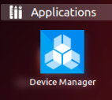
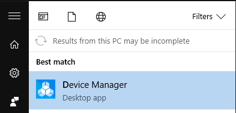
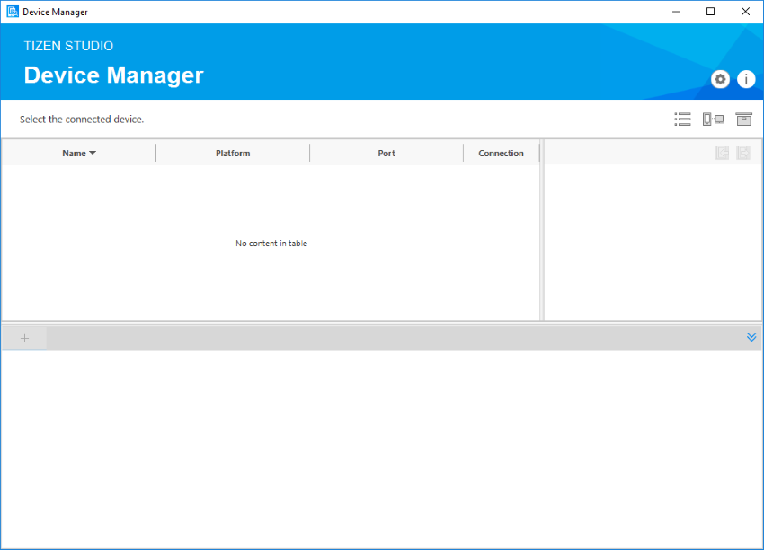
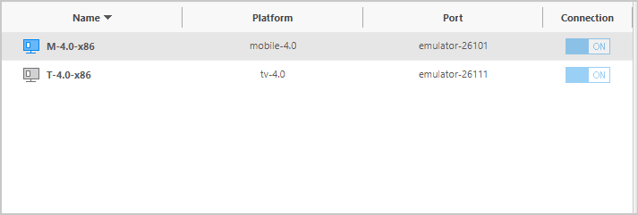
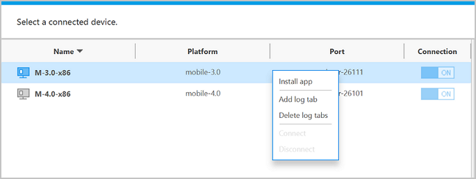
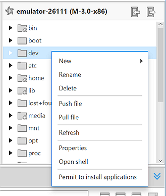
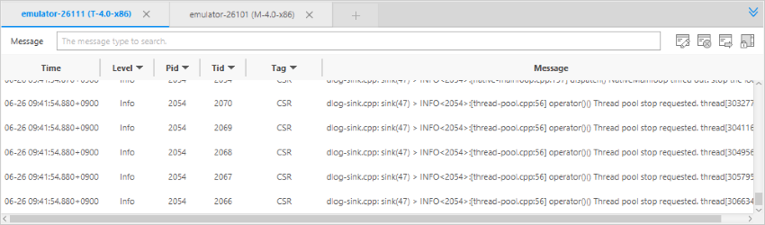
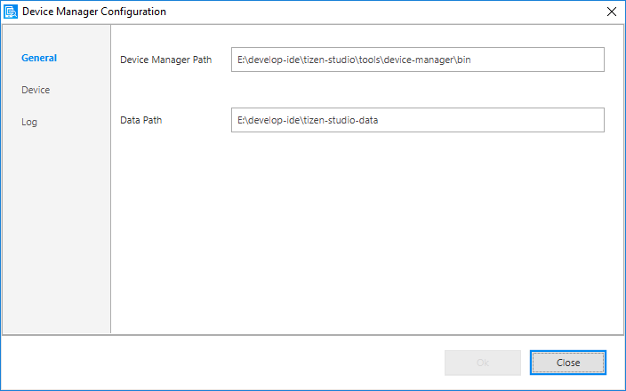

Monitoring Devices with the Device Manager
==========================================

The Device Manager is a standalone tool that manages devices and allows you to access their internal file systems and logs. A device can be either a virtual device, such as an emulator, or a physical device connected with a USB cable or a wireless connection.

The Device Manager provides a graphical user interface that is more convenient than the CLI (Command Line Interface). You can use it to connect and disconnect devices to and from your computer, as well as to access devices' internal file systems and push or pull files between the device and your computer. The Device Manager provides the device logs in a table format, and you can use filters to find the entries that interest you.

To use the Device Manager with a specific device, you must connect the device over SDB (Smart Development Bridge). Physical devices can be connected with a USB cable, and emulators can be connected through the Emulator Manager. When the device is connected over SDB, it is automatically displayed in the Device Manager and its directory structure and logs are shown in the **File Explorer** and **Log** views, respectively.

> **Note**  
> If you do not have the Device Manager installed, open the [Package Manager](../setup/update-sdk.md), go to the **Main SDK** tab, and locate the **Device Manager** under **Tizen SDK Tools > Baseline SDK**. To install the tool, click **Install**.

## Accessing Device Manager

-   There are 2 different ways to access the Device Manager:

    - Click the Device Manager icon on the desktop or in the **Start** menu.

      | Ubuntu                                   | Windows&reg;                                 | macOS                                    |
      |----------------------------------------|----------------------------------------|----------------------------------------|
      | **Desktop > Applications > Device Manager:** | **Start > All Programs > Tizen Studio > Tools > Device Manager:** | **Finder > Applications > Tizen Studio > Device Manager:** |

    - Run the Device Manager from the command line.

      | Ubuntu                                   | Windows&reg;                                 | macOS                                    |
      |----------------------------------------|----------------------------------------|----------------------------------------|
      | `<TIZEN_STUDIO>/tools/device-manager/bin/device-manager` | `<TIZEN_STUDIO>\tools\device-manager\bin\device-manager.exe` | `<TIZEN_STUDIO>/tools/device-manager/bin/device-manager.app/Contents/MacOS/device-manager` |

    If the program is executed normally, the Device Manager main screen appears.

**Figure: Device Manager main screen**

## Connecting Devices

The Device Manager shows both local devices connected to the system and any configured remote devices:

-   Only connected local devices (both physical and virtual devices) are listed. Disconnected devices automatically disappear from the list. Therefore, the **Connection** switch is disabled.
-   Remote devices are listed even if the connection is lost. You can turn the connection on and off with the **Connection** switch.

**Figure: Connected devices in the Device Manager**

Connecting a device to a computer depends on the device type:

-   Physical device

    When you connect a local physical device with a USB cable, it automatically appears in the Device Manager.

- Virtual device

    To connect a virtual device, click the **Emulator Manager** button (), select the virtual device, and click **Launch**.

    When the emulator finishes booting, the device appears in the Device Manager.

- Remote device

    To connect a remote device:

    1.  Launch the Remote Device Manager by clicking the **Remote Device Manager** button ().
    2. Click **Scan Devices** to display a list of devices you can connect to.
    3. Confirm the IP and port of the remote device and change the **Connection** switch to **ON**.

        When the connection is established, the remote device appears in the Device Manager.

## Installing Applications

You can install a Tizen application to a connected device with the TPK or WGT file:

1.  In the device list, right-click the device to which you want to install an application, and select **Install app**.
2. In a file dialog, select a TPK or WGT file to install and click **OK**.

    The application is installed and launched on the selected device.

**Figure: Context menu for connected devices**

## Permitting Devices to Install Applications

If your device has a distributor certificate that contains a DUID starting with 1.0\#, you must give the device permission to install applications.

Assume that you have registered 2 devices, the Gear S2 and Gear S, in your distributor certificate. The Gear S2 DUID starts with 2.0\# and the Gear S DUID starts with 1.0\#. This means that the certificate format is issued internally based on the 1.0\# device, and both Gear S2 and Gear S devices must get permission before installing an application.

To permit a device to install applications:

1.  In the device list, select the device for which you want to give permission.
2. In the **File Explorer** view, right-click anywhere and select **Permit to install applications**.

    A `device-profile.xml` file, issued in your profile directory, is pushed to the `/home/developer` directory of the device.

**Figure: Context menu for the File Explorer view**

A distributor certificate containing only \#2.0 devices does not have the `device-profile.xml` file, and consequently does not require this process to push the file to the device.

## Managing Device Files

You can browse the internal file structure of a connected device in the **File Explorer** view. Depending on your permissions, you can create and delete files on the device, and pull and push files between the device and your computer.

All files are granted read, write, and execute permissions and they cannot be arbitrarily changed.

You can perform a variety of actions through the **File Explorer** view:

-   To check the read, write, and execute permissions for a file or folder, right-click the file or folder and select **Properties &gt; Permission**.
-   To create a new file or folder, right-click the directory where you want to create it, and select **New &gt; File** or **New &gt; Folder**. Name the new item and click **OK**.
-   To remove a file or folder, right-click the item you want to delete, select **Delete**, and click **OK**.
-   To push a file from the computer to the device, right-click the directory where you want to push the file and select **Push the file**. In the popup, select the file to push and click **OK**.
-   To pull a file from the device to the computer, right-click the file you want to pull and select **Pull the file**. In the popup, select the destination directory on the computer and click **OK**.

> **Note**  
> To create or remove a file, the folder must have `Write` permission set for the `Other` user.

## Viewing Device Logs

When a device is connected to the Device Manager, a device log tab is automatically created in the **Log** view. The default tab name is the device ID, but it can be modified. You can create additional tabs for a device, and you can set different filters for each tab. Tabs for disconnected devices are shown as inactive, and are reactivated when the device is reconnected.

**Figure: Log view**

Each log tab contains a toolbar and a log table. The log table lists log messages in chronological order, and this order cannot be modified. Each log message contains the **Time**, **Level** (priority level of the log message), **Pid** (process ID), **Tid** (thread ID), **Tag** (identification of the log message source), and **Message** fields, and you can create filters for each field.

You can perform a variety of actions in the **Log** view:

-   Creating a new log tab

    You can create a new log tab in 2 ways:

    -   Right-click a device in the Device Manager and select **Add log tab**. Enter a name for the tab and click **OK**.
    -   Select a device in the Device Manager and click **+** in the **Log** view. Enter a name for the tab and click **OK**.

- Editing a log tab name

    To edit the log tab name, click the **Edit Tab** button (). Enter a new name for the tab and click **OK**.

- Removing a log tab

    You can either delete a single tab, or delete all tabs related to a device:

    -   To delete a single tab, click the **X** next to the name of the log tab.
    -   To delete all tabs for a device, right-click it in the Device Manager and select **Delete log tabs**. Confirm the deletion by clicking **OK**.

    > **Note**  
	> Any filters created for a log tab are deleted when the tab is removed.

- Filtering log messages

    You can filter log messages based on the table columns:

    -   To filter log messages based on the **Level**, **Pid**, **Tid**, or **Tag** columns, click the  icon next to the column name, select 1 or more values you want to show, and click **OK**.
    -   To filter log messages based on the **Message** column, enter the string you want to search for in the **Message** field at the top of the **Log** view.

- Clearing logs

    To clear all log messages from a tab, click the **Clear Logs** button ().

- Exporting logs

    To export logs to a file, click the **Export Logs** button (), select the file storage location and file name for the exported log, and click **OK**.

   > **Note**  
   > If you have filters applied to a log tab, only messages that match those filters are exported. If you want to export the complete log, remove all filters before exporting.

## Configuring Device Manager

You can access the Device Manager Configuration window by clicking the **Settings** icon.

**Figure: Device Manager Configuration**

You can set the following settings for the Device Manager:

-   Application path

    To set the application installation path and data storage location, select the **General** tab, change the directory paths, and click **OK**.

- File transfer timeout

    This is the maximum wait time for push and pull operations in the **File Explorer** view. To set the timeout value, select the **Device** tab, change the value, and click **OK**.

    > **Note**  
    > Only values between 30 000 and 600 000 (milliseconds) are allowed.

- Log buffer size

    This is the maximum amount of log entries to store in the log table. To set the buffer size, select the **Log** tab, change the value, and click **OK**.

    > **Note**  
    > Only values between 5 000 and 100 000 (lines) are allowed.

## Related Information
* Dependencies    
    - Tizen Studio 2.0 and Higher
