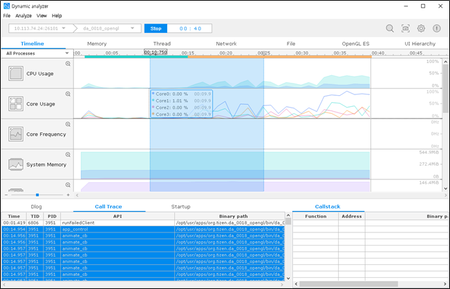
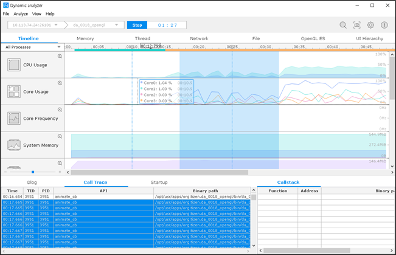
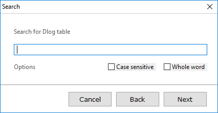
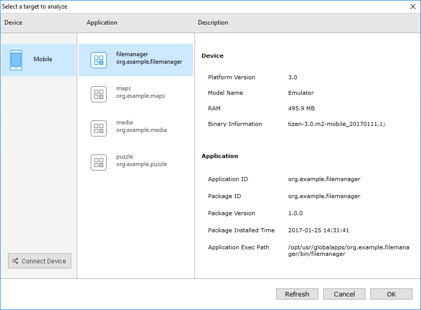
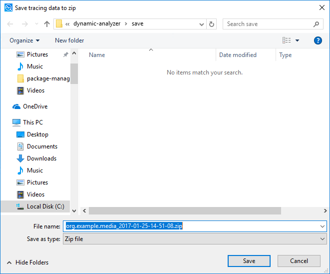
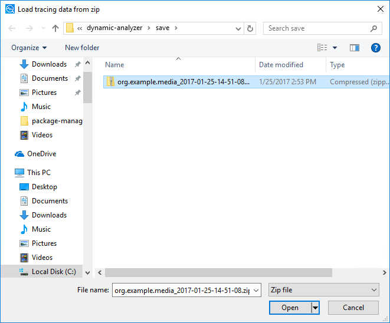
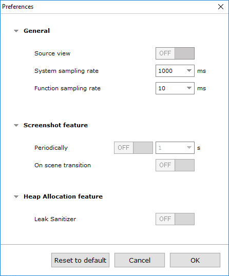

# Handling Advanced Dynamic Analyzer Tasks

This topic explains some additional functionality of the Dynamic Analyzer.

## Range Inspection

You can analyze specific ranges using markers or drag and drop operations.

<a name="marker"></a>
### Range Inspection with Markers

You can create markers at specific times and analyze the time between the markers:

1. Create the markers by double-clicking a chart or detail table view that has a timestamp.

2. Right-click between the markers, and select **Select range**.

   The table data is updated based on the range inspection results.

**Figure: Range inspection with markers**



You can create as many markers as you want, and can move the marker by dragging and dropping with a mouse. To delete a marker, double-click it.

### Range Inspection with Drag and Drop

If you drag and drop on a chart view, a range is set and the table data is updated based on the range inspection results.

**Figure: Range inspection with drag and drop**



The drag and drop action creates a temporary range. If you click another area on the chart view, the range selection is removed.

## Search Dialog

You can search for a specific keyword in the detail table view, and the search result is highlighted by color.

You can set some search parameters:

- **Case sensitive:** Case-sensitive matching
- **Whole word:** Whole word matching

**Figure: Search dialog**



## Target Dialog

You can check the connected target information in the target dialog:

- **Device:** Device type of the connected target (Mobile/Wearable/TV)
- **Application:** List of applications that can be analyzed in the connected target
- **Description:** Detail information about the connected target:
  - **Platform Version**
  - **Model Name**
  - **RAM**
  - **Binary Information**
  - **Application ID**
  - **Package ID**
  - **Package Version**
  - **Package Installed Time**
  - **Application Exec Path**

  **Figure: Target dialog**

  

## Data Load and Save Dialogs

You can save the tracing result into a file and load it later for analysis:

- You can save the analysis result to a ZIP file.

  **Figure: Saving data**

  

- You can load the analysis result from the ZIP file. After loading, the chart and table data are updated from the loaded data.

  **Figure: Loading data**

  

## Preference Dialog

To adjust the Dynamic Analyzer functions during a trace, you can open the preference dialog by clicking the **Preference** button on the toolbar.

The preference dialog contains the following settings:

- **General**
  - **Source view:** Enable the source view option that opens the source view in the detail table view.
  - **System sampling rate:** Define the system sampling rate.
  - **Function sampling rate:** Define the function sampling rate.
- **Screenshot feature**
  - **Periodically:** Enable screenshot captures periodically and set the time between captures in seconds.
  - **On scene transition:** Enable screenshot captures on scene transitions.
- **Heap Allocation feature**
  - **Leak Sanitizer:** Enable the Leak Sanitizer analysis to detect memory leaks in the application.

**Figure: Preference dialog**



## Keyboard Shortcuts

You can trigger some major analysis functions with keyboard shortcuts.

**Table: Keyboard shortcuts**
<table>
	<thead>
		<tr>
			<th colspan="3" rowspan="2">Command</th>
			<th colspan="2">Shortcut</th>
		</tr>
		<tr>
			<th>Windows&reg;</th>
			<th>macOS</th>
		</tr>
	</thead>
	<tbody>
		<tr>
			<td rowspan="4">File</td>
			<td colspan="2">New</td>
			<td><strong>Ctrl + N</strong></td>
			<td><strong>Command + N</strong></td>
		</tr>
		<tr>
			<td colspan="2">Load</td>
			<td><strong>Ctrl + O</strong></td>
			<td><strong>Command + O</strong></td>
		</tr>
		<tr>
			<td colspan="2">Save</td>
			<td><strong>Ctrl + S</strong></td>
			<td><strong>Command + S</strong></td>
		</tr>
		<tr>
			<td colspan="2">Exit</td>
			<td><strong>Ctrl + Q</strong></td>
			<td><strong>Command + Q</strong></td>
		</tr>
		<tr>
			<td rowspan="12">Analyze</td>
			<td colspan="2">Start or stop trace</td>
			<td><strong>F5</strong></td>
			<td><strong>Fn + F5</strong></td>
		</tr>
		<tr>
			<td colspan="2">Search</td>
			<td><strong>Ctrl + F</strong></td>
			<td><strong>Command + F</strong></td>
		</tr>
		<tr>
			<td colspan="2">Target</td>
			<td><strong>Ctrl + T</strong></td>
			<td><strong>Command + T</strong></td>
		</tr>
		<tr>
			<td colspan="2">Screenshot</td>
			<td><strong>F9</strong></td>
			<td><strong>Fn + F9</strong></td>
		</tr>
		<tr>
			<td colspan="2">Preferences</td>
			<td><strong>F10</strong></td>
			<td><strong>Fn + F10</strong></td>
		</tr>
		<tr>
			<td colspan="2">Detail</td>
			<td><strong>Ctrl + H</strong></td>
			<td><strong>Command + H</strong></td>
		</tr>
		<tr>
			<td rowspan="6">Navigate</td>
			<td>Zoom in</td>
			<td><strong>W</strong></td>
			<td><strong>W</strong></td>
		</tr>
		<tr>
			<td>Zoom out</td>
			<td><strong>S</strong></td>
			<td><strong>S</strong></td>
		</tr>
		<tr>
			<td>Move left</td>
			<td><strong>A</strong></td>
			<td><strong>A</strong></td>
		</tr>
		<tr>
			<td>Move right</td>
			<td><strong>D</strong></td>
			<td><strong>D</strong></td>
		</tr>
		<tr>
			<td>Move first</td>
			<td><strong>Q</strong></td>
			<td><strong>Q</strong></td>
		</tr>
		<tr>
			<td>Move end</td>
			<td><strong>E</strong></td>
			<td><strong>E</strong></td>
		</tr>
		<tr>
			<td>Help</td>
			<td colspan="2">How to use Dynamic Analyzer</td>
			<td><strong>F1</strong></td>
			<td><strong>Fn + F1</strong></td>
		</tr>
	</tbody>
</table>

## Table Data Copying and Export

To copy or export data in TSV (Tab Separated Values) format from a table in the Dynamic Analyzer:

1. Select the data you want to copy or export.

2. Right-click the selection and select:
   - **Copy** to copy the selected data to the clipboard.  
     You can also copy using the **Ctrl + C** or **Ctrl + Insert** keyboard shortcuts.

   - **Export to file** to export the selected data to a TSV file.  
     You can define a file location for the exported data.

## Command Line Interface

You can use the command line interface (CLI) with the Dynamic Analyzer. You can collect tracing data from your application from a target device and later open it in the Dynamic Analyzer GUI (graphical interface) for analysis.

To launch tracing, you must know the target device name (or IP address) and your application identifier, and you must specify the profiling features to be enabled.

To view the CLI help, run the `./dacli.jar -h` command:

```
Usage: dacli.jar <command> [options...]
List of commands:
    devices : show list of connected devices and emulators
        -u                           show list of devices where tracing is running

    apps <ip:port|serial> : show list of applications of specified target

    start <ip:port|serial> : start tracing on specified target for specified
                             application using selected tracing features
        -a <application identifier>  identifier of application to trace
        -o <output filename>         redirect tracing output to file
        -C,--cpu-usage <arg>         select cpu usage tracing
                                     Possible arguments: usage, core, frequency, all
                                     If no arguments provided - 'all' is selected
        -M,--memory <arg>            select memory tracing
                                     Possible arguments: system, process, heap, all
                                     If no arguments provided - 'process,system' is selected
        -F,--file <arg>              select file tracing
                                     Possible arguments: io, analysis, all
                                     If no arguments provided - 'all' is selected
        -G,--graphics <arg>          select graphics tracing
                                     Possible arguments: opengl, all
                                     If no arguments provided - 'all' is selected
        -N,--network <arg>           select network tracing
                                     Possible arguments: io, analysis, all
                                     If no arguments provided - 'all' is selected
        -T,--thread-analysis         select thread analysis tracing
        -U,--ui-event                select ui event tracing
        -P,--peripheral-status       select peripheral status tracing
        -E,--power-estimation        select power estimation tracing
        -S <period>                  enable screenshots capturing periodically
        -s,                          enable screenshots capturing on scene transition
        -L,--leak-sanitizer          select LeakSanitizer analysis tracing
                                     Works only if 'heap' memory tracing is selected and does not work
                                     with thread analysis tracing

    stop <ip:port|serial> : stop currently running tracing process on specified device

    version : print information about version
```

### Environment Setup

The CLI tool requires Java VM installed on your computer. The minimum supported version is Java VM 1.7.

You can launch the `dacli.jar` file from the Dynamic Analyzer installation directory by using the `./dacli.jar` command. To make launching easier, add the directory to your `PATH` variable. For example, use the following command on Ubuntu:

```
export PATH=$PATH:<path-to-tizen-studio>/tools/dynamic-analyzer/
```

> [!NOTE]  
> If you have trouble with the execution, you can try one of the following:
>
> - Grant execution permissions to the `dacli.jar` file:
>
>   `chmod +x dacli.jar`
>
> - Use the following command to launch the Dynamic Analyzer CLI tool:
>
>   `java -jar dacli.jar`

### Useful Commands

The following commands are the most useful when controlling the Dynamic Analyzer with the CLI:

- `devices`

  The command shows a list of connected devices. If you specify the `-u` option, only the devices where tracing is already launched through the CLI are listed.

  Command syntax:
  ```
  devices [-u]
  ```

  For example:
  ```
  $ ./dacli.jar devices
  List of connected devices:
	  <Device Name> <Serial Number>
      m-0818-1      emulator-26101
  ```

  Take note of the device serial number. It is used to specify the device in other Dynamic Analyzer CLI commands.

- `apps`

  The command shows a list of installed applications on a specified device.

  Command syntax:
  ```
  apps <ip:port|serial>
  ```
  For example:
  ```
  $ ./dacli.jar apps emulator-26101
  List of installed applications:
    <Application ID>               : <Package ID>             : <Application Name>
    org.tizen.camera-app           : org.tizen.camera-app     : Camera
    org.tizen.calendar             : org.tizen.calendar       : Calendar
    org.tizen.contacts             : org.tizen.contacts       : Contacts
    org.tizen.gallery              : org.tizen.gallery        : Gallery
    org.tizen.browser              : org.tizen.browser        : Internet
  ```
  Take note of your application identifier. It is used to specify the application in other Dynamic Analyzer CLI commands. If you cannot find your application, make sure it has been installed (for example, from Tizen Studio). The application ID can differ from the package ID.

- `start`

  The command starts tracing your application on the specified device. In addition, you must specify at least 1 profiling feature to be enabled.

  Command syntax:
  ```
  start <ip:port|serial> -a <application identifier> <features> [options...]
  ```
  For example, you can specify the `-C` option to enable all CPU profiling features. You can see a list of all available features in the command help message.

  The following command starts the Camera application on the emulator-26101 device with the CPU profiling features enabled:
  ```
  $ ./dacli.jar start emulator-26101 -a org.tizen.camera-app -C
  DA tracing started.
  Run "dacli stop emulator-26101" to finish it.
  ```
  You can specify the `-o` option to customize the tracing result location.

- `stop`

  The command stops the active tracing process on a specified device.

  Command syntax:
  ```
  stop <ip:port|serial>
  ```
  For example:
  ```
  $ ./dacli.jar stop emulator-26101
  DA tracing finished.
  Total time:   1m 37.777s
  Tracing time: 1m 29.362s
  Output:       /home/eclipse/tizen-sdk-data/dynamic-analyzer/save/org.tizen.camera-app_2016-08-18-16-51-53.zip
  ```
  In the command output:
  - **Total time** is the time required to perform all the tracing activities: connection, command communication, data interchange, and activity finalization.
  - **Tracing time** is the pure tracing time: from the beginning to the end of your program.
  - **Output** is the location where the tracing result is stored: it can be opened for further analysis in the Dynamic Analyzer GUI.

- `version`

  The command displays information about the Dynamic Analyzer, including its version, build time, and useful links.

  Command syntax:
  ```
  version
  ```
  For example:
  ```
  $ ./dacli.jar version
  DA Version      2.4.4
  Build Time      20161213-0258
  Tizen Site      http://www.tizen.org
  Release Note    https://developer.tizen.org/development/tizen-studio/download/release-notes
  ```
  In the command output:
  - **DA Version** is the version of the Dynamic Analyzer.
  - **Build Time** is the build timestamp.
  - **Tizen Site** is the link to the Tizen Web site.
  - **Release Note** is the link to the Tizen Studio Release Notes.
  

## Related Information
* Dependencies
  - Tizen Studio 1.0 and Higher
