# Handling Common Dynamic Analyzer Tasks

The common tasks in the Dynamic Analyzer show how you can launch the Dynamic Analyzer and understand its user interface. Once you have installed your application on the emulator or Tizen device, you are ready to run the Dynamic Analyzer.

**Figure: Dynamic Analyzer icon**

## Dynamic Analyzer Launch

You can launch the Dynamic Analyzer in the **Project Explorer** view or from the Tizen Studio sub-menu:

- **In the Project Explorer view:**
  - Right-click the project in the **Project Explorer** view and select **Profile As > Profile with Dynamic Analyzer**
- **From Tizen Studio sub-menu:**
  - Windows&reg;: **Startup > Tizen Studio > Tools > Dynamic Analyzer**
  - Ubuntu: **Applications > Dynamic Analyzer**
  - macOS: **Launchpad > Dynamic Analyzer**

After the Dynamic Analyzer startup, select the profiling target and applicable features in the feature dialog. The selected features are listed in the **Selected Features** pane. If a feature has additional settings, you can access them from the gear icon next to the feature name in the **Selected Features** pane. When you are ready, click **OK** and the Dynamic Analyzer main UI opens.

**Figure: Feature selection dialog**

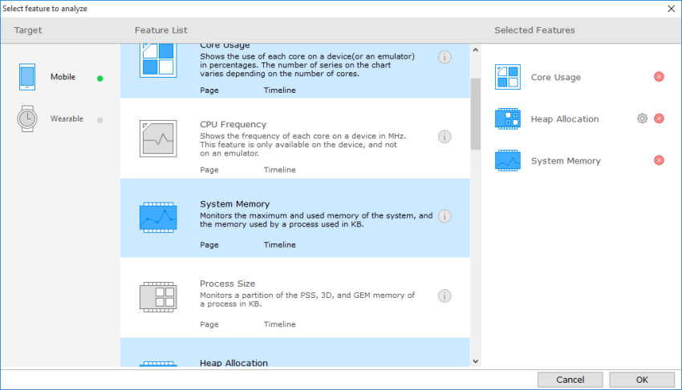

## Main UI

The Dynamic Analyzer main UI consists of the following components:

1. Menu bar
2. Toolbar
3. Page tabs
4. Chart view
5. Detail table view

**Figure: Main UI**

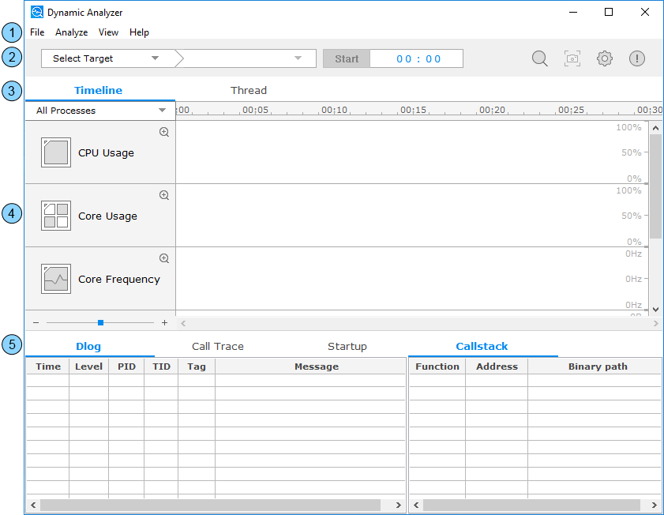

### Menu Bar

You can trigger analysis functions in the menu bar:

- **File**
  - **New**: Reset the analysis result and show the feature selection dialog for a new analysis.
  - **Save**: Save the analysis result to a file.
  - **Load**: Load a saved analysis result.
  - **Exit**: Terminate the Dynamic Analyzer.
- **Analyze**
  - **Search**: Search for a specific keyword in the detail table view.
  - **Target**: Open the target dialog to check the connected target information.
  - **Screenshot**: Take a snapshot of the target screen and handle the result in the screenshot dialog.
  - **Preference**: Open the preference dialog to edit the analysis settings.
- **View**
  - **Detail**: Hide the detail table view and maximize the chart view by clearing the checkbox.
  - **Report**: Add a table containing specific information to the detail table view by selecting the applicable checkboxes:
    - **Function Profiling**: L, Function name, CPU time, CPU rate, Elapsed time, Call count
    - **Failed API**: Time, API, Parameter, Return, Error code, Error description, PID
    - **Warning**: Category, PID, Warning message
  - **Navigate**: Zoom in and out and move the vertical scrollbar to left, right, first, or end.
- **Help**
  - **How to use Dynamic Analyzer**: Connect to the Dynamic Analyzer user guide webpage.
  - **Bug Report**: Connect to the Dynamic Analyzer bug report webpage.
  - **About**: Open the about dialog to check the Dynamic Analyzer version.

### Toolbar

You can trigger some major analysis functions from the toolbar:

**Figure: Toolbar**

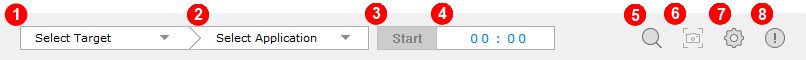

1. Target combo: Select the target device.
2. Application combo: Select the target application.
3. Start/Stop trace button: Start or stop the trace.
4. Trace timer: View the tracing time.
5. Search button: Open the search dialog to search for a specific keyword in the detail table view.
6. Screenshot button: Take a snapshot of the target screen and handle the result in the screenshot dialog.
7. Preference button: Open the preference dialog to edit analysis settings.
8. About button: Open the about dialog to check the Dynamic Analyzer version.

### Page Tabs

The Dynamic Analyzer separates the detailed features into various page tags. Most traces are done with the **Timeline** tab. However, there are separate tabs, for example, for memory allocation, OpenGL, and thread synchronization analyses.

### Chart View

Each feature has a chart that displays the analysis results. The charts are represented in various forms, such as areas, lines, bars, and points.

The charts have the following parts:

1. Chart: View the analysis data in various forms.
2. Process combo: Select a process among multiple processes in an application.
3. Timeline: View the timestamp of the pointed area.
4. App life-cycle bar: View the life-cycle of the application.
5. Zoom bar: Set a scale for the chart view.

**Figure: Chart view**

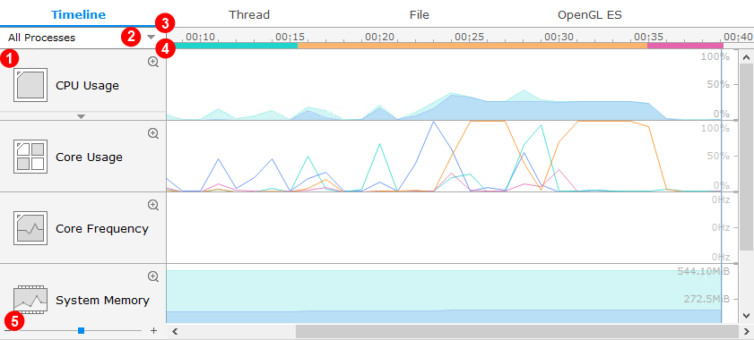

### Detail Table View

The chart view shows the general analysis results. For more detailed data, use the detail table view.

#### Dlog Table

The Dlog table shows the content of all the Tizen Dlog logs generated during tracing. The table contains the following columns:

- **Time**: Timestamp
- **Level**: Dlog level (**D** - Debug, **W** - Warnings, **E** - Error, **I** - Info)
- **PID**: Process ID that generates a log
- **TID**: Thread ID that generates a log
- **Tag**: Dlog tag, which the application used
- **Message**: Dlog message

**Figure: Dlog table**

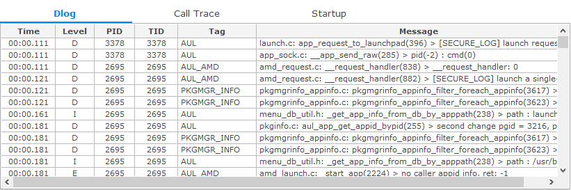

#### Call Trace Table

The Call Trace table shows the user method callstack that occurs during application execution.

When you select a list item:

- The call time is shown in the **Timeline** view. If you select multiple calls, the call time range is shown.
- If you select a single call, the status and image are shown in the **Snapshot** view.
- The callstack of the chosen API is shown in the **Callstack** view.

The Call Trace table can occasionally show methods that you have not defined in the application. If an application class inherits a super class and does not declare the constructor of the super class, the compiler automatically generates the default constructor code in the application binary.

The Call Trace table contains the following columns:

- **Time**: Timestamp (calling time of the API)
- **TID**: Thread ID
- **PID**: Process ID
- **API**: Name of the called function
- **Binary path**: Path of binary

**Figure: Call Trace table**

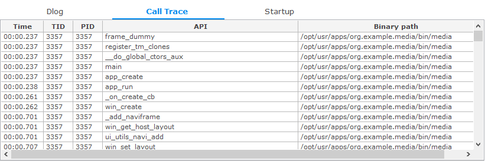

> **Note**  
> If your application is built by setting the optimization option above O0 (default value), the API callstack-related information shown in the Call Trace table can be incorrect. To profile your application with the Dynamic Analyzer, you must not change the optimization option.

#### Startup Table

The Startup table shows the startup information for the application. The table contains the following columns:

- **PID**: Process ID
- **Stage**: Stage of the application life-cycle:
  - **library mapping** is a linking phase when the linker maps the library dependencies of the application.
  - **main** is an execution phase from the beginning to the `ui_app_main()` function within the `main()` function.
  - **create** is an execution phase of the `app_create_cb()` callback within the `ui_app_lifecycle_callback_s` struct (this callback function is executed at the start of the application).
  - **service** is an execution phase of the `app_control_cb()` callback within the `ui_app_lifecycle_callback_s` struct (this callback function is executed when another application sends a launch request to the application).
- **Start Time**: Start time of the stage
- **End Time**: End time of the stage

**Figure: Startup table**

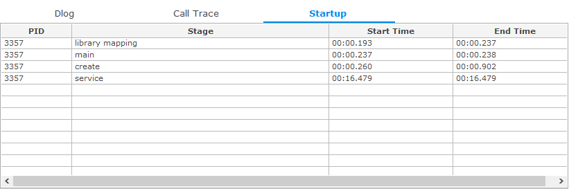

#### Callstack Table

The Callstack table shows the callstack of the selected API or function. The table contains the following columns:

- **Function**: Name of the called function
- **Address**: Address of the called function
- **Binary path**: Path of the binary

**Figure: Callstack table**

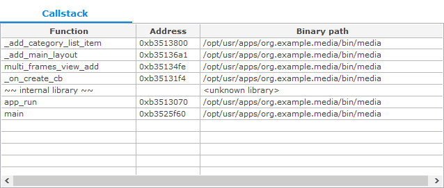

If the symbol is located in the user binary, it is shown in blue. If the symbol name cannot be found, it is marked as an unknown function.

#### Function Profiling Table

The Function Profiling table shows the method usage in an application. The information is divided into 2 units:

- Application directory contains the methods that are created in the application code.
- Dependent library directory contains the methods that are used in the application code.

The table contains the following columns:

- **Library or function name**: Library unit (application or dependent), the binary/library name, and the method name in a tree format
- **Exclusive CPU time**: Exclusive CPU time in seconds
- **Exclusive CPU rate**: Exclusive CPU rate in percentages
- **Exclusive Elapsed time**: Exclusive elapsed time in seconds
- **Inclusive CPU time**: Inclusive CPU time in seconds
- **Inclusive CPU rate**: Inclusive CPU rate in percentages
- **Inclusive Elapsed time**: Inclusive elapsed time in seconds
- **Call count**: Number of times the method has been called

The exclusive time is the amount of execution time that is passed within the method, excluding the time spent in methods called from the method in question. The inclusive time is the amount of execution time that is passed within the method, including the time spent in methods called from the method in question.

The CPU time is the actual CPU time consumed by the process. The value is obtained by sampling. The elapsed time is the wall-clock time, meaning the time elapsed between the method entry and exit.

**Figure: Function Profiling table**

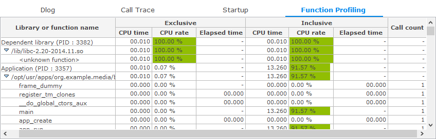

#### Failed API Table

The Failed API table contains the following columns:

- **Time**: Timestamp
- **API**: Name of the failed API or function
- **Parameter**: Parameter
- **Return**: Return value
- **Error code**: Error code
- **Error description**: Description
- **PID**: Process ID

**Figure: Failed API table**

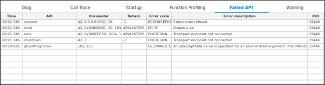

#### Warning Table

The Warning table contains the following columns:

- **Category**: Warning category
- **PID**: Process ID
- **Warning**: Warning message

**Figure: Warning table**

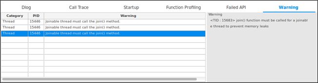

## Related information
* Dependencies
  - Tizen Studio 1.0 and Higher
