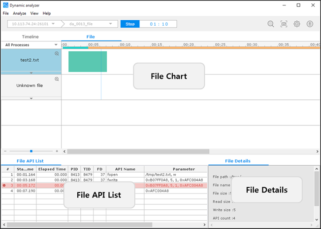
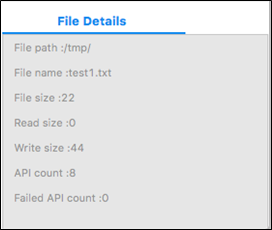

# Performing File Analysis

The **File** tab of the Dynamic Analyzer shows information associated with file operations. The **File** tab can be enabled or disabled in runtime from the **Configuration** dialog. If the file analysis capabilities are disabled, the file API information is not displayed.

The tab consists of the following views:

- [File chart](#chart) shows file operations (open/close, read/write, lock) as a time flow chart.
- [File API List](#api_list) table shows the file APIs that are associated with the file selected in the file chart.
- [File Details](#details) view shows detailed information about the file selected in the file chart.

**Figure: File analysis**

Together, the views show the following information:

- Name and location of the file
- Current state of the file (closed or open)
- Usage time and size of the data saved or read in the file
- Information about the API used in the file (API name, parameter value, return value, and the success or failure of the API)
- Non-target processes, as well as target processes, are shown on the file chart; however, more information on non-target processes is not displayed on the File API List table and File Details view

Terminology:

- A target process is on a given application or library that you are interested in analyzing.
- A non-target process is the opposite of the target process, but it accesses the target files.
- A target file is the file that has the function calls which you are interested in.
- A non-target file is the opposite of the target file. For example, if you are only interested in internal calls, files that include direct calls are non-target files.

## File Chart

The file chart has a separated child and parent chart. There can be only 1 parent chart of each file, whereas multiple child charts are supported. Multiple child charts are separated by PID and TID. The parent chart records all the operations performed by the child charts.

**Figure: File chart**

The file chart shows the following information:

- The open or closed state of the file is shown through the color of the graph bars:
  - Teal blue indicates that the file was opened and by other processes or threads concurrently. (A)
  - Aqua area indicates the open area of the file. (B)
- The upper side lines displayed on the child chart indicate the time of locking the file:
  - Violet area indicates the lock area of the file. (D)
  - Purple area indicates the lock waiting of the file. (E)
- The lower side lines displayed on the child chart indicate the time of reading and writing the file:
  - Sky blue area or line indicates the write or read area of the file. (C)
  - Blue area or line indicates the concurrent writing or reading of the file without the lock.
  - Red line indicates that the API has failed. (F)

## File API List

The File API List table shows the APIs that are associated with the file selected in the file chart. When the child of the file is selected, this view shows information about the file included in the TID.

**Figure: File API List table**

The table contains the following columns:

- **#** (integer): Sequence number of the API calls
- **Start Time** (time): Time when the API was called
- **Elapsed Time** (time): Time that elapses while an event occurs
- **PID** (integer): API process ID
- **TID** (integer): ID of the thread that called the API
- **FD** (integer): ID of the file
- **API Name** (text): Name of the API
- **Parameter**: Input parameters of the API
- **Return** (integer): Return value of the called API
- **Error code** (text): Value returned by the API; for the APIs associated with glibc, the value is the description of the error number

## File Details

The File Details view shows detailed information about the file selected in the file chart. When the child row of the file is selected, this view shows information about the file that is included in the TID.

**Figure: File Details view**

The view contains the following fields:

- **File path**: Path of the file
- **File name**: Name of the file
- **File size**: Total size of the file
- **Read size**: Total size of read
- **Write size**: Total size of write
- **API count**: Total API count that is associated with the file
- **Failed API count**: Number of failed APIs

## Related Information
* Dependencies
  - Tizen Studio 1.0 and Higher
