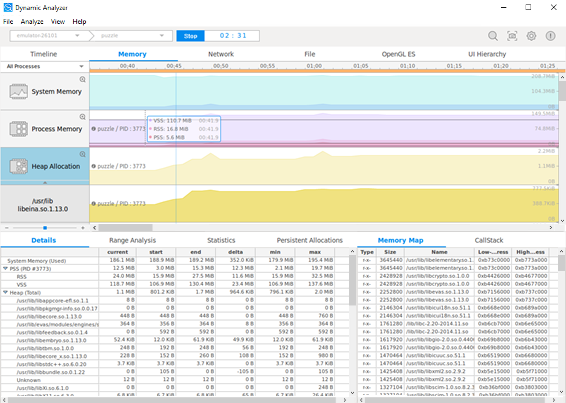
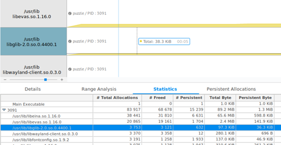
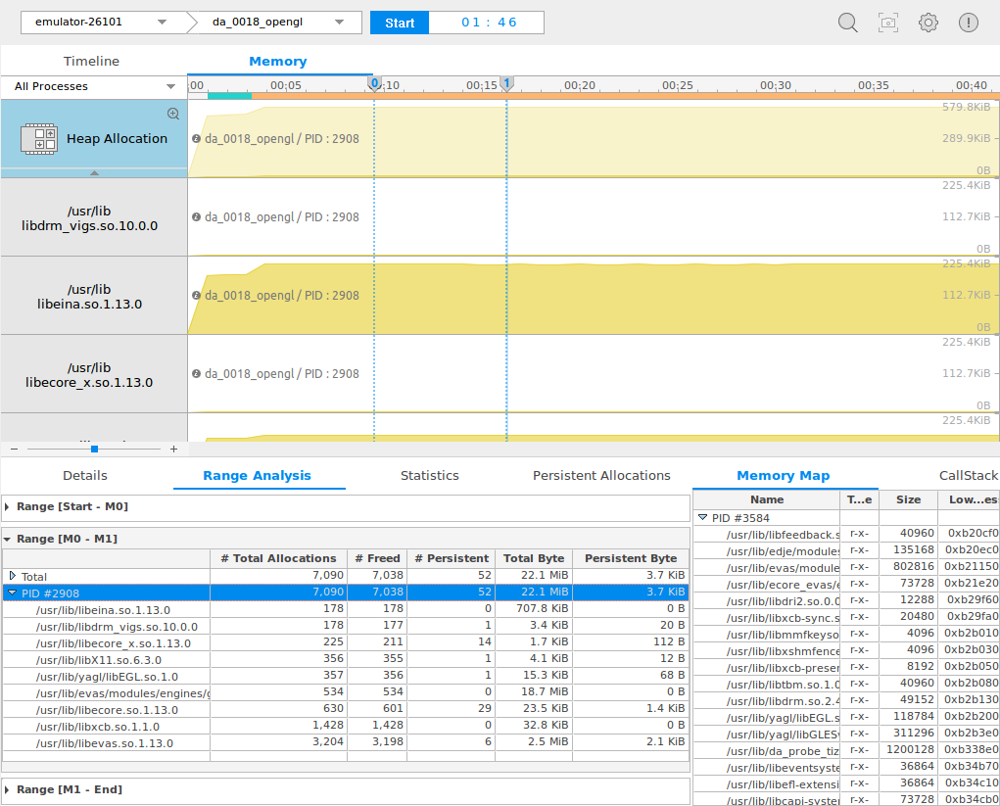
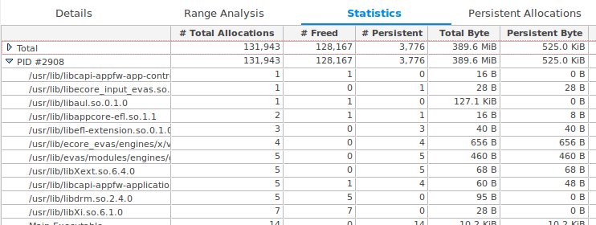
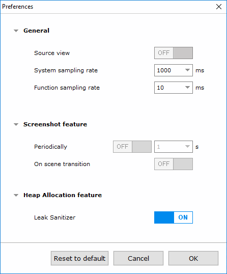
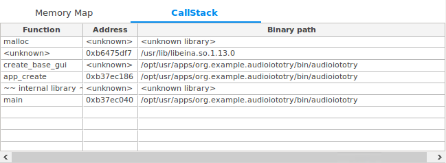

# Performing Memory Analysis

You can analyze the memory usage of an application in the **Memory** tab of the Dynamic Analyzer.

The tab consists of the following views:

- [Memory chart](#memory_chart) shows the memory sizes for the system, process, and heap memory.
- [Details](#details) table shows the changes in the system and process memory sizes.
- [Range Analysis](#range) table shows the changes in memory allocations between user-defined time markers.
- [Statistics](#statistics) table shows the changes in memory allocation.
- [Memory Map](#map) table shows detailed information on the memory mapping.
- [Persistent Allocations](#allocation) table and chart show the persistent allocations of the heap.
- [Leaks](#leaks) table shows memory leaks detected with the Leak Sanitizer.
- [CallStack](#callstack) table shows the call stack of the chosen allocation from the **Persistent Allocations** table.

**Figure: Memory usage analysis**

## Memory Chart

The memory chart consists of various child charts:

- **System Memory** chart  
  You can check the memory size of the system and process.  
  **Figure: System Memory chart**
- **Process Memory** chart  
  You can check the memory size of the process:
  - **VSS**: Virtual Set Size
  - **RSS**: Resident Set Size
  - **PSS**: Proportional Set Size  
    **Figure: Process Memory chart**
- **Heap Allocation** chart  
  You can check the allocated heap memory size of the process. It is calculated by "total allocation – total free":
  - **Total**: Allocated heap memory size of the process
  - **Main Executable**: Allocated heap memory size of the main executable  
    **Figure: Heap Allocation chart**  
    When you select one of the heap allocation charts or its children, the corresponding **Statistics** table entry is also selected. This can be helpful if you need more detailed information on some process or library.  
    **Figure: Cross-focusing from Heap Allocation charts to the Statistics table**

## Details

You can check the changes in the system and process memory sizes in the **Details** table.

**Figure: Details table**

The table contains the following columns:

- **current**: Value at the inspection bar on chart
- **start**: First value in the total range or the selected range data
- **end**: Last value in the total range or the selected range data
- **delta**: Difference between the end and start
- **min**: Minimum value in the total range or the selected range data
- **max**: Maximum value in the total range or the selected range data

The table can contain, for example, the following rows:

- **System Memory**: System-used memory (only if the system memory feature is enabled)
- **Process #PID (Total)**: PSS + 3D + GEM of the target process
  - **PSS**: Proportional Set Size of a process
  - **3D**: Memory allocated by the GPU driver that a process uses
  - **GEM**: Sum of the unique GEM (Graphics Execution Manager) memory in the system
- **Heap (Total)**: Main executable heap size + each library heap size
- **Main Executable**: "Allocated memory – free memory" of the main executable
- **Each library**: "Allocated memory – free memory" of each library

## Range Analysis

You can add markers to the timeline to divide the timeline into intervals. The allocation and deallocation statistics are shown for each interval individually in the **Range Analysis** table.

To add markers:

- Double-click any chart or the time bar within the tracing interval.
- Double-click a row in:
  - **Persistent Allocations** table on the **Memory** tab
  - **Dlog** table or **Call Trace** table on the **Timeline** tab

To remove a marker, double-click it.

Markers and intervals are numbered starting from zero. The **Range Analysis** table allows you to compare the changes in memory usage between time markers. For the explanation of the data shown for each range, see [Statistics](#statistics).

**Figure: Range Analysis table**

For more information on using ranges with time markers, see [Range Inspection with Markers](advanced-tasks.md#marker).

## Statistics

You can check the change in total allocated and free memory of each library in the **Statistics** table.

**Figure: Statistics table**

The table contains the following columns:

- Process PID, path to library called from that process or **Total** entry for aggregated information for such libraries.
- **# Total Allocations**: All allocated memory count that includes the free memory count in the total or selected area
- **# Freed**: Calling count of the memory free APIs in the total or selected area
- **# Persistent**: Remaining allocated memory count that excepts the free memory count in the total or selected area
- **Total Byte**: All allocated memory size that includes free memory size in the total or selected area
- **Persistent Byte**: Remaining allocated memory size that excepts the free memory size in the total or selected area

When you select one of the **Statistics** table entries, the corresponding heap allocation chart is selected in the charts area. For more information, see [Heap Allocation chart](#heap).

Note that heap allocation charts are always sorted according to the **Statistics** table entry order. You can change that order by clicking at one of the columns in the **Statistics** table. This is useful if you need to sort the library charts, for example, by persistent allocation size.

## Memory Map

You can check the memory mapping of a selected process in the **Memory Map** table. Using this table, you can understand the size of each library mapped onto a process, including the library's starting address (low address) and ending address (high address).

**Figure: Memory Map table**

The table contains the following columns:

- **Type**: Access permission of the library; currently the Dynamic Analyzer only shows readable (r-) and executable (--x-) memory areas of the library.
- **Size**: Mapped size of the library, calculated by subtracting the high address from the low address.
- **Name**: Library file name, including the full path.
- **Low- and High-address**: Address range of the library inside the process.

## Persistent Allocations

You can check the persistent allocations of the heap in the **Persistent Allocations** table and charts. To show the persistent allocation reports, select **View > Report > Persistent Allocations**.

The Persistent Allocations table can show 2 types of data:

- Persistent allocations for the entire trace (when no interval is selected). These are all allocations which occurred during tracing and were not freed by the end of the trace. They are shown only after the tracing process is finished.
- Persistent allocations for a selected interval. These are all allocations which occurred during the selected interval and were not freed by the end of the interval. They can be shown both during tracing and after tracing is stopped. For this type of data, you must select an interval in the timeline charts area.

**Figure: Persistent Allocations table**

The table contains the following columns:

- **Timestamp**: Call time (target side)
- **PID**: Process identifier
- **TID**: Identifier of the thread that called the allocation API
- **Address**: Allocation address
- **Size**: Allocation size
- **Path**: Path of the library that called the allocation API
- **Called Function**: Called allocation function

The **Persistent Allocations** charts are shown above the **Heap Allocation** charts after tracing is stopped or when the trace is loaded from a file. You can see the following additional information:

- **Process Persistent**: Size of the heap memory already allocated in the process and not freed by the end of the trace.
- **Main Executable Persistent/Persistent**: Size of the heap memory already allocated by the main executable or each library, and not freed by the end of the trace.

**Figure: Heap Allocation chart with the Persistent Allocation chart option enabled**

## Leaks

You can find where memory leaks occurred in the application by enabling the **Leak Sanitizer** for the **Heap Allocation** tracing feature in the **Preferences** dialog.

**Figure: Leak Sanitizer enabled in the Preferences dialog**

> [!NOTE]  
> Pay attention to the known limitations of the Leak Sanitizer in the Dynamic Analyzer:
> - Leak Sanitizer can be enabled for Tizen 3.0 devices only.
> - Leak Sanitizer cannot be enabled together with the Thread Analysis feature.
> - Only allocations that occur in a profiled application are checked for leaks.
> - False negative results can be produced on a 32-bit platform (ARM, x86), particularly in applications which use large memory allocations.
> - False positive results can be produced if an application uses the Thread Local Storage (TLS) memory.

The **Leaks** table has the same columns as the [**Persistent Allocations** table](#allocation).

**Figure: Leaks table**

The leaks are also marked in the **Persistent Allocations** table in an additional **Leak** column, which is shown only if the Leak Sanitizer is enabled. The column contains **Yes** if the allocation is detected to be the source of a memory leak.

**Figure: Persistent Allocations table with the Leak column**

## CallStack

You can see a call stack for each allocation from the **Persistent Allocations** or **Leaks** table in the **CallStack** table. To see the call stack, select the corresponding row in the **Persistent Allocations** or **Leaks** table.

**Figure: CallStack table**

The table contains the following columns:

- **Function**: Name of the called function, or **\<unknown>** if the function name cannot be determined
- **Address**: Address of the instruction from where the next function was called, or **\<unknown>** if the function name cannot be determined
- **Binary path**: Path to the library which contains the defined function, or **\<unknown library>** if it cannot be determined

## Related information
* Dependencies
  - Tizen Studio 1.0 and Higher
