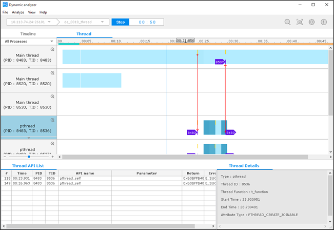
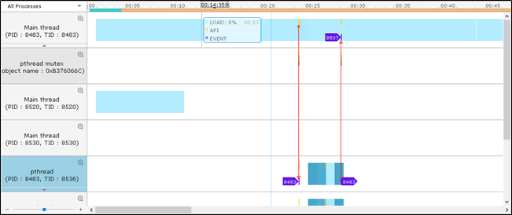
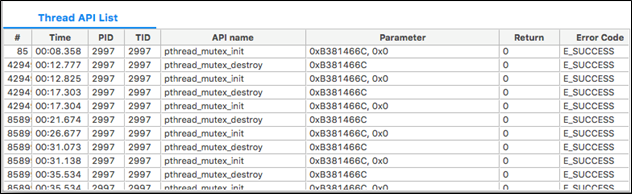
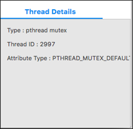

# Performing Thread Analysis

The **Thread** tab of the Dynamic Analyzer displays information about threads and synchronization.

The tab consists of the following views:

- [Thread chart](#chart) displays thread and synchronization operations and the thread load as a time flow graph.
- [Thread API List](#api_list) table displays the thread or synchronization object APIs selected in the thread chart.
- [Thread Details](#details) view displays detailed information on the thread or synchronization object selected in the thread chart.

**Figure: Thread analysis**

## Thread Chart

The thread chart displays the thread and the related synchronization object in a tree format using a graph.

**Figure: Thread chart**

The chart classifies thread and synchronization object states by color and shape:

- Blue colored area of the thread line depicts the thread load of that time frame. A darker color means higher load.
- Yellow vertical bar points the time when the API was called.
- Violet arrow displays the interaction between threads. The number inside the arrow is the thread ID of the related thread.
- Orange colored area of the synchronization object line displays the possession of that synchronization object (lock).
- Gray colored area of the synchronization object line shows the waiting time for acquiring that synchronization object.

## Thread API List

The Thread API List table displays the APIs associated with the thread or synchronization object selected in the thread chart.

**Figure: Thread API List table**

The table contains the following columns:

- **#** (integer): Unique log index
- **Time** (time): Time when the API was called
- **PID** (integer): Process ID of the API
- **TID** (integer): Thread ID of the API
- **API name** (text): Name of the API
- **Parameter**: Input parameter of the API
- **Return** (integer): Return value
- **Error Code** (text): Error description of the API; a normal end return is **E_SUCCESS**

## Thread Details

The Thread Details view displays detailed information about the thread or synchronization object selected in the thread chart.

**Figure: Thread Details view**

The view contains the following fields:

- **Type**: Type of the thread or synchronization object
- **Thread ID**: Thread ID (LWP) of the thread
- **Thread Function**: Name of the function which the thread is executing
- **Start Time**: Start time of the thread
- **End Time**: End time of the thread
- **Attribute Type**: Attribute type of the thread

## Related information
* Dependencies
  - Tizen Studio 1.0 and Higher
