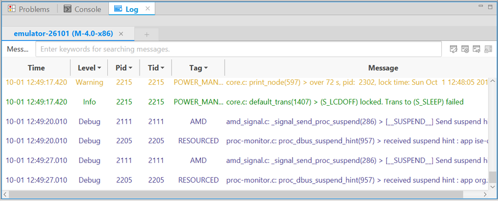
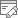
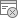
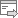

# Checking Logs with Log View

You can insert logging methods to your code and check the logs of your application in the **Log** view.

When a device is connected, a device log tab is automatically created in the **Log** view. You can create additional tabs for a device, and you can set different filters for each tab. Tabs for disconnected devices are shown as inactive, and are reactivated when the device is reconnected.

**Figure: Log view**

Each log tab contains a toolbar and a log table. The log table lists log messages in chronological order, and this order cannot be modified. Each log message contains the **Time**, **Level** (priority level of the log message), **Pid** (process ID), **Tid** (thread ID), **Tag** (identification of the log message source), and **Message** fields, and you can create filters for each field.

You can perform a variety of actions in the **Log** view:

- Creating a new log tab

   You can create a new log tab in 2 ways:

   - Right-click a device in the Device Manager and select **Add log tab**. Enter a name for the tab and click **OK**.

   - Select a device in the Device Manager and click **+** in the **Log** view. Enter a name for the tab and click **OK**.

- Editing a log tab name

   When a device is connected and a log tab is automatically created, the default name of the new tab is the device ID. You can edit that name, and the names of the tabs you have manually created yourself.

   To edit the log tab name, click the **Edit Tab** button (). Enter a new name for the tab and click **OK**.

- Removing a log tab

   You can either delete a single tab, or delete all tabs related to a device.

   - To delete a single tab, click the **X** next to the log tab name.

   - To delete all tabs for a device, right-click the device in the Device Manager and select **Delete log tabs**. Confirm the deletion by clicking **OK**.

   > **Note**
   >
   > Any filters created for a log tab are deleted when the tab is removed.

- Filtering a log messages

   You can filter log messages based on the table columns:

   - To filter log messages based on the **Level**, **Pid**, **Tid**, or **Tag** columns, click the  icon next to the column name, select 1 or more values you want to show, and click **OK**.

   - To filter log messages based on the **Message** column, enter the **Message** field string you want to search for to the input field at top of the **Log** view.

- Clearing logs

   To clear all log messages from a tab, click the **Clear Logs** button ().

- Exporting logs

   To export logs to a file, click the **Export Logs** button (), select the file storage location and file name for the exported log, and click **OK**.

   > **Note**
   >
   > If you have filters applied to a log tab, only messages that match those filters are exported. If you want to export the complete log, remove all filters before exporting.

## Related information
* Dependencies  
  - Tizen Studio 1.0 and Higher
