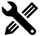
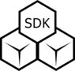
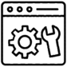

# Tizen Studio

<section id ="main">

Tizen Studio is an official Integrated Development Environment (IDE) for developing Tizen apps. This environment is built over Eclipse, it presents a unified environment where you can write, edit, debug, build, and publish your app. Tizen Studio runs on Windows®, Ubuntu®, and macOS®.

Tizen Studio primarily consists of: 

- set of fast and feature-rich emulators for devices based on Tizen, for example: Smartphone, TV emulator, Smart watch and much more
- extensive tool chains to capture performance, usability, version compatibility
- code templates, samples to help you get started 
- components to support new platforms
- system applications and drivers 
- utilities for compiling applications to Tizen RT (Tizen RTOS kernel variant)
<!-- tiles-->
<section id="one" class="wrapper special">
		

			<header class="major">
			</header>

							<a href="https://developer.tizen.org/development/tizen-studio/download" class="button special">Download</a>
							<a href="./setup/install-sdk" class="button special">Get Started</a>
						

						
</header>

Visit the following pages to explore more about Tizen Studio:

                        

                        

                        
                         

						 <a href="native-tools/index.md">
						 Native Tools</a>
                        

						

						

							
							

							<a href= "web-tools/index.md">Web Tools</a>
							

						

						

							
                            

							<a href= "configurable-sdk/configurable-sdk.md">Configurable-IoT SDK</a>

						

						

							
                            

							<a href= "extension-sdk/overview.md">Extension SDK</a>
							

						

						

							<i class="fa fa-envelope-o"></i>
							
							

							<a href= "rt-ide/overview.md">Tizen RT IDE</a>
							

						

					

				

			</section>