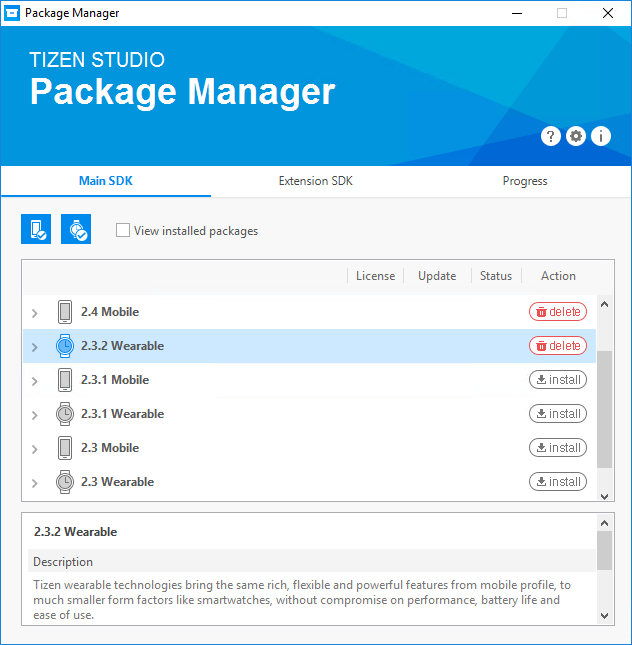
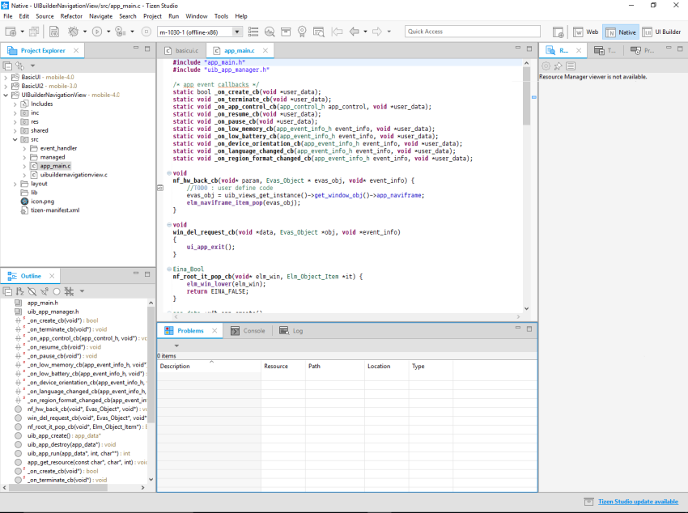
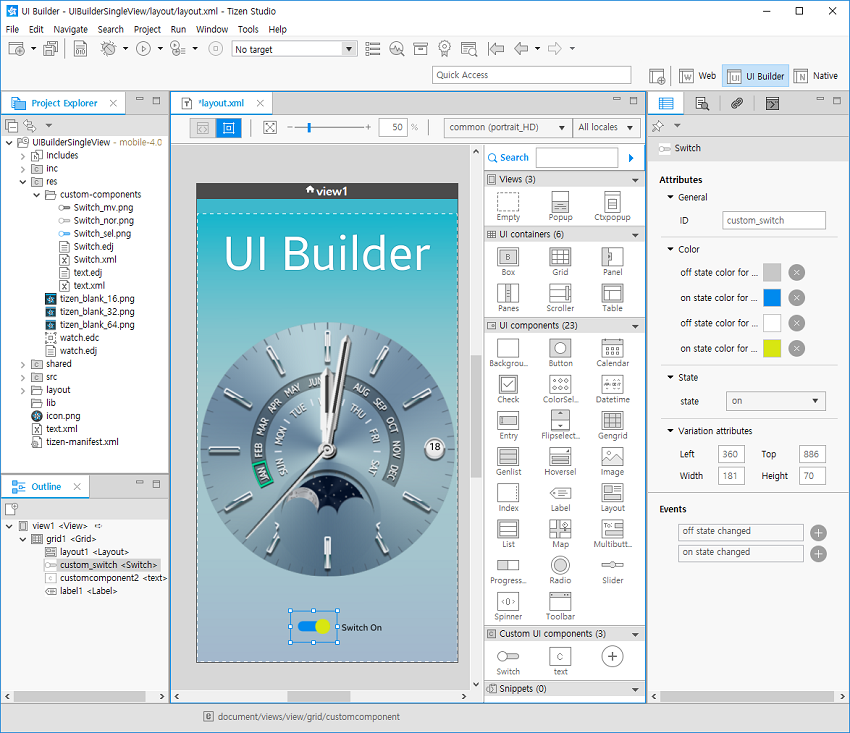
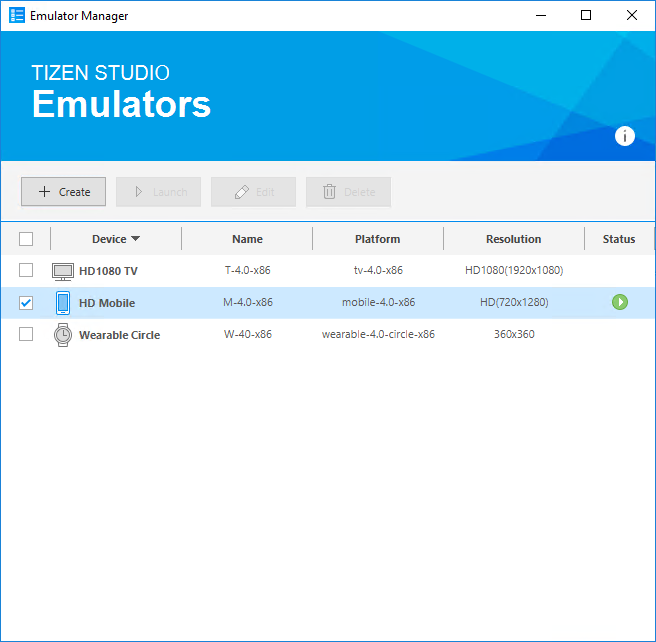
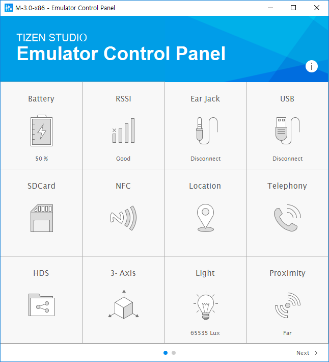
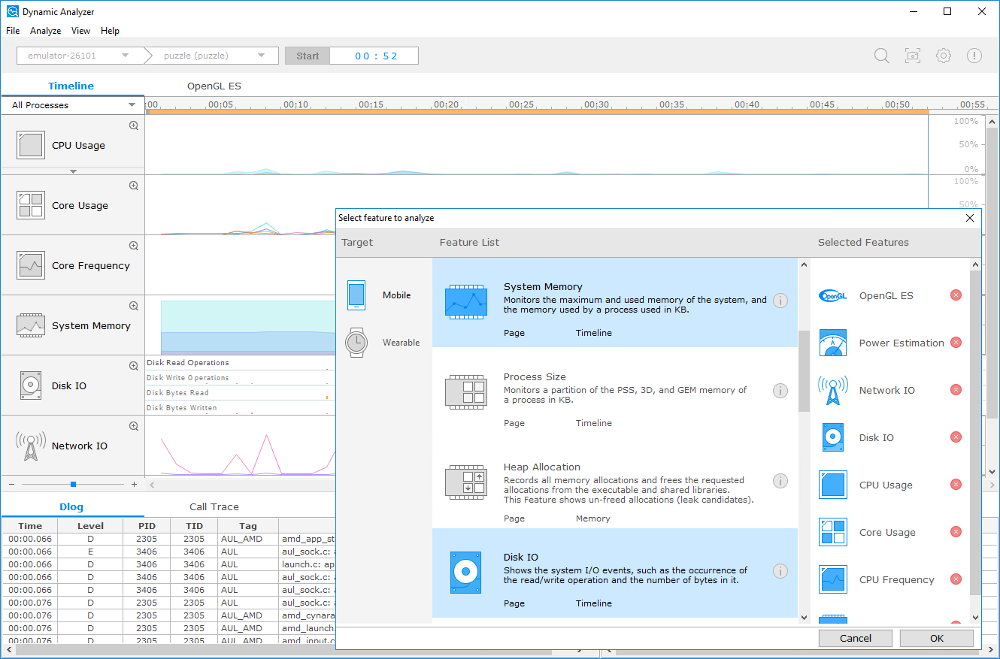

# Tizen Studio

**Tizen Studio 3.7 is now launched!**&nbsp;&nbsp;&nbsp;&nbsp;&nbsp;[  **Download**](https://developer.tizen.org/development/tizen-studio/download)

<section id ="main">

Tizen Studio is an official integrated development environment (IDE) for developing Tizen apps. This environment is built over Eclipse, it presents a unified environment where you can write, edit, debug, build, and publish your app. 

Tizen Studio runs on Windows®, Ubuntu, and macOS. For more information on the latest release, see the [Download](https://developer.tizen.org/development/tizen-studio/download) page.

Tizen Studio primarily consists of: 

- set of fast and feature-rich emulators for devices based on Tizen, for example: Smartphone, TV emulator, Smart watch and much more
- extensive tool chains to capture performance, usability, version compatibility
- code templates, samples to help you get started 
- components to support new platforms
- system applications and drivers 
- utilities for compiling applications to Tizen RT (Tizen RTOS kernel variant)

Visit the following pages to explore more about Tizen Studio: 

  

    
    <a href="https://developer.tizen.org/development/tizen-studio/download" class="docs-btn-more">Download</a>
    
  

  

    
        <a href="native-tools/index.md" class="docs-btn-more">Native Tools</a> 
    
  

 
   

    
    <a href="web-tools/index.md" class="docs-btn-more" style="padding-left: 0px;padding-right: 13px;">Web Tools</a>
    
  

  

    
    <a href="configurable-sdk/configurable-sdk.md" class="docs-btn-more">Configurable - IoT SDK</a>
        
  

  

    
    <a href="extension-sdk/overview.md" class="docs-btn-more">Extension SDK</a> 
    
  

    
    <a href="rt-ide/overview.md" class="docs-btn-more">Tizen RT IDE</a> 
    
  

</section>

The Tizen Studio platform is based on a new version of Eclipse, so you can experience a stable, lightweight, and consistent user interface that is unique to the Tizen development environment. With Tizen Studio, you can select and install only those platforms and profiles you need.

In Tizen Studio, you can perform all the same development activities that were possible with the old Tizen SDK: you can develop, build, debug, profile, and emulate Tizen native and Web applications. The new development environment in Tizen Studio is simply better. It allows you to develop applications more comfortably and is more focused on Tizen development. There are about 200 online sample applications available to increase your understanding of Tizen applications, and the sample library continues to grow.

> **Note**
>
> Support for Windows 32-bit and Ubuntu 32-bit will be deprecated from Tizen Studio 3.5.

To develop your applications, use the set of tools provided by Tizen Studio:

- [Setup](setup/install-sdk.md)

  Learn about installing and updating Tizen Studio. You may need to install additional packages to develop applications for various platforms.

- [Native Tools](native-tools/index.md)

  Learn about the available native application development tools. Native applications are developed using the C programming language. You can create an application project, edit the code to meet your needs, and run the application on the emulator or a target device.

- [Web Tools](web-tools/index.md)

  Learn about the available Web application development tools. Web applications are developed using the JavaScript, HTML, and CSS languages. You can create an application project, edit the code to meet your needs, and run the application on the emulator, simulator, or a target device.

- [Platform Tools](platform-tools/overview.md)

  Learn about the platform development environment that helps you develop preloaded platform applications, platform libraries, and device drivers in Ubuntu.

- [Tizen Studio for RT](rt-ide/overview.md)

  Learn about Tizen Studio for RT and how you can develop lightweight RTOS-based applications.

- [Configurable SDK](configurable-sdk/configurable-sdk.md)

  Learn about using Tizen Studio to develop applications in a customizable Tizen platform environment.

Tizen Studio contains many tools familiar from the old Tizen SDK, but with some improvements. The following list describes the main changes:

- Installer and Package Manager

  These tools allow you to install, update, and maintain Tizen Studio. You can select and install the platforms and profiles you need, and receive regular updates. The tools provide you with accurate information so you can configure the development environment easily.

  **Figure: Package Manager**

  

- Tizen Studio development environment

  This component, where development of Tizen applications takes place, has a unified Tizen theme, provides a fast development environment, and improves ease of use through sorting the menu in a logical order for application development tasks and expanding the toolbar icons.

  In addition, Tizen Studio provides accurate information in a consistent manner to minimize the difficulties you can encounter while using it.

  **Figure: Tizen Studio development environment**

  

- Native UI Builder

  This tool provides assistance for developing native Tizen applications. It allows for visual development of UI applications using a WYSIWYG (What You See is What You Get) editor, and it helps you understand Tizen native UI development and the UI hierarchy. The application UI screen can be configured easily with this editor.

  **Figure: Native UI Builder**

  

- Emulator

  This tool helps you develop and debug Tizen applications without an actual Tizen device. You can select the platform, profile, and device features that you need and run applications on an emulator. In addition, through the Emulator Control Panel (ECP), you can simulate events in your application and see how the application responds.

  **Figure: Emulator Manager and ECP**

  

  

- Profiling tool

  Tizen Studio provides profiling assistance for application optimization. By using the Dynamic Analyzer, the status of the device, such as its processor usage, memory usage, and UI events, can be measured and analyzed to help you optimize your Tizen application.

  **Figure: Dynamic Analyzer**

  

For more information, see [Release Notes](release-notes/release-notes.md).
