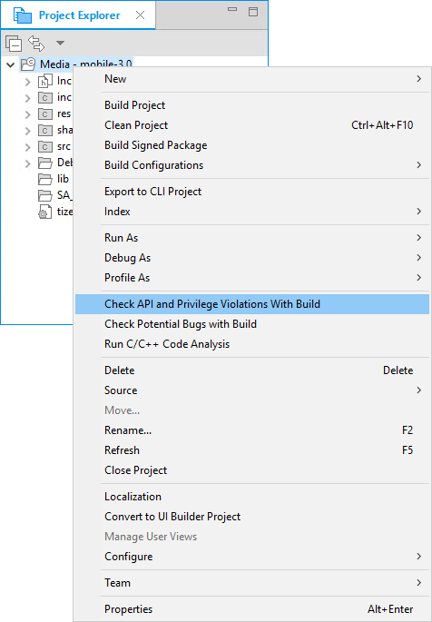
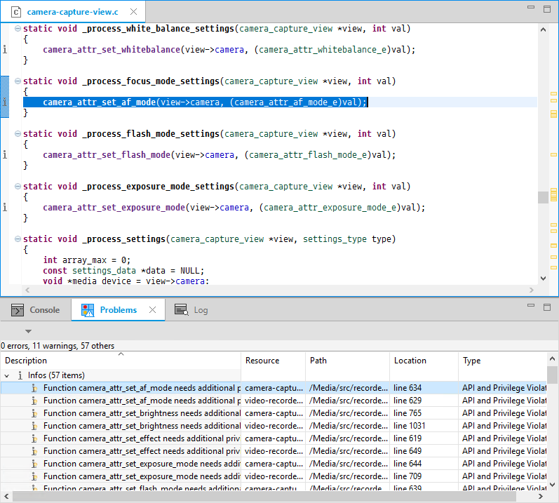
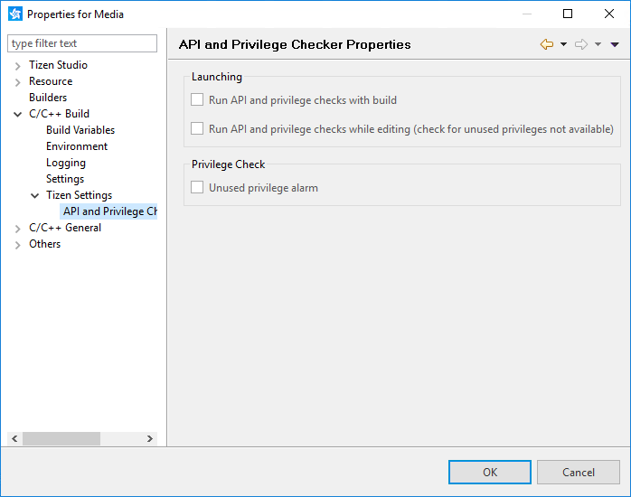
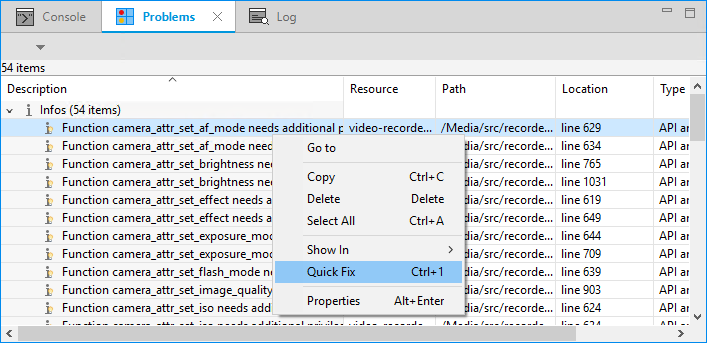
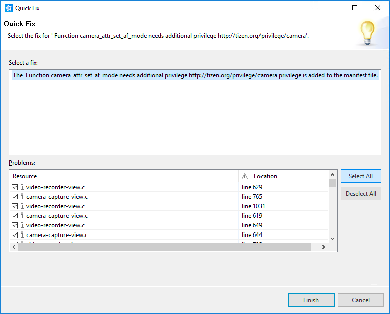

# Verifying APIs and Privileges

The Tizen Studio provides the API Checker tool to identify potential problems in the application code related to the API and privilege use.

The API Checker can be used on Tizen native applications to detect potential issues with privileges and API versions. The tool can be used from the Tizen Studio as well as from the command line.

The following defects can be detected by the API Checker:

- **API Version Problem**: Flags a warning if the application contains a function or enumerator which is only provided in a higher API version than the one the application is using.
- **Deprecated API Problem**: Flags a warning if the application uses a deprecated function or enumerator which is not supported in the API version used by the application.
- **Undefined Privileges**: Flags a warning if the application uses a function or enumerator which requires a privilege, but that privilege has not been defined in the application manifest file.
- **Unused Privileges**: Flags a warning if the application contains privileges that are not used by any APIs in the application. This feature is disabled by default.

## Running the API Checker

In the **Project Explorer** view, right-click the project on which you want to run the API Checker and select **Check API and Privilege Violations with Build**.

The project is automatically built and the API Checker is run during the build process.

**Figure: Running the API Checker**

When the API Checker is finished, the detected issues are listed in the **Problems** view under the **API and Privilege Violations** type. The view contains a detailed description of the issue along with the file and line information about where the error occurred.

**Figure: Check results in the Problems view**

## Customizing the API Checker

By default, the API Checker checks for API version mismatches, deprecated APIs, and undefined privileges.

You can customize the API Checker to also check for unused privileges. You can also enable the tool to run by default along with the normal build or while editing the code.

To customize the API Checker:

1. In the **Project Explorer** view, right-click the project and select **Properties**.

2. Go to **C/C++ Build > Tizen Settings > API and Privilege Checker**.

3. Modify the settings, as needed.

   

## Quick-fixing API Checker Findings

You can quick-fix some of the issues found by the API Checker, such as use of undefined and unused privileges.

> **Note**  
> Deprecated API and version mismatch issues cannot be quick-fixed. You must fix them manually.

To quick-fix issues:

1. In the **Problems** view, select the issues to be quick-fixed.
2. Right-click the selection and select **Quick Fix**.
3. To resolve all issues of the same type in the project, click **Select All** and **Finish**.

## Related information
* Dependencies
 - Tizen Studio 1.0 and Higher
