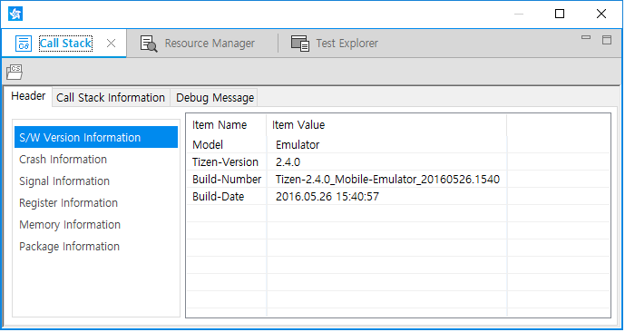
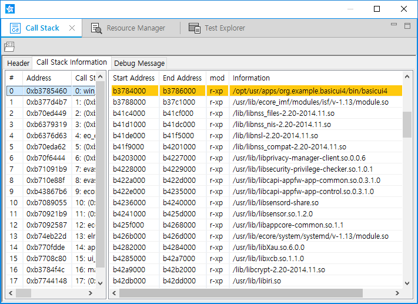
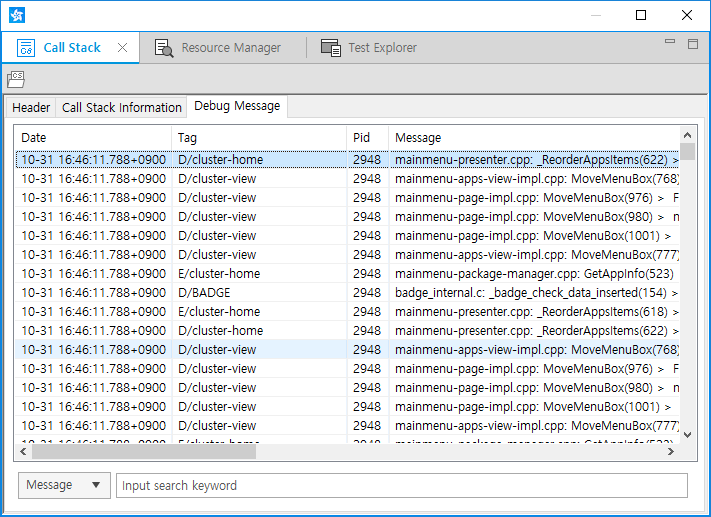

# Getting Crash Data from Call Stack View

The **Call Stack** view provides information about a crashed API, call stack, or debug message when the application crashes while running. Though debugging tools give more detailed information in the debugging state, the **Call Stack** view is a useful tool in the running state.

When the application crashes during running, the Tizen Studio creates a `*.cs` file in the `crash-info` folder under the current project and shows the **Call Stack** view automatically. The view can also be opened from the Tizen Studio menu by selecting **Window > Show View > Other > Tizen > Call Stack**.

The **Call Stack** view has 3 tabs:

- **Header**: Provides basic information about the crashed application. Select a specific information type from the left pane.

  **Figure: Header tab**

  

- **Call Stack Information**: Traces call stack steps to find where the memory block has crashed. If you select a call stack item in the left pane, the search result is shown in the right pane.

  **Figure: Call Stack Information tab**

  

- **Debug Message**: Provides the latest debug messages and the filtering function similar to the **Log** view. You can search with keywords filtered by tag, pid, and message.

  **Figure: Debug Message tab**

  

The **Call Stack** view shows information only when the application crashes.

## Related Information
* Dependencies
  - Tizen Studio 1.0 and Higher
