# Designing UIs with the EDC Editor

The EDC Editor is an EDC (Edje Data Collections) script editor tool that supports text editing and previewing functions for the EDC source code.

When your application requires real-time changeable layouts, for example, animations, you can write the layout designs using an EDC script, compile it into an EDJ format file, and import it into your application using a UI layout component. You can also write simple and complex design layouts using the EDC script with the EDC Editor. The EDC Editor makes it easier to write the EDC script code and faster to finish your work. If you are not familiar with EDC programming and need more information, see [Layouting with EDC](../../native/guides/ui/efl/learn-edc-intro.md).

**Figure: EDC Editor**

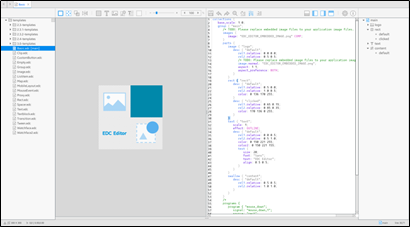

The EDC Editor also provides useful functions for you to develop your application UI. Before using the EDC Editor, familiarize yourself with the functionalities described in the following sections.

## Editor Views

The EDC Editor consists of the following views:

- Directory view

  The directory view shows the file list in the current workspace.

- Preview area and preview area tools

  The preview shows preview images corresponding to part objects in the EDC source code.

- Code view area and code view area tools

  The code view contains the EDC source code.

- View layer

  The view layer shows the current group hierarchy tree.

- Status view

  The status view provides extra functions and informative messages.

Because of its real-time update mechanism, the EDC Editor updates the preview in real-time while you modify the source code in the code view.

**Figure: EDC Editor views**

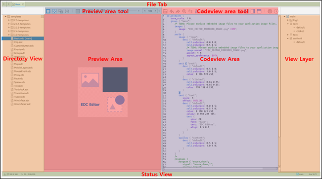

### Directory View and Workspace

If your EDC collection consists of multiple EDC files, set up a workspace. The default workspace directory is where you opened the EDC file in the Tizen Studio.

The workspace is designed to be used with the file browser (toggle hotkey, **F9**) and the file tab (toggle hotkey, **F11**) so that you can navigate between multiple EDC files. The file browser (directory view) displays the current workspace directory.

You can open EDC files in the directory view by double-clicking them. The EDC text file is opened in a new file tab.

The EDC Editor allows only one main EDC file that can be activated in the live view. In the directory view, the main EDC file is displayed with the **[main]** tag. If the main EDC file contains multiple sub EDC files, you can open and navigate through them. You can open those files in the directory view, or by pressing the **F3** key if the text editor cursor is placed on the **"include"** line in the text view (such as `#include "subfile.edc"`). To go back to the previously edited file tab, use the **F4** shortcut key.

The EDC Editor tracks the currently focused EDC group to display it while you go through the groups in 1 EDC collection. But if you open a new EDC file which contains another collection, you need to manually set up that file to be a main. To let the EDC Editor know that EDC has a collection to be adoptable with its subordinate files, press the **F2** key after selecting the new main EDC file in the directory view. You can also change the main EDC file in **Settings > EDC Build > Main EDC File**.

### Code View

The EDC Editor code view is used for text editing, to write and modify the EDC source code. Once the part sections are written in the code view and the modified EDC source code is saved, the preview images corresponding to the part objects of the EDC source code are displayed in the preview.

The text editor applies syntax color and auto indentation for EDC with its own coding standard rules. If you open an EDC file which does not use the EDC Editor coding standard rules, the EDC Editor applies them to your source code automatically. To disable this functionality, go to **Settings > Preference > Auto Indentation**.

The code view supports the following features:

- Auto-complete

  To help you write EDC source code, the code view supports an auto-complete function, which lists the reserved keywords in a contextual pop-up.

  **Figure: Auto-complete feature**

  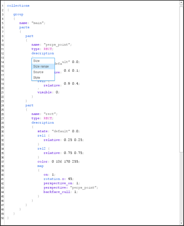

  When you enter a part of a reserved keyword, a contextual pop-up appears with a list of keywords beginning with your input string. Select a keyword with the up and down arrow keys and press **Enter**. The keyword is selected and a related EDC code snippet is inserted in the code view automatically. In contrast, if you press the **Backspace** key, the auto-complete function is cancelled and the contextual pop-up is dismissed.

  You can also use auto-complete as a contextual help. Press the **Ctrl + Space** key combination to show a list of available keywords in the current cursor position context.

  To enable or disable the auto-complete function, go to **Settings > Preferences > Auto Completion**.

- Candidate list

  The EDC script provides a variety of pre-defined keywords, including part object types and program action types. To easily edit the keywords, the code view supports a candidate list function for the keywords. When you double-click a keyword in the code view, the available candidate keyword list based on the context pops up. If you select one of the candidate keywords, the double-clicked keyword is changed to a selected one.

  **Figure: Candidate list feature**

  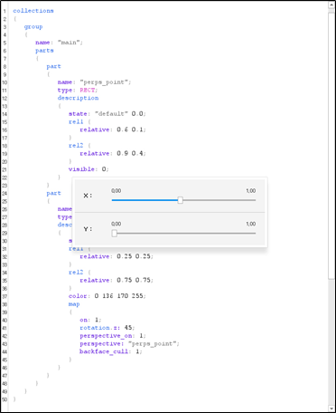

  The candidate list function also helps you to know the available range of numeric values based on the context. The numeric candidate function shows a range of available numbers. When you drag the sliders, the EDC Editor updates the preview instantly.

- Color selector

  To change color values, use the color selector tool. Each time a "color" keyword is double-clicked, it displays the color selector.

  **Figure: Color selector feature**

  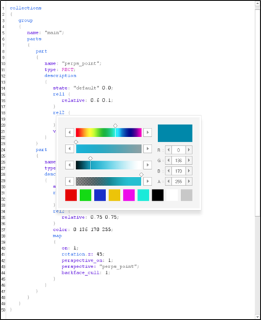

- Text zoom

  Zooming in and out in the code view area changes the editor text font size relative to the zoom factor. This action can be done by pressing the **Ctrl** key and rolling the mouse wheel up and down while the mouse cursor is placed in the text area. To change the font size in the text editor settings, go to **Settings > Text Editor > Font Size**.

### Preview

The preview area displays the EDC source code content as images.

To change the preview zoom value, use the zoom level controller slider, or press the **Ctrl** key and roll the mouse wheel up and down while the mouse cursor is in the preview area.

The range of the zoom is from 0.1x to 5.0x.

**Figure: Preview zooming**

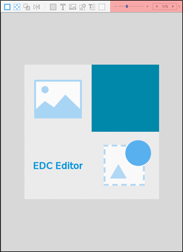

### View Layer

For easy navigation inside the EDC blocks, the EDC Editor provides a tree-style visual tool called the **view layer**. You can expand and collapse tree items and understand the structure of your EDC layout at a glance.

The following blocks are supported in the view layer:

- Group
- Part
- State
- Program

To navigate the EDC source code through the view layer, click an item in the list. The editor cursor in the code view changes its position to the name of the selected item. For program items in the tree, the view layer provides the play and stop buttons to trigger or stop the programs in the EDC Editor. This helps you to check the programs by seeing the results directly in the preview.

The view layer can be enabled or disabled by the **F10** hotkey.

### Status View

The status view is located at the bottom of the EDC Editor window. To toggle the status view visibility, use the **F8** hotkey.

With the status view, you can check the current mouse position, the name of the focused group, and the text editor cursor line position. You can also change the size of the live view in the preview area. The status view shows informational messages to help you with your editing.

## Editor Tools

The EDC Editor provides useful tool functions through the tool buttons available at the top of the preview and code view areas. The following table lists the tool buttons along with their functions and available hotkeys. To toggle the tools themselves, use the **F7** hotkey.

**Table: Tool buttons**

| Icon                                     | Description                              | Hotkey         |
|----------------------------------------|----------------------------------------|--------------|
|  | Show a highlight effect on the selected part in the preview. | **Ctrl + H**   |
|  | Display virtual images for the swallow and spacer parts. | **Ctrl + U**   |
|  | Display wireframes to identify the parts boundaries. | **Ctrl + W**   |
|  | Invert the layout horizontally and review the designed layout in the RTL, LTR settings. | **Ctrl + M**   |
|     | Add a Rect part to the preview.          | -              |
|     | Add a Text part to the preview.          |                |
|  | Add an Image part to the preview.        |                |
|  | Add a Swallow part to the preview.       |                |
|  | Add a Textblock part to the preview.     |                |
|  | Add a Spacer part to the preview.        |                |
|     | Save the current script to a file.       | **Ctrl + S**   |
|     | Undo text changes.                       | **Ctrl + Z**   |
|     | Redo text changes.                       | **Ctrl + R**   |
|  | Find or replace text.                    | **Ctrl + F**   |
|    | Open the go to window to move the cursor position. | **Ctrl + L**   |
|  | Display the script line numbers.         | -              |
|  | Insert the best code corresponding to the current editor context. | **Ctrl + T**   |
|  | Display the **Console** view, which shows the EDC build logs and detected errors. | **Alt + Down** |
|  | Display the directory view, which shows the file list in the current workspace. | **F9**         |
|  | Display the view layer, which shows the current group hierarchy tree. | **F10**        |
|  | Display the file tab at the top.         | **F11**        |
|  | Open the Settings window.                | **F12**        |
|  | Open the About page.                     | **F1**         |

## Using Interactive Feedback

The EDC Editor has the following ways of providing interactive feedback information when you edit the EDC source code:

- Highlighting a part object

  To easily identify the part object that you are modifying, the EDC Editor highlights the preview image corresponding to the part object. When you click a part section in the EDC source code, the image corresponding to that part object is highlighted in the preview. Alternatively, clicking a part object image in the preview moves the editor cursor to the corresponding EDC line in the code view.

  **Figure: Part object highlighting**

  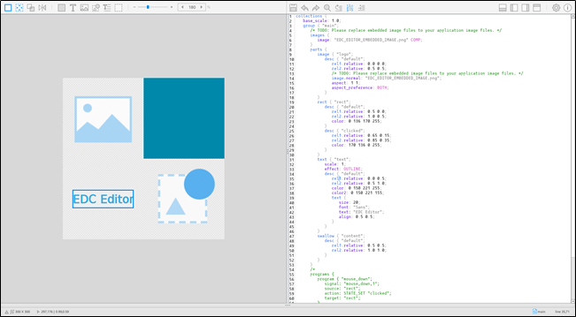

- Detecting errors

  To notify you about EDC grammar errors, the EDC Editor compiles the EDC source code in the background and detects errors whenever the EDC source code is saved.

  When errors are detected, the console view at the bottom of the EDC Editor is activated automatically, and the detected errors are listed there. The erroneous code is also underlined in the code view. The console view is deactivated when the errors are fixed.

  The console view behavior is only enabled if the auto hiding console mode is enabled in **Settings > Preference > Auto Hiding Console**. You can change the size of the console view by dragging the pane divider between the code view and the console view. You can also toggle the console view visibility with the **Alt + Up** and **Alt + Down** hotkeys.

  **Figure: Error detection**

  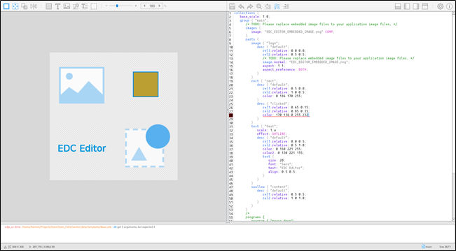

- Image preview

  To easily check the image files you use, the code view allows you to preview image files. Write an image keyword and an image file name in the EDC source code and click the image keyword. The preview pop-up of the clicked image file opens. If other image files are written in a previous or next line of the previewed image line, you can view them using the up and down arrow keys or the mouse wheel.

  **Figure: Image preview**

  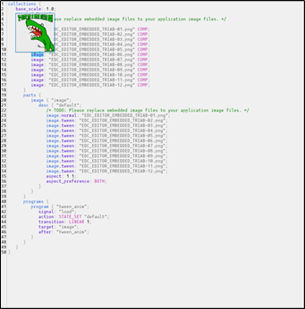

- Reference popup

  A reference popup is like a manual for the EDC keywords applicable to the current cursor position. It shows a description of an EDC keyword for those who are not familiar with the EDC programming script language, and helps them to understand the keyword syntax. To pop up the reference, press the **F5** key after positioning the editor cursor on an EDC keyword.

  **Figure: Reference popup**

  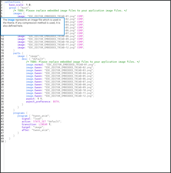

## Using Live Edit

The EDC Editor provides a live edit mode to add part objects to the application layout.

To activate the live edit mode, click one of the part object buttons in the preview area tools. After that, you can add a part object using the live edit contextual pop-up, and change its position and size by dragging. Once you confirm the new part, a code snippet describing it is inserted in the code view. While the live edit mode is active, the code view is disabled.

**Figure: Live edit mode**

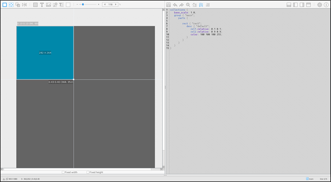

In the live edit mode, a wireframe is used to display the outlines of all parts with solid lines, to enable you to understand the logical boundaries of the parts in a layout. You can toggle the wireframe visibility by pressing the **Ctrl + W** key combination.

**Figure: Wireframes**

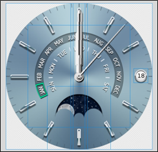

To use the live edit mode:

- Add a new part object

  The preview area tools contain buttons for 6 frequently-used part types: Rect, Text, Image, Swallow, Textblock, and Spacer. Click the applicable button, and the corresponding part object appears in the preview.

- Set the position and size

  The position and size of a part object in pixels are displayed in the center of the part object preview image. The relative position of the part object is displayed at the top-left and bottom-right corners.

  Change the position and size of a part object by dragging the control points placed on each edge of the part object. To move the part object without changing the size, drag the object itself. To move the object position pixel by pixel, use the arrow keys.

  Each part in a layout can be constructed with a relative or fixed size:

  - If a part is constructed with a fixed size, its size does not scale with the other parts or the layout size. When the live edit mode is activated, you can find a fixed size tool at the bottom of the preview. Check the fixed size options for width and height to fix them. For more information on the scalability concept in EDC, see [Scalability Using the EDC File](../../native/guides/ui/efl/scalability.md#edje).
  - A part with a relative size expands or contracts its size to keep up with other parts' position and size or a layout size. In contrast to the fixed size, you can set a new part's position and size relative to other parts. Drag a control point to the edge of other existing parts. Once you release the mouse button, a contextual pop-up opens and displays a list of candidate parts that you can select as a relative to the X and Y coordinates of the new part.

- Auto-align the part object

  If the auto-aligning functionality is activated, it helps you to place a control point near other parts while you are dragging it. The EDC Editor highlights a control line with a red color when it attaches to another part. Auto-aligning helps you construct a layout quickly and easily.

  To disable the auto-align functionality, press the **Ctrl** key while dragging the control point.

- Confirm or cancel the part addition

  After you have finished setting the new part, press **Enter** or double-click a mouse button to insert the part object in your layout. The live edit mode is terminated and the code view is enabled again. To cancel the live edit mode any time during editing, press the **Esc** or **Backspace** key.

The EDC Editor displays non-visual parts with symbols so that you can understand how their parts are positioned and sized. Typically, the swallow and spacer parts are dummy parts. You can toggle the dummy parts by pressing the **Ctrl + U** key combination to show or hide the symbols.

### View Size

When a new group view is shown in the live view area, it has a default view size, 300x300. You can change the view size by clicking the resize button in the status view and using a slider to manipulate the view size. You can control the slider using mouse dragging or the mouse wheel. Each group stores its individual view size, so when you switch views, they can have a different view size. To change the default view size, go to **Settings > Preferences > View Size**.

You can swap the width and height of the live view instantly by pressing the swap button in the status view. The swap functionality can be used for simulating some scenarios, such as mobile device portrait and landscape modes.

**Figure: View size change**

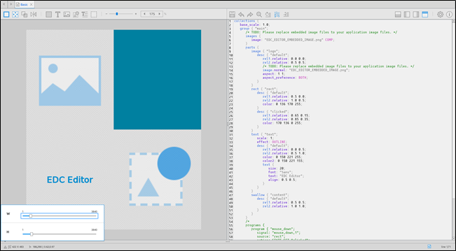

## Settings

You can set and control the EDC Editor properties in the Settings window tabs: **Preferences**, **Text Editor**, and **Resources**.

### Preferences

The preferences contain occasionally used options in the EDC Editor. In addition, it contains some unique function options, such as **Auto Hiding Console**, **Smart Redo/Undo**, and **Error Message Red Alert**:

- When the **Auto Hiding Console** option is switched on, the EDC Editor hides the console box automatically when no messages exist after you have fixed all grammatical errors.
- When the **Smart Undo/Redo** option is switched on, the EDC Editor redoes and undoes text word by word. If disabled, redoing and undoing works character by character.
- When the **Error Message Red Alert** option is switched on, the EDC Editor enables the error message red alert effect. When the EDC compilation fails because of a grammatical error, the EDC Editor alerts you with a fading screen effect.  
**Figure: Preference settings**  
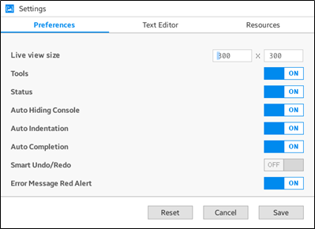

### Text Editor

The **Text Editor** tab provides text options to control the font size and type. You can also change the text color highlighting scheme. Double-click a keyword in the preview pane to change its color.

**Figure: Text editor settings**

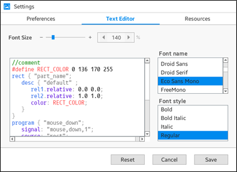

### Resources

You can control some EDC Editor resources. For example, you can change the image, sound, font, data, and even the main EDC paths.

**Figure: Resources settings**

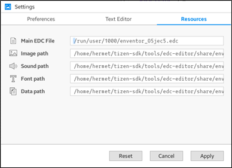

## Running the EDC Editor

There are 3 ways to start the EDC editor:

- Open an existing EDC file:

  1. In the Tizen Studio, open a Tizen application project.

  2. In the **Project Explorer** view, select an EDC file in the resource folder.  
  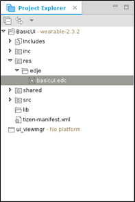

  3. Double-click the EDC file to open it in the EDC Editor.

     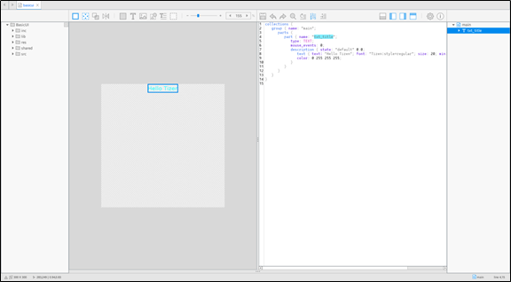

- Create a new EDC file:

  1. In the Tizen Studio, open a Tizen application project.
  2. In the **Project Explorer** view, select the project name.
  3. Right-click the project, and select **New > EDC file**.  
  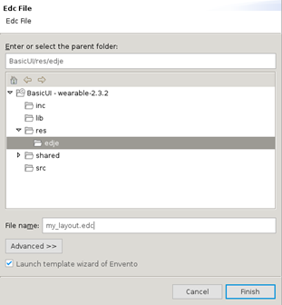
  4. Enter a new file name and click **Finish**.

- Create a new EDC file with a predefined template:

  1. In the Tizen Studio, open a Tizen application project.

  2. In the **Project Explorer** view, select the project name.

  3. Right-click the project, and select **New > EDC file**.

  4. Type a new EDC file name and click **Finish**.

  5. Select a template in the EDC Editor New File dialog.

     The EDC Editor provides various template samples, which can bring you some ideas about what you can do with EDC programming. The templates contain simple samples and practical examples.

     If you select a template, the EDC Editor launches the new EDC file with the template source code, allowing you to build your own EDC layout faster.

     **Figure: EDC Editor templates**

     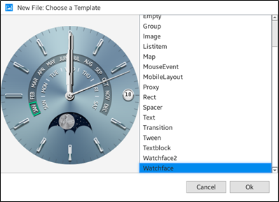

## Importing an EDJ File in the Source Code

The Tizen Studio Package Manager compiles the EDC files you have written into EDJ files. The name of the generated EDJ file is the same as the original EDC file. After you have edited the EDC file and built the application project, you can normally import the EDJ file in the application source code using the [layout](../../native/guides/ui/efl/container-layout.md) UI component.

In most cases, an EDC file contains multiple groups, so you need to specify the name of the group you want to import to the layout:

```
Evas_Object *layout;
layout = elm_layout_add(parent);

char buf[PATH_MAX];
app_get_resource("edje/my_layout.edj", edj_path, (int)PATH_MAX);
elm_layout_file_set(layout, buf, "main");
```

The `elm_layout_file_set()` function imports 1 group from an EDJ file. You can pass the EDJ file path to the second parameter and the group name to the third parameter. On success, this function returns `EINA_TRUE`.

**Figure: Imported EDC layout**

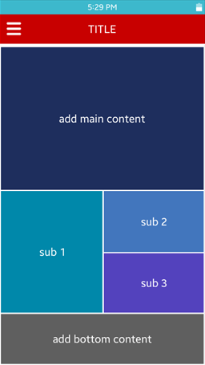

## Related information
* Dependencies
  - Tizen Studio 1.0 and Higher
