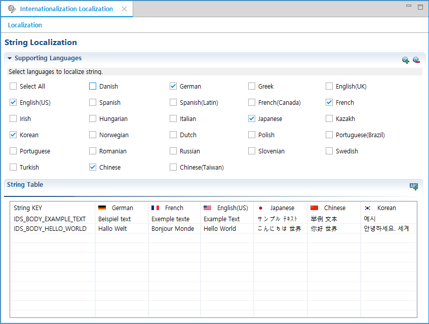
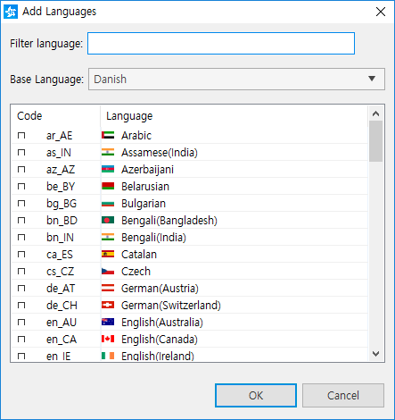
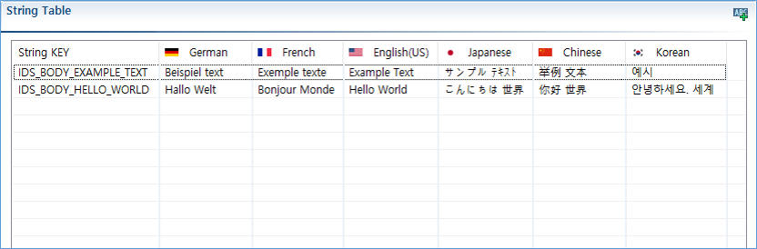

# Localizing Application Resources

Tizen works in many environments with different countries, regions, languages, and cultures. To make your application suitable for various device environments, localize application resources, such as text strings, layouts, sounds, and graphics.

This topic helps you localize text strings. Text string localization is the process of translating the strings used by your application into different languages.

> **Note**  
> Internationalization is the process of making your application able to adapt to different languages, regions, and cultures.
>
> Localization is the process of translating your application into multiple languages.

The PO file editor is a visual editor for [.po files](https://www.gnu.org/software/gettext/). It allows you to easily add, edit, and remove supported languages and strings. You can also check all strings of a supported language at a glance.

## Opening the Editor

To open the PO file editor, use one of the following methods:

- Right-click a project in the **Project Explorer** view, and select **Localization**.
- Double-click the `.po` file in the **Profile Explorer** view.

**Figure: PO file editor**

## Adding and Removing Languages

To add a new language, click the Add Language icon () and select a language code item in the **Add Languages** dialog.

**Figure: Adding a language**

If you select a base language when adding a new language, you can add and edit strings based on the base language. For example, you can select English (US) as base language when adding a new English (Canada) language, if the English (US) language already exists.

To remove a language, click the Remove Language icon (), and select a language code item in the **Remove Languages** dialog.

## Adding, Editing, and Removing Strings

The string table in the PO file editor shows the string keys and translated strings of the supported languages. The string keys are in the first column, and the translated strings are listed from the second column forward.

**Figure: String table**

To manage strings:

- Adding a string key and strings

  Click the Add a String Key icon (). A new empty row is added on the top of the string table, and you can add a new string key and translated strings in the row.

- Editing strings

  Click a cell which you want to edit to change the cell to the editing mode, and edit its content. To move between cells while editing, use the **Tab** key. After editing is ready, press **Enter**.

- Removing strings

  Right-click the row to be removed, and click **Remove**.

> **Note**  
> The `.po` file name usually has the form `<ll>_<CC>.po`, where `<ll>` stands for an [ISO 639](https://www.gnu.org/software/gettext/manual/html_node/Usual-Language-Codes.html) 2-letter language code, and `<CC>` stands for an [ISO 3166](https://www.gnu.org/software/gettext/manual/html_node/Country-Codes.html) 2-letter country code. For example, for German in Germany, the file name is `de_DE.po`.

## Related Information
* Dependencies
  - Tizen Studio 1.0 and Higher
