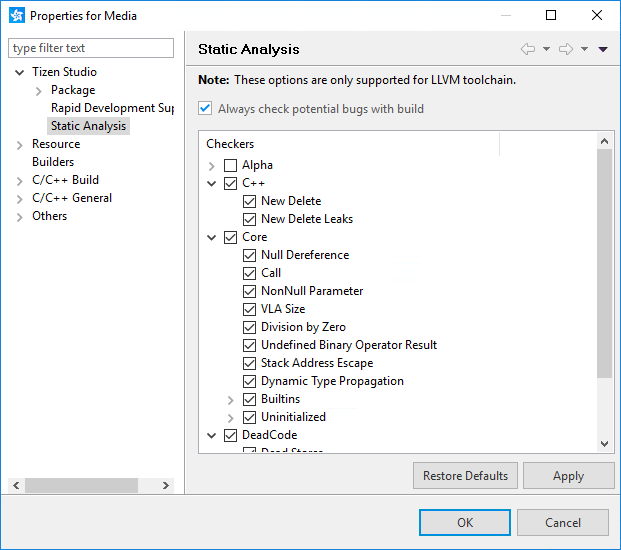
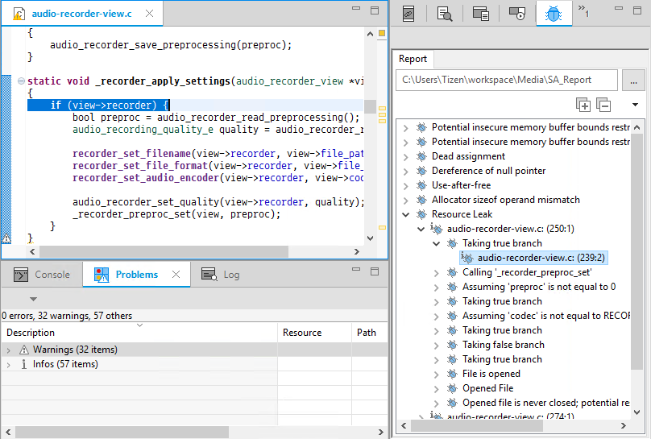

# Analyzing the Source Code

Tizen Static Analyzer is a source code analysis tool that can find static issues in Tizen native applications. It can be helpful in detecting a variety of issues in the code during compilation, well before application deployment.

Tizen Static Analyzer uses clang static analyzer to analyze C/C++ code, and reports static issues, such as Dereference of Null Pointers, Memory Leaks, Division by Zero, and Double Free.

## Running the Static Analyzer

In the **Project Explorer** view, right-click the project on which you want to run the static analyzer, and select **Check Potential Bugs with Build**.

The project is automatically built and the static analyzer is run during the build process.

**Figure: Running the Static Analyzer**

## Customizing the Static Analyzer

The static analyzer runs all available checkers by default. If you want to check only specific issues, such as memory leaks, you can customize the tool by enabling the required checkers only.

To customize the static analyzer:

1. In the **Project Explorer** view, right-click on the project and select **Properties**.

2. Go to **Tizen Studio > Static Analysis**.

3. Select and clear the checkers, as needed.

   The analysis is carried out for the selected issues only.

   

To always run the static analysis along with the build process, select the **Always check potential bugs with build** checkbox. However, note that this causes the build time to increase due to the analysis.

## Viewing Analysis Results

When the static analysis is completed, the issues found by the static analyzer are listed in the **Potential Bugs** view on the right pane of the Tizen Studio.

The issues are categorized based on type. You can expand the categories and double-click the issues to navigate to the exact location of the problem along with the path which caused the issue.

**Figure: Analysis results in the Potential Bugs view**

## Related Information
* Dependencies
  - Tizen Studio 1.0 and Higher
