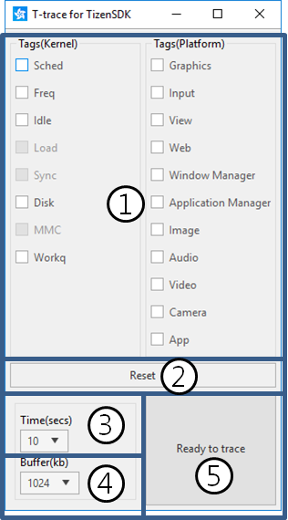
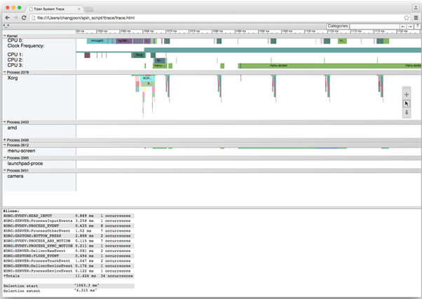
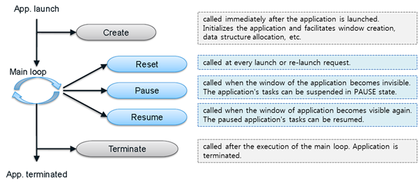
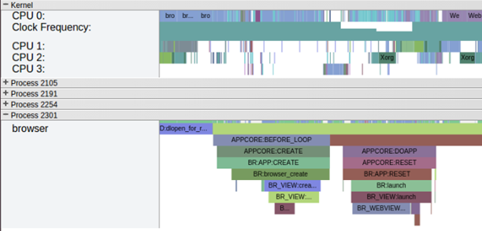

# Optimizing Performance with T-trace

The T-trace is a profiling tool that allows you to optimize application performance by measuring and visualizing instrumented function calls in the Tizen platform. It helps you to understand what the system is doing while your application is running.

## T-trace Dialog

The following figure illustrates the T-trace dialog elements.

**Figure: T-trace dialog**



1. **Tags**

   You can define which categories to trace. Currently, the T-trace provides several Tizen platform-specific categories, and a few low level system information categories. The Linux kernel and Tizen platform modules (such as EFL, xorg, and mmfw) support the categories.

   To enable the categories you want, select the applicable check boxes.

2. **Reset**

   Click the button to return all tags and options in the T-trace dialog to their default values.

3. **Time(secs)**

   Set the time period to be used for tracing. You can select a predefined value of 10, 30, 60, or 120 seconds, enter a value of your own, or select **manual** (which means that no specific tracing time is set and you stop tracing when you want).

4. **Buffer(kb)**

   Set the target buffer size. You can select a predefined value of 1024, 2048, 4096, or 10240 kb. If the set buffer size is insufficient, the oldest trace data is overwritten to accommodate new data.

5. Main button

   The main button allows you to control the tracing process based on the current operation state:

   - **Ready to trace**  
     When the **Ready to trace** button is displayed, click it to start tracing based on the selected tags and settings.

   - **No Connection**  
     When the **No Connection** button is displayed, you cannot perform any trace operations. Connect a target device to the computer to see the **Ready to trace** button.

   - **Waiting**  
     When the **Waiting** button is displayed, the T-trace is working on the target and you must wait for it to finish.

   - **Stop**  
     When the **Stop** button is displayed, click it to stop the tracing process. This button is displayed when the trace operation is started with the time period set to **manual**.

   - **Show result**  
     When the **Show result** button is displayed, the tracing process is finished. Click the button to run the viewer.

## Running the T-trace

When you run the T-trace, the tracing process gathers traces during a specified time period. After tracing is finished, the T-trace processes the traces and creates a trace report in HTML format.

> **Note**  
> To operate the T-trace, you must first install Python (2.7.x) and the Google Chrome&trade; browser on your computer.

You can run the T-trace in the Tizen Studio or from the command line:

- In the Tizen Studio:

  1. Switch on debugging mode on the target device, and connect it to your computer with a USB cable.

  2. Install your application on the target device.

  3. In the **Project Explorer** view, right-click the project and select **Profile as > Profile With T-trace**.

     The **T-trace for TizenSDK** dialog opens.

  4. In the dialog, set the tracing options and click **Ready to trace**.

- From the command line:

  1. Open the command prompt and move to the T-trace script directory:

     ```
     $ cd <TIZEN_STUDIO>/tools/ttrace
     ```

  2. Run the T-trace script with applicable options:

     ```
     $ python ttrace.py –-time=10 –-buf-size=10240 –o output_filename.html
     ```

     For more information on the command options, access the help:

     ```
     $ python ttrace.py --help
     ```

## Viewing the Tracing Result

The results are stored in the `<TIZEN_STUDIO>/tools/ttrace/trace` directory. Both a `.text` binary-format trace file and a `.html` result report file are generated. The files are named with a timestamp (YYYYMMDDHHMMSS).

You can view the results using the Google Chrome&trade; browser as a viewer. The viewer is launched with the result report when you click **Show result** in the T-trace dialog. If you run the T-trace from the command line, open the result report manually in the viewer.

**Figure: T-trace viewer**



The following table lists the keyboard shortcuts available in the viewer.

**Table: Viewer keyboard shortcuts**

| Keyboard shortcut        | Description                              |
|--------------------------|------------------------------------------|
| **W**                    | Zoom into the trace timeline.            |
| **S**                    | Zoom out of the trace timeline.          |
| **A**                    | Pan left on the trace timeline.          |
| **D**                    | Pan right on the trace timeline.         |
| **E**                    | Center the trace timeline on the current mouse location. |
| **G**                    | Show the grid at the start of the currently selected task. |
| **Shift + G**            | Show the grid at the end of the currently selected task. |
| **Left Arrow**           | Select the previous event on the currently selected timeline. |
| **Right Arrow**          | Select the next event on the currently selected timeline. |
| **Double-click**         | Zoom into the trace timeline.            |
| **Shift + Double-click** | Zoom out of the trace timeline.          |

### Result Report

The result report allows you to analyze various performance aspects of your application. The report shows how your application interacts with the Tizen framework, according to the category tags you selected for tracing. The following table shows the kind of information each tag provides.

**Table: Tag-specific information**

| Tag                 | Description                              |
|---------------------|------------------------------------------|
| Application manager | Shows how the application life-cycle management works. |
| Camera              | Shows the workflow of the camera module. |
| Input               | Shows how to process user input events from, for example, touch and keyboard. |
| Video               | Shows the workflow of the video and radio system. |
| Window manager      | Shows the state changes of the window system, such as show, hide, resize, and rotation. |
| Image               | Shows information on image processing, such as rotation, resize, and encoding. |

**Application life-cycle analysis example:**

You can analyze your application life-cycle using the T-trace in native applications. The following figure illustrates the various states of a Tizen application. The T-trace shows you the state changes as well as how much time is consumed at each state while the application is launching, running, and terminating.

**Figure: Application life-cycle**



To analyze the application life-cycle, run the T-trace with the **Application manager** tag. When the tracing process is finished, the T-trace generates a report, as shown in the following figure.

**Figure: Application life-cycle report**



In the section for Kernel and application processes, you can see your application state changes and system information, such as the CPU frequency and kernel task scheduling on a common timeline. With this information, you can investigate in which state your application spends unnecessary time and then make changes to optimize the time usage.

## Related information
* Dependencies
  - Tizen Studio 1.0 and Higher
