# Developing Applications Using Databinding

Databinding helps you to manage application-specific data sources and models along with data bindings. You can manage databinding in the **UI Builder** perspective using the **Data Binding** view, which allows you to bind JSON and XML data sources to your application UI.

In the **Data Binding** view, you can, for example, add data sources, create data models from those sources, and bind data elements to UI components in the **Design** tab. The view displays all the data sources that you have added to your application. Along with the data sources, you can also see the "data element – UI component" bindings that you have created.

> **Note**  
> Databinding is supported for 2.4 and higher mobile applications, and 3.0 and higher wearable applications.
>
> When creating the application, you must use the [Project Wizard](../project-wizard.md) and select a native UI Builder template (any template with the "UI Builder" prefix).

The **Data Binding** view opens by default when you switch to the **UI Builder** perspective. The UI Builder templates in the Project Wizard do not have any data sources by default.

## Adding Data Sources

To add a new data source:

1. Right-click in the **Data Source** panel of the **Data Binding** view and select **Add**.

   Alternatively, you can click the **ADD** icon in the toolbar.

   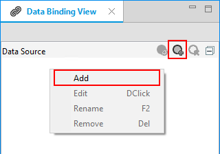

   The new data source appears in the **Data Source** panel.

   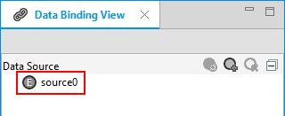

2. Right-click the new data source and select **Edit**.

   Alternatively, you can click the **EDIT** icon in the toolbar.

   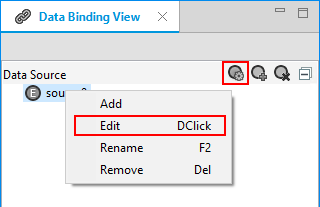

3. You can create static (default) and remote data sources:

   - To create a static data source:

     1. Set the type as **JSON** or **XML**.

     2. Add static JSON or XML data in the text area.

        The data source schema populates the side panel.

     3. Click **OK**.

     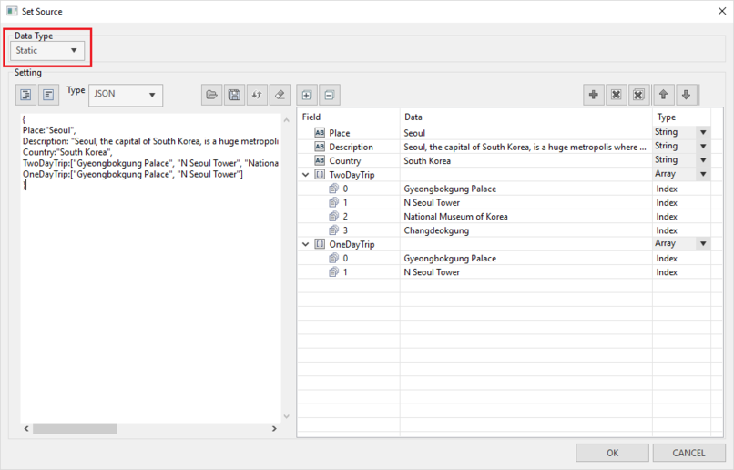

   - To create a remote data source:

     1. Change the data type from **Static** to **Remote Call**.

     2. Add the URL of the remote data source.

        You can also add query parameters, if required.

        If the data is retrieved successfully, the data source schema populates the side panel.

     3. Click **OK**.

        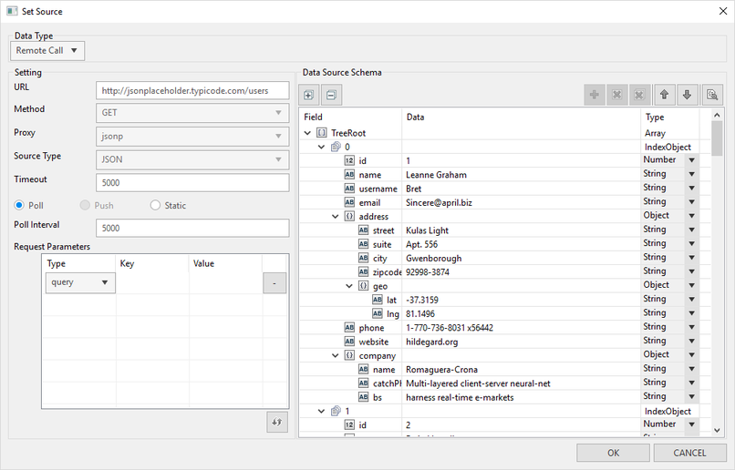

     4. If the application requires privileges, a popup window appears asking you to add them.

        Click **OK**.

        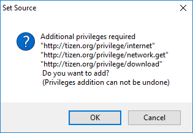

## Adding Data Models

Data models are created from the added data sources. A newly created data model is the exact replica of the data source from which the model is created. You can modify the data model according to your application’s needs. For example, to de-clutter, you can remove unnecessary data elements from the data model and keep only the relevant portion of the data source in your data model.

To add a data model:

1. Drag and drop a data source from the **Data Source** panel to the **Data Model** panel.

   Alternatively, you can select a data source from the drop-down list in the **Data Model** panel.

   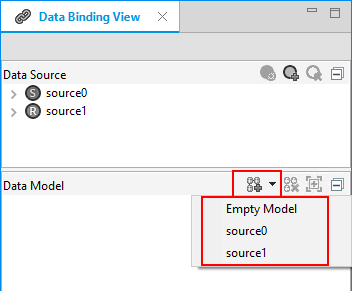

2. To remove any unnecessary data elements, right-click the element and select **Remove**.

## Creating Data Bindings

To bind a data element with a UI component present in the **Design** tab:

1. Expand the data model and select the data element which you want to bind to a UI component.

   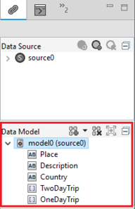

2. Drag the data element and drop it on the UI component in the **Design** tab.

   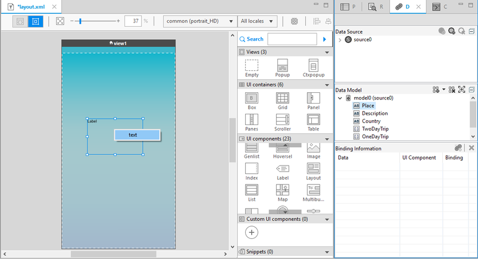

3. When you drop the data element on the UI component, the available binding types (**text** and **foreach**) are displayed in a popup window. Select the binding type you want.

   The binding information is displayed in the **Binding Information** panel of the **Data Binding** view.

   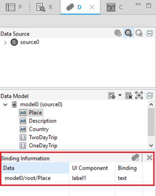

### Adding Filters For Data Bindings

In certain scenarios, based on the structure of the data received from the data source, you can apply filters to the data element while binding.

For example, if you have a data source which has information about restaurants in different places within a city (such as "Suwon") and you only want to list the restaurants present around a particular place (such as "Hwaseong Fortress"), you can use filtering to achieve this:

1. Drag the **restaurants** data element to the list UI component in the **Design** tab.

   Because direct mapping is not possible in this case, a filtering window appears.

2. Add "Hwaseong Fortress" as a filter value for the **places** data element.

3. Click **OK**.

When you run the application, the list component shows all the restaurants around Hwaseong Fortress in Suwon.

**Figure: Filtering a data binding**

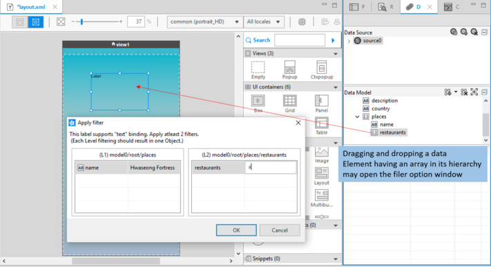

## Related Information
* Dependencies
  - Tizen Studio 1.2 and Higher
