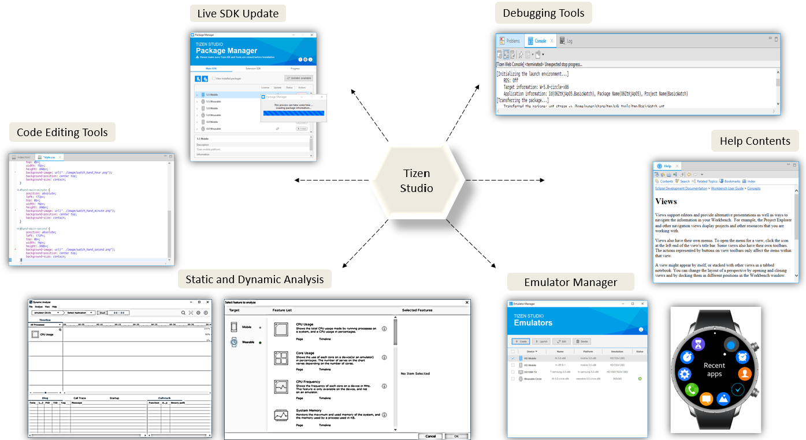

# Overview

Tizen Studio is the official IDE for developing Web applications and Native applications for Tizen. Tizen Studio consists of a comprehensive set of tools such as emulator, toolchain, sample code, documentation, and so on. These tools are used to develop Tizen applications. Tizen Studio runs on Windows®, Ubuntu®, and macOS®. 

The following figure summarizes various benefits that you can achieve using Tizen Studio IDE tools:

## Tizen Studio Views

-	**Project Explorer**: 
This view provides a hierarchical view of all the resources in the workspace. You can open files for editing or select resources for operations, such as building, packaging, signing, or validating an application: 

The following is the basic UI that you see when Tizen Studio IDE appears: 

Tizen Studio main window comprises of the following components: 

-	**Edit**: It is the area on the UI where you can write your code. 
-	**Outline**: This view shows the structural outline and object hierarchy of programming languages such as C, C++, JavaScript and so on.
-	**Problem**: This view shows the build status and packaging error or warning.
-	**Console**: This view shows the target or emulator log when applications run.
-	**Property**: This view shows the property of selected files on Project Explorer, such as file path, size, and name.

Tizen UI is easy on eyes and provides all the required features and tools that are necessary for the Tizen development, and few of the main tools are discussed in the next section. 

## Tizen Studio Tools

-	**Device Manager**: Manages the connected devices and supports installation of applications. It also supports the real target, virtual target, and remote target.
-	**Certificate Manager**: Manages the certificate profile. It can create or import author certificate. It can also use default or import distributor certificate.
- **Package Manager**: Retrieves detailed information of the installed packages on the device such as package name, label, path to the icon image, version, type, and installed storage.
- **Emulator Manager**: Creates an actual hardware environment that has real device controls, and also you can check the application features such as data processing and user scenarios.
- **Dynamic Analyzer**: Helps in performance monitoring and is an analysis tool for your Native and Web applications on a Tizen device or an emulator. 
