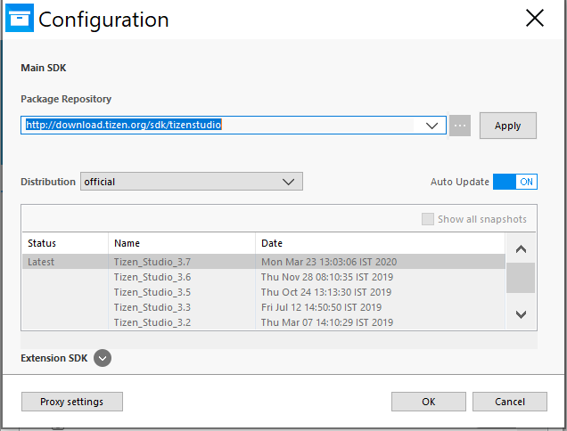
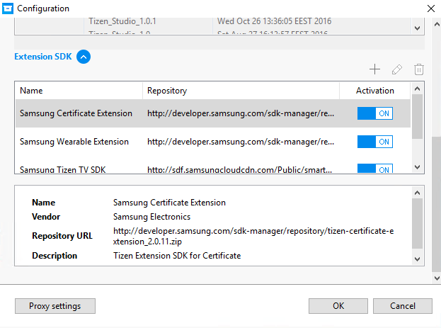
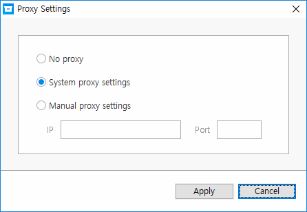
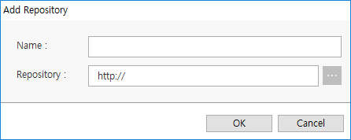
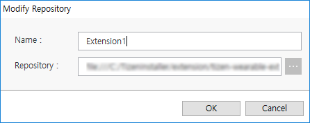
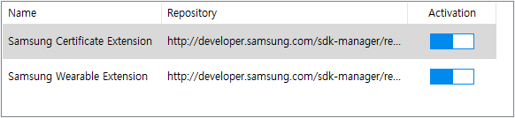

# Configure Package Manager

This page explains about configuring Package Manager for setting up various package repositories and their proxies. By performing these configurations, you get complete control over all package repositories for the main and the extension SDK. It also enables you to modify the proxy settings for accessing these package repositories.

Configure the SDK options using one of the following ways:

- Configure main SDK package repository
- Configure main SDK image
- Configure extension SDK repository
- Configure proxy

Manage extension SDK repositories using the following ways:

- Add extension repository
- Remove extension repository
- Modify extension repository
- Activate or deactivate extension repository

> **Note**
>
> The installed packages are removed automatically. Before changing the package repository, you must reinstall the packages from the changed repository.

If you want to configure Package Manager in the command line interface, see [Updating with the CLI Package Manager](update-sdk.md#updating-with-the-cli-package-manager).

### Configure Main SDK Package Repository

The package repository is a server, which stores all the packages that are used in Tizen Studio. Using Package Manager, you can install or update the packages from the package repository. 
Instead of providing a single repository for the main SDK, various  Content Delivery Networks (CDNs) are provided as per the locales. Select the desired locale specific package repository and install or update your packages seamlessly.

**Figure: Configuration window with Package Repository selected**

To set the Package Repository, follow these steps:

1. In **Package Repository** drop-down list, select an available repository, and select your desired locale specific repository for quick installation and update.
2. To validate the repository, click **Apply**. 
3. In **Distribution** drop-down list, select the distribution that you want to access.
4. Different snapshots are listed in the snapshot box based on your selection in the **Distribution** drop-down list. You can toggle **Auto Update** to **ON** and **OFF**. If you toggle **Auto Update** to **OFF**, you can select the specific snapshot from the list. If you toggle **Auto Update** to **ON**, Package Manager updates the snapshot with the latest package snapshot.
   > **Note**  
   >
   > If you toggle the **Auto Update** option to **OFF**, the update can cause entire packages to be removed to guarantee system integrity.
5. To confirm your setting, click **OK**.

### Configure Main SDK Image

To install or update packages using the SDK image, follow these steps:

1. Enter the full path of the SDK image file in the **Package Repository** field or click  next to the drop-down list to open the file browser.
2. In the file browser that appears, select the SDK image file, and click **OK**. When you select the image file, the image's origin repository information is displayed in the snapshot table.
3. To confirm your setting, click **OK**.

> **Note**  
> If you install or update packages using an image file, the SDK image's origin repository URL or distribution ID can be different from the current packages' URL or distribution ID. 
>
> The installation or update can cause entire packages to be removed to guarantee system integrity.

### Configure Extension SDK Repository

Tizen Studio supports extension packages from the extension repositories, which are developed and managed by external developers and companies. 

To configure the extension SDK, follow these steps:

1. To open the configuration panel, click **Extension SDK**  at the bottom of the dialog box.
2. To return to the package repository configuration, click **Extension SDK** .

**Figure: Configuration window with the Extension SDK unfolded**

### Configure Proxy

Package Manager provides a network option to configure a proxy. This configured proxy is used to connect to the repository servers. 

To set the proxy, follow these steps:

1. Click **Proxy Settings** at the bottom of the **Configuration** dialog box.  

2. Select the proxy option:
   - **No proxy**: Package Manager accesses the repository servers directly.
   - **System proxy settings**: Package Manager accesses the repository servers through the system proxy.
   - **Manual proxy settings**: Package Manager accesses the repository servers through the **IP** and the **Port** value that you specify.
3. Click **Apply**.

## Manage Extension Repository
### Add Extension Repository

To add an extra repository, follow these steps:

1. In the **Configuration** window that appears, scroll down to the **Extension SDK** panel or click **Extension SDK** .
2. In the repository information table, click **Add +**.
3. In the **Add Repository** dialog box that appears, enter the values in the **Name** and **Repository** fields. The **Repository** field indicates the external server address. You can also click  to select a local image file or a local server location.  

4. Click **OK**.

   In the **Configuration** window that appears, you can verify the detailed repository information.
   
5. Click **OK**.

### Remove Extension Repository

To remove an extra repository, follow these steps:

1. In the **Configuration** window that appears, scroll down to the **Extension SDK** panel or click **Extension SDK** .
2. Select an extension repository from the repository table.
3. Click .
   
   In the **Configuration** window that appears, you can verify whether the extension repository is removed or not.

### Modify Extension Repository

To modify an extra repository, follow these steps:

1. In the **Configuration** window that appears, scroll down to the **Extension SDK** panel or click **Extension SDK** .
2. Click the  icon above the repository information table.
3. In the **Modify Repository** dialog box that appears, modify the values of the **Name** and the **Repository** fields. The **Repository** field indicates the external server address. You can also click  to select a local image file or local server location.  

4. Click **OK**.
5. In the **Configuration** window that appears, check whether the repository information has changed below the table.
6. Click **OK**.

### Activate or Deactivate Extension Repository

To activate or deactivate the extra repository, follow these steps:

1. In the **Configuration** window that appears, scroll down to the **Extension SDK** panel, or click **Extension SDK** .
2. In the **Activation** column, toggle  to activate or deactivate the repository.  

3. Click **OK**.

> **Note**  
> If the extension repository is deactivated, the packages from that repository are no longer shown in Package Manager. However, if you activate the extension repository, the packages will be displayed in Package Manager.

## Related Information
- Dependencies
  - Tizen Studio 1.0 and Higher
