# Hardware Accelerated Execution Manager

The Intel Hardware Accelerated Execution Manager (Intel&reg; HAXM) is a hardware-assisted virtualization engine (hypervisor). This hypervisor uses Intel Virtualization Technology (VT) to speed-up the Tizen application emulation on the Windows&reg; and the macOS host machines. When you combine the Tizen x86 emulator images with [Tizen Studio](../index.md), Intel&reg; HAXM speed-ups the Tizen emulation on the Intel-VT-enabled systems.
Intel&reg; HAXM significantly enhances the performance of the Tizen emulator. For more information on the emulator details, see [Increasing the Application Execution Speed](../common-tools/emulator.md#speed).

This page explains how to install HAXM on your [Windows&reg;](#on_Windows) or [macOS](#on_MacOS) development system.

Following are the hardware requirements:

- Intel processor with support for VT-x, EM64T, and Execute Disable Bit
- Minimum 1 GB of available memory (2 GB or more is preferred)

> **Note**   
>
> Intel&reg; HAXM can only be used on the systems with an Intel processor that supports the Intel VT.

<a name="on_Windows"></a>
## How to Install Intel&reg; HAXM on Windows&reg;?

Following are the supported Windows&reg; versions: 
- 10/8.1/8/7 (32-bit/64-bit)
- Vista (32-bit/64-bit)
- XP SP2 or higher (32-bit only)

HAXM is automatically installed as part of the Tizen Studio installation. To install HAXM separately, see [http://download.tizen.org/sdk/haxm/7.0.0/win/](http://download.tizen.org/sdk/haxm/7.0.0/win/IntelHAXM_7.0.0.exe) and download the Windows installer package.

**Table: Windows installer package**

| Windows installer                        | File description | File size | MD5 checksum                     |
|----------------------------------------|----------------|---------|--------------------------------|
| IntelHAXM_7.0.0.exe | System driver    | 2.89 MB   | 1587f7ae42e11c7b22dc674fd776ce252b6a19152e7ca416a748e2bdbf2b36c5 |

To install Intel&reg; HAXM on Windows&reg;, follow these steps:

1. Open the downloaded DMG file and run the installer.
2. In the User Account Control dialog that appears, to accept the UAC prompt, click **Yes**.  
   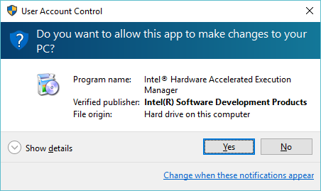

3. To start the installation, click **Install**.  
   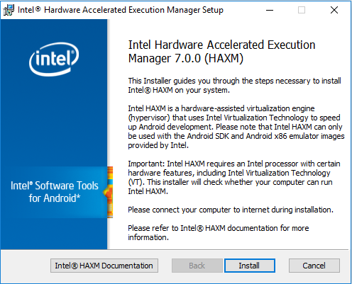  

   To access the documentation, click **Intel&reg; HAXM Documentation**.

   The following screen shows the installation in-progress:
   
   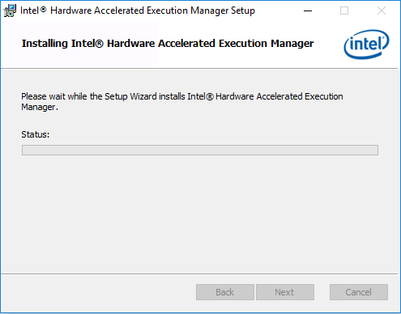

4. When the Intel&reg; HAXM installation is completed, to exit the installer, click **Finish**.

   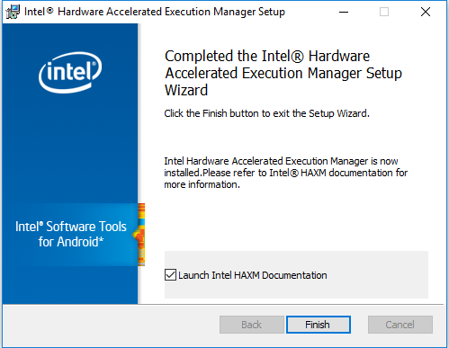

Intel&reg; HAXM is successfully installed.

Execute the following command, to verify whether Intel&reg; HAXM is running:

```
sc query intelhaxm 
```

If Intel&reg; HAXM is working, the command displays a status message indicating that the state is "4 RUNNING".  
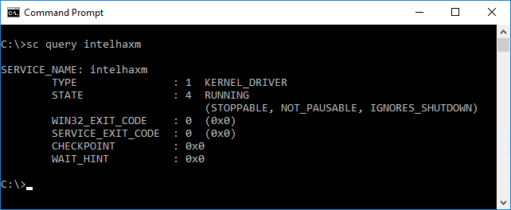

### How to Start and Stop Intel&reg; HAXM?

To start or stop Intel&reg; HAXM, open the command prompt window with administrator privileges and execute one of the following commands:

- Start HAXM: `sc start intelhaxm`
- Stop HAXM: `sc stop intelhaxm`

### How to Remove Intel HAXM?

> **Warning** 
> 
> Close all instances of the Tizen emulator before removing Intel&reg; HAXM.

To uninstall Intel&reg; HAXM, either run the installer or use the control panel.

> **Note** 
> 
> If you remove Intel&reg; HAXM, the acceleration of the Tizen emulator is disabled; however, the emulator is still enabled. To re-enable the acceleration, install Intel&reg; HAXM again.

### Troubleshooting

If there is an installation failure because of the hardware requirements, check the following BIOS/OS settings:

- Ensure that **VT** is enabled in BIOS.
- Ensure that **Execute Disable Bit** is enabled in BIOS.
- Ensure that **Data Execution Prevention** is enabled in Windows&reg;. In the Windows&reg; platform, click **Control Panel > System** and then select **Advanced system settings**. In the **Advanced** tab that appears, select **Performance section**, **Options** (or **Settings**), and **Data Execution Prevention**. Ensure that **DEP** is enabled.
- Ensure that **Hyper-V** is disabled in Windows&reg; 8 or higher:  
  1. In the **Start** menu, run **Programs and Features**.  
  
  2. In the **Programs and Features** window that appears, click **Turn Windows features on or off**.
  3. In the **Turn Windows features on or off** window that appears, disable **Hyper-V** and click **OK**.  
  
  4. Reboot the computer.

<a name="on_MacOS"></a>
## How to Install Intel&reg; HAXM on macOS?

Following are the supported macOS versions: 
- 10.12 Sierra (64-bit) 
- 10.11 OS X El Capitan(64-bit) 
- 10.10 Yosemite (64-bit)
- 10.9 Mavericks (64-bit)
- 10.8 Mountain Lion (64-bit)

HAXM is automatically installed as part of the Tizen Studio installation. To install HAXM separately, see [http://download.tizen.org/sdk/haxm/7.0.0/mac/](http://download.tizen.org/sdk/haxm/7.0.0/mac/IntelHAXM_7.0.0.dmg) and download the macOS installer package.

**Table: Windows installer package**

| macOS installer                          | File description | File size | MD5 checksum                     |
|----------------------------------------|----------------|---------|--------------------------------|
| IntelHAXM_7.0.0.dmg | System driver    | 218 KB    | fe7e4cd86b7a2b85591397fd6bf2ef43e7b088bfc72badab0c4d3532a65c2a2f |

To install Intel&reg; HAXM on macOS, follow these steps:

1. Open the downloaded DMG file and run the installer.

2. To start the installation, click **Continue**.  
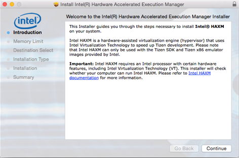

3. Either adjust the amount of RAM to be allocated to Intel&reg; HAXM or set it to **2048 MB** as the default value.  
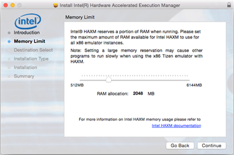  
The installer also functions as a configuration tool for Intel&reg; HAXM. To change the memory settings later, run the installer again.

4. Verify your Intel&reg; HAXM memory allocation settings, and click **Continue**.  
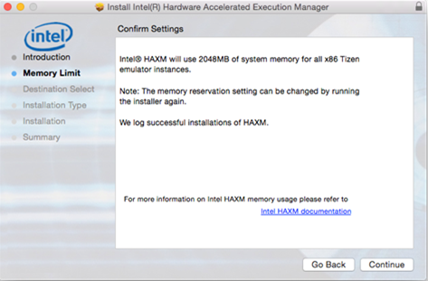

5. Check the capacity and the disk location of the HAXM driver, and click **Install**.  
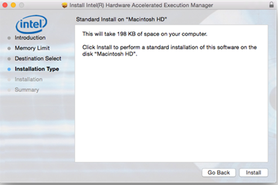

6. Type your password.  
	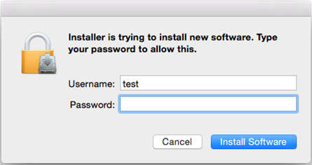

7. When the Intel&reg; HAXM installation is finished, to exit the installer, click **Close**.

   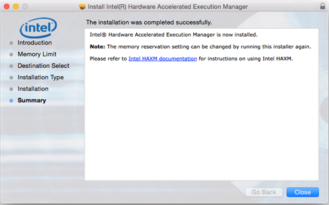

The Intel&reg; HAXM gets successfully installed.

To verify if Intel&reg; HAXM is running, execute the following command:

```
kextstat | grep intel 
```

If Intel&reg; HAXM is successful, the command displays a status message indicating that the kernel extension named "com.intel.kext.intelhaxm" is loaded.  


### How to Start and Stop Intel&reg; HAXM?

To start or stop Intel&reg; HAXM, open the terminal window with administrator privileges and execute one of the following commands:

- Start HAXM: `sudo kextload –b com.intel.kext.intelhaxm`
- Stop HAXM: `sudo kextunload –b com.intel.kext.intelhaxm`

### How to Remove Intel HAXM?

> **Warning** 
> 
> Close all the instances of the Android emulator before removing Intel HAXM. Intel HAXM cannot be removed while in use.

1. T o uninstall Intel HAXM, execute the following command in the terminal window:

   ```
   sudo /Library/Extensions/intelhaxm.kext/Contents/Resources/uninstall.sh
   ```

2. Enter your current user password. Follow the uninstaller prompts, to remove Intel HAXM.


> **Note** 
> 
> If you remove Intel&reg; HAXM, the acceleration of the Tizen emulator is disabled, however, the emulator is still enabled. Existing x86 and x86_64 Android Virtual Devices may no longer boot. To re-enable the acceleration, install Intel&reg; HAXM again.

### Troubleshooting

- Intel Execute Disable (XD) Bit capability error:

  When installing Intel HAXM, you may encounter an error regarding Intel XD support.
  This error message can be triggered by one of the following conditions:

  - Intel XD is not supported by your computer’s processor
  - Intel XD is not enabled
  
  **Intel XD is not supported**
  
  Intel HAXM requires an Intel processor with Execute Disable (XD) Bit functionality and cannot be used on systems lacking this hardware feature. To determine the capabilities of your Intel processor, see http://ark.intel.com/.
  
  **Intel XD is not enabled**
  > **Note**
  >
  > Apple computers have Intel XD permanently enabled if supported by the processor.
  
  If you receive an error message indicating that Intel XD is not enabled, your computer does not meet the minimum system requirements to use Intel HAXM. To determine the capabilities of your Intel processor, see http://ark.intel.com/.

- Intel Virtualization Technology (VT-x) capability:

  When installing Intel HAXM, you may encounter an error regarding Intel VT-x support. This error message can be triggered by the following conditions:

  - Intel VT-x is not supported by your computer’s processor
  - Intel VT-x is not enabled
  
  **Intel VT-x is not supported**
  
  Intel HAXM requires an Intel processor with Intel VT-x functionality and cannot be used on systems lacking this hardware feature. To determine the capabilities of your Intel processor, see http://ark.intel.com/.

  **Intel VT-x not enabled**
  > **Note**
  >
  >  Apple computers have Intel VT-x permanently enabled if supported by the processor.
  
  If you receive an error message indicating that Intel VT is not enabled, your computer does not meet the minimum system requirements to use Intel HAXM. To determine the capabilities of your Intel processor, see http://ark.intel.com/.

## Related Information
- Dependencies
  - Tizen Studio 1.0 and Higher
