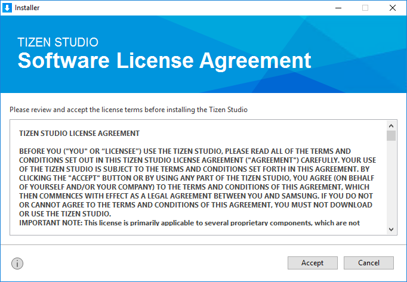
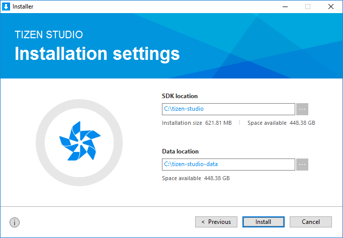
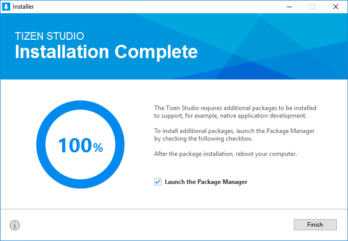

# Install Tizen Studio on macOS

This page explains the process to download and install Tizen Studio on your development hardware. 

To have the optimal installation experience, follow these steps chronologically:

- System prerequisites
   - Hardware requirements
   - Software requirements
   - Additional requirements
- Launch installer
- Verify installation

## System Prerequisites

Ensure that the following system prerequisites are met:

### Hardware Requirements
<table>
  <tr>
      <td width=150px>CPU</td>
    <td colspan="3" width=50px>Dual Core, 2Ghz or faster</td>
  </tr>
  <tr>
    <td>Architecture</td>
    <td width=520px>x64 only</td>
  </tr>
  <tr>
    <td>Memory</td>
    <td colspan="3">3GB or more </td>
  </tr>
  <tr>
    <td>Disk Space</td>
    <td colspan="3">6 GB or more </td>
  </tr>
</table> 

### Software Requirements
<table>
  <tr>
    <th colspan="2" align=left>MacOSX</th>
  </tr>
  <tr>
    <td width=190px>Version</td>
    <td width=520px>10.13 (High Sierra) 10.12 (Sierra) 10.11 (El Captain)</td>
  </tr>
  <tr>
    <td>Bit</td>
    <td>64 bit only</td>
  </tr>

  <tr>
    <td>Tizen Studio setup file</td>
    <td><a href="https://developer.tizen.org/development/tizen-studio/download#" class="clickable" target="_blank">Download </a></td>
  </tr>
</table>

### Additional Requirements

<table>
<thead>
<tr>
<th>Component</th>
<th>Requirement</th>
</tr>
</thead>
<tbody>
<tr>
<td>Prerequisite packages (<code>msgfmt</code>) to build PO files
</td>
<td>On the terminal prompt, type the following commands:
<pre><code>$ brew install gettext
$ brew link gettext -force
$ which msgfmt
/usr/local/bin/msgfmt
</code></pre>
<strong>Note</strong> 
To install Homebrew, see the<a href="http://brew.sh/">Homebrew documentation</a>.
</td>
</tr>
</tbody>
</table>

## Launch Installer
 
To launch the installer, follow these steps:

1. Double click on the downloaded installer file **web-ide_Tizen_Studio_x.x-64.dmg**.
   
   > [!NOTE]
   >**x.x** represents the latest version of Tizen Studio, for example:web-ide_Tizen_Studio_**3.7**-64.dmg.

2. Accept the software license.
   
   > [!NOTE]
   > The license contains important legal notices for using Tizen Studio. Read it fully, and click **Accept** only if you agree with the license terms.

   
3. Click **Browse** and specify a new directory to set the SDK location and the data location. 
   
   
   
   > [!NOTE]
   > If the new directory is valid, it shows no errors.
4. Click **Install**.
5. Click **Finish** and close the installer.
   
   
   > [!NOTE]
   > - If you want to install additional platforms and tools, launch  Package Manager by selecting the Launch Package Manager **check box** and click **Finish**.
   > - Use Tizen Studio Package Manager, to install and update additional tools. 
   > - For more information on the Package Manager, see [Updating Tizen Studio](./update-sdk.md).

## Verify Installation

To verify whether the installation is successful or not, click **Tizen Studio icon**. Tizen Studio startup window must appear.

