# How to Develop Wearable Web Applications using Template

## Introduction
Wearable Web applications are apps that help you monitor health, show time, play games, and much more. These applications are developed using various Web-native languages, such as HTML5, Cascading Style Sheets (CSS), and JavaScript.

This page explains how to develop a Wearable Web application in Tizen Studio using an existing **Template**.

## System Requirements

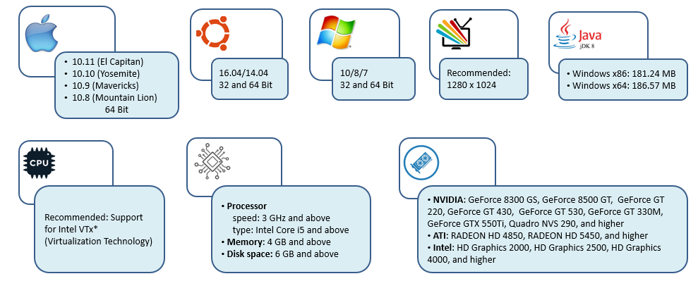

### Download Tizen Studio
You can download and install Tizen Studio using the IDE installer or the CLI installer. For more information, see https://developer.tizen.org/tizen-studio/download

## Tizen Studio UI

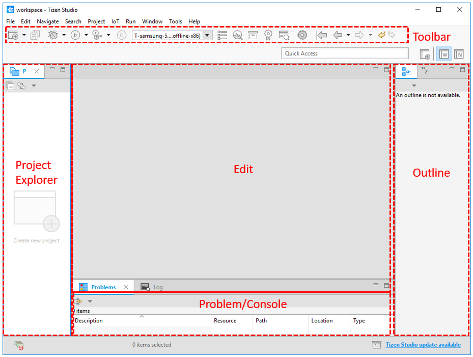

## Create Project 

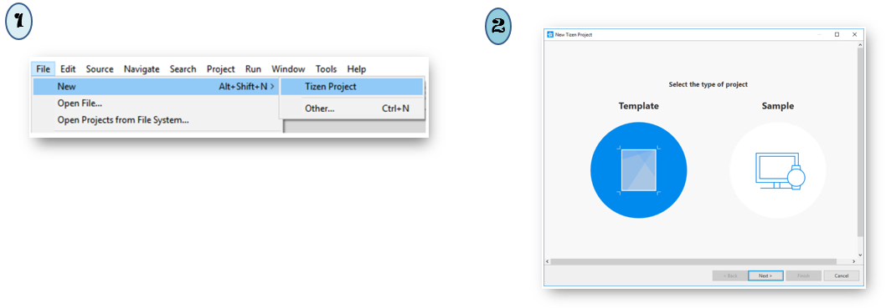

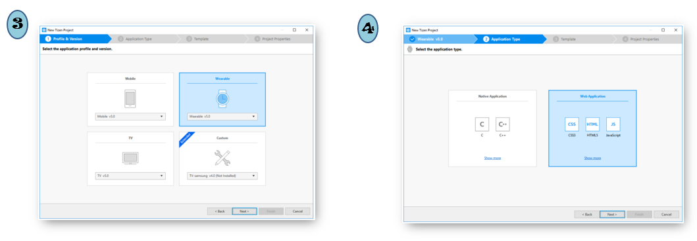

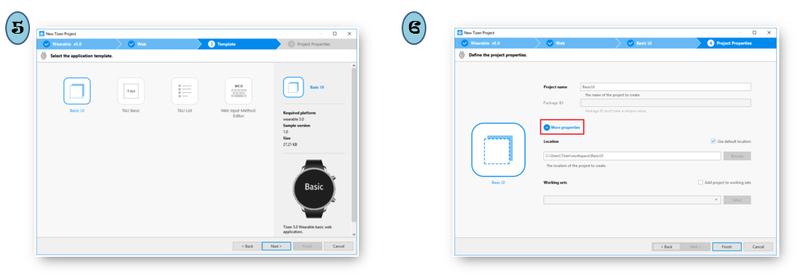

## Generate Author Certificate

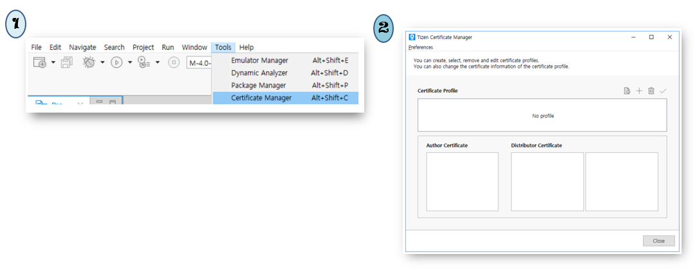

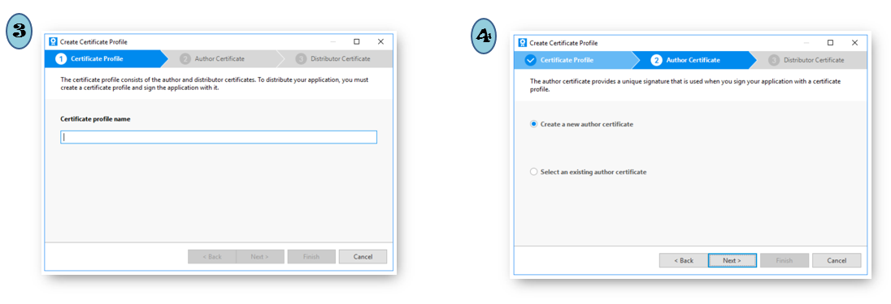

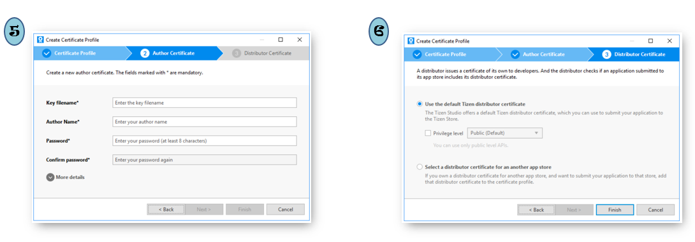

## Running Application on Emulator

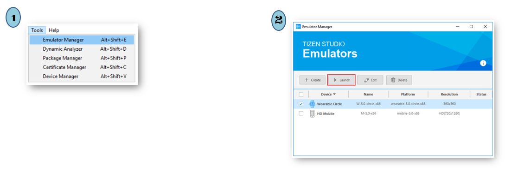

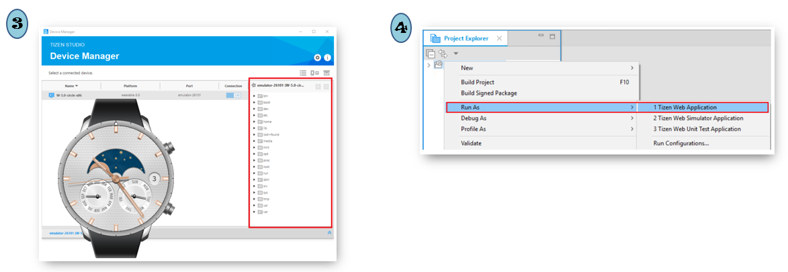

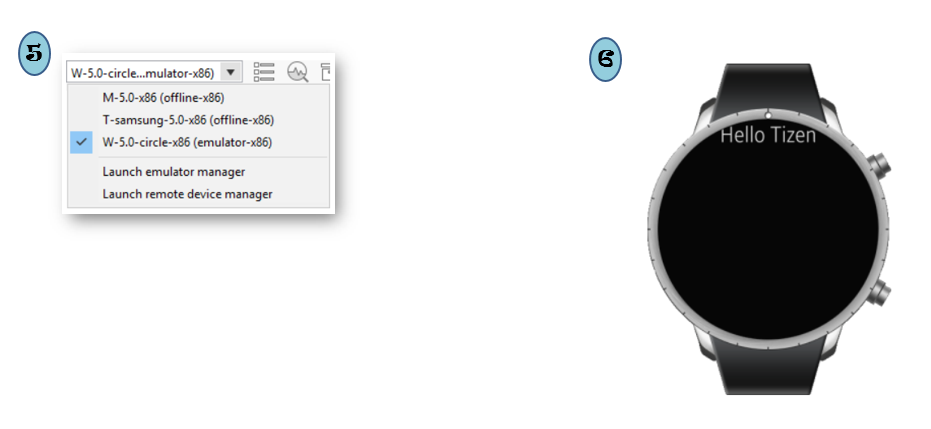

## Running Applications on Target Device

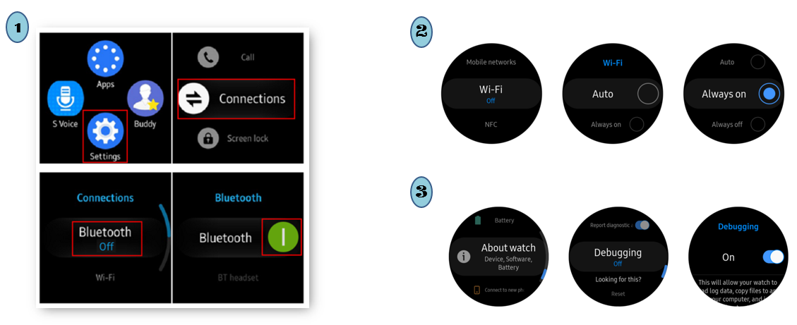

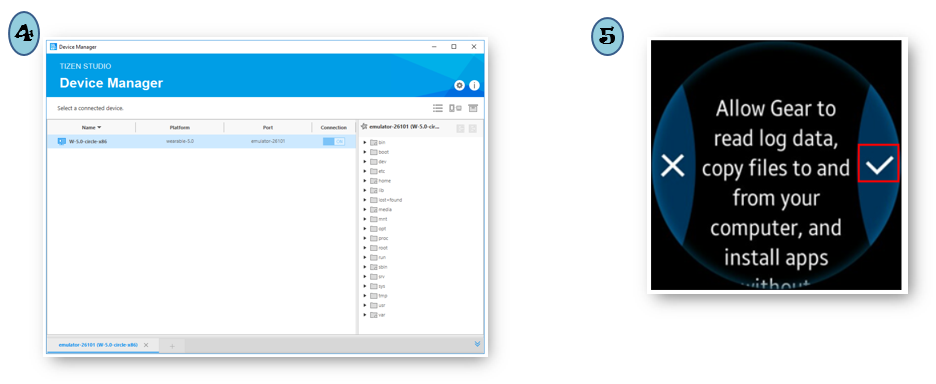

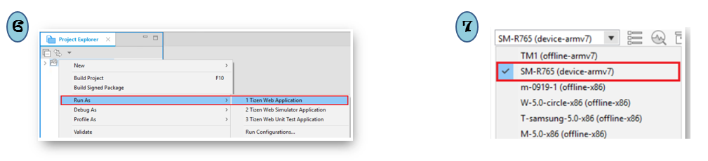

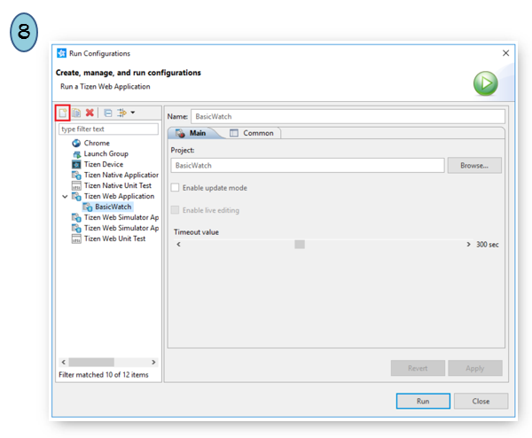

