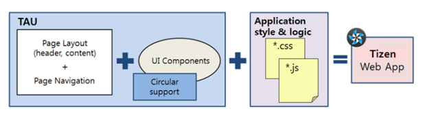
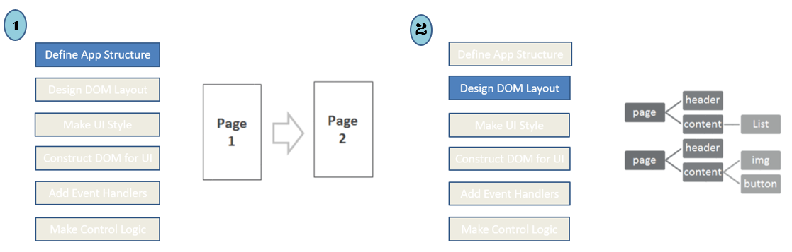
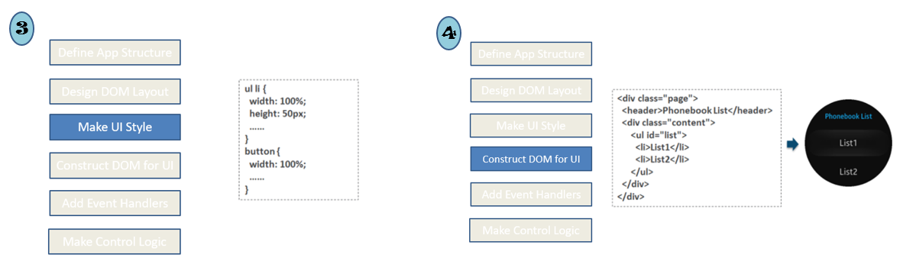
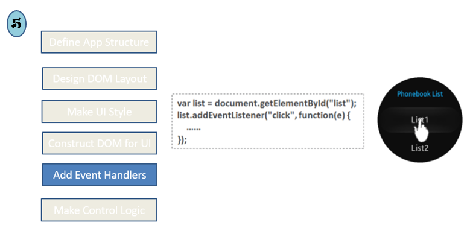
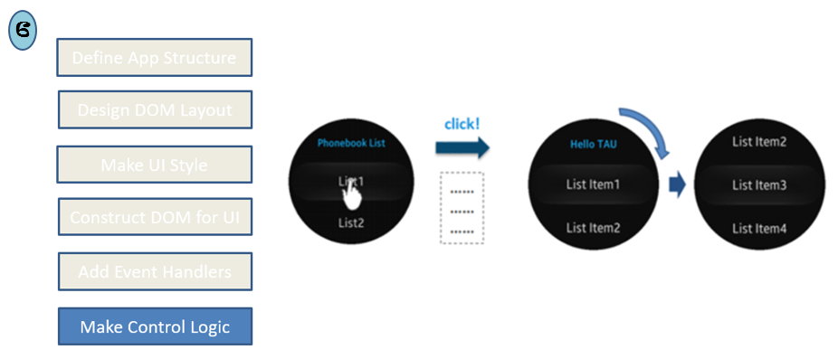
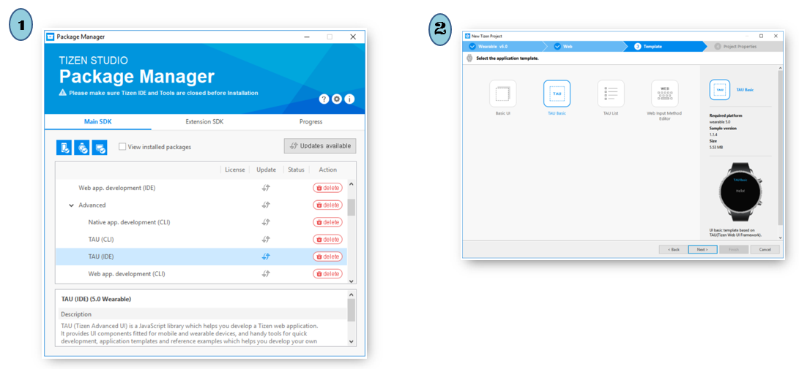
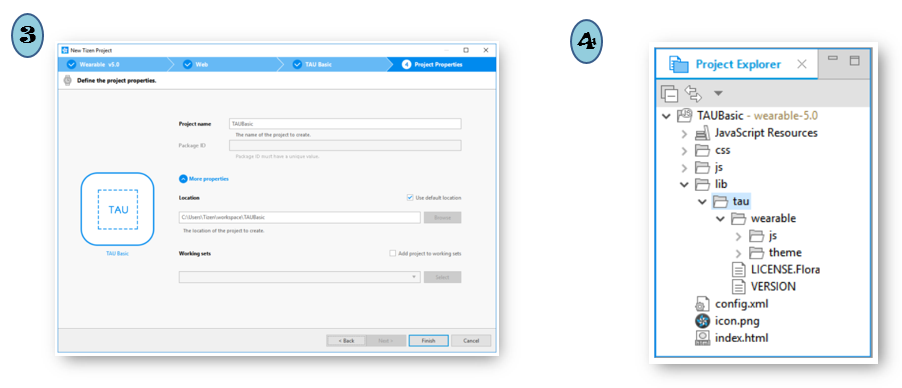
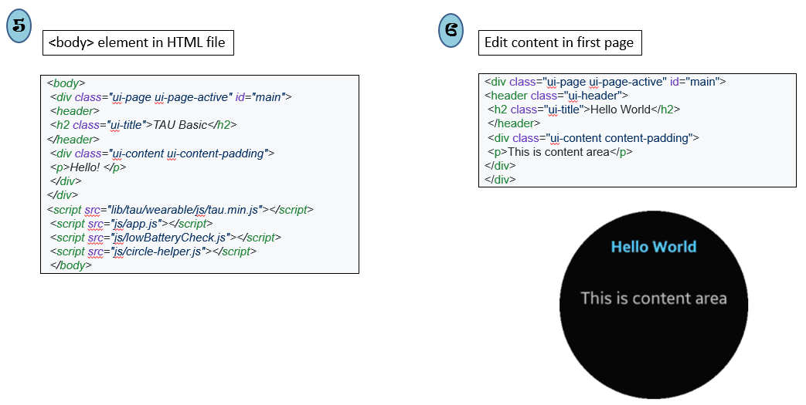
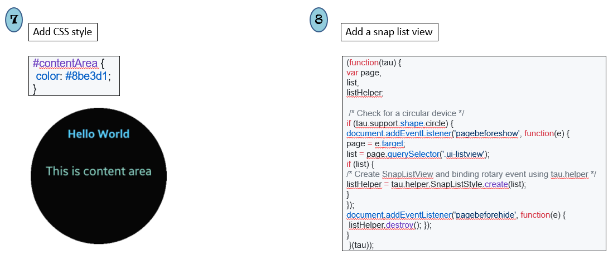
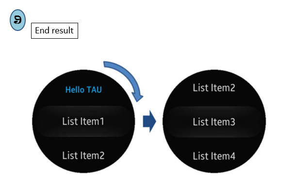

# How to Develop Wearable Web Application with TAU

TAU stands for Tizen Advanced UI framework, which is the Tizen Web UI framework. 
TAU helps you to: 
- Create, manage pages, and various kinds of UI components 
- Use utilities for Web applications such as using transition effect for pages
- Support the Mobile and Wearable profiles 
- Support the circular UI for Wearable devices

The concept of TAU is similar to jQuery Mobile, which is a commonly used for Web UI for making responsive Web sites and applications on the mobile devices. Compared to jQuery Mobile, TAU is much faster because it is created with pure JavaScript.
TAU supports the layout styles and page navigation of Web applications. TAU makes it easy to develop your own Tizen Web application with the UI components provided by TAU.

This page explains how to develop a Wearable Web application in Tizen Studio using **TAU**.

## TAU Development Process

## Web Application with TAU

