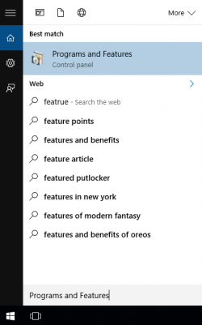
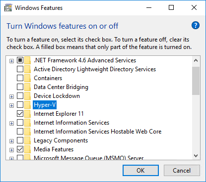

## Troubleshooting 

This page provides the information needed to troubleshoot Tizen Studio. Participate in the [Tizen User Community forum](https://developer.tizen.org/forums), and suggest ways to improve the documentation. This page describes methodologies, techniques, and procedures for troubleshooting problems that might arise in the day-to-day operations while using Tizen Studio.

## Issue: HAXM fails to install
**Description:** You encounter an HAXM installation failure.

**Solution:** 
- Ensure that **VT**, **Execute Disable Bit** option is enabled in BIOS
- Ensure that **Data Execution Prevention** is enabled in Windows&reg;
        
  - To enable **Data Execution Prevention**On the Windows&reg;, follow these steps:

    1. Click **Control Panel > System and Security > System**.
    2. Select **Advanced system settings**.
    3. In the left navigation bar, Click **Advanced**.
    4. In **Performance section**, click **Settings**.
    5. In **Performance Options** dialogue window that appears, click **Data Execution Prevention**.
    6. Select **Turn on DEP**. 
    7. Click **Apply** and click **OK**.

- Ensure that **Hyper-V** is disabled (on Windows&reg; 8 or after).
    1. In the **Start** menu Run **Programs and Features**.  
         
    2. In the **Programs and Features** window, click **Turn Windows features on or off**.
    3. In the **Turn Windows features on or off** window that appears, disable **Hyper-V** and click **OK**.  
         
    4. Reboot the computer.
 
## Issue: HAXM installation fails due to Intel Execute Disable (XD) Bit capability

**Description:**
 While installing Intel HAXM, you may encounter an error regarding the Intel XD support.
  This error message can be triggered by the following conditions:

  - Intel XD is not supported by your computer�s processor
  - Intel XD is not enabled
  
  **Solution:** 
   - **For Intel XD not supported**
  
   Intel HAXM requires an Intel processor with Execute Disable (XD) Bit functionality and cannot be used on systems not supporting this hardware feature. To determine the capabilities of your Intel processor, see [official site] (http://ark.intel.com/).
  
   - **For Intel XD not enabled**
      > **Note**
      >
      > Apple based computers have Intel XD permanently enabled, if the feature is supported by the processor.
  
   If you receive an error message that Intel XD is not enabled, it implies that your computer does not meet the minimum system requirements to use Intel HAXM.In addition, to determine the capabilities of your Intel processor, see [official site](http://ark.intel.com/).


## Issue: HAXM installation fails due to Intel Virtualization Technology (VT-x)
**Description:**
  When installing Intel HAXM, you may encounter an error regarding Intel VT-x support. This error message can be triggered by the following conditions:

   - Intel VT-x is not supported by your computer�s processor
   - Intel VT-x is not enabled
  
**Resolution:** 
- **Intel VT-x is not supported**
  
Intel HAXM requires an Intel processor with Intel VT-x functionality and cannot be used on systems lacking this hardware feature. To determine the capabilities of your Intel processor, see [official site](http://ark.intel.com/).

  - **Intel VT-x is not enabled**
    > **Note**
    >
    >  Apple based computers have Intel VT-x permanently enabled, if the feature is supported by the processor.
  
If you receive an error message indicating that Intel VT is not enabled, your computer does not meet the minimum system requirements to use Intel HAXM. To determine the capabilities of your Intel processor, see the [official site](http://ark.intel.com/).
  

## Issue: Visual Studio throws errors when using Tizen.NET.SDK 1.0.0

**Description:**

Visual Studio Tools for Tizen support Visual Studio 2019 (16.0 or higher version), yet you encounter errors while using Tizen.NET.SDK 1.0.0 or 1.0.1 as shown in the following:

```
Severity    Code	    Description	Project	File	Line	   Suppression State
Error	  NETSDK1013	The TargetFramework value 'tizen40' was not recognized. It may be misspelled. If not, then the TargetFrameworkIdentifier and/or TargetFrameworkVersion properties must be specified explicitly.	AnalogWatch.Tizen.Wearable	C:\Program Files\dotnet\sdk\2.1.700\Sdks\Microsoft.NET.Sdk\targets\Microsoft.NET.TargetFrameworkInference.targets	96
```
**Resolution:**

This error occurs due to the recent changes in visual studio project system. You can resolve the issue by following
either of the options: 

1. Use Tizen.NET.Sdk 1.0.3
   Since Tizen.NET.Sdk 1.0.3, Tizen.NET can be used as a custom SDK for MSBuild.
   
   ```
   <Project Sdk="Tizen.NET.Sdk/1.0.3">

   <PropertyGroup>
      <OutputType>Exe</OutputType>
      <TargetFramework>tizen40</TargetFramework>
   </PropertyGroup>

   </Project>
   ```
   
2. Use Microsoft.NET.Sdk, if you want to continue working with existing Tizen project using legacy Tizen.NET.Sdk. Add the following lines to your **csproj** file:
   ```
   <Project Sdk="Microsoft.NET.Sdk">

   <PropertyGroup>
      <OutputType>Exe</OutputType>
      <TargetFramework>tizen40</TargetFramework>
      <!- Workaround: Set TargetFrameworkIdentifier to avoid Tizen TFM issue on VS2019 -->
      <TargetFrameworkIdentifier>Tizen</TargetFrameworkIdentifier> 
      <TargetFrameworkVersion>v4.0</TargetFrameworkVersion>
   </PropertyGroup>

   </Project>
   ```

## Issue: Cannot use external library (FSharp.Core.dll) in .NET Core SDK preview version
**Description:**  While trying to use external libraries, you get an error. 

**Resolution:** 

1. Switch from .NET Core SDK preview version (v3.0.0-preview5) to .NET Core SDK preview version 2.2.102 
2. Build using Visual Studio (right click on the **Project > Build**) and the FSharp.Core.dll library gets included in the build directory, and using the functions from FSharp.Core will also resolve the issue.

## Issue: Screen Reader not working

**Description:** 
The screen reader is not working 

**Resolution:** 
- Check whether the accessibility TTS(screen reader - voice assistant) and SystemSettings.AccessibilityTtsEnabled is enabled. For more information, see [Accessibility](https://developer.tizen.org/dev-guide/csapi/api/Tizen.System.SystemSettings.html#Tizen_System_SystemSettings_AccessibilityTtsEnabled).


## Issue: Emulator terminates unexpectdly on MacOS&reg;

**Description:** If you use a Macbook that has both Intel HD and NVIDIA graphics, the emulator terminates nexpectedly while you execute the emulator with OpenGL ES version 1.1 or 2.0.

**Resolution:** 
1. Verify the emulator configuration in **Emulator Manager**. 
2. On **General tab** in the Emulator configuration window, set **OpenGL ES version to version 2.0** or to **version 3.0.**

## Issue: UI display perspective issues on MacOS
**Description:** : After updating Tizen Studio, UI perspectives are not displayed properly.

**Resolution:**

- In MacOS, if the UI perspectives are not displayed properly, after you update Tizen Studio. It is recommended to restart the IDE, doing so clears the cache from the previous installation.

- In case, you see any old perspective, it is recommended to create a new workspace and import the projects to the new workspace to resolve the issue.

## Issue: Not able to view Connection Explorer

**Description:** Cannot view Connection Explorer.  

**Resolution:**
Since Tizen Studio 2.0 and higher,**Connection Explorer** is replaced with **Device Manager**. Additionally, You can fix this issues in following ways:

- Reset the perspective:
  1. In Tizen Studio menu, select **Window > Perspective > Reset Perspective**.
  2. After updating Tizen Studio to higher version, run the following command:
  `eclipse.exe -clean -clearPersistedState` 
  3. Launch the Tizen Studio normally.

>**Note:** 
>
> You can create unit tests for Tizen Studio versions higher than 2.3.1. 

## Issue: Preview tab does not appear

**Description:**

The preview tab in the Web Page Editor does not appear. 

**Resolution:**
- Use Web SDK HTML Editor, that enhanced features compared to the Web Page Editor. 
- Instead of the preview tab in the Web Page Editor, use the preview feature by pressing the **Ctrl + 4** combination of keys in Web SDK HTML Editor.
- In Rapid Development Support (RDS) mode, the web unit test result is not updated.

## Issue: Cannot launch Tizen Studio with GDB Client

**Description:** Tizen Studio fails to launch with GDB client on Ubuntu 18.04
**Resolution:**

Ubuntu 18.04 does not come with readline6 dev package,to install the readline6 dev package, run the following command, for 64 bit system:

```
$ wget http://mirrors.edge.kernel.org/ubuntu/pool/main/r/readline6/libreadline6-dev_6.3-8ubuntu2_amd64.deb
$ wget http://mirrors.edge.kernel.org/ubuntu/pool/main/r/readline6/libreadline6_6.3-8ubuntu2_amd64.deb 
$ sudo dpkg -i libreadline6_6.3-8ubuntu2_amd64.deb
$ sudo dpkg -i libreadline6-dev_6.3-8ubuntu2_amd64.deb 
```

Xenial (16.04) contains libreadline6-dev package, but Ubuntu 18.04 does not. You can download and install it with the preceding commands.

## Issue: Emulator stuck at booting kernel

**Description:** Emulator gets stuck at booting kernel 

**Resolution:**

 The cause for such an issue is that the user has insufficient permissions. To resolve this problem, after installing KVM for Ubuntu-18.04, run the following command:

```
$ sudo adduser $USER kvm
```
After the command is executed,  "kvm" group(/dev/kvm) will be added into the group file(/etc/group).

> **Note**
>
> To apply this change, you must restart or logout/login.


