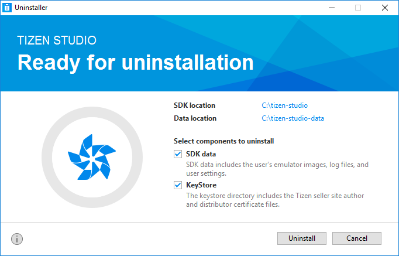
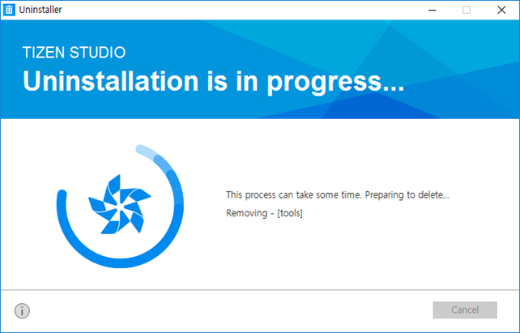

# Uninstall Tizen Studio

This page explains how to uninstall Tizen Studio from your system. Tizen Studio uninstaller removes all the installed Tizen platforms and the tools. During the uninstallation procedure, all the data stored in the installation directory is removed. It includes any customizations or any other data that is stored within that directory. Take a back up of any data that you want to keep before performing the uninstallation procedure.

You can uninstall Tizen Studio in one of the following ways: 
- Using GUI uninstaller
- Using CLI uninstaller

> [!NOTE]
> For more information on how to remove a single package or multiple packages, see [Updating Tizen Studio](update-sdk.md).

## GUI Uninstaller

With an intuitive interface, the GUI uninstaller simplifies the uninstallation process. You can easily uninstall Tizen Studio and the related platforms and packages. 

To uninstall Tizen Studio using GUI uninstaller, follow these steps:

1. Back up all the data and the files in case you want to keep them for future reference. 
   > [!NOTE]
   > Once you start the uninstallation process, the process is irreversible. You cannot restore the removed files.
2. Launch Tizen Studio uninstaller, click the **uninstaller icon.**
3. Check the following section to make a choice of components that you want to uninstall. 

   - **SDK data**  
   The SDK data directory typically contains user-created data files, including emulator images, log files, and tool configuration files.

   - **KeyStore**  
   The Keystore directory is located inside the SDK data directory and contains the author and distributor certificate files. If the certificate files are deleted, you cannot restore them from any Tizen seller market site. If you plan to install another Tizen Studio version or reinstall Tizen Studio later, it is strongly recommended that you back up the certificate files or keep the Keystore directory by unchecking the **KeyStore** component.

     > [!NOTE] 
     > If you do not select SDK data or KeyStore components, you can keep the SDK data or KeyStore files in their directories for future re-use.

4. To remove all the installed platforms, packages, tools, and the user-created data and the files, click **Uninstall**.

   

5. If you click the **checkbox** to uninstall the SDK data or the KeyStore components, they get uninstalled during the process. In case you want to keep one of them, uncheck the respective **checkbox**.

   

## CLI Uninstaller

For advanced users, Tizen Studio provides a CLI uninstaller. The following procedure facilitates removing Tizen Studio and the related platforms and packages. 

To uninstall Tizen Studio using the CLI uninstaller, run th eCLI Package Manager with `uninstall` command using the following syntax:

   ```
   package-manager-cli uninstall [-p <password>] <package name>[,...] | [--all]
   ```

The following table explains various command parameters to perform uninstallation tasks:

**Table: Uninstall command parameters**

| Parameter                   | Description                              |
|---------------------------|----------------------------------------|
| `-p, --password <password>` | Administrator (sudo) password for authentication.<br> Works in Ubuntu only. |
| `--all`                     | Uninstalls the entire Tizen Studio with tools and platforms including user-created data, emulator images, and settings. |
| `<package name>[,...]`        | Name of the package you want to uninstall. You can enter multiple package names such as **NativeIDE** and **Emulator**.<br>To retrieve the names of the uninstallable packages, use the following command:<br>`package-manager-cli show-pkgs` |

## Related Information
-  Dependencies
   - Tizen Studio 1.0 and Higher
