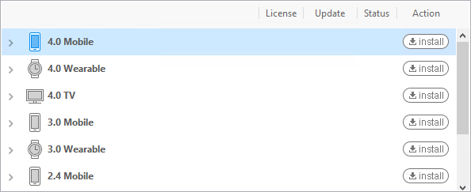
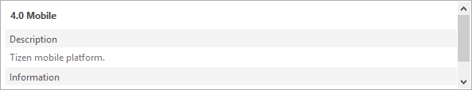
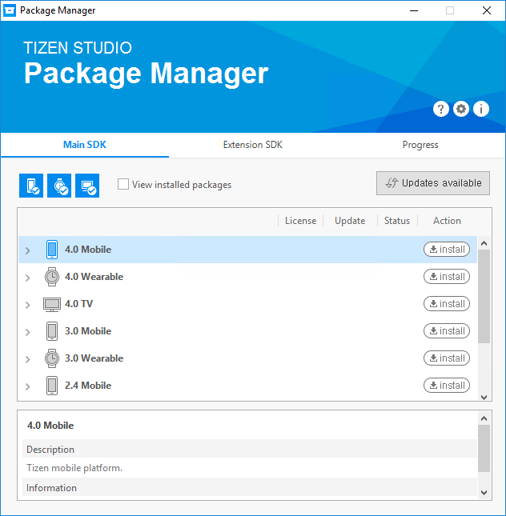
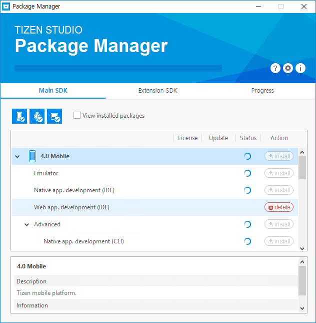
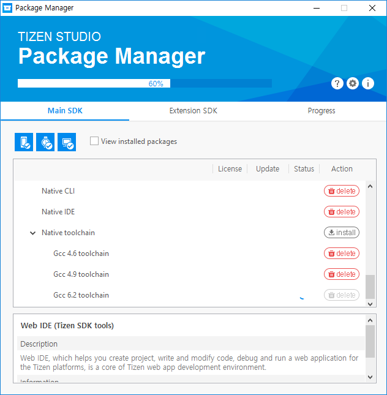
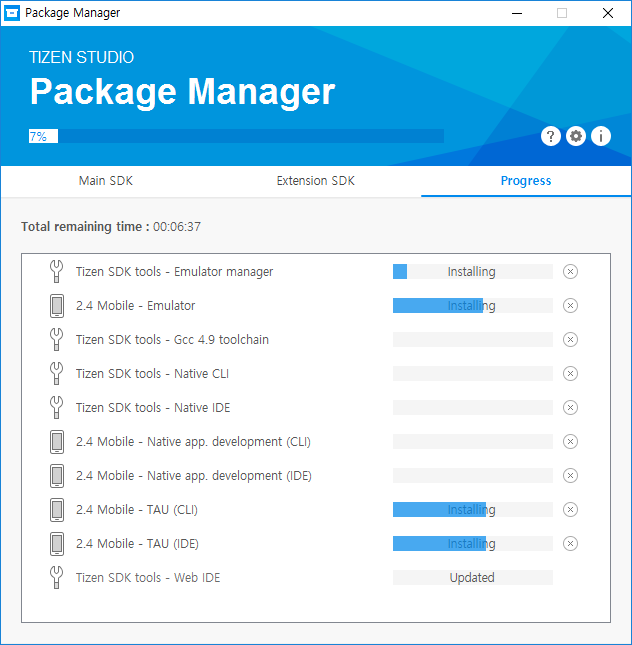

# Update Tizen Studio

This page explains how to install, update, and remove packages using the Package Manager tool in Tizen Studio. It also guides advanced developers to manage packages with the CLI version of the tool. At its core, Tizen Studio primarily comprises of various packages that includes necessary files, metadata, installation, and removal scripts, and these packages have interdependencies. 

After you install Tizen Studio, it is easy to keep the packages, platforms, and other tools up-to-date with automatic updates. Tizen Studio includes a comprehensive package management tool to manage processes such as installing, uninstalling, updating packages and platforms, and other related tools.

## Launch Package Manager

Package Manager offers a simple way to manage packages without getting into the complicated package dependencies.

To launch Package Manager on your preferred operating system, follow these steps: 

- Windows&reg;: Click **Start > All Programs > Tizen Studio > Tools > Package Manager**.
- MacOS&reg;: Click **Launchpad > Package Manager**.
- Ubuntu&reg;: Click **Dashboard Home > Package Manager**.

>Note: 
>
> Before you launch Package Manager, ensure that you close all the Tizen Studio programs.

## Package Manager Components 

The Package Manager window is made up of the following logical areas as identified in the following figure:

**Figure: Package Manager main window**


The Package Manager window consists of the following logical areas:

- **Header area** comprises of the following elements:

    - **Trouble Shooting** : You can  access troubleshooting guides that help you resolve common issues related to Package Manager.
    - **Configuration** : You can change the Package Manager configuration and other related settings, such as package repository locations, proxy options, and so on.
    - **Information** : You can access the details of Package Manager, such as version number, installation path, package repository URL, distribution name, and package snapshot.
    
    **Figure: Header area**

     
- **Main area** comprises of the following tabs:

    - **Main SDK**: It enables you to install and remove packages, platforms, and tools. In addition, the filter button narrows down the choice of the package list display based on the selected profiles.
    - **Extension SDK**: It enables you to install or remove extension tools and packages such as Samsung Certificate Extension.
    - **Progress**: It enables you to see the progress of the packages that are currently getting installed or removed.
  
    
    In the **Main SDK** and the **Extension SDK** tab, you can also list the installed packages by selecting **View installed packages**.

     **Figure: Main area with package list**

     

- **Description area**: It enables you to view the detailed description of each package or platform that is currently selected on the list in the main area.

    **Figure: Description area**

    

## Update Packages

Package Manager makes it easy to update your packages and platforms. You can use the Package Manager tool to locate and install updates and new features for the packages that are already installed. 

>**Note**
>
>Before you begin to update a package, ensure that Package Manager has access to the repository that contains the packages and you have access to the Internet. 

Tizen Studio notifies you with the **Updates available** button that appears in the **Package Manager** window, if new updates are available for your existing Tizen Studio packages and platforms.

To update the existing packages, click **Updates available**.
    
**Figure: Updates available button**



>**Note**
>
>- To ensure system integrity across all the packages in Tizen Studio, Package Manager does not support updating packages individually.
>- In case, you do not have access to the Internet, you can update the packages with an image file, which can be downloaded separately. 

### Update Packages Offline

Package Manager also facilitates offline upgrade with an update image for all the existing packages.

To install the packages with an image file, follow these steps:

1. In Package Manager, click .
2. In the **Configuration** window that appears, enter the full path of the image file in **Package Repository**. Alternatively, to select the image file, click **Browse** next to the combo box. 
3. To close the **Configuration** window, click **Open**.

 > **Note:**
 >
 >If the image file is valid, detailed information about the image is displayed below the combo box.

4. To close the **Configuration** dialog, click **OK**. 
   
   The **Update available** button appears.
5. To update and install additional platforms and tools with the image file, click **Update available**.

 > **Note**  
 > 
 > Ensure that the image file includes the latest version of Tizen Studio, before updating or installing using the image file.

## Install Additional Packages

Package Manager simplifies the process to install packages, platforms, and tools. You can install any platform or tool that are listed under the **Main SDK** and **Extension SDK** tabs.

In the **Main SDK** and the **Extension SDK** tab, click **install** next to any desired platform or tool in the list that you want to install. 

>**Note**
>
>Package Manager installs all the packages that are required for that platform or tool.

Package Manager also provides you the flexibility to install an individual preferred package for a particular platform or tool.

To install individual packages for a particular platform or tool, follow these steps: 

1. Click  located on the left of the main area of the window for each platform or tool to view more packages and tools.
2. Click **install** next to the package, if want to install that package.
 
**Figure: Install platform packages**



## Cancel Installation

The Package Manager tool gives you total control over the installation related tasks, you can cancel an installation anytime. 

To cancel the installation process, click  under the **Progress** tab next to the respective package. 

>**Note:** 
>
>Due to package dependencies, cancelling the installation of a single package may also cancel the installation of other packages.

**Figure: Cancel installation**


## Retry Cancelled Installation 

The Package Manager tool also provides utmost flexibility. It enables you to retry a cancelled installation anytime. 

To retry a cancelled or failed installation, click  under the **Progress** tab next to the respective package. 

>**Note:**
>
>Due to package interdependencies, retrying the installation of a single package may also cause the installation of other related packages.

## Remove Packages

The Package Manager tool also provides an intuitive user interface that helps you to remove any package, platform, or tool with ease. 

To remove a package, click  located next to the respective package. 

>**Note:**
>
>- Due to package interdependencies, removing a single package may also cause other related packages to be removed. 
>- To ensure system integrity across all installed Tizen Studio packages, package removal process cannot be cancelled while the process is in progress.

**Figure: Remove packages**



## Monitor Progress

Tizen Studio provides a progress bar where you can monitor the installation, update, or removal progress. This progress bar appears on the header area and helps in checking the overall progress of a respective process.  Also, to monitor the progress of specific installation, uninstallation, or update, as well as view the expected time of completion, Package Manager provides respective progress bars for each package or tool.

**Figure: Progress tab**



## Update Packages using CLI

For advanced developers, Tizen Studio provides command line version of the Package Manager tool. It can be used to install, update, remove packages, and platform tools respectively using the terminal or the console window. 

To Run the CLI version of Package Manager with the `update` command, use the following syntax:

```
package-manager-cli update [--accept-license] [--no-java-check] [--proxy <value>] [-f <file path>] [-p <password>] [--latest]
```

The following table lists various options that you can append to the syntax for the desired choice of the process:   

| Parameters                   | Descriptions                              |
|---------------------------|----------------------------------------|
| `--accept-license`          | Accepts the license terms.               |
| `--no-java-check`           | Skips the Java version check.            |
| `--proxy <value>`           | Represents proxy configuration value. You can use one of the following values: direct, auto, or ip:port. |
| `-f, --file <file path>`    | If you want to install packages from a local SDK image, specify the full path of the SDK image file. |
| `-p, --password <password>` | Specifies Administrator (sudo) password for authentication in Ubuntu only |
| `--latest`                  | Specifies the option for updating Tizen Studio to the latest version. |

## Related Information
- Dependencies
  - Tizen Studio 1.0 and Higher
