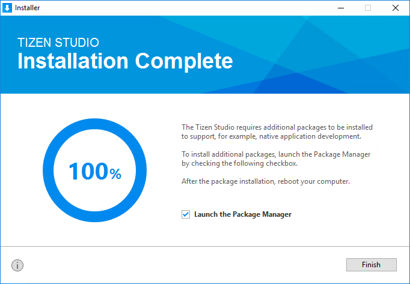

# Install Tizen Studio on Windows

This page explains the process to download and install Tizen Studio on your development hardware.

To have optimal installation experience, follow these steps chronologically:

- System prerequisites
  - Hardware requirements
  - Software requirements
- Launch installer
- Verify installation

## System Prerequisites

Ensure that the following system prerequisites are met:

### Hardware Requirements
<table>
  <tr>
      <td width=150px>CPU</td>
    <td colspan="3" width=50px>Dual Core, 2Ghz or faster</td>
  </tr>
  <tr>
    <td>Architecture</td>
    <td width=520px>x32 or x64 </td>
  </tr>
  <tr>
    <td>Memory</td>
    <td colspan="3">3GB or more </td>
  </tr>
  <tr>
    <td>Disk space</td>
    <td colspan="3">6 GB or more </td>
  </tr>
</table> 

### Software Requirements
<table>
  <tr>
    <th colspan="2" align=left>Windows</th>
  </tr>
  <tr>
    <td width=150px>Version</td>
    <td width=520px>7/8/10</td>
  </tr>
  <tr>
    <td>Bit</td>
    <td>32 or 64 bit</td>
  </tr>
  <tr>
    <td>Tizen Studio setup file</td>
    <td><a href="https://developer.tizen.org/development/tizen-studio/download#" class="clickable" target="_blank">Download</a></td>
  </tr>
</table>

## Launch Installer
 
To launch the installer, follow these steps:

1. Double click **web-ide_Tizen_Studio_x.x_windows-64.exe** file.
	> [!NOTE] 
	>**x.x** represents the latest version of Tizen Studio, for example:web-ide_Tizen_Studio_**3.7**_windows-64.exe.

2. Accept the software license.
   
   > [!NOTE]
   > The license contains important legal notices for using Tizen Studio. Read it fully, and click **Accept** only if you agree with the license statement.

   

3. Click **Browse** and specify a new directory to set the SDK data location. 

   
  
   >[!NOTE] 
   >If the new directory is valid, it shows no errors.

4. Click **Install**.
5. Click **Finish** to close the installer.

   

   >[!NOTE]
   > - If you install Tizen Studio in a directory that requires administrator privileges for access, such as `C:\Program Files`, then administrator privileges are required to run the Tizen SDK tools.
   > - If you want to install additional platforms and tools, launch Package Manager by selecting the Launch the Package Manager **check box** and click **Finish**.
   > - Use Tizen Package Manager, to install and update additional tools. 
   > - For more information on the Package Manager, see [Updating Tizen Studio](./update-sdk.md).

    ### Quick hands-on installation Demo
   
   

# Verify Installation   

   To verify whether the installation is successful or not, click **Tizen Studio icon**. Tizen Studio startup window must appear.