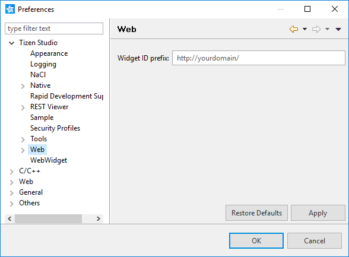
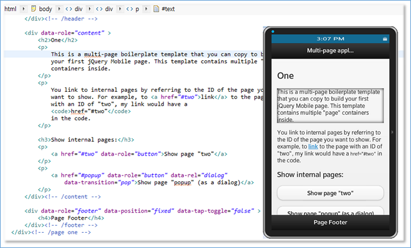

# Setting Tizen Studio Web Preferences

Tizen Studio Web preferences are used to configure the workspace details, such as resources, file colors, version control options, and code styles. They are stored persistently across sessions.

You can customize your Tizen Studio with the Web preferences introduced in the following sections.

## Setting Web Preferences

To set Web preferences, go to **Window > Preferences > Tizen Studio > Web** in the Tizen Studio menu.

> **Note**  
> In Windows&reg; and Linux, **Preferences** is located in the **Window** menu. However, in macOS, it is located in the **Tizen Studio** menu.

**Figure: Tizen Studio preferences**

The preferences are listed in the left pane, and you can search for items by using the search box in the upper left.

## Widget ID

To set a customized prefix for the widget ID, go to **Window > Preferences > Tizen Studio > Web**, and enter the value in the **Widget ID prefix** field. The default value of this field is **http://yourdomain/**.

The value is automatically used in all widget IDs when you create a new Web application in the Tizen Studio. You can view the widget ID in the `config.xml` file of the project.

**Figure: Widget ID**

## Google Chrome&trade; Browser Path

Go to **Tizen Studio > Web > Chrome**.

The Google Chrome&trade; browser location is automatically set if the browser is installed on your system.

If you have installed the browser in a custom location, the Tizen Studio cannot automatically detect the path and you must set the location manually.

## Editor

Go to **Tizen Studio > Web > Editor**.

Tizen Studio provides advanced editor features, such as file path content assist. These features are required to search files in the project.

To specify folders that you want to exclude from file searching, go to **Project Resource Lookup Setting > Excluded Folders**.

## Configuration Editor

Go to **Tizen Studio > Web > Editor > Configuration Editor**.

To stop error messages from being displayed if you incorrectly modify the `config.xml` source file, select the **Don't show error message** check box.

## CSS Editor

Go to **Tizen Studio > Web > Editor > CSS Editor**.

In the CSS editor, you can modify several [CSSLint](http://csslint.net/) options. CSSLint is a CSS code quality tool.

You can set the following validation times:

- Build
- Reconcile

You can set the following validation levels:

- Ignore
- Warning
- Error

You can exclude CSS files from parsing by specifying pattern strings, separated by a comma, in the **Exclude files that match these patterns from validation** field. The default value in this field is **min, jquery, jqm-docs, phonegap, sencha, tizen-web-ui-fw, dowhide, globalize, coderdeck, modernizr, tau**. For instance, since parsing the `jquery.min.css` file generates many warnings, the default pattern string values exclude the parsing of this CSS file.

## HTML Editor

Go to **Tizen Studio > Web > Editor > HTML Editor**.

You can set the visibility of the breadcrumb control in the HTML editor. If you clear the **Show breadcrumb** checkbox, the breadcrumb control is not visible in the HTML editor.

## JavaScript Editor

Go to **Tizen Studio > Web > Editor > JavaScript Editor**.

In the JavaScript editor, you can modify several [JSHint](http://www.jshint.com/) options. JSHint is a JavaScript code quality tool.

You can set the following validation times:

- Build
- Reconcile

You can set the following check levels:

- Ignore
- Warning
- Error

You can exclude JS files from parsing by specifying pattern strings, separated by a comma, in the **Exclude files that match these patterns from validation** field. The default value in this field is **min, jquery, jqm-docs, phonegap, sencha, tizen-web-ui-fw, dowhide, globalize, coderdeck, modernizr, tau**. For instance, since parsing the `jquery.min.js` file generates many warnings, the default pattern string values exclude the parsing of this JS file.

## Json Editor

Go to **Tizen Studio > Web > Editor > Json Editor**.

You can insert spaces for tabs in JSON by selecting the **Insert Spaces for Tabs** check box. In the **Number of spaces to indent** field, enter the number of spaces to indent for tabs.

## Privilege

Go to **Tizen Studio > Web > Editor > Privilege**.

Tizen provides the privilege checker tool to identify potential problems in the application code related to privilege usage.

You can set the following validation times:

- Build
- Reconcile

You can set the following check levels:

- Ignore
- Warning
- Error

You can exclude JS files from parsing by specifying pattern strings, separated by a comma, in the **Exclude files that match these patterns from validation** field. The default value in this field is **min, jquery, jqm-docs, phonegap, sencha, tizen-web-ui-fw, dowhide, globalize, coderdeck, modernizr, tau**. For instance, since parsing the `jquery.min.js` file generates many warnings, the default pattern string values exclude the parsing of this JS file.

## Launch

Go to **Tizen Studio > Web > Launch**.

Select the option, if you want to launch the application even when the `config.xml` file has an error. The option is cleared by default.

## Live Editing

Go to **Tizen Studio > Web > Live Editing**.

The following preview preference options are available:

- **Enable live-editing as default when emulator is launched**: Check to enable live editing by default whenever running an application. 

  You can select only 1 synchronization option, which is whether file content or editor content is shown in the application:
  - Select **None** to perform no synchronization.
  - Select **File** (default) to change the application when a file is saved.
  - Select **Editor** to change the application when the editor content changes. This means that your changes are reflected without saving the changes.

- **Live highlight**: Check to highlight your cursor in the editor.

  The option is only available when synchronization with the editor is selected above.

**Figure: Live highlight**

## Related Information
* Dependencies
  - Tizen Studio 1.0 and Higher
